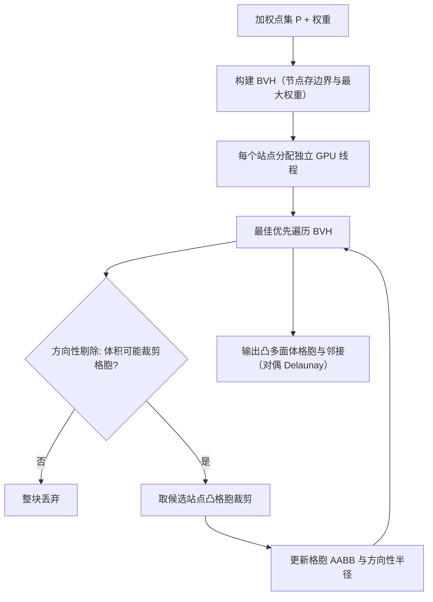

## 一句话总结

提出一个高度并行的 GPU 算法，通过"逐格胞独立裁剪 + 方向性剔除 + BVH 最佳优先遍历"来构建大规模 3D Voronoi 与 power（加权）图，把可处理的点集规模推到千万级，并让 mesh-based 神经渲染的显式表示扩展到 2000 万格胞。

## 研究背景

Voronoi 图及其对偶 Delaunay 三角化是计算几何的基石，广泛用于网格生成、流体模拟、碰撞检测与曲面重建；其加权推广 power 图（对偶为加权 Delaunay）还能表达多分散聚集与保体积剖分。近年来 Radiant Foam、Radiance Meshes 等 mesh-based 神经渲染把三维空间表示为可微的体网格（源自 Voronoi 或 Delaunay 拓扑），带来了一个几何求解器从未被设计去满足的需求：在优化迭代内部反复构建超过百万级站点的大规模图。

现有方法在这个规模下都力不从心：

- **CPU 方法**（CGAL、Geogram、HXT）精确可靠，但难以高效扩展。
- **GPU 方法**（如 gDel3D）存在稳定性问题、显存吃紧，通常只能扩展到几百万点。
- **加权 power 图**更少被探索，已有方案多假设点分布均匀、权重变化小，无法应对异构复杂数据。

这一构建瓶颈直接限制了体积神经渲染的分辨率与场景规模。作者的目标是提供一个统一、通用、可扩展到数千万站点、且对任意空间与权重分布都稳健的 GPU 框架。

## 方法

核心思路来自 cell-oriented clipping：每个 power 格胞可独立计算，定义为一组半空间的交集，因此天然适合把 $n$ 个格胞分解为 $n$ 个独立线程任务。给定点集 $P=\{p_1,\dots,p_n\}$，每个站点带权重 $w_i$，其 power 格胞为：

$$
C_i = \{\,x\in\mathbb{R}^d \mid \lVert x-p_i\rVert^2 - w_i \le \lVert x-p_j\rVert^2 - w_j,\ \forall j\neq i\,\}
$$

当所有权重相等时退化为标准 Voronoi 图。方法由三个关键组件组成：

**1. 凸格胞裁剪**：对每个候选邻居，移除位于其半空间外侧的顶点，再计算裁剪平面与当前凸格胞的交，得到新的多边形边界。若平面完全在格胞外则跳过。为提高效率，应优先用最可能贡献边界的邻居裁剪，尽早缩小格胞体积。

**2. 方向性剔除准则**：站点 $p_i$ 到与邻居 $p_j$ 的二等分平面的 power 距离为：

$$
d_{ij} = \frac{\lVert p_i-p_j\rVert}{2} + \frac{w_i-w_j}{2\lVert p_i-p_j\rVert}
$$

给定格胞范围的上界 $r_i$，若 $d_{ij} > r_i$ 则该邻居可安全丢弃。已有工作用各向同性半径（到最远顶点的距离）作为 $r_i$，在均匀分布下有效，但对各向异性格胞过于保守。本文改用**方向性半径**：根据邻居相对站点所在的卦限（octant），只取该方向上包围盒（AABB）相关角点的最大距离作为上界，得到更紧的剔除准则，同时保持正确性。该准则进一步推广到**整个包围体**：为体积 $B$ 记录其内站点的最大权重 $w_{max}$（最坏情形），用 $B$ 表面上最近可能站点估计二等分平面距离下界，若下界仍超过 $r_i$，则整块体积一次性丢弃。

**3. 层次化邻居搜索**：用 bounding volume hierarchy（BVH）组织站点，支持多尺度剔除——高层节点一次测试即可丢弃含数百万站点的大片区域，对密度剧烈变化的分布尤其关键。每个 BVH 节点额外存储其子树内的最大权重以支持 power 图剔除。遍历采用**最佳优先搜索**（按距离排序的局部优先队列）而非深度优先，优先处理最"侵入"当前格胞的平面，最大化体积收缩速率；遍历中持续维护并更新当前部分裁剪格胞的 AABB。

## 实验结果

在合成数据（均匀、高斯聚簇、密度梯度，0.1M–15M 点）与真实数据（Radiant Foam 在 Mip-NeRF 360 上的 2M–4.2M 站点 checkpoint）上评测，对比 CPU 方法（SciPy、CGAL、Geogram、HXT GmSH）与 GPU 方法（gDel3D、Radiant Foam 内置、作者自实现的 Basselin 版本）。所有计时均为端到端，300 秒超时。

下表为真实场景（Radiant Foam checkpoint）上 Voronoi 构建/Delaunay 三角化的运行时间（秒，NVIDIA H200，节选场景）：

| 方法 | bicycle (4.2M) | garden (4.1M) | stump (4.2M) | room (1.9M) |
| --- | --- | --- | --- | --- |
| HXT GmSH (CPU) | 1.243 | 1.299 | 1.375 | 0.675 |
| Geogram (CPU) | 1.593 | 1.732 | 1.560 | 0.812 |
| gDel3D (GPU) | 0.893 | 0.862 | 0.896 | 0.424 |
| Ours (GPU) | 0.684 | 0.574 | 0.564 | 0.293 |

主要结论：本方法在 Poisson 分布（密度梯度、白噪声）与真实场景上于所有点规模均最快，在大点集（$\ge 5$M）上总体最快。gDel3D 在小规模聚簇数据上高效，但更大场景即使在企业级硬件上也会耗尽显存；真实场景上平均比本方法慢约 55%（H200）到 137%（RTX 5090）。CPU 最强的 HXT 在聚簇数据上接近本方法，但在 Poisson 数据上慢约 55%、真实场景慢约 129%。方法自然推广到 power 图，加权情形保持相近的运行时与扩展性。应用侧：把 Radiant Foam 的 Delaunay 步骤替换为本方法后，可将显式表示从约 2M 站点扩展 5 倍至 2000 万以上，训练时间随点数近似线性增长，LPIPS 感知质量随容量提升持续改善。

## 亮点与局限

**亮点**：

- 统一框架同时覆盖 Voronoi、Delaunay、power 图与加权 Delaunay，power 图无需额外假设。
- 方向性剔除 + 包围体剔除比各向同性半径准则显著更紧，且保证正确性，对异构分布与大权重差异稳健。
- 格胞级完全独立，天然契合 GPU 大规模并行；BVH 最佳优先遍历兼顾稀疏空区跳过与高密簇处理。
- 作为 drop-in 替换直接解锁神经渲染的规模化，验证了容量与感知质量的强相关。

**局限**：

- 仅针对单 GPU 与静态点集，扩展性最终受设备显存而非算力限制。
- 尚不支持增量更新、多 GPU 与分布式构建。
- 依赖浮点算术，不提供 CPU 精确几何库那样的精确性保证。
- 极端权重分布下的剔除策略上限有待进一步研究。

## 延伸思考

该工作把"几何构建"从神经渲染的隐性瓶颈变为可扩展的一等公民，暗示未来大规模显式表示（Voronoi/tetrahedral foam）的天花板将由几何求解效率与显存共同决定。方向性几何界与 BVH 最佳优先的组合是一种通用的"保守但更紧"的剔除范式，或可迁移到其他需要局部凸构造的问题（如受限 Voronoi、meshless 体积分、碰撞查询）。而"用最大权重作为节点摘要实现整块剔除"的思想，本质是把加权度量嵌入层次包围体，值得思考能否推广到 Apollonius 图等更复杂的加权划分。真正把它推向工业级动态场景，还需解决增量更新与多 GPU 分布式构建，以及浮点鲁棒性与精确谓词之间的权衡。
