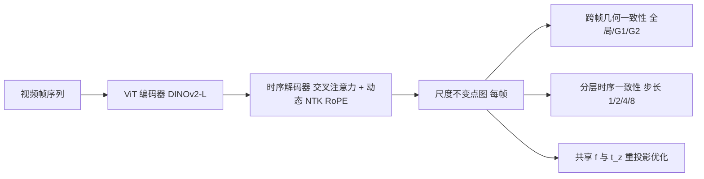

## 一句话总结

SCOPE 用单次前向推理，从任意长的单目视频里预测出既几何精确、又在数百帧尺度上保持一致（无尺度漂移）的仿射不变点图，为下游 4D 重建提供稳定输入。

## 研究背景

- 领域现状：单图深度/点图估计（如 MoGe）已能恢复相当精细的几何，但逐帧套用到视频上结果彼此不一致；视频专用方法（滑窗、关键帧条件、全局注意力如 VGGT）能维持短期连贯，却在长序列上出现明显尺度漂移，且几何精度偏弱。
- 核心痛点：现有方法几乎只能在"单帧几何精度"和"跨帧时序一致性"里二选一，很难在数百帧的长序列上同时兼顾。根源之一是显存约束——无法直接在几百帧上训练，模型必须学会外推到远超训练长度的序列；而传统光流约束只连相邻帧，误差会随序列累积。
- 本文 idea：预测让整段视频共享同一尺度与偏移参数的仿射不变点图，并配三件套——视点不变几何、外观不变学习、频率调制的时序位置编码——使模型能一次性吞下长序列并稳定外推。

## 方法

整体框架：在 MoGe 单图点图模型基础上，编码器（DINOv2-L）保持不变，仅在解码器四个特征层后各插入一个带交叉注意力与动态 NTK 缩放 RoPE 的时序 Transformer 块（共约 7.68M 参数）。网络对 $$T$$ 帧视频输出每帧各自相机坐标系下的点图 $$P_t \in \mathbb{R}^{H\times W\times 3}$$，整段序列共享同一尺度 $$s$$ 与偏移 $$t$$；推理时通过最小化重投影误差恢复一个全序列共享的焦距 $$f$$ 与 Z 轴偏移 $$t_z$$，从而得到尺度一致的点图。

关键设计：

1. 视点不变的跨帧几何约束。用相机位姿把各帧点云先转到世界坐标、再转到本轮随机选定的参考帧，在统一坐标系下比较不同视角的几何结构。损失采用多尺度网格对齐（全局 $$l=1$$ 以及 $$G_l\times G_l\times G_l$$ 的局部网格，实现中取 4 和 16），每个网格单元独立求对齐参数 $$(s_c, \mathbf{t}_c)$$，并用深度感知权重 $$w_i = \mathrm{clip}(1/\lvert z_i \rvert)$$ 平衡远近几何。参考帧每次迭代随机采样，避免损失绑定到某个固定视角。位姿只用于合成训练序列的这一项损失，不是所有数据都必需。

2. 外观不变学习 + 分层时序监督。提出跨多个时间尺度的分层导数监督：对指数增长的时间间隔 $$\delta_s = 2^s$$，约束预测深度与真值深度的时间导数 $$\partial D/\partial t$$ 之差。这一阶约束补充了零阶深度监督——逐帧仿射对齐后残余的深度误差会缓慢跨帧漂移，导数项在多个时间尺度上直接惩罚这种漂移。同时对每帧独立施加颜色变换与模糊增强，迫使模型关注不变的几何结构、忽略光照等瞬时视觉线索，从而在剧烈光照变化与大幅相机运动下仍保持稳健。

3. 频率调制的外推位置编码。采用带 NTK 自适应的 RoPE，频率分量按 $$\theta_{i,j} = j \cdot s^{(1-i/d)} / 10000^{2i/d}$$ 计算，其中缩放因子 $$s = L_{seq}/L_{train}$$ 在推理长度超过训练长度时启用——它对编码局部细节的高频分量做小幅衰减、对捕捉长程依赖的低频分量做放大。训练时以 50% 概率做"序列拉伸"：为一条长度 $$L_{virtual} = L_{seq}\cdot r$$ 的虚拟序列生成位置编码，再按 $$j' = j\cdot r$$ 采样，仅改位置索引而不动 RGB 帧与运动，等于在训练中模拟外推。此外用可变时序上下文窗口——固定 24 帧输入，但动态调整帧间步长，让这 24 帧既能表示密采样短序列、也能表示稀采样的数百帧长序列。

## 实验结果

在五个数据集上以"全序列共享尺度对齐"评估点图（Rel$$_p$$、$$\delta_p$$）与深度（Rel$$_d$$、$$\delta_d$$）及时序对齐误差 TAE。相较 MoGe，ScanNet 上点图误差降低 24.2%、时序对齐误差降低 34.9%，KITTI 上 Rel$$_p$$ 降低 9.9%，并在综合排名上领先。

主实验（点图指标，↓越低越好、↑越高越好）：

| 方法 | Sintel Rel$$_p$$↓ | ScanNet Rel$$_p$$↓ | ScanNet TAE$$_p$$↓ | KITTI Rel$$_p$$↓ | 平均排名↓ |
|------|------|------|------|------|------|
| DepthPro | 0.400 | 0.132 | 0.095 | 0.191 | 3.67 |
| VGGT | 0.382 | 0.032 | 0.079 | 0.196 | 2.67 |
| MoGe | 0.281 | 0.132 | 0.126 | 0.101 | 2.25 |
| SCOPE | 0.257 | 0.100 | 0.082 | 0.091 | 1.25 |

其余结论用文字概述：与 MoGe-2、$$\pi^3$$、MASt3R-SLAM、MonST3R 等几何方法相比，SCOPE 在所有评测集上取得最优或并列最优的时序对齐误差，且仅用 322M 参数（$$\pi^3$$ 为 959M）。效率上，H20 GPU、FP16 下处理 300 帧 378×672 仅 7.68 秒（39.1 FPS），比现有视频深度方法快 6–42 倍。消融显示：RoPE+（NTK 自适应 + 序列拉伸训练）在长/短序列上都是最优或并列最优的位置编码方案；时序模块把 ScanNet-270 的 Rel$$_p$$/TAE$$_p$$/TAE$$_d$$ 从 0.168/0.121/0.068 改善到 0.125/0.097/0.062；$$\mathcal{L}_{temp}$$ 与 $$\mathcal{L}_{cross}$$ 组合带来最佳时序一致性；单次推理相比滑窗在 KITTI 上 Rel$$_p$$ 再降 9.8%。用预测点图喂给 MegaSAM 做位姿估计，Sintel 上 ATE/RTE 相比 MonST3R、MoGe 大幅降低且 100% 成功。

## 亮点与局限

- 亮点：
  - 单次前向处理数百帧长序列，同时兼顾单帧几何精度与长程时序一致性，避免了滑窗的冗余与拼接漂移。
  - 把语言模型里的 NTK-RoPE 外推与训练期"序列拉伸"迁移到视频 3D 重建，让 24 帧训练的模型能外推到数百帧。
  - 全序列共享尺度/偏移的仿射不变点图设计，天然适配下游 4D 重建，且参数量与推理速度都很有竞争力。

- 局限：
  - 相机位姿仍依赖外部的 MegaSAM 恢复，网络本身不直接输出相机轨迹。
  - 跨帧几何损失需要带位姿的（主要是合成）训练数据，真实场景位姿监督受限。
  - 单次处理 300 帧的显存占用达 76.53 GB，对硬件要求较高。

## 延伸思考

作者已指出未来方向是把相机轨迹估计直接并入网络，形成真正端到端的"视频进、带位姿的一致几何出"的系统，省去 MegaSAM 这一外部环节。更广地看，把 NTK/RoPE 这类为长文本外推设计的位置编码手段引入视频几何，是一个值得继续挖的思路——训练期"序列拉伸"本质上是一种廉价的长度增广，或许能推广到其他需要处理变长时序的视觉任务。此外，共享尺度点图与 3D Gaussian Splatting、动态 NeRF 等重建管线如何更紧耦合，也是自然的后续。
