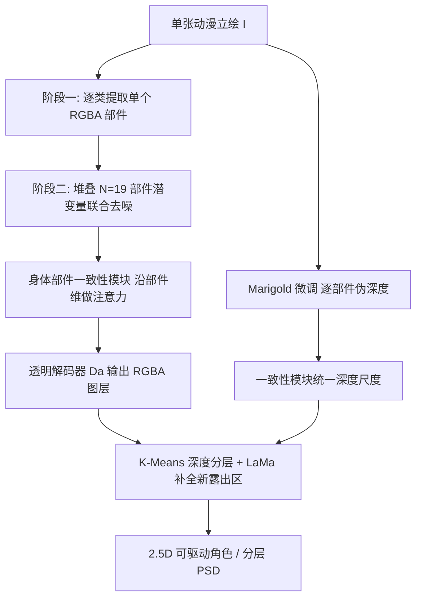

## 一句话总结

See-through 提出首个端到端框架，把一张静态动漫立绘自动拆解为完整补全（含遮挡区域）的 19 类语义 RGBA 图层，并推断细粒度的伪深度绘制顺序，从而把平面插画转成可实时驱动的 2.5D 角色模型。

## 研究背景

- 领域现状：把高质量静态动漫立绘（Tachi-e）转为可交互的"动态插画"是 VTubing、2D 游戏、视觉小说的核心需求。业界普遍采用 Live2D 这类 2.5D 方案，在保持原始平面美学的同时制造出体积与视差错觉。
- 核心痛点：Live2D 工作流需要美工把单张角色图手工拆成几十上百个语义图层、显式指定绘制顺序，还要"脑补"绘制出被遮挡区域的合理内容以支持运动，工作量巨大且高度依赖技巧。
- 现有方法不足：近期基于扩散的 RGBA 图层分解或场景去遮挡方法通常假设固定的自上而下图层顺序，无法表达动漫角色中复杂的交错分层（如发丝"夹住"脸部）；且它们多在粗粒度的实例级操作，绘制顺序仅用简单有向图表达，捕捉不了精细的交错遮挡。
- 本文 idea：把任务定义为"单图 → 完整补全的语义 RGBA 图层 + 逐层伪深度"。由于不存在 2.5D 现成标注，作者构建了一个从商业 Live2D 模型自举监督信号的数据引擎，并用两阶段潜在扩散模型加上"身体部件一致性模块"来保证全局分层的完整与连贯。

## 方法

整体分为三大块：从 Live2D 自举标注的数据引擎、两阶段语义 RGBA 图层分解、以及基于伪深度的绘制顺序推断与分层重建。

数据引擎（关键创新之一）：

1. 以 Live2D 为 2.5D 数据源。Live2D 模型由若干 ArtMesh（贴到纹理图集局部区域的三角网格，对应发丝、缎带等小绘制片段）组成，渲染引擎给每个 ArtMesh 分配确定的绘制顺序索引，等于提供离散 z-buffer 信号。
2. 弱监督播种。用 Danbooru 标签体系与 wd-eva02 标注器，把细粒度视觉标签映射到预定义的 19 类，用 GradCAM++ 激活图做粗定位，再用 ArtMesh 可见性掩码做"投票"snap 到精确边界，得到种子标签。
3. 多解码器 SAM 迭代精化。把 SAM-HQ 的可提示解码器替换成 19 个各自负责一类的独立掩码解码器，训练时清零提示嵌入，将其变成闭集语义分割器，并用自精化循环让模型与训练数据互相改进。
4. 2.5D 分层标注。把 2D 预测投影回 ArtMesh，对全遮挡片段用 Live2D 层级结构与连通分量分析传播标签，再经人工核对；用"角度跟随"动画自动增广多姿态。最终得到 9,102 个标注模型（训练 7,404 / 验证 851 / 测试 847），标注总时约 12 小时。

语义图层分解（基于 SDXL 骨干，原生 1024×1024）：

1. 部件透明解码器。沿用 LayerDiffusion 的潜在透明策略，保持 SDXL VAE 编解码器不变，额外训练一个透明解码器 $$D_a$$，条件于潜变量 $$z_k$$ 与重建 RGB $$\hat{L}^{(c)}_k$$ 预测填充高斯图与 alpha 通道。解码器用带对抗项的重建损失训练：

$$L_{dec} = \lVert L^{(c)}_k - \hat{L}^{(c)}_k \rVert_2 + \lVert L^{(\alpha)}_k - \hat{L}^{(\alpha)}_k \rVert_2 + \lambda_{disc} L_{disc}$$

其中 $$\lambda_{disc}=0.01$$。

2. 两阶段"局部到全局"训练。阶段一微调 SDXL U-Net 为条件去噪器，逐类提取单个 RGBA 部件，用离散类别嵌入 $$\tau_C(c_k)$$ 经交叉注意力注入、源图经零卷积 $$\tau_I(I)$$ 条件注入：

$$L_{stage1} = \mathbb{E}_{I,k,t,\epsilon}\left[\lVert \epsilon - \epsilon_\theta(z^{(t)}_k, t; \tau_I(I), \tau_C(c_k)) \rVert_2^2\right]$$

3. 身体部件一致性模块（核心）。阶段一常把某些语义层留空或把内容错分到相邻部件。阶段二把全部 $$N$$ 个部件潜变量沿一个"部件维" $$c$$ 堆叠成 $$Z^{(t)}$$（类比视频扩散的时间维）联合去噪，在每个空间注意力块后插入沿 $$c$$ 维做注意力的一致性模块，让每层能看到其他所有层的当前预测，从而把模糊内容合理分配：

$$L_{stage2} = \mathbb{E}_{I,t,\epsilon}\left[\lVert \epsilon - \epsilon_\phi(Z^{(t)}, t; \tau_I(I), \tau_C(C)) \rVert_2^2\right]$$

绘制顺序与分层重建：

1. 伪深度推断。以 Marigold（仿射不变深度估计器）为骨干，同样两阶段：先按类别 $$c_k$$ 微调预测逐部件伪深度，再堆叠 19 张深度图用一致性模块统一尺度，得到全局有序的伪深度层级。伪深度由绘制顺序索引 min-max 归一化得到，$$d(m_i) = (z(m_i) - z_{min})/(z_{max} - z_{min}) \in [0,1]$$。
2. 深度引导分层。对自遮挡部件（默认 Hair、Handwear、Topwear、Bottomwear），在 alpha 掩码内对伪深度做 $$K=2$$ 的 K-Means 聚类，切成前/后两层以表达同一语义层的"三明治"交错遮挡，再用 LaMa 对新露出区域做补全。

## 实验结果

在自建 2.5D 测试集上评测图层分解与重建质量，对比 SAM+LaMa 组合基线，并消融身体部件一致性模块。指标含 LPIPS、PSNR、SSIM、掩码 Dice loss、掩码 MSE 与 FID。

| Method | LPIPS ↓ | PSNR ↑ | SSIM ↑ | Mask Dice ↓ | Mask MSE ↓ | FID ↓ |
| --- | --- | --- | --- | --- | --- | --- |
| SAM+LaMa | 0.2880 | 12.2802 | 0.8445 | 0.4336 | 0.1020 | 81.1419 |
| Ours w/o Consistency Module | 0.1952 | 16.2350 | 0.9053 | 0.6480 | 0.0640 | 16.7069 |
| Ours Full | 0.1549 | 18.2965 | 0.9230 | 0.3855 | 0.0354 | 18.3700 |

完整模型在重建保真度（LPIPS/PSNR/SSIM）与掩码精度上均显著优于纯 2D 的 SAM+LaMa 流水线，也优于去掉一致性模块的版本；FID 略微上升是预期内的，因为更强的全局一致性会降低输出多样性。一致性模块还把伪深度的平均相对误差从 0.1549 降到 0.0943，$$\delta_1$$ 从 0.8427 升到 0.9103。与 Qwen-Image-Layered 的定性对比显示后者难以精确分离部件、层间不连贯不可用。推理上单图分层约 74 秒、深度约 10 秒（单张 RTX 4090），作为一次性预处理可接受。下游应用包括木偶动画、实时"说话头"VTubing，均展示了在大形变下保持连贯遮挡与分层关系的能力。

## 亮点与局限

- 亮点：首个把单张动漫立绘端到端转为 2.5D-ready 角色的框架，同时做语义 RGBA 分层、遮挡补全与细粒度分层排序；从商业 Live2D 模型自举 2.5D 标签的数据引擎（GradCAM 弱监督 + ArtMesh 几何 snap + 多解码器 SAM 自精化）解决了标注稀缺；身体部件一致性模块把分解重构为沿部件维的联合去噪，显著提升完整性与跨层连贯性；伪深度 + K-Means 分层巧妙表达了同一语义层的交错"三明治"遮挡。
- 局限：体外区域的预测图层偶有轻微重叠（如示例中酒杯被复制），但易在图层编辑器修正；深度引导分层难以稳定切成多个子层，因为伪深度不总能诱导可靠的离散边界；单图信息缺失时补全仍可能出错（多落在难以观察的最后层）。

## 延伸思考

- 把"部件维联合去噪 + 沿该维注意力"作为通用一致性机制，本质上借用了视频扩散的时间维思路，未来可推广到任意"多分量需协同分配内容"的分解任务（如材质/光照/阴影分离）。
- 伪深度不追求真实 3D 度量，而是把绘制顺序当作可学习的相对分层信号，这对二维艺术的分层排序是很务实的取巧；结合更强的离散边界建模或可缓解多子层不稳的问题。
- 作者提出的下一步是从分解结果自动预测动画时序，若能与实时物理（弹簧发丝动力学）联动，有望把"单图到可驱动虚拟形象"的自动化推得更远。
