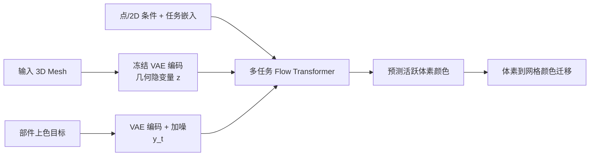

## 一句话总结

SegviGen 把预训练的原生 3D 生成模型"改造"成 3D 部件分割器：将分割重新表述为"给部件上色"的条件生成任务，仅用同类方法 0.32% 的训练数据，就在交互式分割上超越现有最优方法 40%、在全量分割上超越 15%。

## 研究背景

- 领域现状：3D 部件分割是 3D 内容创作（部件编辑、绑定动画、3D 打印）的核心能力。现有路线分两类——一类把强大的 2D 分割先验"抬升"到 3D（多视角掩码回投影融合，或 2D-to-3D 蒸馏）；另一类做原生 3D 判别式分割，直接在 3D 表示上预测掩码。
- 核心痛点：2D-to-3D 路线存在跨视角不一致、边界模糊、优化耗时的问题；原生 3D 判别式路线则严重依赖大规模、高质量的 3D 部件标注，而这类标注昂贵，且不同数据源在粒度、层级、边界定义上互相冲突，反而削弱泛化。
- 本文 idea：与其收集海量标注从头训判别模型，不如借用一个"同时编码 3D 结构与纹理"的先验模型。大规模无标注 3D 纹理资产上训练出的 3D 生成模型内化了丰富的部件级结构与纹理规律，天然利于产生边界锐利的分割。于是把分割重构成"部件上色"的生成任务，直接调用生成模型的全部能力。

## 方法

整体框架：以原生结构化隐空间 3D 生成模型 Trellis.2 为底座。给定输入 3D 资产，用冻结的 3D VAE 编码得到几何隐变量 $$z$$，锚定活跃体素（active voxel）的支撑区域；同时把"部件上色"的目标图也编码进同一隐空间得到 $$y$$。训练时对 $$y$$ 加噪得到插值 $$y_t=(1-t)y+t\epsilon$$，微调一个基于 DiT 的流匹配骨干，条件于噪声输入 $$y_t$$、几何隐变量 $$z$$、任务条件 $$C$$ 和可学习的任务嵌入 $$e_\tau$$ 来预测噪声残差 $$\hat v_\theta=f_\theta(y_t,z,C,e_\tau,t)$$，优化条件流匹配目标 $$\mathcal{L}(\theta)=\mathbb{E}\!\left[w(t)\lVert \hat v_\theta-(\epsilon-y)\rVert_2^2\right]$$。推理时生成活跃体素的颜色，每种颜色对应一个部件，即得分割。

关键设计：

1. **分割即上色（Task Reformulation）**：三种任务用统一接口表达。交互式分割是二值抽取——用户给的目标点上色为白、其余为黑；全量分割给每个部件从随机调色板取一个独立颜色（每个物体采样 $$K=10$$ 组调色板降低对具体配色的敏感性）；2D 引导全量分割则额外条件于一张渲染出的 2D 分割图，训练模型生成与 2D 配色一致的 3D 体素颜色。三种任务共享同一模型接口与训练管线。

2. **条件注入（Condition Injection）**：交互式分割中每次点击编码成稀疏点 token（3D 坐标 + 共享可学习特征 $$e_p$$）。由于坐标已被注意力层里的 RoPE 有效编码，作者省去了以往设计中额外的可学习位置嵌入，所有点共享同一特征向量。点数不足 10 时用零坐标零特征补齐到 10；全量分割与 2D 引导分割也保留这个 10 token 的统一接口（全零填充）。2D 引导图经图像编码器 $$g_\phi$$ 编码为条件 token，通过交叉注意力注入。

3. **任务嵌入（Task Embedding）**：任务序号 $$\tau$$ 先做正弦编码 $$s_\tau=\mathrm{PE}(\tau)$$，再经轻量 MLP 映射为任务嵌入 $$e_\tau$$。它与时间步嵌入 $$e_t$$ 相加融合成调制向量 $$m=e_t+e_\tau$$，注入 DiT 的自适应层，让同一骨干同时编码扩散进度与任务语义。训练时不同任务样本交错监督。

4. **体素到网格颜色迁移（Voxel-to-Mesh Color Transfer）**：SegviGen 在活跃 O-Voxel 上预测部件颜色，但 Trellis.2 解码出的网格在细分与拓扑上可能与输入不同。因此把预测颜色迁回原始输入网格——每个网格顶点取最近活跃体素的颜色，每个面通过顶点多数投票确定标签，并做轻量网格级平滑去除边界处的孤立尖刺。这样保留了原网格结构，比直接用解码网格更适合网格级分割。

## 实验结果

底座为 Trellis.2（Tex-SLAT 流模型可训、SC-VAE 冻结），训练数据为 PartVerse（约 12k 物体、91k 标注部件），仅在 8 张 A800 上训练 8 小时，默认 12 步推理。评测集为 PartObjaverse-Tiny（200 个纹理网格）和 PartNeXT 的 300 个子集。

交互式分割主实验（IoU，随点击数变化），SegviGen 在所有点击轮次、两个数据集上全面领先，尤其单击 IoU@1 的初始理解能力优势显著：

| 方法 | PartObjaverse-Tiny IoU@1 | IoU@10 | PartNeXT IoU@1 | IoU@10 |
|------|--------|--------|--------|--------|
| Point-SAM | 24.87 | 67.99 | 23.90 | 65.04 |
| P3-SAM | 33.04 | 55.51 | 35.61 | 53.81 |
| SegviGen | 42.49 | 75.02 | 54.86 | 82.73 |

全量分割上，SegviGen 纯 3D 输入即达 50.64 / 55.40 IoU（两数据集），在 PartNeXT 上大幅超过 PartField（41.50）和 SAMPart3D（29.62，且从 PartObjaverse-Tiny 的 59.05 崩塌）。加入单视角 2D 分割图引导后进一步刷新到 62.98 / 71.53，取得新的最优。消融显示：点嵌入用显式坐标编码在多次点击后略优于纯语义标签嵌入；推理步数上 1 步已有不错效果，8 步后收益饱和，25 步仅微增但延迟近乎翻倍，故 12 步（2.63s）为精度与效率的折中。模型对 Hunyuan3D 2.1 生成的 AI 网格也能给出合理分割，展示了免额外训练的泛化能力。

## 亮点与局限

- 亮点：
  - 视角新颖——把"判别式分割"重构为"生成式上色"，首次系统性地把原生 3D 生成先验迁移到部件分割，思路简洁而有效。
  - 极端数据高效——仅 0.32% 训练数据 + 8 卡 8 小时，就超越依赖百万级标注的 P3-SAM，印证了生成先验的价值。
  - 统一多任务接口——交互式、全量、2D 引导三种设置共用同一架构与训练管线，靠任务嵌入与统一 token 接口切换。

- 局限：
  - 语义歧义导致部件数不稳定——同一物体存在多种合理分解，模型可能生成比预期更多或更少的部件。
  - 2D 引导对极精细结构无能为力——当引导图过于细粒度时，3D 分割的边界精度和平滑度会下降；跨视角对遮挡区域的配色也可能不一致（虽多为标签指派歧义而非分解错误）。

## 延伸思考

- 这项工作与"重用生成模型做判别任务"的大趋势相呼应（如 2D 领域用 Stable Diffusion 特征做分割/对应）。SegviGen 把这一思想落到原生 3D 隐空间，暗示预训练 3D 生成模型可作为通用 3D 感知底座，下游还可能延伸到关键点、对应、可动性预测等任务。
- 把分割编码成"颜色"而非离散标签是关键取巧：既复用了生成模型的连续输出通道，又天然支持任意粒度。但颜色数量与部件数的对应、配色歧义仍是可深挖的建模问题，未来或可引入更显式的语义控制或实例级 token。
- 体素到网格的颜色迁移是必要但略"工程化"的一环，解码网格与输入网格的拓扑错配是这类隐空间生成方法的共性痛点，值得更原理化的对齐方案。
