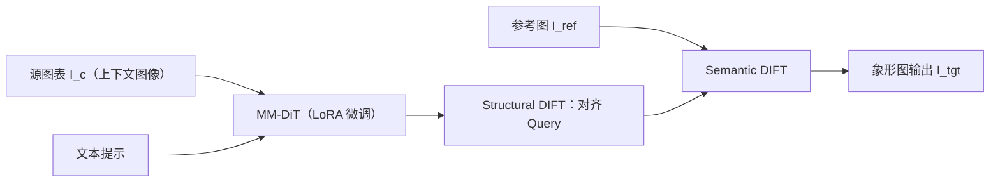

## 一句话总结

把"抽象统计图表变成有语义的象形图"这件事重新表述为一个**双条件生成任务**，用多模态扩散 Transformer 在特征层面同时做结构对齐和语义对齐，让生成的象形元素既好看又忠实地保留数据编码。

## 研究背景

- 领域现状：象形图（pictorial chart）用可识别的具象物体替代柱子、扇形等几何图元，比传统统计图更有记忆点和感染力。过去要么靠人工绘制、要么靠模板检索替换素材，最近也有人用潜在扩散模型做风格迁移。
- 核心痛点：现有生成方法缺乏**对象级的空间尺度控制**。在扩散模型里，物体大小是纠缠出来的涌现属性而非可控变量。像 ControlNet 这种稠密空间引导会强加刚性的一一对应，压制了把有机形状贴合数据边界所需的局部形变；而 SDEdit 这类随机编辑又会产生结构漂移，破坏可视化要求的精确性。于是"在不牺牲语义的前提下做精确的多实例结构控制"仍是难题。
- 本文 idea：用两路平行的外部控制信号引导扩散模型——文本提示携带编辑意图的语义，上下文图像提供抽象图表的全局结构。核心是把语义与结构显式解耦，通过两个基于扩散特征的对齐模块 Structural DIFT 和 Semantic DIFT，一个把空间布局锚定到输入图表，一个从参考图迁移富有表现力的纹理。

## 方法

整体框架：以在海量编辑图对上预训练、天然支持上下文图像条件的 FLUX.1 Kontext 为骨干，先用 LoRA 在精选与增广数据上微调，让模型学会把抽象图元映射到自然物体；推理阶段引入双分支机制，在单流块（single-stream block）的自注意力层里分别施加结构对齐与语义对齐。

关键设计分为三部分：

**1）结构感知的语义变换（数据与微调）。** 现有数据集只有成品象形图、没有对应的源图表，缺配对数据。作者手工逆向重建了 120 张高质量象形图的源图表构成有效图对，再用视觉语言模型抽属性、生成候选提示并经人工校验，得到 583 个 $$(I_c, \text{prompt}) \to I_{tgt}$$ 样本。为增强对结构变化的敏感度，还按主视觉编码通道（长度、面积、角度、位置）把数据分成四类，各训一个临时 LoRA，程序化扰动源图表几何参数来合成结构多样的图对，最后与原始数据一起训练最终 LoRA。关键约束：图表用象形元素的连续尺寸（高度、长度、面积、位置）而非离散计数来编码数值。

**2）Structural DIFT（结构对齐）。** 两个洞见：操纵自注意力里的 Query 投影能有效控制全局图像结构；内部扩散特征（DIFT）是建立语义-结构对应的稳健度量。做法是把源图表 $$I_c$$ 作为上下文注入视觉流，在早期去噪阶段用扩散特征计算源图表 Query $$Q_c$$ 与目标 Query $$Q_{tgt}$$ 的稠密对应索引图 $$C_{c \to tgt}$$，再据此把目标 Query 空间重排以严格对齐：

$$Q'_{tgt} = Q_{tgt}\big(C_{c \to tgt}(v_c)\big)$$

该操作只在去噪早期、且只在单流块的图像级 token 上施加，避免干扰文本驱动的语义控制。

**3）Semantic DIFT（语义对齐）。** 少样本微调偶尔会退化物体保真度，结构注入也可能引入"图表味"的伪影。于是从参考图 $$I_{ref}$$ 迁移外观：先用扩散特征算目标与参考的稠密对应，把参考的键 $$K_{ref}$$、值 $$V_{ref}$$ 空间重排到目标结构上，再用球面线性插值 SLERP 平滑融合而非直接替换（直接替换会盖掉承载数据的关键颜色）：

$$K'_{tgt} = \text{SLERP}(K'_{ref}, K_{tgt}; \alpha)$$

其中 $$\alpha \in [0, 1]$$ 控制融合强度。为防外观越界破坏结构，用从注意力图导出的语义掩码 $$M$$ 约束转移：

$$K'_{tgt} = K'_{tgt} \odot M + K_{tgt} \odot (1 - M)$$

最后把更新后的目标键与提示键 $$K_p$$、图表键 $$K_c$$ 拼接：$$K' \leftarrow \text{Concat}(K_p, K'_{tgt}, K_c)$$，值与查询同理，送入该层自注意力。

## 实验结果

作者自建了一个 160 对图表-物体的基准（Bar、Line、Pie、Bubble 四种图表类型，每类 10 个语义物体，每物体 4 个随机实例），用结构指标（SSIM、PSNR、DINO 自相似距离）、感知指标（LPIPS）和语义指标（CLIP 相似度）评测。核心结论是本文在结构保真与语义合成之间取得最佳平衡：结构上仅次于 ControlNet（刚性、不自然）和 Stable Flow（几乎不可编辑），语义合成上与纯生成方法持平。

| 方法 | SSIM↑ | PSNR↑ | DINO↓ | LPIPS↓ | CLIP↑ |
|------|-------|-------|-------|--------|-------|
| Stable Flow | .99 | 32.91 | .02 | .02 | .22 |
| ControlNet | .67 | 8.56 | .20 | .68 | .23 |
| CIA | .90 | 19.69 | .13 | .23 | .24 |
| Ctrl-X | .78 | 15.17 | .21 | .38 | .26 |
| FLUX.1 Kontext | .77 | 14.85 | .16 | .37 | .26 |
| SDEdit | .84 | 17.03 | .23 | .37 | .26 |
| 本文 | .86 | 20.47 | .08 | .22 | .26 |

Stable Flow 虽然结构指标最高，但几乎不做编辑（改动可忽略），因此高分并不代表完成了象形化任务；本文在拿到最高 CLIP、最低 LPIPS 的同时结构指标仅次于两个"退化解"，体现的是真正的权衡最优。

用户研究：56 名参与者对 20 个输入图表、4 种方法共 80 个结果排序，Friedman 检验显著（$$\chi^2(3) = 974.450, p < .001$$），事后 Wilcoxon 检验（Bonferroni 校正）显示本文显著优于 CIA、Ctrl-X 与 FLUX.1 Kontext，本文在 67.8% 的试次中被排为第一。消融验证了 LoRA 微调（弥合领域鸿沟）、结构对齐（纠正局部结构偏差）、语义对齐（消除伪影、重注语义细节）以及用 DIFT 做对应（避免朴素注意力匹配导致的鬼影与错位）四者缺一不可。

## 亮点与局限

- 亮点：
  - 把象形图生成从"表面风格迁移"重构为"结构不变量 + 语义变量"的显式解耦问题，视角清晰。
  - 将扩散特征从被动的对应分析工具升级为主动的生成控制机制，Structural/Semantic DIFT 都在推理时的注意力层做，无需为对齐再训练额外权重。
  - 覆盖长度、面积、角度、位置四种视觉编码通道，并能泛化到共享同种编码逻辑的未见图表形式。

- 局限：
  - 强制结构对齐会把生成偏向图表衍生特征，可能干扰语义合成、破坏上下文背景生成，最终语义与背景质量仍部分依赖微调基座和提示词。
  - 语义对齐重度依赖参考图，当参考的视角或空间布局与目标图元差异较大时合成质量会下降。
  - 仍基于训练式适配（LoRA），继承了训练依赖的局限；范围也限定为主要几何图元的一对一变换，排除高度嵌套或多视图可视化。

## 延伸思考

作者点出的未来方向很自然：一是走向零样本、免训练的生成，纯靠推理期注意力控制完成抽象图元的语义变换，进一步强化结构保真与语义表达的分离；二是从孤立图元变换扩展到整场景生成，做可控且与图表语义兼容的背景合成而不损害数据可读性。更广地看，"用扩散特征对应作为可控生成的显式约束"这一思路，对其他需要严格结构保真同时又要丰富语义的编辑任务（如工程示意图、地图符号化、界面元素生成）都有借鉴价值；而 SLERP + 语义掩码融合避免覆盖关键数据颜色的做法，也是把生成能力"戴上镣铐跳舞"的一个可复用范式。
