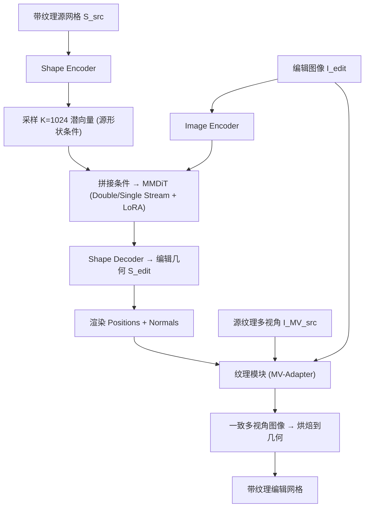

## 一句话总结

ShapeUP 把 3D 编辑重新表述为原生 3D 潜空间中的"有监督潜码到潜码翻译"，以单张编辑图像作为提示条件，在预训练 3D 基础模型上通过轻量微调实现可扩展、免掩码、且保持原始身份的精细几何与纹理编辑。

## 研究背景

3D 基础模型（如 TRELLIS、Hunyuan3D 2.0、Step1X-3D）已能从稀疏输入生成高保真几何与纹理，但对已有资产的精确编辑仍是难题。作者归纳出理想 3D 编辑框架应同时满足四个条件：

- **原生 3D 一致性**：编辑整体融入 3D 表征，避免视角相关伪影。
- **隐式定位**：从条件信号直接推断编辑区域，统一局部与全局变换，无需手工掩码。
- **细粒度控制**：通过视觉条件表达超越自然语言歧义的精确意图。
- **可扩展性**：能随数据与模型容量增长而受益（呼应 "The Bitter Lesson"）。

现有方法往往顾此失彼：优化式方法（SDS 系列）速度极慢且易出现 Janus 问题；多视角 2D 传播方法会引入配准伪影与身份漂移；免训练的潜码操纵方法被冻结先验束缚，无法从规模化中获益。ShapeUP 旨在同时满足上述全部四条。

## 方法

ShapeUP 沿用现代 3D 基础模型"先几何、后纹理"的两阶段结构，基于 Step1X-3D 的几何与纹理骨干进行图像条件化编辑。核心思想是把编辑当作有监督的潜码翻译：给定源 3D 资产与一张展示编辑目标单视角的图像，几何阶段先修改形状，纹理阶段再合成与编辑几何一致的外观。

**几何编辑。** 用预训练 shape VAE 把源形状 $$S_{src}$$ 编码到 DiT 骨干所处的潜空间（每个形状映射为 2048 个潜向量）。作者发现该表征高度冗余，故子采样至 $$K=1024$$ 个潜 token 作为源形状条件。将这些 token 与预训练图像编码器提取的 $$I_{edit}$$ 表征拼接，仅在 MMDiT 的 double-stream 与 single-stream 块上训练 LoRA 适配器（rank 128），从而让模型在统一潜空间中同时推理原始几何与目标编辑，训练目标为把 $$S_{src}$$ 的潜码翻译到 $$S_{edit}$$。

**纹理编辑。** 骨干采用 MV-Adapter，输入编辑图像、源网格多视角渲染 $$I_{MV}^{src}$$，以及编辑几何的法向与位置图 $$G_{edit}$$。$$I_{edit}$$ 与 $$I_{MV}^{src}$$ 的深层特征通过 cross-attention 融合，$$G_{edit}$$ 特征以加性残差注入；为区分目标编辑线索与视角对齐的源纹理特征，对源多视角 token 加入视角轴位置编码。微调 adapter 层后输出一致的多视角图像并烘焙到编辑几何上。

**数据（DFM）。** 作者从 Objaverse 构造 7,430 个带纹理网格的合成数据集。除模拟部件增删的 Parts 样本外，引入 **Distant Frames in Motion (DFM)**：取动画序列中时间上相距较远的关键帧作为编辑对，天然刻画连贯的姿态与形变变化且保持身份，是实现身份保持型全局编辑的关键。其中 560 个为 DFM 样本，训练时对 DFM 上采样至有效采样概率约 22%。

**采样。** 几何与纹理均采用双条件 classifier-free guidance：

$$\tilde{\epsilon}^{G}_{\theta} = \epsilon^{G}(\varnothing,\varnothing) + s^{G}_{i}\left(\epsilon^{G}(c_i,\varnothing)-\epsilon^{G}(\varnothing,\varnothing)\right) + s^{G}_{s}\left(\epsilon^{G}(c_i,c_s)-\epsilon^{G}(\varnothing,\varnothing)\right)$$

推理时几何用 $$s^{G}_{i}=2.5,\ s^{G}_{s}=3.5$$，纹理用图像与多视角引导尺度 $$s^{T}_{i}=2.5,\ s^{T}_{mv}=3.5$$。

## 实验结果

作者构建了新基准 BenchUp（24 个多样网格、100 个编辑条件，覆盖局部到全局变换，含风格形变、姿态变化等），并沿两个维度评估：Condition Alignment（编辑与条件图像的对齐度）与 Occluded Region Fidelity（未见/部分遮挡区域的保持度）。与两种免掩码方法 3DEditFormer 与 EditP23 对比：

| Method | SSIM↑ | LPIPS↓ | CLIP-I↑ | DINO-I↑ | C-Dir↑ | Occl. CLIP-I↑ | Occl. DINO-I↑ |
|---|---|---|---|---|---|---|---|
| 3DEditFormer | 0.733 | 0.270 | 0.908 | 0.849 | 0.441 | 0.877 | 0.736 |
| EditP23 | 0.759 | 0.254 | 0.917 | 0.851 | 0.455 | 0.880 | 0.748 |
| Ours | **0.763** | **0.198** | **0.943** | **0.915** | **0.520** | **0.928** | **0.878** |

ShapeUP 在全部指标上领先，说明它在提升编辑对齐度的同时并未牺牲未编辑区域的保持，化解了编辑保真度与源形状一致性之间的典型权衡。用户研究（34 名参与者、664 次两选一比较）中，相对 EditP23 被偏好 82.5%，相对 3DEditFormer 被偏好 74.6%。消融显示：用 1024 个源潜向量显著优于 256/512；加入 DFM 数据虽在遮挡区保真上略低于不加 DFM 的变体，但显著增强姿态与全局编辑能力。

## 亮点与局限

**亮点**

- 将 3D 编辑统一表述为原生潜空间中的有监督潜码翻译，避免 2D 提升带来的重建漂移与视角不一致。
- 以单张图像作为提示，实现高带宽视觉控制、免掩码的隐式定位，同时统一局部与全局编辑。
- 方法与骨干无关，仅靠 LoRA/adapter 轻量微调即复用基础模型的强生成先验，具备可扩展性。
- 提出 DFM 数据构造思路，用动画远距关键帧廉价获取身份保持的全局编辑监督对。

**局限**

- 依赖合成三元组数据与特定基础模型（Step1X-3D），数据规模（约 7.4K 网格）相对有限。
- 编辑由单视角图像指定，遮挡与视角外区域仍需模型推断，极端全局形变时保真受限。
- 消融显示 DFM 会小幅降低遮挡区保真度，编辑灵活性与源形状严格保持之间仍存在张力。

## 延伸思考

ShapeUP 的核心启示是：把"编辑"从优化/传播任务转化为在原生 3D 潜空间内的有监督翻译，使得 3D 编辑首次能像 InstructPix2Pix 之于 2D 那样随数据与模型规模化受益。这为构建大规模配对 3D 编辑数据集（DFM 这类"从生成资产/动画中挖掘监督对"的思路）打开了空间。后续值得探索的方向包括：多图或多视角联合条件以缓解单视角歧义、把几何与纹理两阶段统一为端到端训练、以及将该翻译范式迁移到更强或不同的 3D 基础骨干上验证其"骨干无关"的可扩展性主张。
