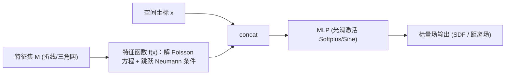

## 一句话总结

SharpNet 给普通 MLP 额外喂进一个"特征函数"通道，让网络能在用户指定（或可学习）的位置精确产生 $$C^0$$ 尖锐特征（连续但导数突变），同时其余区域保持光滑，从而更好地表达带尖边尖角的距离场和 CAD 模型。

## 研究背景

- 领域现状：MLP 是几何与视觉里的主力工具，被广泛用于神经 SDF、NeRF 等隐式表示。光滑激活（softplus、tanh 等）的 MLP 是 $$C^\infty$$ 的，天生擅长拟合光滑函数。
- 核心痛点：很多真实目标"连续但故意不可导"——比如 CAD 模型的尖边尖角，或距离场沿中轴线的梯度突变。光滑 MLP 会把这些地方抹平；ReLU MLP 虽是 $$C^0$$ 能产生梯度不连续，却无法控制不连续发生在哪；而 InstantNGP 这类网格编码的尖锐性被绑死在网格单元边界上，会在不该尖的地方"漏"出尖锐；NH-Rep 之类基于面片分割 + 布尔运算的方法则要求特征曲线闭合，处理不了开放尖边。
- 本文 idea：既然直接改激活函数难以定点控制，不如给 MLP 额外输入一个精心设计的辅助"特征函数"$$\mathfrak{f}(\boldsymbol{x})$$，它恰好只在指定特征集 $$M$$ 上 $$C^0$$、其余处处 $$C^\infty$$ 光滑。只要网络对该通道敏感，这种不可导性就会通过复合传递到最终输出，让尖锐特征精确地"长"在想要的位置。

## 方法

### 整体框架

SharpNet 的主干很朴素：把空间坐标 $$\boldsymbol{x}$$ 与一组特征函数值 $$\mathfrak{f}^{(1)}(\boldsymbol{x}),\dots,\mathfrak{f}^{(\mathfrak{n})}(\boldsymbol{x})$$ 拼接后送入一个标准 MLP，输出标量场（如 SDF）。真正的巧思全在如何构造这个特征函数，使它把"哪里该尖"的几何先验编码进网络输入。

### 关键设计

1. 不可导性的复合传递（理论保证）。论文先证明：若 $$\mathfrak{f}$$ 在 $$M$$ 上不可导、其余可导，且网络对特征通道敏感（$$\partial\Phi/\partial\mathfrak{f}\neq 0$$），那么复合场 $$\Phi_\theta(\boldsymbol{x},\mathfrak{f}(\boldsymbol{x}))$$ 就恰好在 $$M$$ 上不可导、别处可导。反例是"局部拍平"（如 $$g(t)=t^2$$ 把 $$\lvert t\rvert$$ 的尖角磨掉），实践中该敏感条件很温和，所以传递几乎总成立。

2. 用 Poisson 方程构造特征函数。作者要的是一个跨 $$M$$ 连续、但法向导数有跳跃的函数，于是把 $$\mathfrak{f}$$ 定义为带跳跃 Neumann 边界条件的 Poisson 方程的解。取特例 $$h=0,\,g=1$$ 后，借助 Green 第三恒等式化为边界积分 $$\mathfrak{f}(\boldsymbol{x})=\int_M G(\boldsymbol{x},\boldsymbol{y})\,\mathrm{d}S_{\boldsymbol{y}}$$，其中 $$G$$ 是 Laplacian 的 Green 函数。当 $$M$$ 离散成 2D 折线段或 3D 三角面时，这些积分有闭式解，直接求和即可。相比之下，用无符号距离函数（UDF）当特征函数会在中轴线等额外位置也不可导，不满足要求。

3. 用磨光子（mollifier）做局部化加速。全局积分要遍历所有特征元素，代价是 $$O(mn)$$。作者给每个局部特征元素 $$M_i$$ 的积分乘上一个光滑且紧支撑的磨光子 $$\phi_i(\boldsymbol{x})=\varphi(d(\boldsymbol{x},M_i))$$，使贡献只在有限半径内非零。这样把全局积分变成局部积分，有效项数降到约 $$O(n)$$，训练速度和显存都获得接近两个数量级的提升（否则含二阶导的 Eikonal 损失极易爆显存）。

4. 特征集分裂表达跳跃的不连续。法向导数跳跃 $$D_{\partial n}\Phi$$ 的正负由局部凹凸决定，在凹凸尖边交汇的角点处其大小甚至符号会突变。为让网络能表达"跳跃本身也不连续"，作者把 $$M$$ 划分为若干不相交子集 $$M^{(i)}$$（2D 归结为对特征图做边着色，使交汇处各边异色），每个子集配一个独立特征函数通道，从而在子集边界上允许跳跃值突变。

## 实验结果

评测覆盖 2D（已知特征的测地距离场拟合、未知特征的中轴线学习）与 3D CAD 重建三种输入设定：网格、带朝向法线的点云、纯点云。数据集为 ABC 中的 100 个 CAD 模型。指标为 Chamfer 距离（CD）、Hausdorff 距离（HD）、法线误差（NE）、F1 分数（FC）。

下面取"纯点云重建"这一最具挑战的主实验做对比（100 个模型统计均值）：

| 方法 | CD ×10⁻³ ↓ | HD ×10⁻² ↓ | NE(°) ↓ | FC(%) ↑ |
|------|-----------|-----------|---------|---------|
| SIREN | 4.593 | 4.798 | 5.877 | 95.84 |
| NeurCADRecon | 4.354 | 5.515 | 5.388 | 96.03 |
| SharpNet | 4.129 | 4.004 | 3.839 | 97.21 |

SharpNet 在四项指标上全面领先。在另两种设定中同样占优：从网格重建时（65 个可比模型）CD 从 NH-Rep 的 4.273 降到 3.788、HD 从 3.081 降到 2.249；从带法线点云重建时 CD 3.807、NE 仅 2.918，明显好于 SIREN 与 InstantNGP。此外，NH-Rep 因依赖闭合特征曲线，100 个模型里只能成功处理 65 个；SharpNet 无需面片分解，可处理开放尖边、薄结构、高亏格等复杂几何。消融实验表明：让特征集 $$M$$ 可学习能大幅降低特征 Chamfer 距离与特征法线误差；特征分裂能修复凹凸尖边交汇角点的伪影；磨光子相对全局积分带来近两个数量级的速度与显存收益（单卡 RTX 4090 上平均约 23 分钟、1.9 GB 显存）。

## 亮点与局限

- 亮点：
  - 把"在指定位置定点制造不可导"这一需求，转化为一个有 PDE 理论支撑、且有闭式边界积分解的辅助特征函数，思路干净、可控性强，且特征几何本身对 $$M$$ 可微、因而可与网络联合优化。
  - 是对 MLP 的即插即用增强，不改主干、不需面片分割或网格细分，天然兼容 SDF 常规损失与布尔运算，能处理开放尖边、薄结构、高亏格等 NH-Rep 处理不了的情形。
  - 磨光子加速把全局积分降为局部，实用性显著提升。
- 局限：
  - 特征面 $$M$$ 必须事先给定或有一个近似初始化，无法从零学出；且假定初始 $$M$$ 拓扑正确，裂缝/孔洞等拓扑缺陷在优化中无法修复。
  - 尖锐特征重建对输入点云噪声较敏感，噪声大时由带噪数据初始化的 $$M$$ 会退化。
  - 需要把 $$M$$ 离散成折线/三角网才能用闭式积分，本质上仍是离散近似。

## 延伸思考

- 论文提到 SharpNet"有潜力成为 NeurCADRecon 更好的骨干"，把这种可控 $$C^0$$ 特征函数作为通用即插件接到其他神经隐式管线（如 NeRF、神经 UDF、逆向渲染）中，或许能让更多"该尖处尖、该滑处滑"的信号被精确表达。
- 特征集只能初始化而非从零学习，是当前最大的实用瓶颈。若能把尖边检测（如文中用的 NerVE 初始化）与特征拓扑修复也纳入端到端可微框架，将显著扩大适用范围。
- 用磨光子把边界积分局部化的做法，与图形学里其他基于 Green 函数/边界元的技巧（如 walk-on-spheres、广义缠绕数）思路相通，值得思考能否统一成一类"用 PDE 解当神经场先验"的方法族。
