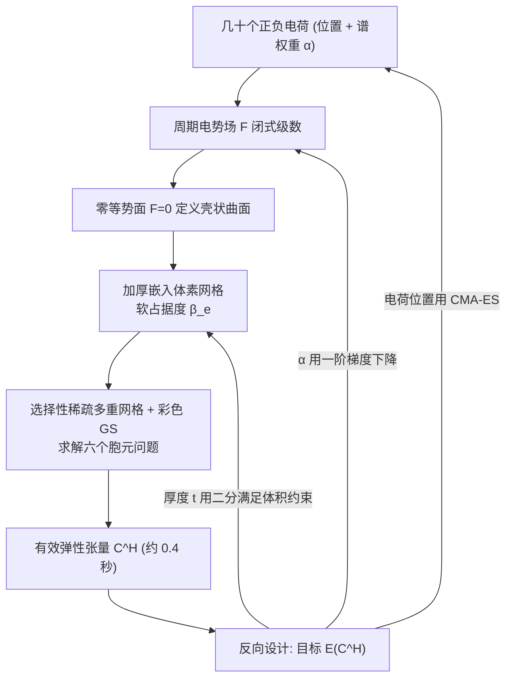

## 一句话总结

本文借用静电学直觉，用几十个电荷生成的周期电势场的零等势面来紧凑地参数化壳状（shellular）超材料，配合一套 GPU 稀疏多重网格均匀化管线，把单个结构的有效弹性张量评估压到约 0.4 秒，从而首次让壳状超材料的交互式探索与目标属性反向设计同时变得实用。

## 研究背景

壳状超材料是一类由均质弹性材料构成薄壳、通常填入立方胞元的力学超材料，因体积占用极小又能保持结构完整性而备受关注，典型代表是三周期极小曲面（TPMS）。它们被广泛用于 3D 打印填充、换热器界面、可重构薄壳等场景。

但设计壳状超材料一直很难，已有方法在"设计空间"上各有硬伤：

- 桁架型方法（如弹性纹理）不适合薄壳类微结构；针对壳的模板法往往要在狭窄模板族里求解昂贵的优化/仿真，属性多样性受限。
- 体素表示自由度随分辨率立方增长，薄壳需要极高分辨率才无离散伪影，设计空间大到难以承受。
- 程序化生成通常无法同时兼顾高效合成与自动反向设计；边界环、PDE 场等方法则常需在参数变化时反复做数值求解，难以支撑交互与大规模反向设计。

作者据此归纳出理想设计空间的四个诉求：低自由度、构造上自带周期性、无需数值求解、用户可直观操控。现有表示很难四者兼得，这正是本文要填补的空白。

## 方法

### 用电势场参数化隐式曲面

核心观察是：当空间中正负电荷数量相等时，其电势场在形态上非常接近一个符号距离场（SDF），零电势位置即曲面，离面越远电势幅值越大（虽不严格满足 Eikonal 条件）。于是曲面被定义为电势场的零等势面，设计变量只剩电荷的位置与取值，维度大幅降低。

连续电势场为

$$F(x,y,z) = \iiint \frac{\rho(\xi,\eta,\zeta)\, d\xi\, d\eta\, d\zeta}{\sqrt{(x-\xi)^2 + (y-\eta)^2 + (z-\zeta)^2}}$$

其中 $\rho$ 是由 $N$ 个电荷组成的电荷分布。为满足超材料的周期边界条件，电荷分布被周期化。Barnes（1990）证明在周期为 1 的立方胞元下该隐式函数存在傅里叶级数闭式解：

$$F(x,y,z) = \frac{8}{\pi} \sum_{j=1}^{N} q_j \sum_{h,k,l=0}^{\infty} w_{hkl} B_{hkl}(x,y,z,x_j,y_j,z_j)$$

$$B_{hkl} = \frac{\cos(2\pi h(x-x_j))\cos(2\pi k(y-y_j))\cos(2\pi l(z-z_j))}{h^2 + k^2 + l^2}$$

由于级数无穷，作者截断到 $h,k,l \le K$，并对每个模式引入谱权重 $\alpha_{hkl}$；电荷取符号 $q_j \in \{+1,-1\}$ 且正负各半：

$$F(x,y,z) = \sum_{h,k,l=0}^{K} \alpha_{hkl} w_{hkl} \sum_{j=1}^{2N} q_j B_{hkl}(x,y,z,x_j,y_j,z_j)$$

于是几何完全由电荷位置和谱权重 $\lbrace \alpha_{hkl} \rbrace$ 联合决定。值得注意的是，Barnes 早已证明截断这一电荷级数得到的闭式隐式函数能逼近多个常用 TPMS 族，因此该参数化天然涵盖 TPMS 又能超越之。作者还可在基本包围体（FBV，如八分之一胞元或四面体域）内布置电荷并镜像，强制结构对称、进一步降维，并在补充材料中证明对称电荷配置必然产生对称结构。

### 高效均匀化

为评估有效弹性张量，作者把隐式曲面加厚后嵌入规则体素网格，用平滑指示函数给每个体素赋一个软占据度 $\beta_e$：

$$K_e = \beta_e K_0, \quad \beta_e = h(d_e), \quad d_e = \frac{\lvert F(p_e)\rvert}{\lVert \nabla F(p_e)\rVert}$$

其中 $d_e$ 是体素中心到零等势面的一阶距离近似，$h(\cdot)$ 采用 logistic 平滑的 Heaviside 把零等势面转成有限厚度的壳带。这种体积嵌入既复用了结构化网格上的标准周期均匀化，又保留了紧凑的曲面参数化。

关键计算挑战是反复求解体素化周期胞元问题 $\boldsymbol{K}\boldsymbol{u} = \boldsymbol{f}$（线弹性均匀化需要六个右端项）。由于壳结构在体素空间高度稀疏——只有曲面附近一薄层体素有非可忽略刚度——作者把计算限制在活跃体素集 $\mathcal{A}_0 = \lbrace e \mid \beta_e > \varepsilon \rbrace$，并把多重网格加彩色 Gauss–Seidel 框架扩展到选择性（稀疏）体素层级上，配合结构体数组布局、批量求解六个右端项、按残差跳过已收敛项等 GPU 优化。

### 反向设计

反向设计被表述为在电荷位置 $\lbrace p_m \rbrace$、权重 $\lbrace \alpha_{hkl} \rbrace$ 和壳半厚度 $t$ 上最小化用户目标：

$$\arg\min_{\lbrace p_m\rbrace,\lbrace \alpha_{hkl}\rbrace,t} \; \mathcal{E}(\boldsymbol{C}^H)$$

体积嵌入让整条管线对设计参数可微，$\partial \mathcal{E}/\partial \beta_e$ 可沿用拓扑优化的标准伴随方法，其余项由 $h(\cdot)$ 与隐式场解析给出。实践中作者发现电荷位置的优化景观高度非凸且因体素化和离散活跃集选择而"噪声化"，一阶法和无导数局部法（如 BOBYQA）常早停，故电荷位置用 CMA-ES 优化；而权重 $\alpha_{hkl}$ 的景观更光滑，用一阶梯度下降更快更好。带体积约束时，管线交替执行三步：二分调整厚度 $t$ 满足体积分数、固定电荷优化 $\alpha_{hkl}$、固定权重用 CMA-ES 优化电荷位置。

## 实验结果

在配备 NVIDIA H200 的服务器上（CUDA 实现），核心性能与精度如下。在 $256^3$ 分辨率、厚度 $t=0.02$ 时，选择性求解器相对稠密网格基线约 8 倍加速，单次均匀化约 0.35 秒，相对商业参考解的 $L_2$ 误差约 4%，且始终优于同设置下开源求解器 Zhang et al. 的精度与速度。

| $r$ | $t$ | 活跃体素 $n_e$ | $t_{\text{all}}$ (ms) | $t_{\text{Zhang}}$ (ms) | V-cycle 数 | $\epsilon$ | $\epsilon_{\text{Zhang}}$ | 显存 (GB) |
|---|---|---|---|---|---|---|---|---|
| 64 | 0.02 | 32K | 126.4 | 377.0 | 5 | 6.6% | 13.8% | 1.1 |
| 128 | 0.02 | 212K | 182.9 | 696.1 | 5 | 4.8% | 8.6% | 2.6 |
| 256 | 0.02 | 1.5M | 355.7 | 2919.4 | 5 | 4.1% | 5.4% | 13.5 |
| 256 | 0.02 | 1.5M | 1976.2 | 33209.4 | 29 | 2.0% | 4.7% | 13.5 |
| 256 | 0.04 | 2.8M | 399.6 | 3091.3 | 5 | 1.5% | 5.7% | 13.5 |
| 512 | 0.02 | 11.4M | 2866.2 | 37129.6 | 15 | 1.4% | 7.5% | 100.4 |

其他关键结果：

- **几何多样性**：组合三种对称模式、三种厚度、两种电荷数共 18 类，合成 2700 个随机结构，属性覆盖杨氏模量、体积模量、剪切模量、各向异性指数等宽广范围。在约 192 个标量的相同变量规模下，其设计空间对 $K_{\text{eff}}$ 和 $E_x$ 的覆盖跨度与极值均优于截断傅里叶基、Green 函数（热源）基以及星形 Voronoi 方法（例如 Cubic_8 设置下 $E_x$ 跨度从 42.1% 提升到 75.1%）。
- **表示既有结构**：通过拟合优化可精确重建 50 个 TPMS 与 3 个平面，相对 $L_2$ 弹性张量误差与 Hausdorff 距离都很小。
- **最优结构搜索**：六类目标下，$E_x$ 优化达到 Voigt 上界的 96.9% 与 99.8%；$K_{\text{eff}}$ 达理论上界约 91.3%–91.4%；$G_{\text{eff}}$ 达 52.3%–58.4%。这些在低密度区（$V \le 10\%$）与已有最优方法相当，且体积分数 0.1 下的剪切/体积模量优化明显超过基于拓扑优化的基线（58.4% 对 38.2%、91.5% 对 69.8%）。还能找到与最近各向同性张量仅差 0.22% 的近各向同性结构。
- **可制造性**：胞元天然周期、可无缝平铺，并能在界面窄带内插值隐式场混合异质胞元。用 DLP 打印了三个 $5\times5\times5$ 均质块和一个异质块（均为 5cm 立方、无支撑、约 1 小时/块）验证可制造。

## 亮点与局限

**亮点**：

- 用电荷/电势这一物理直觉把周期壳曲面压缩到几十个可解释参数，同时满足低自由度、构造周期性、无需求解、可直观操控四点，罕见地四者兼得。
- 参数化天然涵盖 TPMS 又能连续泛化超越之，且能高精度拟合既有 TPMS 与平面结构。
- 选择性稀疏多重网格针对壳体素稀疏性做优化，把均匀化压到约 0.4 秒，真正支撑了交互式 GUI 与反向设计。
- 针对不同变量选用不同优化器（电荷位置用 CMA-ES、谱权重用一阶梯度），务实地应对了非凸且噪声化的景观。

**局限**：

- 属性评估依赖体素嵌入与均匀化，存在离散化误差，对极薄壳尤为明显；作者建议未来引入壳/曲面级仿真提升精度。
- 公式不显式强制连通性约束，可能产生孤立分量（需靠额外惩罚项处理）。
- 电荷位置优化高度非凸、依赖 CMA-ES，缺乏收敛保证；论文主要停留在线弹性有效属性，未系统刻画非线性、屈曲、材料缺陷等真实性能。

## 延伸思考

这项工作最吸引人的地方是把一个陌生物理领域（静电势）的结构借来做几何参数化：正负电荷等量时电势场"恰好像"SDF，于是零等势面就成了天然周期、光滑、低维的曲面表示。这种"借场生形"的思路提示我们，凡是能写出闭式周期解的线性 PDE（热、扩散、亥姆霍兹等）都可能诱导出一族有用的隐式设计空间，而选择哪种"场"其实隐含了对可达几何/属性分布的先验偏好——论文里电势基就比热源 Green 基覆盖更广，说明基的选择本身是设计的一部分。

作者也指出这套隐式周期表示可迁移到热学、流体等物理目标，这与其"标量属性快速评估 + 反向设计"的范式高度契合。真正要走向工程落地，仍需补上连通性、屈曲、非线性大变形与制造缺陷这几块拼图；把可微均匀化换成可微的壳/曲面仿真、并在优化目标中显式纳入稳定性，或许是让这类"秒级可评估"的紧凑设计空间从图形学 demo 迈向可靠承载件的关键一步。
