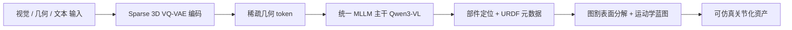

## 一句话总结

SIMART 用一个统一的多模态大模型（MLLM），把没有关节信息的整体静态网格一步转成"可仿真"的关节化资产——同时完成部件分解与运动学参数（URDF）预测，并靠 Sparse 3D VQ-VAE 把 3D token 数量砍掉约 70%。

## 研究背景

- 领域现状：具身智能与物理仿真离不开带运动学信息的关节化 3D 资产（能开的冰箱、能转的车轮），但现有绝大多数 3D 资产是静态、不可动的整块网格，手工制作关节化资产又极其费力。近年的 3D 生成模型能造出高质量静态网格，却不带任何关节或物理元数据。
- 核心痛点：主流做法是多阶段流水线——先做部件分解，再单独估计关节参数，最后拼装。这种解耦方式会逐级累积误差：2D 视觉模型迁移到 3D 边界不可靠，3D 原生分割方法只追求表面一致性、容易错过力学上有意义的连杆边界；关节估计对网格瑕疵敏感，预测出的关节常与部件几何不兼容，产生物理上无效的关节。而已有的 3D-native MLLM 尝试又受制于稠密体素 tokenization——大量 token 浪费在空白空间上，$$O(N^3)$$ 复杂度导致显存爆炸，难以扩展到复杂物体。
- 本文 idea：用一个统一 MLLM 单阶段地同时做部件分解和运动学预测，避免误差累积；再用一个 Sparse 3D VQ-VAE 只编码被占据的表面体素，大幅压缩几何 token 序列，让 MLLM 能高效处理复杂网格并生成高保真多部件装配。

## 方法

整体框架：给定视觉图像、原始几何、文本指令三种模态输入，SIMART 先用 Sparse 3D VQ-VAE 把 3D 几何编码成紧凑的稀疏几何 token，再与视觉、文本 token 拼接送入统一 MLLM 主干（Qwen3-VL），联合输出部件定位标记和结构化 URDF 元数据；最后把生成的部件点云映射回原网格做精细分解，配上运动学蓝图，得到可直接导入仿真器的资产。

关键设计：

1. **Sparse 3D VQ-VAE（稀疏几何表示）**。借鉴 ShapeLLM-Omni，用 3D-Unet 把 $$64^3$$ 体素网格编码到 $$16 \times 16 \times 16$$ 的隐空间。与稠密 VQ-VAE 对每个隐位置一视同仁不同，本文利用 3D 数据天然的稀疏性：编码时识别出未占据体素并赋予一个专门的零 token（$$e_{\text{zero}}$$），只把占据几何区域的特征送去做向量量化，量化规则为在码本中（排除零 token）取最近邻。这样跳过空白空间，典型场景下 token 数量减少约 70%。

2. **坐标感知的稀疏 token 序列化**。稠密表示靠固定序列长度维持索引与 3D 坐标的映射，而稀疏 token 需要显式定位来保住拓扑结构。每个占据体素被序列化为三元组 `⟨voxel⟩[xyz] [K]`：`⟨voxel⟩` 是起始标识符，$$[K] \in [0, 4095]$$ 是从码本取回的几何索引，空间位置由坐标 token 用线性化索引 $$xyz = 64x + 8y + z$$（其中 $$x, y, z \in [0, 7]$$）编码。这让 MLLM 能在变长序列上做细粒度几何推理。

3. **统一 MLLM 联合推理**。以 Qwen3-VL-8B 为主干，把 ViT 视觉特征、稀疏几何特征、文本指令拼成总长 $$L = N_v + N_g + N_t$$ 的多模态序列联合推理。文本指令用来调制部件定位标记和结构化 URDF 元数据（运动学层级与物理属性）的生成。借助大模型的世界知识，模型还能推理材料属性、真实尺度等抽象物理属性。

4. **可仿真资产合成**。VQ-VAE 解码器把 MLLM 生成的部件体素 token 解码成稀疏点云种子 $$S_p$$；再用基于图的表面分割把种子映射到高保真原网格：先按高斯核初始化每个顶点属于某部件的概率 $$P(v, p) \propto \exp\left(-\dfrac{d(v, S_p)^2}{2\sigma^2}\right)$$，其中 $$d(v, S_p)$$ 是到该部件最近种子的距离；再沿网格邻接矩阵迭代图平滑、多数投票得到最终面标签。原网格纹理被保留作为输出纹理。同时 MLLM 直接生成 URDF，描述运动链（父子层级、关节轴与限位）以及关节限位、材料密度、表面摩擦等物理属性。

## 实验结果

训练数据来自 PhysXNet 与 PartNet-Mobility 的 39,600 个物体（5,600 关节化 + 34,000 静态），每个关节化模型渲染 20 个不同运动状态做增强，合成 URDF 生成集与部件定位集各约 96 万 QA 对。评测用自建的 SIMART-Bench，把 PartNet-Mobility 的域内资产与 AIGC 合成的分布外物体结合。VQ-VAE 用 8 卡 A100、MLLM 用 32 卡 A100 微调。

主实验（关节精度与几何保真度）在域内（ID）和 AI 生成两类物体上对比各基线，SIMART 全指标最优：

| 方法 | Type ↑ | Axis ↓ | Origin ↓ | IoU ↑ | CD ↓ |
|------|--------|--------|----------|-------|------|
| Urdformer | 0.496 | 0.585 | 0.610 | 0.002 | 0.624 |
| Articulate-Anything | 0.891 | 0.315 | 0.174 | 0.202 | 0.239 |
| PhysX-Anything | 0.686 | 0.312 | 0.322 | 0.128 | 0.278 |
| Particulate | 0.822 | 0.208 | 0.204 | 0.643 | 0.140 |
| SIMART（本文，ID） | 0.928 | 0.080 | 0.111 | 0.690 | 0.087 |
| SIMART（本文，AI 生成） | 0.831 | 0.136 | 0.145 | 0.777 | 0.079 |

除 Particulate 外的基线都无法直接处理原始网格，与源数据几何对齐差，IoU 极低、CD 很高。SIMART 因直接吃网格并由 MLLM 驱动分割，几何保真度显著领先。

其余实验：在部件定位（3D Part Understanding）任务上，SIMART 在 AI 生成物体上 IoU 0.807 / CD 0.018，大幅超过 PhysX-Anything（0.067 / 0.347）和"P3SAM + Qwen3-VL"基线（0.507 / 0.234）。消融显示：稠密 token 因序列随部件数线性增长直接 OOM（约 4138 token）；"强制稀疏"降到 862 token 但精度一般；引入零 token 机制降到 516 token 且全指标更优；再加视觉特征得到完整 SIMART，取得最高精度（Type 0.937、IoU 0.832、CD 0.055），印证视觉信息对消解几何歧义的关键作用。

## 亮点与局限

- 亮点：
  - 单阶段统一框架同时做部件分解与运动学预测，避免多阶段流水线的误差累积，产出与输入几何严格对齐的可仿真资产。
  - Sparse 3D VQ-VAE 的零 token 机制把 3D token 砍掉约 70%，从根本上缓解稠密体素的显存爆炸，使复杂多部件装配可训。
  - 坐标感知的稀疏序列化让变长几何序列可被 MLLM 细粒度推理，并能借助 VLM 世界知识把功能性文本描述对应到物理坐标。
  - 展示了在 NVIDIA Isaac Sim 物理仿真和 VR/AR（结合 SAM3D 的点击式功能化）中的下游应用。

- 局限：
  - 现有关节化数据集稀缺且质量参差，仍是开放世界泛化的主要瓶颈。
  - 几何被离散到 $$64^3$$ 体素再重建，细粒度表面细节可能受限；分部件重建后再映射回原网格，边界质量依赖图平滑与投票。
  - 依赖大规模算力（数十张 A100）训练，复现成本高。

## 延伸思考

- 作者提出的未来方向很实际：把 SIMART 当作"预验证的关节标注器"来加速数据标注闭环，反过来造出更大更多样的关节化数据集，形成数据-模型正反馈。
- 稀疏 token 化的思路（只编码占据体素 + 显式坐标 token）对更广的 3D-native MLLM 都有借鉴价值，可能迁移到部件级编辑、场景级关节推理等任务。
- 与依赖多状态观测的重建类方法（如 ArtGS、ArticulatedGS）相比，SIMART 只需单一静态网格即可推断运动学，泛化性更好；但代价是运动学来自模型先验推断而非真实观测，物理正确性的上限值得进一步追问。
