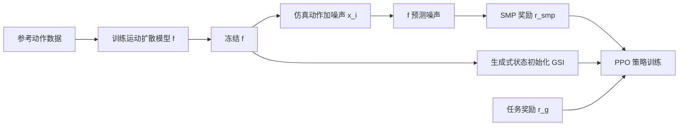

## 一句话总结

把一个预训练好、之后完全冻结的运动扩散模型，通过分数蒸馏采样（SDS）改造成"可复用、可模块化"的运动自然度奖励函数，让物理仿真角色在各种任务上学出自然动作，而且训练策略时不再需要保留原始参考动作数据。

## 研究背景

- 领域现状：让物理仿真角色动作自然，主流是"分布匹配"式的对抗模仿学习，代表作是 AMP（Adversarial Motion Priors）——用一个判别器区分角色动作和参考动作，把判别分数当风格奖励。
- 核心痛点：对抗式先验几乎都要和某个具体策略"联合训练"。换一个新任务、新策略，判别器就得从头再训一遍，而且训练全程都必须持续访问原始动作数据集。这让先验既不可复用、也不模块化，还逼着你永久保留数据集。作者尝试的"冻结判别器复用"（AMP-Frozen）会因为输入分布外（OOD）而失效，判别器被策略钻空子。
- 本文 idea：先在动作数据上训一个与任务、策略无关的扩散模型，然后把它冻结，用 SDS 把它当成一个"稳定的、现成的"奖励模型来评估动作自然度。扩散模型多噪声层的鲁棒性，让它即使面对偏离数据集的动作也能给出可靠的梯度方向。一次训练，之后到处复用。

## 方法

整体框架：给定一段无结构动作数据，先训练一个运动扩散模型来刻画数据分布；训练完把它冻结，在强化学习里当奖励用。策略每走一步，把仿真出来的动作片段加噪声送进扩散模型，让模型预测噪声 $$\hat{\boldsymbol{\epsilon}}$$，预测噪声和真实加入噪声 $$\boldsymbol{\epsilon}$$ 之间的残差 $$(\boldsymbol{\epsilon}-\hat{\boldsymbol{\epsilon}})$$ 就是"把角色动作往参考分布拉"的修正方向。残差越小，说明动作越贴近参考分布。

关键设计：

1. **SMP 奖励（SDS 转成 RL 奖励）**：简化后的 SDS 损失就是预测噪声和加入噪声的平方差 $$\lVert \hat{\boldsymbol{\epsilon}}-\boldsymbol{\epsilon} \rVert_2^2$$。作者对它做指数变换归一化到 $$[0,1]$$，得到奖励 $$r_{\text{smp}}=\exp(-w_s \lVert \hat{\boldsymbol{\epsilon}}-\boldsymbol{\epsilon} \rVert_2^2)$$。这个"归一化"偏离了原始 SDS 形式，但作者发现能让 RL 训练明显更稳更好。最终奖励是先验奖励和任务奖励的线性组合 $$r_t = w_{\text{prior}} r_{\text{smp}} + w_g r_g$$。

2. **集成分数匹配（ESM）**：SDS 对扩散时间步（噪声档位）非常敏感——高噪声档位可靠但信息少，低噪声档位对抖动敏感、精细但对 OOD 不稳。逐步随机采一个时间步会给奖励引入巨大方差，破坏值函数和优势估计。作者的做法是在一组固定时间步 $$\mathcal{K}=\{22,15,8\}$$ 上做多次 SDS 评估取平均。实测这一招把同一段动作重复评估 1024 次的方差从 1.140 压到约 $$9.96\times10^{-6}$$，而均值几乎不变，从而让 RL 奖励稳定得多。再叠加一个按每个时间步 SDS 误差跑动均值做的自适应归一化（AdaNorm），进一步降低对不同扩散模型、不同风格的敏感度。

3. **生成式状态初始化（GSI）**：传统的参考状态初始化（RSI）要从数据集里采初始姿态，又把数据依赖拉回来了。作者干脆直接从冻结的扩散模型里"生成"初始状态。于是同一个扩散模型身兼两职：既是奖励函数，又是初始状态分布。这样训练策略时可以彻底扔掉原始数据集。

4. **风格条件化与风格组合**：在大规模 100STYLE 数据上训一个风格条件扩散模型，用无分类器引导（CFG）就能把这个"通用先验"重塑成任意单一风格的先验（CFG 权重设 1.0 基本够用），无需为每种风格单独训模型。更进一步，把不同风格的噪声预测在 $$\boldsymbol{\epsilon}$$ 空间用上下半身掩码 $$M_{\text{upper}}, M_{\text{lower}}$$ 混合，就能合成数据集里根本不存在的新风格（如"AeroPlane + HighKnees"），并直接用于奖励和 GSI。

扩散模型本身很轻：一个两层 transformer 编码器、约 3M 参数、窗口 10 帧、50 个扩散步，在单张 RTX 4090 上约 5 小时就能拟合 20 小时的大规模风格数据。策略用 PPO 训练。

## 实验结果

主实验是单片段模仿基准，用位置跟踪误差衡量各方法能否精确复现一段参考动作。对比对象：跟踪式方法 DeepMimic（DM，显式逐帧对齐，理论上误差下限）、对抗式 AMP、冻结判别器的 AMP-Frozen、以及同为分数匹配的 SMILING。

| 技能 | DM | AMP | AMP-Frozen | SMILING | SMP（本文） |
|------|------|------|------|------|------|
| Walk | 0.010 | 0.028 | 0.044 | 0.042 | 0.030 |
| Run | 0.013 | 0.088 | 0.129 | 0.115 | 0.067 |
| Spinkick | 0.073 | 0.049 | 0.324 | 0.088 | 0.059 |
| Cartwheel | 0.243 | 0.043 | 0.419 | 0.104 | 0.043 |
| Backflip | 0.073 | 0.058 | 0.272 | 0.144 | 0.069 |
| Crawl | 0.006 | 0.011 | 0.285 | 0.061 | 0.011 |
| 平均 | 0.070 | 0.046 | 0.246 | 0.092 | 0.046 |

（单位：米，越低越好）SMP 平均误差 0.046 与 AMP 持平，全面优于 SMILING 和 AMP-Frozen，且在高动态技能上很接近甚至追平专门做逐帧跟踪的 DeepMimic——关键是它训练时完全不需要访问参考数据。AMP-Frozen 全线崩坏，印证了对抗式先验无法直接冻结复用。

其余实验用文字概括：风格任务上，单个 100STYLE 先验经 CFG 适配到 12 种风格，平均任务回报 0.879、风格准确率 0.962，与需要逐风格单独训练判别器的 AMP 相当，而 AMP-Frozen 风格准确率仅 0.205。多任务复用上（LaFAN1 跑步先验），SMP 在 Steering/Target Location/Dodgeball 上均领先，尤其 Dodgeball 达 0.733 而 AMP 仅 0.233（对抗目标在动作偏离数据集较远时不稳）。人-物交互（Object Carry 成功率 0.997）、起身恢复（Getup 成功率 0.998）也都能胜任。消融显示 ESM 把 Backflip 误差从 0.195 降到 0.069，AdaNorm 把平均误差从 0.176 降到 0.057。此外只用 3 秒的走/慢跑/跑数据，策略就能自发泛化出连续调速和自然的步态切换。控制器还成功仿真训练后直接部署到 Unitree G1 真实人形机器人上。

## 亮点与局限

- 亮点：
  - 真正做到了运动先验的"可复用 + 模块化"：训一次、冻结、到处用，训练下游策略时可以彻底丢掉原始数据集（对数据隐私场景友好）。
  - 用 ESM + AdaNorm 两个工程上很关键的设计，把此前 SDS 做 RL 奖励"糊、弱、不稳"的老毛病治好了，质量追平 SOTA 对抗方法。
  - 奖励模型是稳态的（不随策略更新而漂移），因此样本效率普遍优于 AMP；还能靠 CFG / 噪声空间混合零成本合成数据集中不存在的新风格。
  - 从 3 秒到 20 小时数据都能用，并且做到了真机部署。

- 局限：
  - 和多数 mode-seeking 目标一样，SMP 容易模式坍塌，策略收敛到某个任务下的少数技能而非完整行为分布，数据集越大越明显。
  - 朴素的 GSI 可能生成非法初始状态（如自穿插），给仿真带来不稳定。
  - 相比 AMP 更小的风格专用判别器，SMP 用的先验模型更大，单任务训练时间偏长（如 HighKnees 目标位置任务 11.5 小时 vs AMP 6.2 小时），不过推理期开销和 AMP 一致（只跑策略）。

## 延伸思考

SMP 本质是把视觉领域"用冻结扩散模型当可微目标"的 SDS 思路，成功搬到物理角色控制的 RL 奖励上，并针对 RL 的高方差特性打了两个关键补丁（ESM、AdaNorm）。它和 SMILING 的分界很清楚：SMILING 需要任务专用扩散模型，SMP 用的是任务无关先验，再靠目标组合去适配任务，这正是"可复用"的来源。

值得追问的方向：一是模式坍塌，能否用生成式策略或更细粒度的技能条件来显式指定"该用哪个技能"从而恢复多样性；二是把 GSI 和扩散引导采样结合，过滤掉自穿插等非法初始态；三是"冻结奖励模型带来稳态、进而提升样本效率"这一观察，可能对更广义的"扩散模型即奖励"范式（机器人操作、通用技能学习）有借鉴意义。
