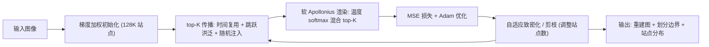

## 一句话总结

SAD 用一组自适应的各向异性"站点"把图像表示成一个可微的软 Apollonius（加性加权 Voronoi）划分，每个像素只在最近的 top-$$K$$ 个站点上做温度可控的 softmax 混合，从而在保持显式空间归属和内容对齐边界的同时，实现比 Image-GS / Instant-NGP 更高的重建质量和快一个数量级的拟合速度。

## 研究背景

- 领域现状：紧凑、可微、能快速拟合与求值的图像表示（隐式神经场如 SIREN / Instant-NGP，以及基于点/泼溅的显式表示如 GaussianImage / Image-GS）在压缩、生成模型解码器、可微重采样与逆问题先验等场景中越来越重要。
- 核心痛点：隐式神经场缺乏显式的空间归属，剪枝、局部容量重分配、预算控制都很别扭；泼溅类方法虽然内容自适应，但核之间相互重叠会模糊"每个像素归谁负责"，让剪枝和预算控制变难，尤其难以在不过度重叠的前提下表示尖锐不连续。更普遍的障碍是**编码成本**——把一张图拟合成紧凑表示往往比求值慢好几个数量级。
- 本文 idea：用一个**可学习的软划分**替代核重叠。每个站点定义一个各向异性度量和一个加性半径，用站点相关的距离分数在每像素 top-$$K$$ 上做 softmax 混合。这样得到一个"单位分解"（partition of unity）：既有稠密梯度便于优化，又让空间归属显式；每站点可学习的温度 $$\tau_i$$ 能把软划分逐步锐化成内容对齐的清晰边界。固定 $$K$$ 的邻域让渲染和拟合都对 GPU 友好。

## 方法

整体框架：把图像建模为 $$N$$ 个各向异性站点的集合，每个站点带位置、颜色、加性半径、各向异性方向与温度。渲染时对每个像素只取其 top-$$K$$（$$K=8$$）个竞争站点，按温度控制的 softmax 权重混合颜色。训练是一条全程驻留 GPU 的流水线：梯度加权初始化 → Adam 联合优化站点参数 → 基于误差密度的自适应致密化与剪枝控制预算，并用一套受 Jump Flooding 启发的 top-$$K$$ 传播算法在恒定代价下维护每像素候选集。

关键设计：

1. **各向异性加性加权分数（软 Apollonius）**。站点 $$i$$ 用一个行列式为 1 的 SPD 度量 $$G_i = e^{a_i} u_i u_i^{\top} + e^{-a_i} v_i v_i^{\top}$$ 定义方向性拉伸（只改长宽比、不改面积），并定义归一化的有符号距离分数 $$d_{\text{mix}}(x,i) = s\lVert x - p_i \rVert_{G_i} - s\,r_i$$，其中 $$s = 1/\max(H,W)$$ 保证分辨率无关。半径 $$r_i$$ 相当于站点的"影响半径"，$$G_i$$ 控制方向拉伸，$$\tau_i$$ 控制软硬。相比 power/Laguerre 的二次形式，这个平方根形式让 $$r_i$$ 在各向异性下几何意义更清晰，并把"覆盖范围（$$r_i$$）"与"硬度（$$\tau_i$$）"解耦。

2. **温度可控的 softmax 单位分解**。每站点产生 logit $$\ell_i(x) = -\tau_i\, d_{\text{mix}}(x,i)$$，像素颜色为 $$c(x) = \sum_{i \in \mathcal{C}(x)} w_i(x)\, c_i$$，权重 $$w_i(x) = \exp(\ell_i(x)) / \sum_{j \in \mathcal{C}(x)} \exp(\ell_j(x))$$。它不是硬的 $$\arg\min$$ 划分，而是软划分——多个邻近站点可共同解释一个像素，梯度稠密、优化稳定；每站点独立的温度提供从"软"到"硬"的连续旋钮，可在需要处锐化边界。

3. **top-$$K$$ 传播（恒定代价查询）**。为避免每像素扫描全部 $$N$$ 个站点，维护一个固定大小（$$K=8$$）的每像素候选表，近似同一分数下的 top-$$K$$。更新式为 $$\tilde{\mathcal{C}}_t(x) = \mathcal{C}_{t-1}(x) \cup \mathcal{P}_t(x) \cup \mathcal{G}_t(x)$$，再取 top-$$K$$：时间复用（沿用上一步候选做暖启动）+ 空间传播（自身 + 4 邻域，跳跃步长按 JFA 的 $$B/2, B/4, \dots, 1$$ 由粗到细）+ 少量随机全局探测（防止漏掉远处新竞争者）。每像素恒定 $$O(P\cdot K)$$ 工作量，天然适配 GPU 的规整、带宽友好核。

4. **GPU-first 训练与预算控制**。梯度加权初始化把站点集中到高频区域；用纯 MSE 损失和 Adam 优化。自适应预算用误差密度启发式 $$s_i = E_i / \max(m_i, \varepsilon)^{\alpha}$$ 选站点致密化（沿主轴分裂），并用**移除增量**（闭式估计删掉某站点并重归一化后的重建误差增量）做剪枝信号。整条前向/反向/候选传播/Adam 全部在 GPU 上跑、不依赖自动微分框架、训练迭代中无 CPU 往返，并用分块 threadgroup 哈希归约缓解梯度累加的原子冲突。

## 实验结果

在 Image-GS 基准（45 张图，同比特率下与 Image-GS、Instant-NGP 对比重建质量）上，SAD 在所有比特率和指标上全面领先：

| 方法 | 0.2 BPP PSNR↑ | 0.3 BPP PSNR↑ | 0.4 BPP PSNR↑ | 0.5 BPP PSNR↑ |
|------|------|------|------|------|
| SAD (本文) | 33.87 | 35.72 | 36.97 | 37.86 |
| Image-GS | 31.32 | 32.79 | 33.80 | 34.57 |
| Instant-NGP | 26.66 | 29.41 | 29.86 | 30.69 |

在 0.5 BPP 时 SAD 相对 Image-GS 高约 +3.29 dB，LPIPS 也从 0.0769 降到 0.0458。跨数据集看：DIV2K 上 +1.52/+2.58 dB（0.5/2.0 BPP），CLIC 上 +1.17/+1.98 dB。Kodak（5 万站点、约 16 BPP）上 SAD 达 46.00 dB / 0.9871 SSIM / 0.0032 LPIPS，编码时间仅 2.2 s，而 Image-GS 需 28 s、Fast 2DGS 需 10 s（43.13 dB）。训练效率方面，SAD 每 epoch 比 Instant-NGP 快 1.75–3.36×、比 Image-GS 快 4.08–15.10×，端到端墙钟训练相对 Image-GS 提速 5–19×。

消融显示各参数贡献清晰（2048² 图、0.5 BPP）：固定温度基线 28.20 dB → 自适应温度 +2.30 dB → 再加各向异性贡献最大（+4.27 dB）→ 全模型 35.35 dB（较固定基线 +7.15 dB），说明与图像梯度对齐的拉长细胞是尖锐边缘和方向纹理重建的关键。作者还展示了两个下游应用：在不规则域上求解 2D 泊松方程时，显式站点可"冻结"边界站点直接施加硬 Dirichlet 约束（隐式 MLP 难做），1000–2000 步即收敛到机器精度；1D 信号拟合中，SAD 靠可学习温度在阶跃处精确锐化，避免了 SIREN 的 Gibbs 振铃和高斯泼溅的圆角化。

## 亮点与局限

- 亮点：
  - 把经典计算几何的 Apollonius 图"软化 + 可微化"，得到既显式（明确归属与邻接）又可端到端优化的图像表示，概念优雅。
  - 每站点独立温度把"软/硬"与"覆盖范围"解耦，天然处理内容对齐的尖锐不连续，这是高斯核和隐式场都不擅长的。
  - 固定 $$K$$ 的 top-$$K$$ 传播 + 全 GPU 手写核（无自动微分、无 CPU 往返）带来数量级的编码提速，工程落地扎实（Metal/CUDA/WebGPU 多后端）。

- 局限：
  - 最快的渲染只在 top-$$K$$ 缓存有效时成立；一旦需要刷新候选表（大幅编辑、换分辨率重渲染），多趟传播/重播种的更新会主导端到端渲染时间——在 2048² 上完整刷新渲染耗时明显高于 Image-GS，随机访问的低延迟依赖缓存命中。
  - 边界与图像结构的对齐是优化的**涌现结果**而非硬保证，在细结构、弱对比边缘或高度随机的纹理上可能退化、需要更大站点预算。
  - 论文自述其 BPP 只是"参数空间存储"的紧凑性代理，尚未做熵编码，不能直接与 JPEG2000/WebP 等成熟编解码器对标。

## 延伸思考

SAD 站在"显式 vs 隐式"表示的分界线上：它保留了神经场的可微性，又找回了传统 Voronoi/网格表示的显式结构与局部可控性，这种"可微化经典几何原语"的思路（软划分 + 温度锐化）很可能迁移到 3D 体/面表示与更一般的可微物理/逆问题。作者也指出几条自然延展：分层/多分辨率的候选维护以降低刷新代价、比常数颜色更丰富的每站点外观模型、可学习的距离度量以提升表达力而不线性增加站点数，以及用预训练先验替代梯度启发式初始化。值得追问的是熵编码——论文强调站点的诱导邻接图为"邻居条件差分编码 / 图感知量化"提供了抓手，若这一步兑现，SAD 才可能真正逼近生产级编解码器的操作点。

