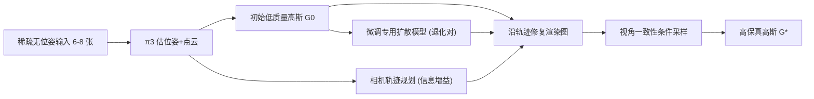

## 一句话总结

S2C-3D 用一个针对当前场景微调的扩散模型、一套覆盖全场景的相机轨迹规划、以及一个免训练的多视角一致性条件采样，把仅 6 到 8 张稀疏照片重建成无缺失、无模糊、无明显伪影的完整 3D 高斯场景。

## 研究背景

- 领域现状：NeRF 与 3DGS 让高保真 3D 场景重建成为可能，但都需要几十张多视角图像，采集耗时费力，对新手也不友好。稀疏视角重建因此成为热点，主流做法是先从少量输入初始化低质量高斯，再用先验（早期是手工先验，近期是预训练扩散模型）修复虚拟相机渲染出的图像，反复迭代来精修高斯。
- 核心痛点：作者指出现有基于扩散先验的管线有三个被忽视的问题。其一，扩散修复出的多视角图像之间彼此不一致，大面积未观测区域会因此产生严重模糊与伪影。其二，直接用未微调的通用扩散模型，当先验分布与目标场景存在较大域间隙时修复质量骤降。其三，简单在输入视角之间做相机插值，生成的虚拟相机只覆盖输入视点附近，无法覆盖整个场景，导致重建不完整。
- 本文 idea：针对这三个痛点分别设计三个组件——用输入视图及其退化版本微调出一个消除域间隙的专用扩散模型；用贪心的相机轨迹规划保证全场景覆盖；在高斯精修阶段冻结扩散模型，度量相邻修复图像的一致性并作为条件注入采样过程，免训练地引导生成视角一致的图像。

## 方法

整体框架分三个阶段：先从无位姿的稀疏输入用前馈几何重建模型 $$\pi_3$$ 估计相机位姿与点云，得到初始低质量高斯；再微调出专用扩散模型并规划覆盖全场景的相机轨迹；最后在规划轨迹上修复渲染图并用视角一致性条件采样精修高斯。

关键设计分三点展开。

第一，专用扩散模型微调，消除域间隙。稀疏输入虽少但携带了场景的外观特征，作者用它们构造训练对来把通用扩散模型适配到目标场景。具体做法是对初始高斯 $$G_0$$ 的属性加随机噪声、渲染出噪声退化图，同时随机移除一部分高斯来模拟大面积遮挡的退化图（掩码技术），从而建立"退化观测到原始场景内容"的映射。训练时冻结 VAE 编码器、只用 LoRA 适配解码器，损失为 $$L_2$$、感知 LPIPS 与 Gram 矩阵损失之和。这样修复大范围可见与遮挡区域的能力显著优于直接套用未微调的 Difix3D+。

第二，相机轨迹规划，保证全场景覆盖。先用泊松重建把 $$\pi_3$$ 点云转成表面网格，但稀疏点云的网格往往不封闭，于是额外在紧包围盒 OBB 的六个面上采样点以覆盖缺失区域，再把所有表面点转成球面并在球面上均匀撒采样点。相机对某局部球面的覆盖用其视锥与球面相交内的采样点集合近似，一个相机的"信息增益"定义为它相比已有相机新观测到的采样点数量。轨迹规划是贪心算法：随机采一个新相机，找 $$\pi_3$$ 位姿距离最近的两个已有相机并在其间插值出一条候选路径，若该路径的信息增益超过阈值就整条并入轨迹，反复直到无法带来新信息。这样少量相机就能覆盖整个场景，且每个规划相机都能从两个相邻修复图获得互补引导。

第三，视角一致性条件采样，免训练精修。作者把多视角一致性写成条件 $$Q$$，据贝叶斯规则条件得分函数拆成无条件项加校正梯度 $$\nabla_{x_t} \log p(Q \mid x_t)$$，并把它建模为一个一致性引导的能量函数，最终正比于 $$-\nabla_{x_t} D_{\theta}(Q, x_0)$$。能量函数如何度量一致性：对每张修复图 $$x_0^j$$，用其两个相邻渲染图的深度与位姿反投影成 3D RGB 点、再投影回 $$x_0^j$$ 的像平面得到两张点渲染图，一致性能量就是修复图与这两张邻居点渲染图之间带有效性掩码的逐像素 L1 差异。采用单步 Difix3D+ 作为骨干，在高斯优化循环里把这个能量梯度注入采样，渐进地把修复图推向视角一致，最终得到高保真高斯。

## 实验结果

在 ScanNet++、Replica 与自采的 S2C-Scene 三个数据集上与稀疏视角方法比较新视角合成质量。下表取 ScanNet++ 8 视角设定作为主实验对比（PSNR/SSIM 越高越好，LPIPS 越低越好）。

| 方法 | PSNR ↑ | SSIM ↑ | LPIPS ↓ |
|------|--------|--------|---------|
| 3DGS | 14.956 | 0.554 | 0.432 |
| DNGaussian | 13.728 | 0.446 | 0.551 |
| Difix3D+ | 15.300 | 0.613 | 0.361 |
| GenFusion | 17.993 | 0.683 | 0.331 |
| VD-3DGS | 18.291 | 0.688 | 0.346 |
| 本文 S2C-3D | 18.777 | 0.706 | 0.315 |

S2C-3D 在全部三个数据集、全部视角设定与全部指标上都取得最好成绩。定性上，Difix3D+、GenFusion、VD-3DGS 常留有大面积未重建区域（如天花板）、模糊高斯或大量伪影，根源都在忽视了修复图的跨视角冲突；本文方法则能给出无缺失、无模糊的完整场景。消融实验（Replica 6 视角）显示三个组件缺一不可：去掉掩码微调（PSNR 从 20.360 降到 18.522）、直接用未微调 Difix3D+（18.160）、去掉相机轨迹规划（18.253）、去掉视角一致性条件（18.129）都带来明显下降。

## 亮点与局限

- 亮点：
  - 精准诊断了稀疏视角扩散重建管线的三个共性缺陷（跨视角不一致、域间隙、覆盖不足），并用三个针对性且相互配合的组件系统性地一并解决。
  - 视角一致性条件采样是免训练的，冻结扩散模型即可用能量梯度引导，工程上轻量、可插入现有单步扩散骨干。
  - 用掩码 + 加噪构造退化训练对来场景内微调，专门模拟场景级大遮挡，弥补了 GaussianObject 这类只面向物体级微调策略的不足。
  - 输入极稀疏（仅 6 到 8 张），单张 RTX 4090 即可训练，且在合成与真实、自采数据集上一致领先。
- 局限：
  - 只面向室内封闭场景；室外开放场景与已有方法一样只能重建输入视角之间的区域。
  - 采样相机偶尔会落到物体内部或桌子下方朝上等不理想位置，对应区域质量偏低（作者认为这些区域不重要、可接受）。
  - 在凹形房间会失败，可能在真值墙外产生多余区域。
  - 相机轨迹规划是贪心算法，非全局最优，作者留作未来工作。

## 延伸思考

这项工作把"扩散先验修复 + 高斯精修"管线里长期被默许的多视角不一致问题显式化，并给出免训练的能量引导解法，思路可迁移到视频扩散驱动的稀疏重建、动态场景乃至室外无界场景，只要能定义可微的跨视角一致性度量。相机轨迹规划部分本质是主动视觉里的 next-best-view 问题，用信息增益贪心求解，若换成可学习的或全局优化的规划器，或结合不确定性估计，可能进一步减少落入无效位姿的相机、提升凹形与开放场景的鲁棒性。另一个值得追问的点是场景内微调的成本与泛化：每个新场景都要微调专用扩散模型，如何在保留消除域间隙优势的同时降低微调开销、或做跨场景共享，是实用化的关键。
