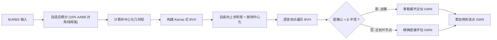

## 一句话总结

把点云/三角网上常用的"层次化空间索引 + 泰勒展开近似"的快速广义缠绕数（GWN）评估策略，首次扩展到 2D NURBS 曲线与 3D 裁剪 NURBS 曲面这类精确参数曲面上，在保持曲面附近精确判定的同时把包含查询的复杂度从线性降到亚线性。

## 研究背景

- 领域现状：广义缠绕数（GWN）是判断查询点是否"在形状内部"的稳健工具，即使边界不封闭、有重叠或嵌套也能给出合理的包含判定。直觉上，GWN 是查询点视野被边界占据的比例（2D 是带符号张角，3D 是带符号立体角）。当前最快的方法（如 Barill 等的点云方法）用空间索引把远处一簇图元的 GWN 贡献用泰勒展开一次性近似，达到对数/亚线性复杂度。
- 核心痛点：这类加速策略只支持离散图元（三角网、点云）。若把曲线/曲面先离散化再套用，虽然对"离散后的几何"判定正确，但对靠近原始曲边界的点几乎必然产生误判（off-by-one 的包含错误）。而直接对参数曲面逐个精确评估 GWN，代价随边界分量数线性增长，对大型复杂模型太慢。
- 本文 idea：设计一套专门针对曲边图元的"聚团（agglomeration）"策略——远处成簇的 NURBS 用泰勒展开近似，近处的 NURBS 用能精确保真曲边特征的直接评估方法。近似只在误差已知足够小、不会翻转包含判定的地方使用，从而既快又不牺牲边界处的判定正确性。

## 方法

整体框架：把所有曲边界分量按各自的轴对齐包围盒（AABB）装进一个 BVH，叶节点是单条 NURBS 曲线（2D）或单张裁剪 NURBS 曲面（3D），内部节点代表一个候选簇，其 GWN 场由泰勒展开近似。展开系数由"几何矩"参数化，在建树时预计算。查询时自顶向下遍历 BVH：足够远的大簇直接用近似公式，包含查询点的叶节点则走精确直接评估。

关键设计：

- **曲边几何的泰勒展开与矩预计算**：GWN 可写成拉普拉斯方程 Green 函数法向导数沿边界的积分。对法向导数在簇心 $$x_0$$ 处做泰勒展开后，每一阶的系数都是对各边界分量的积分（0/1/2 阶矩），且与查询点无关，可预计算并沿 BVH 累加。作者用"非中心化矩"这个技巧规避了按簇心重复积分：先算与中心无关的 $$\int \hat{n}\,dx$$、$$\int x\otimes\hat{n}\,dx$$、$$\int x\otimes x\otimes\hat{n}\,dx$$，内部节点的矩由子节点求和得到，最后再就地平移到实际簇心。这样每个簇的 2 阶数据（2D 每叶 $$2+4+8$$ 个值、3D 每叶 $$3+9+27$$ 个值）都能高效算出。2D 曲线利用"远处一条曲线的 GWN 等于其两端点连线的 GWN"这一事实，用线段的闭式公式直接精确求矩；3D 裁剪曲面无闭式解，改用 Gunderman 等的求积法（把曲面积分转成沿裁剪曲线的边界积分，配 10 点 Gauss-Legendre 规则，Bézier 提取后指数收敛）。
- **参数曲面的自适应细分**：NURBS 的一大优势是可在不改变形状的前提下任意细分。作者发现"最优图元数量"并不存在，真正关键的是叶节点包围盒的空间分布是否均衡。于是采用自适应细分：把每条曲线/每张裁剪面二分，直到其 AABB 对角线小于整个形状 AABB 对角线的 10%。这避免了"一张大曲面的包围盒横跨整个形状、几乎每次查询都退化成叶节点直接评估"的病态情况。3D 上这一步能把整体运行时降低一个数量级。
- **近处的精确直接评估**：叶节点用 Spainhour 等（2D Bézier）与 Spainhour & Weiss（3D 裁剪曲面）的精确方法，保证曲边保真、即便查询点极其贴近边界也能正确判定。作者对实现做了大量优化：2D 用 `atan2` 代替 `acos` 计算张角（省去向量归一化）、用 AABB 包含测试替代凸包/点在多边形测试；3D 改进了逐裁剪曲线求积数据的缓存复用与内存分配。相比原论文实现取得 2–5× 串行加速，并用 OpenMP 做了线程安全的并行化。整套方法实现在开源 HPC 库 Axom 中。

## 实验结果

作者在 3D CAD（ABC-Dataset）和 2D SVG（OpenClipArt20k）上做了大规模测试。下面这组"同一 3D CAD 形状、不同表示与评估方法"的运行时对比最能说明核心权衡：本文方法在 NURBS 上比直接评估快约两个数量级，且不像三角化那样在边界附近引入误判。

| 表示 / 方法 | 预处理 (s) | 查询 (s) | 总时间 (s) |
|------|------|------|------|
| NURBS，直接精确评估 | 0.145 | 287 | 287 |
| NURBS，0 阶近似（本文） | 0.264 | 2.09 | 2.35 |
| NURBS，2 阶近似（本文） | 0.280 | 2.19 | 2.47 |
| 58K 三角网，2 阶近似 | 0.430 | 0.267 | 0.70 |
| 890K 三角网，2 阶近似 | 5.95 | 0.518 | 6.47 |

（查询网格 $$50\times50\times50$$，14 线程）本文的 NURBS 聚团法把总时间从 287s 降到约 2.5s；三角网虽查询更快，但即便 89 万面的高精度三角化仍会在曲面附近产生包含误判，而本文方法忠实保留曲边界。其余实验的要点：2D 上超过一半样本获得 $$>10\times$$ 加速、上四分位 $$>30\times$$；3D 上不少直接评估要 $$10^3$$ 秒量级的模型在本方法下不到 1 秒完成，且运行时随图元数亚线性增长。精度上，增大泰勒展开阶数每阶约让误差降一个数量级，$$\beta$$（判定"足够远"的包围球缩放因子）越大越精确但越慢；实验取 3D $$\beta=2$$、2D $$\beta=4$$（SVG 常有大量重叠曲线，需更保守）。所有包含判定的分歧都只出现在真值 GWN 接近半整数（本就语义模糊）的地方，从不跨越边界本身。

## 亮点与局限

- 亮点：
  - 首次把远场泰勒展开加速从离散图元推广到精确参数曲面，兼得"远处快速近似 + 近处曲边精确判定"，在不牺牲边界处正确性的前提下达到亚线性复杂度。
  - "非中心化矩 + 沿树求和 + 就地中心化"的预处理设计巧妙规避了按簇心重复数值积分，使 2 阶展开的预处理代价始终只占总运行时的一小部分。
  - 明确论证并实验验证了"离散化再套用现成方法"会在曲边界附近必然引入误判这一根本问题，凸显直接处理参数表示的价值；同时开源了 2D 直接 GWN 方法的统一基准与 Axom 实现。
- 局限：
  - 包含判定在真值 GWN 恰好接近半整数处无法保证与真值一致（作者论证此处本身语义模糊，但仍是形式上的不保证）。
  - $$\beta$$ 需按数据集手工设定（3D 取 2、2D 取 4），面对超过 16 层嵌套的极端 SVG 还需更保守的 $$\beta$$，实验中排除了 6 个此类离群样本；缺乏按簇几何自动选 $$\beta$$ 的机制。
  - 3D 少数（<5%）图元极少的模型反而变慢，且部分源于 STEP 读取器（OpenCascade）对某些文件的兼容问题（极小节点跨度、裁剪曲线越界等）。

## 延伸思考

- 论文自己指出的最直接改进方向是"根据簇内几何属性动态选择 $$\beta$$"，这本质上是把"近似误差的置信度"做成局部自适应的问题，或可结合簇内 GWN 值域范围来估计所需的保守程度。
- 该工作与近期一系列直接 GWN 评估方法（几何裁剪、代数求根、结构化点集光线投射）是互补关系：本文负责"远场加速与整体调度"，叶节点的直接评估可随这些方法进步而持续受益，是一个较通用的加速外壳。
- 面向 CAD/HPC 的定位（落地在 Axom、直接吃 STEP/SVG）使其在网格无关的几何查询、隐式布尔、内外判定等下游任务里有实际价值；把这套"参数表示 + 层次矩近似"的思路迁移到其它需要边界积分的场（如某些势能/散射计算）也值得探究。
