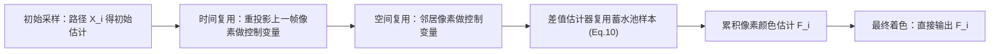

## 一句话总结

把离线渲染里的"图像空间控制变量"搬进实时管线，与 ReSTIR 融合成 ReSTCV：用时空累积的控制变量替换 ReSTIR 单样本着色，在几乎零额外开销下显著压制实时路径追踪中的彩色噪声。

## 研究背景

- 领域现状：现代 GPU 让实时路径追踪可行，但每像素每帧只有寥寥几个样本。ReSTIR（基于蓄水池的时空重要性重采样）通过跨像素、跨帧复用样本，成为实时采样复用的主力框架。
- 核心痛点：ReSTIR 最终着色只用蓄水池里的"一个代表样本"，而重采样的目标函数通常是标量亮度。标量亮度分布拟合得再好，也和逐通道颜色分布之间存在鸿沟——单个样本无法代表像素应有的颜色混合。在有多种彩色光源或复杂材质时，这表现为高频彩色噪声，且时空复用引入的相关性还会放大成"色块聚集"伪影。
- 本文 idea：图像空间控制变量（ICV）用邻居像素的相关估计做辅助函数，通过估计"像素间差值"而非直接算值来降方差，是一种无偏且原理清晰的方案，但它为离线渲染设计、依赖多轮迭代和高初始样本数，实时下不可行。作者把 ICV 推广到时空域（STCV），再借 ReSTIR 高效估计辅助函数与像素差值，兼得两者之长。

## 方法

整体框架：ReSTCV 在标准 ReSTIR 管线基础上，为每个蓄水池额外存一个"像素颜色估计" $$F_i$$（作为控制变量累积），在时空复用的每一步用一个"基于蓄水池的差值估计器"更新它，最终着色不再用代表样本，而是直接输出累积得到的 $$F_i$$。整套改动只需在 ReSTIR 代码里增删几行。

关键设计：

1. **时空控制变量（STCV）**。对像素 $$i$$，先算初始估计 $$\langle F_i \rangle_{\text{init}}$$；再用运动矢量找到上一帧重投影像素做时间控制变量，用邻居像素做空间控制变量。每个"来自 $$j$$"的估计器写成 $$\langle F_i \rangle_{\leftarrow j} = \alpha_{ij}\langle F_j \rangle + \langle F_i - \alpha_{ij} F_j \rangle$$，即"邻居的稳定累积估计 + 两像素差值"。多个估计器按合成权重线性组合，从而把可靠的颜色信息在时空上稳定累积起来。

2. **系数 $$\alpha_{ij}$$ 的启发式**。最优系数需要方差/协方差，实时下算不起。作者改用材质反射率之比 $$\alpha_{ij} = \min(\rho_i / \rho_j,\ 2.0)$$，其中 $$\rho$$ 是主命中点 BRDF 在半球上的平均反射率（用微表面模型的闭式近似算）。当邻居入射辐射分布相近但反照率不同时，这个比值是最优系数的良好近似，类似去噪里的反照率分解；截断到 2.0 防止坏 shift mapping 带来的不稳定。

3. **用 ReSTIR 高效估计差值**。差值项 $$\langle F_i - \alpha_{ij} F_j \rangle$$ 是方差主来源。作者不为差值另设候选样本，而是直接复用蓄水池里已有的代表样本 $$Y_i, Y_j$$ 及其 shift mapping：把标准差值估计器里的倒数 PDF 换成无偏贡献权重 $$W_Y$$，MIS 权重改用置信权重 $$M$$ 与目标函数 $$\hat p$$ 的乘积（沿用 GRIS 的鲁棒 MIS 权重）。由于 MIS 权重满足无偏条件，新估计器保持无偏，而复用的样本来自远优于随机采样的分布，方差大幅降低，且几乎不增加计算量。

4. **直接光照的特殊处理**。ReSTIR DI 用代理目标分布、shift mapping 简单，直接做差值在高光材质上方差大。作者构造一个中间辅助函数 $$\dot D_i$$（用代理分布与光谱光照、并略去 BRDF 的高光分量），先用 ReSTCV 估计 $$\langle \dot D_i \rangle$$，再套一层控制变量 $$\langle D_i \rangle = \langle \dot D_i \rangle + \langle D_i - \dot D_i \rangle$$，在保留 ReSTIR DI 效率的同时降噪。间接光照与直接光照分开处理。

## 实验结果

实现基于 Falcor 中 ReSTIR PT 的公开代码，在 RTX 5080 上以 1920×1080 实时渲染。下面是主实验——等时间对比下各方法在若干动态场景的 relMSE（越低越好），对照标准路径追踪（PT，等时约 5 spp）、STCV（仅控制变量）、ReSTIR PT 与本文 ReSTCV：

| 方法 | VeachAjar relMSE↓ | SunTemple relMSE↓ | ZeroDay relMSE↓ |
|------|------|------|------|
| ReSTCV（本文） | 1.655 | 4.046 | 0.681 |
| ReSTIR PT | 1.767 | 4.024 | 0.871 |
| STCV | 6.741 | 15.53 | 1.264 |
| PT | 8.979 | 21.26 | 1.996 |

ReSTCV 在整体噪声与颜色稳定性上最好。STCV 在简单光照场景（如 LivingRoom）表现不错，但在复杂间接光照（VeachAjar）或多光源（ZeroDay）下拿不到足够有信息量的差值估计。值得注意的是 SunTemple 上 ReSTIR PT 的 relMSE 略低于 ReSTCV，但其 MAPE（对彩色噪声更敏感的指标）更高（0.480 对 0.378），说明 ReSTCV 主要收益在颜色稳定性。差值估计器在 VeachAjar 上比 STCV 更准（MSE 5.464 对 16.100），且通过 65536 spp 参考图的收敛曲线验证了方法无偏。

## 亮点与局限

- 亮点：
  - 首次把图像空间控制变量真正落地到实时路径追踪，思路统一而优雅——把 ICV 的差值降方差与 ReSTIR 的样本复用对齐，共用同一套蓄水池样本与 shift mapping。
  - 工程友好：只需在现有 ReSTIR 管线增删几行代码、每个蓄水池多存一个颜色值，额外开销可忽略，却能明显压制彩色噪声。
  - 保持无偏（有 MIS 权重与收敛曲线佐证），并针对直接光照的高光难点给出分层控制变量的实用方案。
- 局限：
  - 主要收益来自弥合"标量亮度分布"与"逐通道颜色分布"的鸿沟；在弱色度/近无彩场景，ReSTIR 本就贴合亮度，增益变小。
  - 合成权重与系数 $$\alpha_{ij}$$ 都是启发式（基于样本数与成对 MIS），并未显式最小化方差、也未考虑协方差，仍有优化空间。
  - 差值估计的目标分布仍沿用路径贡献，而非直接以"像素差值"为目标分布，理想情况下后者能进一步降方差。

## 延伸思考

这项工作把"相关样本复用"这条主线上的两支——ReSTIR（重采样）与控制变量/梯度域渲染（差值降方差）——缝合到一个框架里，暗示还有更多可统一的空间：比如让 ReSTIR 的重采样过程直接以像素差值分布为目标，或引入方差感知的估计器组合权重。与 area-ReSTIR、ReSTIR PG 等近期扩展相比，本文关注的是"着色阶段的颜色保真"而非采样阶段，二者正交，值得探索联合使用。对做实时渲染系统的人，最实际的启示是：颜色噪声未必要靠去噪（可能引入偏差）解决，控制变量提供了一条无偏、低开销的替代路径。
