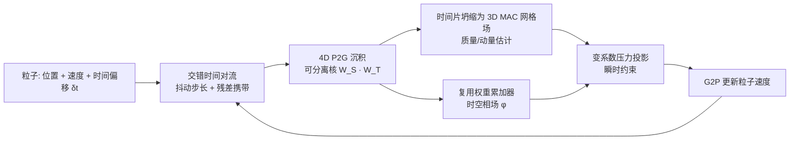

## 一句话总结

ST-FLIP 把 FLIP 粒子重新理解为四维时空里的采样点，在时间维上也做抖动，用一个可分离的 4D 传输核做蒙特卡洛积分，从而让混合粒子-网格液体求解器能在大出一个数量级的时间步（CFL 高达 15~20）下仍保持流动细节，几乎不增加每步开销。

## 研究背景

- 领域现状：PIC/FLIP/APIC 这类混合欧拉-拉格朗日方法是影视液体特效的主力，兼具细节保持的对流与较好的数值稳定性，实践中常能跨越 CFL 条件用更大的时间步而不崩溃。由于 3D 流体模拟随网格分辨率约呈 $$O(n^4)$$ 增长（分辨率翻倍 → 单元数 ×8、时间步减半 → 总耗时约 ×16），用大时间步对高分辨率场景极具吸引力。
- 核心痛点：数值稳定不等于视觉可信。当 CFL 超过约 2~3，粒子运动在时间上被欠采样，投影（压力求解）会放大由此产生的时间混叠（aliasing），表现为自由表面上不物理的涟漪与波纹，迅速吞掉真实的流动结构。这对液体/多相尤其致命，因为界面运动高度非线性。此前少数专攻大时间步（CFL≫1）的方法要么用半拉格朗日对流带来严重耗散，要么引入额外泊松求解等显著开销，且大多只针对单相流。
- 本文 idea：把每个粒子看成时空 4D 中的样本——在标准的空间抖动之外，也沿时间轴随机化粒子位置，并用可分离的空间×时间核做粒子到网格（P2G）沉积。这天然构成一个对"当前时间片（time slab）内积分量"的无偏蒙特卡洛估计，用与标准 FLIP 差不多的每格粒子数就把多出来的时间维覆盖掉。

## 方法

整体框架：ST-FLIP 作为一个轻量插件嵌入现成的 FLIP/PIC/APIC/PF-FLIP 管线，只给每个粒子加一个半精度的时间偏移属性 $$\delta t$$（2 字节），并在既有的对流与 P2G 循环里插入少量运算。核心是"4D 采样 → 坍缩成 3D 网格场 → 常规压力投影"，不需要额外网格、额外线性求解或额外的粒子遍历。

关键设计：

1. **粒子即时空样本 + 4D 蒙特卡洛估计**：给每个粒子一个相对当前全局时刻的时间偏移 $$\delta t^n_p$$，使其代表时空点 $$(\boldsymbol{x}_p, t_p)$$。目标是估计"当前时间片内积分"的每面量 $$\bar q_f = \int_{-1/2}^{1/2} q_f(t^n + \tau \Delta t)\, W_T(\tau)\, d\tau$$，而经典 PIC/FLIP 只做瞬时估计。用可分离核 $$W_{ST}(\boldsymbol{x},\tau)=W_S(\boldsymbol{x})W_T(\tau)$$ 做一次沉积，就得到该积分的无偏蒙特卡洛估计。蒙特卡洛的关键好处是积分误差率 $$O(1/\sqrt{N_{ppc}})$$ 与维度无关，因此从 3D 升到 4D 不需要显著增加每格粒子数（实验证实仍在 8 个左右饱和）。

2. **时间抖动 + 残差携带，防止漂移**：每步给粒子的对流步长加一个均匀抖动 $$\delta t^n_{p,jit}=\gamma \xi^n_p \Delta t^n$$，同时维护一个残差 $$\delta t^n_p$$，把"撤销上一步抖动以恢复分层"和"推进到新的抖动位置"合并进单次标准对流。这样既让粒子采样时刻在时间片上保持均匀分层，又保证 $$\lvert t^n_p - t^n \rvert \le \Delta t_{max}/2$$，避免采样时刻发生随机游走式漂移。步长突变时对 $$\Delta t^n_{p,act}$$ 做 $$[0, 2\Delta t^n]$$ 截断，实测触发不足 1%。对平静区域按局部 CFL 自适应衰减抖动强度 $$\gamma$$，降低静水面的噪声。

3. **复用权重累加器当"时空相场"，省掉每步建面**：借鉴 PF-FLIP 的粒子相场思想并推广到时空。P2G 归一化时本就要累加核权重，标准方法用完即弃；ST-FLIP 把这些累加器（缩放并做饱和非线性 $$C(x)=\min(\sqrt{x},1)$$ 后）直接当作面中心的相场 $$\bar\phi_f \in [0,1]$$ 和变密度泊松方程的面系数，从而免去每步昂贵的显式/隐式表面重建。这也给出了压力投影的体积化（variational）解释，可自然延拓到 4D，界面有效厚度约 $$1.5\,\Delta x$$。

4. **单侧时间核 + 瞬时压力投影**：时间核取半步平移并截断的 poly6 单侧核 $$W_T(\tau)$$，峰值在 $$\tau=1/2$$，让时间片内最新的样本获得最大权重。这等价于对向前时间片边界做镜像边界修正，与"投影产出 $$u^{n+1}$$"的相位对齐；若用居中的对称核会偏向更早样本、引入滞后并放大投影后振荡。压力被当作瞬时拉格朗日乘子，对坍缩后的暂定速度 $$\boldsymbol{u}^\star$$ 施加不可压约束，解变系数泊松方程 $$\nabla\cdot(\beta\nabla p)=\tfrac{1}{\Delta t^n}\nabla\cdot(\alpha \boldsymbol{u}^\star)$$。

## 实验结果

所有方法在同一套 MSBG 稀疏网格 + 自适应多重网格泊松求解器框架内实现、都开启自适应时间步与局部子步对流，在单台 32 核工作站上运行。下表取标准溃坝场景在同一目标 CFL=16 下，ST-FLIP 与标准 FLIP 的单步各阶段耗时对比（秒）——ST-FLIP 唯一略增的是对流开销，但因免去表面重建，总耗时反而更低：

| 阶段 | FLIP | ST-FLIP |
|------|------|---------|
| 总计 | 2.30 | 1.86 |
| P2G | 0.50 | 0.52 |
| 表面重建 | 0.48 | 免去 |
| 压力投影 | 0.52 | 0.48 |
| 对流 | 0.52 | 0.60 |
| 其他 | 0.28 | 0.26 |

其他实验的关键结论：标准溃坝下 ST-FLIP 相对 CFL=1 的 FLIP 基线获得约 2~4 倍（轻微质量损失）到 8 倍（CFL=16，中等损失）加速，而标准 FLIP 在 CFL=2 就已明显扭曲；CFL=16 时 ST-FLIP 体积损失率 0.7%/单位时间 vs FLIP 的 3.5%，且能捕捉多次后续溅起。与 APIC、隐式密度投影（IDP）对比，ST-FLIP 在 CFL=16 更接近参考解、快一个数量级、内存少约 40%（相对标准 FLIP 仅多 3.7% 内存）。涡量（enstrophy）实验表明提高 CFL 不会额外增加数值耗散。两相方面，把 ST-FLIP 集成进已高度优化的 PF-FLIP 后，超大规模溃坝提速约 3.1 倍、大坝泄流约 2 倍。20 亿粒子、$$3072\times3072\times2048$$ 的漩涡场景在 CFL=15 下 3.4 天完成，而传统小步长估计需约 2 周。

## 亮点与局限

- 亮点：
  - 把"大时间步下的自由表面伪影"精准诊断为时空采样问题，用渲染里熟悉的蒙特卡洛分布式采样思想（类比运动模糊、景深）优雅解决，视角新颖。
  - 真正的轻量插件：只加一个半精度标量、无额外网格与求解，能落到现成 FLIP/PIC/APIC/PF-FLIP 上，且往往因省去表面重建而更快。
  - 复用 P2G 权重累加器当相场，一举拿到界面指示与投影系数，工程上"顺手白拿"。
  - 覆盖单相自由表面与高密度比两相，在强基线 PF-FLIP 上仍有正交加速，规模做到数十亿粒子。
- 局限：
  - 与所有方法一样无法完全消除大步长下的质量损失，只是退化更缓和。
  - 蒙特卡洛本质带来噪声，CFL 很高时尤甚；虽多为低幅、不相关、可后处理去噪，但平静水面信噪比低时最明显。
  - 未解决 FLIP 固有的一阶时间分裂造成的能量/角动量损失（可与 advection-reflection、IVOCK、涡量约束等叠加缓解）。
  - 对表面张力主导（极小尺度）的流动收效有限，因表面张力自身施加 $$\Delta t < O(\Delta x^{3/2})$$ 的步长限制。

## 延伸思考

这项工作把图形学两大分支——蒙特卡洛渲染与物理仿真——在"高维采样"这个层面打通：既然路径追踪能用少量样本在像素×时间×镜头的高维空间里估计积分，流体的时空覆盖同样可以。一个自然的追问是能否借鉴渲染里成熟的方差缩减（重要性采样、分层、相关采样、时空重用如 ReSTIR）进一步压低粒子噪声，尤其针对平静水面这一痛点。另外它与同组 2025 年的 PF-FLIP、以及本届会议上"Adaptive Phase-Field FLIP"同属一条"粒子相场 + 大规模两相"的技术线，几者的组合与在 GPU 求解器上的移植（论文指出配方与 GPU 无关）都值得跟进。把 4D 采样思想延拓到 MPM 等其他混合方法，也是一个开放方向。
