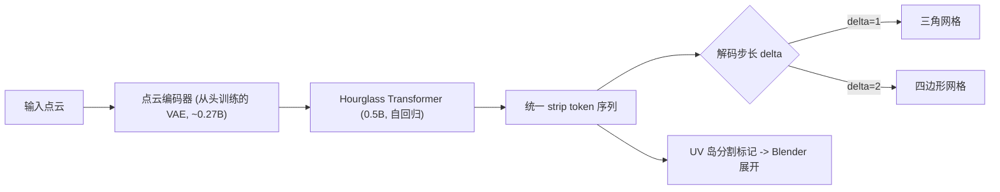

## 一句话总结

SATO 把"三角形带（triangle strip）"作为网格的序列化基元，用一套统一的 token 表示让同一个自回归模型既能生成三角网格又能生成四边形网格，并在生成过程中原生输出 UV 分割。

## 研究背景

- 领域现状：自回归 Transformer（MeshGPT、MeshAnything、BPT、DeepMesh 等）把网格生成当作序列预测任务，通过在离散 token 上建模来直接生成"艺术家风格"的紧凑网格，近年在保真度和规模上进步很快。
- 核心痛点：token 的排序策略普遍不达专业标准。基于坐标排序（把顶点量化后按坐标排三元组）产生的序列过长；而近期的 patch / Delaunay 启发式排序虽然压短了序列，却打断了艺术家网格所依赖的连续边流（edge flow）与结构规律——因为 Delaunay 追求的是数学上的紧致（如最大化最小角），而不是结构规整性。此外，绝大多数生成器只管几何与拓扑，UV 展开被推给下游独立工具，破坏了艺术家风格的接缝结构。
- 本文 idea：借用计算机图形学里经典的三角形带概念——一串共享顶点的三角形，每新增一个顶点就确定性地和前两个顶点构成一个新面。这种"沿边界不断扩张"的结构天然贴合建模师"从边界往外一圈圈加面"的习惯，能把连接性和局部曲面连续性耦合起来。把 strip 提升到 token 级别，就能得到既紧凑、又保留边流、还便于模型学习的序列。

## 方法

SATO 的主干是：以输入点云为条件，用一个点云编码器 cross-attend 到一个 0.5B 参数的 Hourglass Transformer，自回归地生成一段统一的 strip token 序列，再由一个可切换步长的解码协议还原成三角或四边形网格，同时带出 UV 分割。

关键设计：

1. **分层几何量化**：沿用 DeepMesh 的做法，把归一化到单位立方体的顶点量化到 $$512^3$$ 体素网格，每个顶点分解为三级坐标 $$(c_1, c_2, c_3)$$，分别对应 $$4^3 / 8^3 / 16^3$$ 分辨率。$$c_1$$ 是最粗的坐标码本，$$c_2, c_3$$ 是相对父格的局部位置。这样既有 $$512^3$$ 精度，又便于后续的前缀共享压缩。

2. **基于 strip 的序列化**：核心创新。用一个"拉链式"生长算法（Algorithm 1）遍历网格：先建边到面的邻接表，选坐标最小的未访问面作种子，用其最后两个顶点组成的边作为边界边，决定生长方向；随后不断跨越当前边界边走到相邻未访问面，直到碰到网格边界或已访问面才终止，再另起一条 strip。这里用一个拓扑步长 $$\delta$$ 统一三角（$$\delta=1$$，每步加 1 个新顶点）和四边形（$$\delta=2$$，每步加一对顶点，并交换四边形最后两个顶点索引来对齐 winding order）。这种贪心、最小坐标优先的确定性遍历不是为了让 strip 数量最少，而是为了给出空间上连贯、网络易学的固定遍历模式。

3. **strip 转移与原生 UV 分割**：为了在一条序列里区分不同 strip 和不同 UV 岛，作者不插入额外的分隔 token，而是扩充最粗一级码本 $$C_1$$：加一套并行的 strip 起始 token $$C_1^{t}$$ 和一套 UV 岛切换 token $$C_1^{uv}$$，它们空间位置和普通 token 相同但语义不同。于是首级 token 取自增广词表 $$C_1^{*} = C_1^{geo} \cup C_1^{t} \cup C_1^{uv}$$。生成时先在每个 UV 岛内部把所有面遍历完再切到下一个岛，从而在不增加序列长度的前提下把"换 strip / 换 UV 岛"信号嵌进几何流。注意模型只学 UV 的分块（哪些面属于哪个岛），实际 2D 参数化由 Blender 的展开算法事后计算。再叠加 DeepMesh 的前缀共享（相邻顶点共享 $$c_1, c_2$$ 时省略冗余前缀），多数顶点被压到 1~2 个 token；而结构 token 永不压缩、并强制重置共享上下文，让拓扑转移始终明确。

4. **拓扑相关解码与三阶段训练**：解码时只需设定步长 $$\delta$$ 就能把同一条几何流读成三角或四边形，无需特殊 token 或改架构；四边形模式下若 strip 顶点数为奇数，末尾未配对顶点退化为三角形。训练分三阶段：先在大规模三角网格上预训练建立几何先验；再初始化自三角模型做 UV 分割后训练（从头直接学 UV 会收敛慢甚至塌陷）；最后用较小的高质量四边形数据集微调。四边形微调反过来还能让三角输出更规整（更接近直角三角形、减少狭长三角形）。

## 实验结果

主实验是三角网格生成的定量对比，在 ShapeNet / Thingi10K / Objaverse 上用 NC↑、CD↓、HD↓、F1↑ 四个指标与四个开源 SOTA 比较。下表摘取各数据集的 F1（整体表面覆盖/完整度，最能体现差距）与 CD：

| 方法 | ShapeNet F1↑ | ShapeNet CD↓ | Thingi10K F1↑ | Objaverse F1↑ |
|------|--------------|--------------|---------------|---------------|
| MeshAnythingV2 | 0.361 | 0.009 | 0.162 | 0.208 |
| TreeMeshGPT | 0.439 | 0.034 | 0.236 | 0.188 |
| BPT | 0.605 | 0.003 | 0.248 | 0.265 |
| DeepMesh | 0.532 | 0.004 | 0.157 | 0.240 |
| SATO | 0.807 | 0.002 | 0.460 | 0.503 |

SATO 在三个数据集上几乎全面领先，尤其 F1 大幅拉开。其余结论用文字补充：25 位 3D 从业者的用户研究里 SATO 排名分 2.61（满分 3，次高 BPT 1.4）；UV 分割方面它是首个在自回归生成中原生输出 UV 分割的方法，四项参数化畸变指标（L2 Stretch、面积/角度畸变、对称 Dirichlet 能量）均低于 PartField 基线；tokenizer 消融显示相同架构与训练预算下 strip tokenizer 全指标优于 DeepMesh tokenizer（如 F1 0.560 vs 0.455），且序列更短（茶壶过拟合实验 20K vs 24K token、转移次数 981 vs 1654）、编码更快。四边形生成在几何指标上与经典重网格方法（QuadWild/NeurCross/CrossGen）持平甚至略优，且能在任意分辨率下生成并附带 UV 分割。

## 亮点与局限

- 亮点：
  - 用"三角形带"这一经典且直觉的基元统一了三角/四边形两种网格的 token 表示，一个模型、一个开关（步长 $$\delta$$）即可切换输出，且能让大规模三角数据与稀缺的高质量四边形数据互相迁移先验。
  - 首个在自回归网格生成中把 UV 岛分割原生编码进序列的工作，且不增加序列长度；生成的分割配 Blender 展开就能得到干净、低畸变、常带对称性的 UV 布局，直接可用于贴图。
  - strip 排序保留边流，压缩率与训练收敛速度都优于 patch 型 tokenizer。

- 局限：
  - 四边形是从四边形 strip 解码的，绝大多数是 quad-dominant；当 strip 长度为奇数或含重复顶点时会退化出少量三角形。
  - 四边形质量受限于高质量四边形数据集的规模与一致性，专精四边形的方法（如 QuadGPT）在该设定下仍有优势。
  - 近球形物体上偶尔出现不够规整的边流，作者归因于数据偏置（很多三角数据用近等边镶嵌表示球体）。

## 延伸思考

- SATO 定位为"重网格化/后处理"环节的补充：可接在 CLAY 等 SDF 生成器之后，把 Marching Cubes 得到的超密网格转成轻量、带 UV 的艺术家风格网格，从图像/文本一路打通到可用资产。
- "把经典图形学基元（strip）重新抬到 token 级"这一思路很有启发——相比让高阶规律从大量局部三角决策里隐式涌现，显式选对序列化基元本身就是强归纳偏置，值得在其他结构化生成（曲线、样条、CAD 特征）里借鉴。
- 它只预测 UV 分块而把参数化交给 Blender，是个务实的解耦；后续可追问能否把 2D 参数化也纳入统一序列，实现真正端到端的几何+拓扑+UV 联合生成。
- 与 SeamGPT、PartUV、MeshMosaic、MeshSilksong 等并行工作对比，SATO 的差异在于"单次统一生成、天然全局一致"，避免了依赖预分割/预接缝带来的跨部件缝隙与不对称问题。
