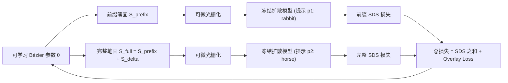

## 一句话总结

提出"渐进式语义错觉"这一新任务，并用双分支 Score Distillation Sampling 联合优化矢量笔画，让同一张草图在逐笔添加过程中从一个概念（如"猪"）戏剧性地转变为另一个概念（如"天使"）。

## 研究背景

- 领域现状：视觉错觉的计算方法几乎都依赖"空间操作"——翻转、旋转、重投影、频段分解（如 Visual Anagrams、Hybrid Images、影子艺术、线艺术），本质是用一个对称空间变换把一整幅图换成另一整幅图。矢量草图生成方面，从 CLIPasso、VectorFusion 到序列化的 SketchAgent、SketchDreamer，也都把绘制当成一个静态单目标。
- 核心痛点：没有工作探索"时间维度"的语义变换，即同一批笔画在不同完成阶段呈现不同语义。这带来一个"双重约束"：前缀笔画既要能识别为概念 A，又要作为概念 B 的结构基础。栅格方法（如 Nano Banana Pro）靠破坏性编辑覆盖初始像素，违反"只增不减"的渐进约束；序列化矢量方法采用贪心策略只为 A 优化，冻结后的前缀在扩展到 B 时变成语义噪声与杂乱。二者都找不到对两种语义都成立的"公共子空间"。
- 本文 idea：把任务形式化为共享 Bézier 参数上的约束优化，用双分支 SDS 对前缀（A）和完整草图（B）同时施加梯度，让前缀笔画在双重语义压力下动态调整，发现"公共结构子空间"；再用一个新的 Overlay Loss 强制前缀与增量笔画空间互补，保证结构融合而非遮挡。

## 方法

整体框架：把一组可学习的 Bézier 笔画 $$S$$ 划分成互不相交的前缀集 $$S_{\text{prefix}} = \{s_1,\dots,s_k\}$$ 与增量集 $$S_{\text{delta}} = \{s_{k+1},\dots,s_N\}$$。两条并行分支共享同一套可学习参数 $$\boldsymbol{\theta}$$：前缀分支只渲染前缀笔画去匹配提示 $$p_1$$，完整分支渲染全部笔画去匹配提示 $$p_2$$，两分支的 SDS 梯度相加更新所有参数，再叠加 Overlay Loss 约束空间布局。

关键设计：

- **双分支联合优化（是什么 / 为什么 / 怎么做）**：与序列方法冻结初始状态不同，本文对前缀和完整两阶段同时优化。原因是只有让前缀笔画持续接收来自两个目标的梯度，才能被"预置"为可被重新解读的结构。做法是分别对两分支计算 SDS 梯度并求和：

  $$\nabla_{\boldsymbol{\theta}} \mathcal{L}_{\text{SDS}}^{\text{prefix}} = \left[ w(t)\,\bigl(\epsilon_\phi(z_t, t, p_1) - \epsilon\bigr)\, \frac{\partial z_t}{\partial \boldsymbol{\theta}} \right]$$

  $$\nabla_{\boldsymbol{\theta}} \mathcal{L}_{\text{SDS}} = \nabla_{\boldsymbol{\theta}} \mathcal{L}_{\text{SDS}}^{\text{prefix}} + \nabla_{\boldsymbol{\theta}} \mathcal{L}_{\text{SDS}}^{\text{full}}$$

  其中 $$z_t$$ 是加噪隐变量，$$\epsilon_\phi$$ 是噪声预测器，$$w(t)$$ 是权重函数。这样前缀笔画同时承担双重角色，增量笔画则优化去补足它。

- **Overlay Loss 强制空间互补**：纯语义引导常让增量笔画直接叠在前缀上造成遮挡与杂乱。做法是把两个子集分别渲染并做高斯模糊 $$G_\sigma$$ 形成软空间缓冲区 $$\tilde{I}_{\text{prefix}}, \tilde{I}_{\text{delta}}$$，再计算归一化重叠：

  $$\mathcal{L}_{\text{overlay}} = \frac{2 \langle \tilde{I}_{\text{prefix}}, \tilde{I}_{\text{delta}} \rangle}{\lVert \tilde{I}_{\text{prefix}} \rVert_1 + \lVert \tilde{I}_{\text{delta}} \rVert_1}$$

  模糊制造了超出笔画边界的缓冲，逼迫笔画保持最小间隔。最终目标为 $$\mathcal{L} = \mathcal{L}_{\text{SDS}} + \lambda_{\text{overlay}} \mathcal{L}_{\text{overlay}}$$。

- **过滤与排序流水线**：用 GPT-4o 从四个维度（阶段可识别性、单目标完整性、错觉质量、草图质量）打分，只有当完整草图明显比单独的增量笔画更可识别时才给高分，以确认前缀确实提供了结构支撑而非被覆盖。排序有两种：GPT 排序 $$R_{\text{GPT}} = \text{Score}_{\text{Phase 1}} \cdot \text{Score}_{\text{Phase 2}}$$，以及惩罚增量笔画独立质量的度量排序（组合 CLIP、ImageReward、HPS）。

- **扩展到 K 阶错觉**：把笔画划分成 $$K$$ 个不相交子集，累积前缀 $$S_{1:i} = \bigcup_{j=1}^{i} S_j$$ 渲染第 $$i$$ 个概念，并行分支联合优化，使早期笔画接收来自所有后续分支的梯度：

  $$\mathcal{L} = \sum_{i=1}^{K} \mathcal{L}_{\text{SDS}}^{i} + \sum_{i=1}^{K-1} \lambda_{\text{overlay}}^{i} \mathcal{L}_{\text{overlay}}^{i}$$

## 实验结果

在 64 个常见物体、随机配对的评测集上，用 Stable Diffusion v1.5 做 SDS 引导，单卡 RTX 4090 优化 2000 步（两阶段约 13 分钟）。主实验对比各方法的 Phase 1 CLIP 分、结构隐藏度（structural concealment）与覆盖率。本文方法在 CLIP 与隐藏度上大幅领先，并达到 100% 覆盖，而 Nano Banana Pro 因破坏性编辑仅有约 35% 覆盖。

| 方法 | Phase 1 CLIP↑ | 结构隐藏 CLIP↑ | 结构隐藏 IR↑ | 语义 CLIP↑ | 覆盖率↑ |
|------|------|------|------|------|------|
| CLIPasso | 32.213 | 1.690 | 0.090 | 1.000 | 100.0% |
| ControlSketch | 27.524 | -2.378 | -0.789 | 0.875 | 100.0% |
| SketchDreamer | 24.803 | -0.393 | 0.338 | 0.887 | 100.0% |
| SketchAgent | 24.393 | -2.544 | 0.095 | 0.752 | 100.0% |
| Nano Banana Pro | 26.821 | -2.774 | -0.663 | 0.875 | 34.9% |
| 本文（GPT 排序） | 29.873 | 1.668 | 0.839 | 0.983 | 100.0% |
| 本文（度量排序） | 30.044 | 3.282 | 1.237 | 0.980 | 100.0% |

其余结论：把本文优化好的 Phase 1 前缀交给基线去续画（Ours-to-illusion），基线表现明显好于自己生成前缀时，说明本文前缀天然嵌入了第二概念的结构线索（验证"公共子空间"存在），但仍显著逊于本文的联合优化。143 人用户研究中，度量排序下 87.1% 的对比选择了本文方法，排序流水线整体满意度超 98%。消融显示：序列优化会让前缀僵化（如鸭嘴无法复用为牛耳），联合优化才能找到通用结构；居中聚集的初始化优于散布式；Overlay Loss 把交叠像素从 539 降到 174；默认 16→32 笔画在结构简洁与语义保真间取得平衡。

## 亮点与局限

- 亮点：
  - 首次把视觉错觉从空间维度拓展到时间维度，定义了"渐进式语义错觉"这一新任务，且是"只增不减、前缀是最终图的严格子集"的非对称加法结构，区别于以往所有对称空间变换。
  - 双分支 SDS + Overlay Loss 的组合直接命中"双重约束"，让前缀笔画被"预置"为可重解读结构，配合 VLM 过滤排序保证可用性。
  - 通用性强：可扩展到 K 阶错觉，并支持 B 样条、彩色笔画、一般矢量图形等多种表示。

- 局限：
  - 继承预训练扩散先验的能力上限，对结构复杂的概念（如"剪刀"）SDS 引导偏弱，会导致优化失败。
  - 每对生成需约 13–15 分钟并依赖多次采样加过滤排序，效率与随机性仍是实际使用的门槛。

## 延伸思考

这项工作把"绘制过程本身"当作语义载体，本质上是在同一组参数上求两个（或多个）扩散目标的公共解，与 Visual Anagrams 等"多视图一致性"错觉是同一类"多约束满足"问题的不同投影方式，只是把变换从空间对称换成了时间累加。值得追问的是：Overlay Loss 目前只惩罚空间重叠，是否能进一步引入语义层面的"复用度"约束（如鼓励同一笔画在两个概念中承担不同语义角色）来提升过渡的自然度？另外，用更强的扩散先验或更好的 SDS 变体（变分粒子、区间匹配等）替换 SD v1.5，或许能缓解复杂概念失败的问题，并把生成时间压下来。应用侧，热变色打印、品牌 logo 动态过渡、认知科学刺激材料等设想都很有想象空间。
