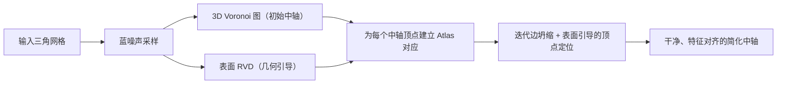

## 一句话总结

通过在简化过程中显式维护"中轴顶点 ↔ 表面区域"的对应关系（称为 Atlas），本文提出了一种表面引导的中轴变换（MAT）简化框架，在极致简化下仍能得到边界干净、特征对齐、三角形质量高的中轴网格。

## 研究背景

- 领域现状：中轴变换（Medial Axis Transform, MAT）是一种完备的形状描述子——中轴上每个点是形状内部到边界至少有两个最近点的位置，配上对应的内切球半径即可重建原始几何。它在形状分析、分解、姿态分析、动画等下游任务中被广泛使用。主流计算路线是：先对表面稠密采样、构造 3D Voronoi 图作为初始中轴，再通过类似 QEM 的渐进边坍缩（edge collapse）做简化，代表工作是 Q-MAT。
- 核心痛点：过去的方法大多只盯着"重建精度"，忽视了"结构对齐"。以 Q-MAT 为例，其坍缩优先级主要由重建误差决定，但随着简化推进，中轴顶点与底层表面对称性之间的联系逐渐减弱，产生所谓的"参考漂移"（reference drift），导致边界锯齿、结构失真。面向 CAD 的新方法（MATFP、MATTopo、MATStruct）在特征保持上有改进，但存在三角形质量差、依赖 GPU 反复重算 power diagram 而速度慢、内部特征线弯曲失真等问题；而 VMAS 这类方法在球数超过几百时会出现震荡不收敛。总之，现有方法难以产出规则、无锯齿的中轴边界。
- 本文 idea：把关注点从"重建精度"转向"原始表面的结构对称性"。核心洞察是——在整个简化过程中**显式维护中轴顶点与表面区域的映射**。初始 Voronoi 图在表面上自然诱导出一个划分（受限 Voronoi 图 RVD），每个 3D 中轴顶点由若干表面片共同决定；当一条中轴边被坍缩时，两端点关联的表面区域被新顶点继承，新顶点的最优位置就由这些表面区域决定，从而让中轴始终锚定在形状的双侧对称结构上。

## 方法

整体框架：输入一张三角网格，先做蓝噪声采样并同时构造两套对偶结构——体空间里的 3D Voronoi 图（取内部作为初始中轴）与表面上的受限 Voronoi 图（RVD，提供几何引导）；随后通过迭代边坍缩渐进简化，每次坍缩都借助已建立的对应关系严格锚定到原始输入表面。

关键设计分为四点：

1. **Atlas 对应与初始化**。一般情形下，一个 3D Voronoi 顶点由四个等距的表面采样点决定。本文把这四个采样点对应的 RVD cell 之并集定义为该中轴顶点的 Atlas：$$\mathrm{Atlas}(v)=\bigcup_{s\in S_v}\mathrm{Cell}(s)$$，从而在每个中轴顶点和一块具体表面区域之间建立显式对应，编码了形状的局部双侧对称。此外，在凹特征附近，两个采样点的 cell 都与凹特征线相交时会产生"虚假中轴面"。本文用一个中点测试过滤：对由 $$s_1, s_2$$ 生成的面取中点 $$m=(s_1+s_2)/2$$，若 $$d_S(m) < \alpha\cdot \lVert s_1-s_2\rVert/2$$（$$\alpha=0.7$$）则说明中点不在中轴上，该面被判为虚假并移除。

2. **表面引导的最优顶点定位**。坍缩边 $$e\triangleq v_1 v_2$$ 得到新顶点 $$v$$ 时，最小化一个复合能量 $$E(e\to v)=E_{\text{Fidelity}}(e\to v)+\lambda E_{\text{Lap}}(e\to v)$$。新顶点继承两端点 Atlas 之并 $$A=\mathrm{Atlas}(v_1)\cup\mathrm{Atlas}(v_2)$$ 作为其表面对应区域。这里区分两类 cell：对不含凹特征的**常规 cell**，用球面二次误差度量（SQEM）计算保真项，其对内切球中心与半径 $$(v,r)$$ 是二次型，可预计算并靠矩阵相加高效累积；对靠近凹特征的**内陷 cell（invaginated）**，切平面近似失效，改为直接度量到表面点的欧氏距离 $$E_{\text{Fidelity}}\big\vert_{\mathrm{Cell}_i}\approx \mathrm{Area}(\mathrm{Cell}_i)\cdot(\lVert v-s_i\rVert-r)^2$$，更稳健。

3. **拉普拉斯平滑与联合优化**。为提升三角形质量，引入拓扑（均匀）拉普拉斯项，鼓励新顶点靠近其邻域质心：$$E_{\text{Lap}}(e\to v)=\frac{1}{\lvert \mathcal{N}(v_1,v_2)\rvert}\sum_{u\in \mathcal{N}(v_1,v_2)}\lVert v-u\rVert^2$$。当 Atlas 中无内陷 cell 时，整个能量为二次，有闭式线性解；含内陷 cell 时含平方根项，用 L-BFGS 求解，优化变量仅为球的四个自由度 $$(v_x,v_y,v_z,r)$$，其余量都作为坍缩时刻从原始表面继承的常量固定。

4. **坍缩优先级与 CAD 扩展**。仅靠几何误差不足以先清除不稳定的"尖刺"分支，本文沿用 Q-MAT 的稳定性度量 $$\mathrm{Spike}(e)=\max\{0,\ \lVert v_1-v_2\rVert-\lvert r_1-r_2\rvert\}/\lVert v_1-v_2\rVert$$，并用一个陡峭 sigmoid 权重 $$\Psi(x)=1/(1+e^{-k(x-\tau)})$$（$$k=100$$）把代价写成 $$\mathrm{Cost}(e)=E(e\to v_{\text{new}})\cdot\Psi(\mathrm{Spike}(e))$$：尖刺边（$$\mathrm{Spike}<\tau$$）被强制优先坍缩，稳定边则纯按几何保真度排序。顶点数降到 200 以下时启用 Link Condition 以启发式地保护拓扑。针对 CAD 模型，额外做特征分类（按二面角阈值 $$\phi$$ 判定尖锐/凹特征）、特征吸附（强制 $$r=0$$ 把中轴顶点拉到凸特征线上）与特征边的离散候选坍缩，确保尖锐棱边和角点被精确保留。

## 实验结果

主实验是在带尖锐特征的 CAD 模型和光滑过渡模型上，与七种代表方法比较重建质量（用相对包围盒对角线的双向 Hausdorff 距离 HD）、球数（#s）与运行时间（t）。下表摘取两个代表 CAD 模型上、各方法简化到相近球数时的对比（数值取自原文示例模型）：

| 方法 | 模型A #s | 模型A HD | 模型A t | 说明 |
|------|---------|---------|---------|------|
| 本文 Ours | 5.0k | 0.15% | 11.4s | 边界干净、特征对齐、无 GPU 依赖 |
| MATStruct | 5.9k | 0.28% | 281s | 三角质量好但慢、依赖 GPU、易漏窄特征 |
| MATFP | 5.0k | 0.46% | 11.7s | 三角形质量欠佳、有尖刺 |
| Q-MAT | 5.0k | 0.77% | 9.9s | 参考漂移、边界锯齿 |
| PC | 62k | 1.36% | 9.3s | 含虚假尖刺结构 |

补充结论：性能上，50K 采样点的典型模型总耗时低于 15 秒，边坍缩阶段占主要耗时；渐进简化中一个有趣现象是 HD 先降后升——说明本文不是在"继承的中轴"上精修，而是**直接相对原始表面**简化，中间结果甚至比初始 Voronoi 中轴逼近得更好。噪声鲁棒性方面（$$\eta=0.25\%,0.5\%$$），噪声引起的法向不连续会自动触发内陷 cell 的保真项，从而保持稳定。消融显示凹特征面过滤、尖锐特征保持、内陷 cell 保真项三者缺一不可。

## 亮点与局限

- 亮点：
  - 全程显式维护"中轴 ↔ 表面"的 Atlas 对应，让每一步坍缩决策都直接参考原始几何，从根本上消除了 Q-MAT 式的参考漂移，实现规则、无锯齿的边界。
  - 用同一套框架统一处理 CAD 尖锐特征与有机光滑过渡，无需分块预处理、无需 GPU；借助 SQEM 矩阵可加性，典型模型 15 秒内完成。
  - 首次从离散网格中直接提取圆角（fillet）区域的滚球中心轨迹这一结构信息；并展示了从无符号距离场（UDF）中提取单层表面的新应用（$$\epsilon$$-等值面的中轴天然给出单层结果）。

- 局限：
  - 3D Voronoi 初始化对极薄的片状模型失效——采样密度不足会让 Voronoi 穿透薄面，导致中轴出现孔洞、侧面特征丢失。
  - 简化后的中轴网格在复杂分支或高曲率区域可能出现轻微自交。
  - 拓扑保持是启发式的、无形式化保证，高亏格模型上仍可能出现拓扑错误。

## 延伸思考

本文的核心价值在于把"简化"从体空间的自我迭代重新锚定回原始表面——Atlas 这一显式对应本质上是一种把 2D-3D 对偶性显式化并贯穿全程的思想，值得推广到其他基于对偶结构的几何简化任务。圆角检测与 UDF 单层表面提取两个应用尤其有想象空间：前者为逆向工程/二次设计提供了从离散网格直接读出参数化特征的可能，后者则为近年火热的神经隐式/UDF 重建管线提供了一个绕过"双层到单层"脆弱后处理的替代路径。未来若能给出更鲁棒的薄结构初始化与有形式化保证的拓扑保持机制，该框架的适用面会进一步扩大。
