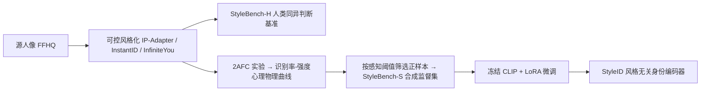

## 一句话总结

针对"人脸风格化后身份还认不认得出"这件事，本文用人类感知实验造了两套数据集（人评基准 StyleBench-H 与合成监督集 StyleBench-S），并微调出一个对风格鲁棒、与人类判断一致的身份编码器 StyleID。

## 研究背景

- 领域现状：把照片渲染成卡通、素描、油画等风格（creative face stylization）已经在头像 App、多模态大模型里成为日常操作，而"风格化后身份是否保持"通常靠现成的人脸识别编码器（ArcFace、AdaFace）或语义编码器（CLIP、SigLIP2）来当评价指标或训练约束。
- 核心痛点：这些编码器几乎都在自然照片上训练与标定，遇到风格化就很脆弱——要么把纹理/配色的改变误判成身份漂移，要么察觉不到夸张的几何变形。整个领域缺少一个"风格无关、且与人类感知对齐"的协议来度量和监督身份一致性；此前最相关的 StylizedFace 既没和人类判断标定，也没公开。
- 本文 idea：把人类感知放到评价的核心，并显式地按"风格化方法"和"风格强度"两个维度来拆解问题。先用人评基准暴露现有指标与人类的分歧，再从心理物理实验得到的"识别率-强度"曲线出发生成合成监督数据，最后微调出对齐人类感知的身份编码器。

## 方法

整体框架分三步：先建可控风格化流水线，用它构造带人类标注的评测基准 StyleBench-H；再通过 2AFC 实验拟合心理物理曲线，据此筛选生成大规模合成监督集 StyleBench-S；最后冻结 CLIP 主干、注入 LoRA，用角度间隔损失与监督对比损失微调出 StyleID 编码器。

关键设计：

1. **可控风格化流水线**：采用三种扩散/流匹配风格化方法 IP-Adapter、InstantID、InfiniteYou，各自都有一个可调的风格强度参数，归一化到 $$s \in [0,1]$$（$$s=0$$ 近似原图，$$s=1$$ 最强风格、可能丢失身份），并离散成 7 个强度级。作者强调不同方法的同一归一化数值不代表相同的感知强度，所以后续必须按方法、按风格分别标定。

2. **StyleBench-H（人评基准）**：从 FFHQ 采样人口属性多样的源人像，跨 10 种艺术风格、7 个强度生成风格化图，让标注者回答"这两张图是不是同一个人"。招募 70 人、经延迟与一致性过滤后保留 68 位有效标注者，从 6088 条有效回答中只保留真阳/真阴并平衡正负，得到 $$N_H = 3551$$ 个有效数据点。此外还构造了 Cross-Style 与 Cross-Method 两个更严格的分布外划分（引入未见风格与未见方法 MTG、Flux.2）。

3. **StyleBench-S（合成监督集）**：训练深度指标需要远超人工标注量的数据。作者用 2AFC 协议拟合每个"风格×方法"的识别率-强度心理物理曲线，只在人类识别概率很高（如 90% 以上）的强度处取样作为"感知正样本"。实验显示 90% 阈值能在保留身份的同时容纳风格变化，而放松到 70% 会明显丢身份（因为 2AFC 下观察者可靠性别等粗线索蒙对）。最终得到 4073 个身份、每身份 55 张风格化图，约 224k 样本。

4. **StyleID 编码器与损失**：以 CLIP-L（ViT）为主干，冻结主干、只在注意力与线性层注入秩为 8 的 LoRA，避免过拟合与偏离 CLIP 预训练流形。训练目标由三项组成：ArcFace 式角度间隔损失 $$\mathcal{L}_{\text{ang}}$$（间隔 $$m=0.5$$、尺度 $$\alpha=32$$）、监督对比损失 $$\mathcal{L}_{\text{scon}}$$（在实例级拉近同身份、推远异身份），以及把适配后嵌入约束在冻结 CLIP 嵌入附近的正则项 $$\mathcal{L}_{\text{reg}} = \frac{1}{B}\sum_i \lVert \hat{z}_i - \hat{z}_i^{(0)} \rVert_2^2$$。总损失为 $$\mathcal{L} = \mathcal{L}_{\text{ang}} + \lambda_{\text{scon}}\mathcal{L}_{\text{scon}} + \lambda_{\text{reg}}\mathcal{L}_{\text{reg}}$$，其中 $$\lambda_{\text{scon}}=0.6$$、$$\lambda_{\text{reg}}=0.1$$。

## 实验结果

主实验在人评基准 StyleBench-H 的三个划分上，用 TPR@FPR=$$10^{-2}$$ 与 AUROC 对比各类编码器。语义编码器（CLIP、SigLIP2）与人类判断一致性最差，照片域人脸识别模型（ArcFace、AdaFace）居中但仍不可靠，StyleID 在几乎所有指标上最好，尤其在最难的 Cross-Method 划分上大幅领先。

| 方法 | Cross-ID TPR↑ | Cross-Style TPR↑ | Cross-Method TPR↑ | Cross-ID AUROC↑ |
|------|------|------|------|------|
| ArcFace | 0.7649 | 0.8511 | 0.3721 | 0.9418 |
| AdaFace | 0.7835 | 0.8563 | 0.3170 | 0.9498 |
| CLIP | 0.2560 | 0.5213 | 0.2127 | 0.8122 |
| SigLIP2 | 0.1736 | 0.3245 | 0.1431 | 0.8119 |
| StylizedFace | 0.8878 | 0.8617 | 0.5030 | 0.9770 |
| StyleID | **0.9020** | **0.9255** | **0.7444** | 0.9711 |

其余实验用文字概述：在艺术家手绘素描数据集 SKSF-A 上 StyleID 依然稳健（TPR 0.8891、AUROC 0.9922），而多数基线明显退化；消融显示角度间隔损失与监督对比损失互补，缺一都会掉 TPR/AUROC；检索测试中 StyleID 人脸查询命中 84.7%、素描查询 70.44%，比最佳基线高 10–20%；位姿鲁棒性测试里 StyleID 在风格化目标域仍保持高相似度（平均 0.8193，ArcFace 仅 0.6349）；作为 JoJoGAN 的身份约束替换 ArcFace 后，GPT 与用户研究都更青睐 StyleID 的风格迁移结果；在自然人脸 LFW 上 StyleID 虽不及专门的 ArcFace，但仍有竞争力（Acc@0.3 0.9750）。此外还提供 4×、20× 更省算力的 StyleID_small / StyleID_tiny 轻量变体。

## 亮点与局限

- 亮点：
  - 把"身份是否保持"这一评价问题正式锚定到人类感知上，用 2AFC 心理物理曲线给出方法/风格相关的标定，而非依赖单一全局阈值。
  - 一套流程同时产出人评基准、可扩展的合成监督集与实用编码器，且证明 StyleID 能作为下游风格化模型更好的身份约束（drop-in 替换 ArcFace）。
  - 冻结 CLIP + LoRA 的轻量适配既省算力又避免灾难性遗忘，还提供了多档规模变体。

- 局限：
  - StyleBench-H 规模受人工标注成本限制，且人口分布偏向年轻白人，可能让基准与学到的指标对少数群体表现不均。
  - StyleBench-S 是合成监督，未必覆盖真实艺术创作的复杂多样性。
  - StyleID 只针对外观风格化下的身份鲁棒性，未显式建模极端位姿与遮挡（源于其数据过滤策略），极端条件下鲁棒性可能下降。

## 延伸思考

- 这项工作本质上是把"感知度量"的思路（类似 LPIPS 之于图像质量）迁移到"风格化下的人脸身份"这一细分场景，可能带动更多"人类感知校准的语义指标"研究。
- 用心理物理曲线的高置信区间来筛选合成正样本、并在模糊边界附近采难负样本，是一种把主观标注放大成大规模监督的通用配方，值得在其他"感知一致性"任务（表情、年龄、材质）上复用。
- 与生成式风格化管线结合是明确的落地点：把身份损失从 ArcFace 换成 StyleID，有望缓解风格迁移中"身份与外观纠缠"导致的伪影，值得在扩散类头像生成中进一步验证。
