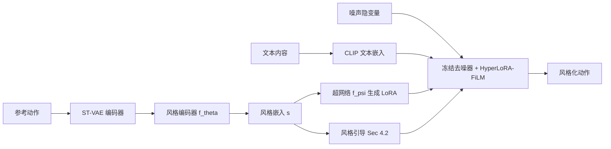

## 一句话总结

用一个超网络（hypernetwork）根据参考动作实时"生成"一套 LoRA 参数，注入到冻结的文本驱动运动扩散模型中，从而高效地把参考动作的"风格"迁移到文本指定的"内容"上，并能泛化到训练时没见过的风格。

## 研究背景

- 领域现状：文本驱动的人体运动扩散模型（如 MDM、SALAD）已能从自然语言生成高质量动作，但纯文本很难表达"风格"——即情绪、性格等决定"一个动作怎么被执行"的细微属性。近期工作转向在预训练扩散模型上附加"风格注入"机制，用文本提供内容、用参考动作提供风格。
- 核心痛点：现有风格化方法各有短板。SMooDi 用 ControlNet 式架构在每个去噪步注入风格，表达力强但模型容量与计算开销大；LoRA-MDM 用 LoRA 微调走参数高效路线，但每次微调只能绑定一种风格，牺牲了可扩展性与泛化；依赖离散风格标签的方法会偏向训练中见过的风格类别，对未见风格泛化差。总体上存在"风格表达 vs 内容保真/运动质量"的取舍困境。
- 本文 idea：提出 HyperLoRA——一个超网络驱动的风格条件框架。它既保留 LoRA 的效率，又能泛化到未见风格：从任意参考动作提取一个全局风格嵌入，再由超网络把这个嵌入映射成一套动态的 LoRA 低秩更新，注入冻结的预训练扩散骨干。同时用有监督对比学习给风格隐空间引入语义结构，并在推理时用风格编码器做梯度引导。

## 方法

### 整体框架

方法建立在预训练的骨干模型 SALAD（一个骨架感知的隐空间运动扩散框架）之上，全程冻结骨干。给定一段参考动作，风格适配器（style adapter）先用 SALAD 的 ST-VAE 编码器把动作编码成结构化隐表示，再用风格编码器提取全局风格嵌入；超网络把该嵌入转成低秩更新，注入去噪器的 FiLM 调制层。推理时再叠加一套风格引导，直接在扩散隐变量上纠偏。文本负责内容，参考动作负责风格。

### 关键设计

1. 结构化的风格隐空间（是什么 / 为什么 / 怎么做）。风格编码器 $$f_\theta$$ 由若干 MLP 块加上在关节与时间维上的均值池化组成，输出全局风格嵌入 $$s \in \mathbb{R}^{D}$$。为什么这么做：风格本身抽象且与内容纠缠，直接学容易过拟合到具体动作内容。怎么做：用有监督对比损失让"同风格、不同内容"的动作在隐空间聚到一起、不同风格推开，从而得到判别性强、连续且内容无关的风格流形，这也是泛化到未见风格的关键。有监督对比损失形式为

$$\mathcal{L}_{\text{supcon}} = \sum_i \frac{-1}{\lvert P(i) \rvert} \sum_{p \in P(i)} \log \frac{\exp(\cos(s_i, s_p)/\tau)}{\sum_{a \in A(i)} \exp(\cos(s_i, s_a)/\tau)}$$

其中 $$P(i)$$ 是与锚点同风格的正样本集，$$\tau$$ 为温度系数。

2. 超网络驱动的 LoRA-FiLM 调制。SALAD 的去噪 Transformer 用 FiLM 层依据时间步嵌入对中间特征做缩放/平移。本文观察到"风格应像时间步一样全局地作用于整段动作"，于是把超网络生成的低秩更新加到 FiLM 生成器的权重上。超网络输出被切分成低秩矩阵 $$(A(s), B(s))$$，最终 FiLM 参数为

$$(\gamma, \beta) = \text{split}\big((W + B(s)A(s))\phi(e_t) + b\big)$$

由于 $$A(s), B(s)$$ 一旦从参考动作导出就不再变化，可在去噪开始前一次性更新所有 FiLM 层权重，因此推理时不引入额外延迟。这既保留了原有时间步条件与冻结骨干的文本语义，又以极小的计算/内存代价实现风格调制。

3. 风格引导采样（推理时）。用两套互补机制。其一是无分类器引导（CFG），把无条件、文本条件、风格条件三种速度预测组合：

$$\hat{v}_t = \hat{v}_t^{\text{uncond}} + w_{\text{text}}(\hat{v}_t^{\text{text}} - \hat{v}_t^{\text{uncond}}) + w_{\text{style}}(\hat{v}_t^{\text{style}} - \hat{v}_t^{\text{text}})$$

其二是风格编码器引导：用训练好的风格编码器对预测的干净隐变量 $$\hat{z}_0$$ 求风格嵌入，定义风格一致性目标 $$\mathcal{L}_{\text{style}} = \lVert \hat{s}_t - s \rVert_2^2$$，把其梯度回传到噪声隐变量并做归一化梯度步：

$$z_t^{\text{guided}} = z_t - \lambda_{\text{style}} \frac{g_t}{\lVert g_t \rVert_2 + \epsilon}$$

与传统 classifier guidance 不同，引导信号来自连续的风格嵌入而非离散风格分类器，因此适用于未见风格。

4. 训练策略。冻结 SALAD 去噪器，只联合训练风格编码器与超网络，数据用重定向到 SMPL 骨架的 100STYLE。作者发现 SMooDi 用 MotionGPT 生成的文本与动作语义对齐差，改用基于运动类别的手写简单描述（如"A person walks forward."）。为鼓励内容无关的风格表示，还刻意"错配"：随机把文本与"同风格不同内容"的参考动作配对。总损失为速度预测损失加对比损失 $$\mathcal{L}_{\text{total}} = \mathcal{L}_{\text{vel}} + \lambda_{\text{supcon}}\mathcal{L}_{\text{supcon}}$$。单卡 RTX A5000 训练 100 轮约 2.47 小时。

## 实验结果

在 HumanML3D（内容文本）+ 100STYLE（风格参考）上，与 SMooDi、LoRA-MDM、Wu et al. 三个代表方法比较。评价分三类：风格表达（SRA，风格识别准确率）、内容保真（R-Precision、MM Dist）、运动质量（FID、FSR 脚滑比）。核心结论：本文在风格表达上取得最高 SRA（甚至超过把评测用的同一分类器当引导信号的 SMooDi），同时在内容保真与运动质量上保持有竞争力的水平，较好地缓解了"风格 vs 保真"的取舍。

| 方法 | SRA(%)↑ | R-Prec↑ | MM Dist↓ | FID↓ | FSR↓ |
|------|---------|---------|----------|------|------|
| SMooDi | 75.818 | 0.571 | 4.477 | 1.609 | 0.124 |
| LoRA-MDM | 42.047 | 0.772 | 3.234 | 0.607 | 0.049 |
| Wu et al. | 56.509 | 0.623 | 4.222 | 2.987 | 0.134 |
| Ours | 76.034 | 0.721 | 3.519 | 1.138 | 0.086 |

其余实验用文字概述：用户研究（20 人、5 点 Likert）中本文在风格表达、内容保真、运动质量三项均以明显优势领先所有基线。消融显示——有监督对比损失在训练风格数减少（75/50/25）时收益愈发明显，能在数据受限时保持最高 SRA 与更好的 FID/FSR，是泛化到未见风格的关键；风格编码器引导移除后 SRA 大幅下降，但内容保真/运动质量略升，体现表达与保真的取舍。架构对比中，把同骨干换成 ControlNet 式适配器会得到很低的 SRA（风格注入能力弱），本文 SRA 显著更高且推理时间更短。仅用 25 种风格训练也能对未见风格生成合理、连贯的风格化动作。

## 亮点与局限

- 亮点：
  - 用超网络"即时生成 LoRA"统一了效率与泛化——既非 ControlNet 的重架构，也非 LoRA-MDM"一风格一微调"，单模型即可覆盖多样风格并推广到未见风格。
  - LoRA 更新在去噪前一次性合并进 FiLM 权重，推理零额外延迟。
  - 有监督对比学习构建的连续风格流形支持无需预定义类别的梯度式风格引导；框架还可扩展到轨迹/关键帧约束生成与基于 DDIM 反演的运动风格迁移。
- 局限：
  - 训练依赖以移动（locomotion）为主的 100STYLE，学到的风格表示偏向行走类动作，对更广动作类别的泛化受限。
  - 风格与内容本质纠缠，"能否脱离内容参考单独定义风格"仍是开放问题；作者建议未来用"相对某锚点动作/内容类"的相对式表示，或借助大规模无标签动作数据学更丰富的风格表示。

## 延伸思考

- 该工作把 NLP/图像里成熟的"hypernetwork 生成适配参数"思路搬到运动扩散上，本质是把"风格"当作一个可由参考样本条件化的连续调制信号，而非离散标签或独立微调实例——这条"条件化参数生成"的路线对其它需要个性化/实例化适配的生成任务（如角色、材质、纹理风格）可能同样适用。
- "把 LoRA 更新预合并进权重以消除推理开销"是很实用的工程点，适合任何需要动态但静态可固化的条件适配场景。
- 风格与内容的纠缠、以及依赖 locomotion 数据集是最值得追问的地方：若能引入大规模无标签动作或相对式风格定义，泛化边界有望进一步打开。
