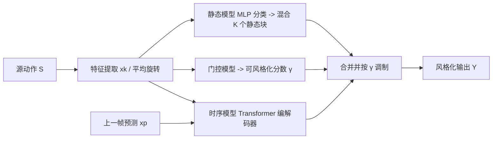

## 一句话总结

STyMo 只用几秒钟的成对动作数据、在一两分钟内训练出一个逐风格的小 Transformer，把"风格"拆成时不变的静态姿态和逐帧动态两部分，实现快速、可控且能泛化到任意输入动作的动作风格迁移。

## 研究背景

- 领域现状：角色动画的风格化（把中性走路变成僵尸走、老人走、愤怒跳等）依赖数据驱动控制器（如 Motion Matching）或深度学习方法，但它们通常需要为每种风格准备大量成对或带标签的风格化动捕库。
- 核心痛点：作者点出了一个被忽视的悖论——如果已经拥有大量某风格的高质量动捕，那直接用它搭建风格化动作集或控制器即可，根本不需要"学风格迁移"。真正的生产瓶颈不是"如何从大数据里学风格"，而是"如何避免为每个新风格去采集/制作大数据"。基于大规模视频扩散先验的方法虽能泛化，却牺牲了专业动画所需的精确可控性，把动画师降级为"筛选者"而非"创作者"。
- 本文 idea：主张风格迁移应当从"短示例"中泛化。用户提供 (i) 已有的大量中性动作，(ii) 仅几秒的成对新风格数据（如一段与中性走路对齐的风格化走路）。系统据此快速学出风格并施加到任意中性动作上。核心洞察是把风格分解为静态与时序两个可独立控制的分量。

## 方法

整体框架：STyMo 是完全的 few-shot 框架，不依赖任何预训练模型或额外数据集。给定成对的源（中性）$$S$$ 与目标（风格化）$$T$$ 序列，学习映射 $$F: X \rightarrow Y$$ 把风格施加到任意输入 $$X$$。风格被拆成静态分量 $$\boldsymbol{\delta}_{\text{static}}$$（对每对序列取源到目标的平均姿态差，捕获"总是前倾""耸肩"这类时不变姿态偏置）与时序分量 $$\boldsymbol{\delta}_{\text{temp}}$$（去掉静态后逐帧的残差，捕获时序、夸张与动态特征）。系统由静态模型、时序模型和一个门控模型三个子网络组成。

关键设计：

1. **静态模型（可解释的姿态分类）**：把训练数据划成 $$K$$ 个"风格块"（每块来自一段成对序列或一个人工编辑的静态姿态对），每块预计算一个平均姿态 delta。静态模型是一个 MLP，对输入的平均关节旋转 $$\bar{r}$$ 做分类，输出 $$K$$ 个块上的概率分布 $$\boldsymbol{\pi} = \mathrm{softmax}(\mathrm{MLP}(\bar{r}))$$，推理时用 $$\boldsymbol{\pi}$$ 加权混合各块 delta（旋转用 SLERP、位置用线性插值，并对 $$\boldsymbol{\pi}$$ 做时间平滑防跳变）。分块的好处：避免网络学到"一个通用平均姿势"，只在动作匹配时才触发对应姿态偏置（如只在跑步时施加跑步含胸）；也方便艺术家插入自定义静态姿态而无需提供整段成对序列。

2. **时序模型（编解码 Transformer，角色分工）**：编码器处理"过去的预测历史" $$x_p$$，学习非周期的一次性动作（如出拳、手势）；解码器接收源运动学 $$x_k$$ 并对编码器做交叉注意力，负责生成周期性风格（如快乐走路每步的弹跳、愤怒步态的跺脚），同时充当"上下文门"——它只能看到源动作，因而能判断何时施加编码器学到的动作（例如坐着时抑制出拳）。交叉注意力输出由运行时参数 $$\alpha$$ 缩放：$$h = h + \alpha \cdot \mathrm{CrossAttn}(h, m)$$，从而安全地夸张非周期动作。训练用按运动链深度加权的 MSE 损失（子树大的关节权重高），避免昂贵的 FK 损失以保证快速训练。

3. **门控模型（Stylizability Gate，防止 OOD 崩坏）**：一个二分类 MLP，为每帧预测可风格化分数 $$\gamma \in [0, 1]$$。训练样本来自基于最近邻距离的负采样：用四分位距 IQR，距离 $$d \le Q_1$$ 记为正样本，$$d > Q_3 + \lambda_n \cdot \mathrm{IQR}$$（默认 $$\lambda_n = 2.5$$）挖为负样本。推理时用 $$\gamma$$ 调制施加强度，$$\gamma \approx 1$$ 安全风格化、$$\gamma \approx 0$$ 判为离群并抑制，防止在训练分布外的动作上产生伪影。

4. **运行时控制与迭代创作**：静态与时序分量可独立缩放，最终每关节旋转 delta 为 $$\boldsymbol{\delta} = \mathrm{slerp}(I, \boldsymbol{\delta}_{\text{static}}, \hat{s}_{\text{static}}) \otimes \mathrm{slerp}(I, \boldsymbol{\delta}_{\text{temporal}}, \hat{s}_{\text{temporal}})$$，其中有效缩放 $$\hat{s}_c = s_c \cdot (1 - \lambda_c (1 - \gamma_t))$$ 融合了用户缩放与门控强度。还支持按身体区域（脊柱、手臂、腿）分区缩放、通过注入训练片段 $$x_p^{\text{induced}}$$ 主动诱发特定动作，以及在两分钟重训周期内不断加静态姿态对或成对序列的迭代式编辑。离线还有接触感知优化：$$L = \lambda_c \sum_{t:c_t=1} \lVert \dot{f}_t \rVert^2 + \lambda_r \lVert \hat{y} - \hat{y}_{\text{ref}} \rVert^2 + \lambda_s \lVert \ddot{p} \rVert^2$$，减小滑步并平滑运动。

## 实验结果

在公开 MOCHA 数据集上，与五种 SOTA 方法对比：few-shot 类的 VAE-GME、GANimator、SinMDM，以及预训练类的 MoST、MoMo。所有正式对比中 STyMo 只用 $$K=1$$（单段 2–3 秒序列），与基线信息量相同。主实验（方法 × 指标）如下：

| 方法 | Diversity ↑ | Content ↓ | Sliding ↓ | ΔJerk →0 |
|------|-------------|-----------|-----------|----------|
| VAE-GME | 0.17 | 0.77 | 1.21 | 189 |
| GANimator | 0.27 | 0.97 | 0.46 | 3.2 |
| SinMDM | 0.94 | 1.55 | 1.76 | 595 |
| MoST | 0.33 | 0.44 | 0.74 | 559 |
| MoMo | 0.02 | 2.75 | 0.44 | 256 |
| 本文 | 0.71 | 0.37 | 0.05 | 44.5 |

STyMo 在内容保持（Content）和滑步（Sliding）上最优、多样性次高。SinMDM 的高 Diversity 是"假象"——它其实在回放训练序列，因而 Content 最差；GANimator 因几乎不施加风格而 Diversity 低。训练时间差距悬殊：GANimator 约 $$195 \pm 17$$ min、SinMDM 约 $$32 \pm 13$$ min，而本文仅 $$1.8 \pm 0.6$$ min。

主观评测：32 名被试做 2AFC 强制二选一，STyMo 相对全部基线的偏好率都显著高于 50%——SinMDM 97.1%、VAE-GME 94.5%、MoMo 93.4%、MoST 88.3%、GANimator 78.5%（均 $$p < 0.001$$，经 Bonferroni 校正）。消融显示：去掉编码器会丢失一次性动作、去掉时序模型会因不修正根运动而滑步剧增、去掉门控在专门构造的 OOD 集上会把 Content 从 0.64 恶化到 1.05；即使不做接触优化，原始网络的滑步 0.37 仍优于所有基线。

## 亮点与局限

- 亮点：
  - 重新定义了问题——直击"为每个新风格制作大数据"这一真正的生产瓶颈，而非在大数据上刷指标。
  - 静态/时序显式分解带来强可解释性与细粒度可控性（姿态强度、时序夸张、分区、诱发动作），契合专业动画对确定性、可编辑的诉求。
  - 一两分钟训练时间使"预览—修正"迭代创作成为可能，比 GANimator/SinMDM 快两个数量级。
  - 门控机制系统性地处理了 few-shot 方法最脆弱的 OOD 泛化问题；并开源了处理后的成对数据集。

- 局限：
  - few-shot 从短示例提取的信息本就有限，对高度 OOD 的动作泛化仍困难。
  - 训练对需要合理的时序对齐（依赖自动相位提取 + DTW），严重错配的成对样本不在支持范围内。
  - 接触优化等步骤为离线设计，尚不能实时；每个风格需单独训练一个模型。
  - 作者坦承：学界仍缺乏"风格与内容如何区分"的坚实理论。

## 延伸思考

方法把风格拆成"静态姿态偏置 + 逐帧动态残差"的思路，本质是给黑箱风格迁移加了一层可编辑的中间表示，这与追求可控性的生产工具方向一致，也解释了为何作者刻意回避扩散/文本先验。一个自然的推进是文中提到的"多时间频率的层次化分解"，以及用大规模视频/动作模型的风格先验来补足 few-shot 的泛化短板——但如何在引入强先验的同时保住这种确定性可控，是值得追问的张力点。此外，把风格化动作作为强化学习中塑造机器人"性格"的表达性训练数据，是一个把图形学动作风格迁移外溢到具身智能的有趣方向。
