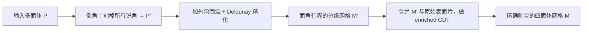

## 一句话总结

通过"倒角（chamfering）"预处理把输入多面体上所有的锐角削掉，让 Ruppert 的 Delaunay 精化在数学上保证收敛，从而在整个 Thingi10k 有效模型集上稳健地生成高质量、且精确贴合输入表面的四面体网格。

## 研究背景

- 领域现状：把一个多面体的内部剖分成四面体（tetrahedralization）是仿真、几何处理、有限元等下游任务的必备步骤。方法主要分两类——"贴合边界（boundary-conforming）"精确保留输入表面，"近似边界（boundary-approximating）"允许在容差内偏移边界。后者（如 TetWild 的包络法、网格背景法）能拿到高质量单元但会在整条边界引入几何误差；前者更实用却长期缺乏可证明稳健的实现。
- 核心痛点：贴合类方法里，能给出合理质量的经典软件 TetGEN 依赖浮点容差，遇到病态输入频繁失败——在 3942 个 Thingi10k 有效模型上，默认容差下失败率高达 37%，容差设 0 时更是 57%。而 Delaunay 精化的收敛性有一个致命前提：输入域不能有锐角（含二面角、边-面夹角）。真实模型里锐角无处不在，这让理论保证形同虚设。已有绕过锐角的变体（如缓冲区、保护球）要么难以稳健实现、要么无法约束遗留坏单元的尺寸，且 3D 情形极难处理。
- 本文 idea：不去回避锐角，而是主动、可控地"削角"——在每个锐角顶点/锐边附近以一个受控半径切掉一小块输入表面，使削后的表面满足"投影条件（projection condition）"，即不再含任何锐角。这样 Delaunay 精化就被数学保证收敛，得到一个面角有下界的分级网格；被削掉的部分随后再重新插回，以在锐角附近付出少量坏单元为代价换取对原始表面的精确贴合。

## 方法

整体框架是三段式流水线（对应作者的 Algorithm 2 "Delmesher"）：先对输入多面体做倒角得到 $$P'$$，再对 $$P'$$ 跑带外包围盒的 Delaunay 精化得到质量网格 $$M'$$，最后把倒角切掉的原始表面片与 $$M'$$ 合并、用一次约束 Delaunay 四面体化（CDT）重新缝合，得到既有质量保证又精确贴合输入的最终网格 $$M$$。全程用隐式点表示，保证数值稳健。

关键设计分四点展开：

1. **正交倒角（orthogonal chamfering），保证不产生新锐角**。这是全文的核心难点：2D 里削角只需沿锐角两条边各切掉圆内一段、留个小缺口即可；但 3D 里削出的边界是一条分段线性折线，天真地用球/圆柱去切锐角顶点/锐边，切口边很容易又形成新的锐角。作者的做法是：削一个锐角顶点 $$V$$ 时，不直接连接两个切点 $$A$$、$$B$$，而是造一座"三段等长边的桥"——在过 $$A$$、$$B$$ 的边-正交直线上取 $$P$$、$$Q$$，使 $$AP$$、$$PQ$$、$$QB$$ 等长，再移除留在 $$V$$ 一侧的五边形。切距取 $$d=\min(\varepsilon,\ \text{local\_lfs}(V)/3)$$，其中局部特征尺寸的 $$1/3$$ 保证 $$P$$、$$Q$$ 落在三角形内部。锐边则用等长约束把相邻切点拉成矩形后整块移除。附录里给了不产生新锐角的形式化证明。

2. **隐式点 + 间接谓词（indirect predicates）保证数值稳健**。倒角和精化过程中插入的 Steiner 点必须"精确落在输入边上或输入面上"，否则浮点舍入会让点漂出面/边，使几何谓词给出矛盾结果、程序陷入不一致。作者沿用 LNC（线性组合点，表示边上的点），并新提出 BPT（Barycentric Point on Triangle，三角形上的重心坐标点）来表示面内部的点：一个 BPT 由三角形三个显式顶点 p、q、r 加两个重心坐标 $$u$$、$$v$$（满足 $$0\le u\le 1,\ 0\le v\le 1,\ u+v\le 1$$）定义，位置为 $$u\mathbf{p}+v\mathbf{q}+(1-u-v)\mathbf{r}$$。判断角是否为锐角、二面角符号、投影条件等，都改写成对这些隐式表达的间接谓词（如 dotProductSign3D、dihedralSign），用带过滤的浮点算术精确求符号。

3. **精化网格构造与避免 sliver**。在 $$P'$$ 外加一个由六个矩形面组成的外包围盒（保证外接圆心不会跑到盒外），先建顶点的 Delaunay 四面体化并恢复线段、再局部恢复各面、然后按"外接半径/最短边之比" $$B=r/s$$ 排优先队列迭代劈裂坏四面体。算法对任意 $$\delta<20.7^\circ$$ 收敛，输出面角均 $$\ge\delta$$；但二面角在近乎扁平的 sliver 里仍可任意小。为此额外用一个比值判据（最短边长 $$e$$ 与两对边最短距离 $$h$$ 之比超过常数 $$\rho=7.2$$ 就判坏）来消除 sliver——实践有效但无法形式化证明收敛，故设为可选项。

4. **enriched CDT 实现精确贴合 + 输入过滤控制爆炸**。要精确保留原表面，就把精化网格 $$M'$$ 中（倒角球/柱外的）顶点、原始未削表面 $$P$$ 的全部顶点、以及被削掉又补回的原始面片一起喂给一次约束 Delaunay 四面体化（用 Diazzi 等 2023 的 CDT，并借助级联隐式点支持隐式输入）。这样得到的网格除锐角邻域外与 $$M'$$ 完全一致。另外，极小的局部特征尺寸会让单元数量爆炸（盒体用六面体剖分时高度减半单元数翻四倍），作者提供输入过滤：把导致 LFS 小于容差 $$\tau$$ 的三角形先删掉、在 enriched CDT 阶段再补回，迭代进行直到无病态配置，保证 100% 贴合的同时把资源消耗压到合理范围。

## 实验结果

主实验在 Thingi10k 的 3942 个有效模型上，与最相关的两个基线对比：TetGEN（质量贴合网格的 SOTA）和 CDT（Diazzi 等 2023，稳健性最强但质量差）。下表为在 TetGEN 能成功的 1701 个公共模型子集上测得的平均角度指标（角度单位为度）：

| 方法 | 成功率 | 平均最小面角↑ | 平均最小二面角↑ | 平均最大二面角↓ | 每单元耗时 |
|------|--------|--------------|----------------|----------------|-----------|
| TetGEN-T0（精确贴合） | 43% | 2.0 | 1.2 | 177.0 | 31 μs |
| TetGEN（默认容差） | 63% | 2.0 | 1.2 | 117.0 | 31 μs |
| CDT | 100% | 1.3 | 1.0 | 175.8 | 11 μs |
| Safe-Delmesher-e4 | 100% | 3.6 | 0.2 | 179.6 | 125 μs |
| Delmesher-e4（去 sliver） | 100% | 3.6 | 1.2 | 176.6 | 114 μs |

核心结论：本文方法（Safe-Delmesher-e4 与 Delmesher-e4）在全部 3942 个模型上都成功，而 TetGEN 精确贴合模式只成功 43%、默认容差 63%。平均质量上，本文的平均最小面角（3.6）优于所有基线；去 sliver 的 Delmesher-e4 把平均最小二面角从 0.2 提到 1.2，与 TetGEN 相当。代价是单元数更多（约 18 万–21 万 vs TetGEN 约 17 万、CDT 约 5 万）、每单元耗时更高。角度直方图显示本文方法的面角/二面角峰值集中在 45–60 度区间，而 CDT、TetGEN 的二面角峰值落在最差的 0–15 度区间。整套算法平均耗时约 77–82 秒、内存约 640–730 MB；约 73% 的模型在 1–10 分钟内收敛。

## 亮点与局限

- 亮点：
  - 首个能在 Thingi10k 全部有效模型上都成功产出质量网格的方法，稳健性同时有理论保证与大规模实测支撑。
  - "倒角"这一思路巧妙地在"精确贴合"与"高质量单元"两条历来对立的路线间取得平衡，且面角下界不依赖输入三角形的角度质量——这是以往方法给不出的保证。
  - 全程用隐式点（LNC + 新提出的 BPT）配合间接谓词，从根本上规避浮点舍入导致的不一致，工程上可复现（已开源）。

- 局限：
  - 原型较慢（每单元耗时约为 TetGEN 的 4 倍），作者自陈数据结构维护开销大。
  - 近乎共面的锐角三角形也会被倒角（若严格共面则不会），造成不必要的额外四面体。
  - 最终网格在锐角邻域仍可能有低质量单元；理想的"输出角 $$\ge \min\lbrace\alpha,\delta\rbrace$$"保证目前无人（含本文）能给出。
  - 去 sliver 的比值启发式实践有效但作者"仍不完全理解为何有效"，缺乏理论支撑。

## 延伸思考

这项工作把"稳健几何谓词 + 隐式点表示"（Attene 的 indirect predicates 生态、Diazzi 等 2023 的稳健 CDT）推进到了带质量保证的体网格生成，思路上与追求无条件稳健的 TetWild 系列形成有趣对照：TetWild 用包络牺牲边界精度换质量与稳健，本文则用局部倒角在保精确贴合的前提下拿到质量保证，二者代表了"近似 vs 贴合"这条老分界线上的两种新答案。值得追问的方向包括：能否用 Bernstein-Fussell 式的"近共面三角形共用单一平面"表示来消除近共面误削、显著降低单元数与耗时；sliver 比值判据为何在实践中总收敛是否可形式化；以及把结果网格接入 Schneider 等"解耦网格质量与解质量"的求解器策略后，锐角邻域的少量坏单元对实际仿真精度影响到底有多大。
