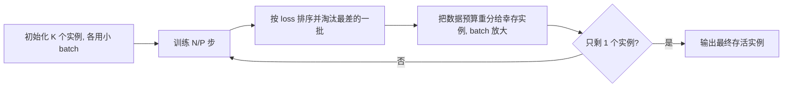

## 一句话总结

针对实时神经着色中"小网络训练结果极不稳定"的问题，本文提出一种在固定算力预算下并行训练多个网络实例、逐步淘汰差实例并同步放大 batch size 的多实例训练方案，让任意一次训练都能高概率收敛到好结果，并配套改进了神经反射率模型的输入参数化、损失函数与激活函数。

## 研究背景

- 领域现状：神经着色（把小型神经网络塞进实时渲染管线）越来越流行，常见用途是把材质"烘焙 / 压缩"进一个紧凑的 MLP，只需拟合训练数据、无需泛化到未见数据。
- 核心痛点：与过参数化的大网络不同，容量刚够用的小网络损失地形更崎岖，不同初始化会收敛到差异很大的局部极小值，训练结果对随机种子和数据顺序高度敏感。生产中一个场景常需反复训练成百上千个着色网络，这种"看运气"的训练严重拖累开发与部署。仅靠精心初始化或换激活函数都不足以解决。
- 本文 idea：借鉴超参数搜索里的 successive halving 思路，并行训练许多实例、只挑最好的那个；关键创新是把 batch size 调度和实例淘汰调度协同设计，使得每一步都把固定大小的数据预算均分给当前存活实例，从而在与单实例基线完全相同的算力下大幅提升训练可靠性。

## 方法

整体框架：先初始化 $$K$$ 个不同随机种子的模型实例，把总优化步数分成 $$P$$ 个阶段；每个阶段结束按当前 loss 排序、按固定倍率淘汰掉表现最差的实例，同时把释放出来的数据预算重新分配给幸存者（即放大它们的 batch size）。训练成本用"网络评估次数"衡量，整套方案的总评估次数与单实例基线严格相等，只是预算的分配方式不同。

关键设计：

1. **早期实例淘汰（early culling）**：作者观察到，虽然各实例的 loss 曲线偶有交叉，但"好实例始终排在前列、差实例始终垫底"的相对排名在训练早期就稳定浮现。因此没必要把所有实例都训到收敛——差模型几乎不可能后来居上，可以提前终止。据此把 $$N$$ 步分成 $$P$$ 个阶段，每阶段末按 $$K^{1/(P-1)}$$ 的倍率淘汰实例，最终只留一个。相比"暴力训 $$K$$ 个再挑最好"（成本是基线的 $$K$$ 倍），这套方案成本约降到基线的 $$K/\log(K)$$ 倍。

2. **batch size 退火（annealing）**：光有淘汰，成本仍被早期阶段主导（64 实例、4 阶段时第一阶段就相当于 16 倍基线成本）。剩下唯一能压成本的旋钮就是 batch size：把一份固定的数据预算在所有存活实例间均分。训练早期实例多、每个只分到很小的 batch（噪声大、易跳出坏的局部极小）；随着实例被淘汰，预算重新集中，batch 逐步变大（梯度更干净、能钻进窄而深的极小值底部）。这与"增大 batch 等效于学习率衰减"的已有结论一致，恰好契合"先探索后利用"的训练需求。与 successive halving 的关键区别是：后者分配的是训练步数预算，用在本场景会过早开始淘汰、误杀好实例；本文分配的是数据预算、步数保持不变。实例进度为 $$K=64,16,4,1$$，对应 batch $$B=1k,4k,16k,64k$$。

3. **神经反射率模型的针对性改进**：在 Zeltner 等人的编码器-解码器 SVBRDF 模型上做案例研究，额外提出三点改进——
   - 输入参数化：传统 half/difference 向量参数化在完美镜面反射点存在奇异性（方位角未定义），导致训练不稳。作者改用"最短弧旋转"把半程向量对齐到 $$z$$ 轴，得到在整个半球上光滑的差向量 $$\omega_{d}'$$；并把 $$(\omega_i,\omega_o,\omega_h,\omega_d')$$ 一整组向量都喂给网络，让它自适应选用最合适的参数化（尤其应对法线贴图带来的 lobe 旋转）。
   - 损失函数：BRDF 是非负高动态范围值，常用的对数映射 $$M_{\log}(x)=\log(1+x)$$ 在小值（漫反射区）梯度趋零、在大值饱和。作者改用幂映射 $$M_{\text{pow}}(x)=n(x^{1/n}-1)$$（取 $$n=3$$），其关于网络输出的梯度幅值为 $$\exp(z/n)$$，在整个动态范围内都保持非零、且随输出增大而持续增长，能同时兼顾漫反射细节与高光峰值。
   - 激活函数：ReLU 在紧凑网络里易"死亡"、且分段线性会在高光峰处产生可见的刻面伪影。作者改用带小泄漏项的平滑 ReLU（Leaky SmeLU），在 $$\lvert x \rvert < \beta$$ 用二次过渡保证 $$C^1$$ 连续，从而在小模型上也能平滑重建高光。

## 实验结果

主实验对比单实例基线与几种"等算力"的多实例配置（通过牺牲 batch 换实例数）以及本文完整方案。下表为"淘汰后存活实例"相对全体 64 实例中最优实例的最终 loss 比值（$$L_o/L_b$$，越接近 1 越好），以及随机选一个实例（等价于基线期望）的比值（$$L_r/L_b$$），数值为多次试验均值。

| 配置 | 相对 loss 比值 | 说明 |
|------|------|------|
| 全体最优实例 $$L_b$$ | 1.00（基准） | 64 实例中的最好者 |
| 本文存活实例 $$L_o/L_b$$ | 约 1.01（均值） | 几乎总能逼近最优实例 |
| 随机实例 $$L_r/L_b$$ | 约 1.95（均值） | 层状材质上可高达 3 倍以上 |

此外，本文淘汰算法平均有 74.4% 概率保留真正最优实例、99.4% 概率保留 top 10% 实例。运行时性能方面，由于让各实例共享训练数据（前三阶段数据量分别减少 64/16/4 倍，整体减少约 3.01 倍），在单张 NVIDIA RTX 5090 上实测比基线快 28–32%（如某材质 86.5s 降到 59.0s），墙钟时间不增反降。改进的幂映射损失与 SmeLU 激活也在漫反射细节与高光刻面伪影上带来可见的视觉改善。

## 亮点与局限

- 亮点：
  - 核心贡献是"淘汰调度 + batch 退火"的协同设计，在与单实例基线**完全相同的网络评估次数**下显著降低训练方差，几乎零额外成本地把"训练靠运气"变成"训练可靠"。
  - 数据共享的实现细节让墙钟时间反而更快，直接对准工业界"一个场景要反复训练成百上千材质"的痛点。
  - 附带的三项改进（最短弧参数化、幂映射损失、Leaky SmeLU）各自都有清晰的动机分析（奇异性、梯度消失、死亡神经元/刻面），实用性强。
- 局限：
  - 方法本质是"从多个候选里挑最好的一个"，并不改善单个候选自身的质量；作者也指出可与随机权重平均等提升候选质量的方法正交组合。
  - 收益随网络增大而递减——大网络本就收敛可靠，多实例训练的价值主要体现在容量刚够的小网络上。
  - 淘汰是贪心的，存在小概率误杀最优实例（保留最优的概率约 74%），对极端敏感的场景仍非万无一失。
  - 案例研究聚焦于 SVBRDF 神经反射率这一特定任务，跨到其他小网络着色任务的普适性有待更多验证。

## 延伸思考

这项工作把机器学习里成熟的超参数搜索思想（successive halving / population-based training）迁移并"改造"到图形学的神经材质训练场景，关键在于识别出"应该分配的是数据预算而非步数预算"这一领域特定差异。它与 Zeltner 等人的实时神经外观模型是直接的承接关系，可看作把那套模型"训得更稳、更快"的工程化补强。值得追问的方向包括：把随机权重平均、SWA 等提升单候选质量的技术整合进管线会带来多少叠加收益；淘汰调度能否从固定倍率改为基于排名收敛程度的自适应策略以进一步降低误杀率；以及这套多实例训练范式能否推广到神经辐射缓存、神经纹理压缩等其他实时神经着色原语上。
