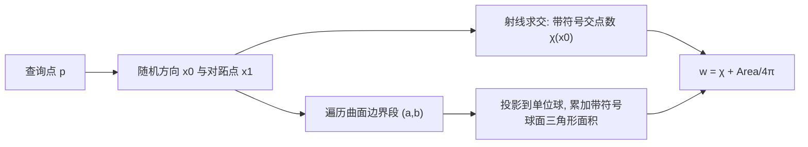

## 一句话总结

把三维广义缠绕数（Generalized Winding Number, GWN）拆成"一次带符号的射线求交 + 一条沿曲面边界的球面线积分"，得到一个既精确到任意精度、又比现有方法快一到两个数量级的算法，同时适用于三角网格与参数曲面。

## 研究背景

- 领域现状：广义缠绕数衡量一个点相对三维曲面（可以是开放的、自相交的、非流形的）"在里面的程度"，是稳健几何处理的基础工具，广泛用于四面体网格化、形状生成、网格布尔、表面重建与法向估计、神经场设计等。
- 核心痛点：现有方法在精度与速度之间二选一。层次化的精确方法（Jacobson 等）准但慢；快速近似方法（Barill 等）快但只是近似，不满足需要精度的应用；One-Shot 方法虽借助射线求交，却要计算球面区域排布，开销随边界分量数量组合式爆炸；近期同时兼顾快与准的工作又只针对参数曲面或只能处理二维。
- 本文 idea：作者证明 GWN 可以写成两个直观几何量之和——射线与曲面带符号交点数，加上曲面边界投影到单位球后的一条边界积分。这个边界积分本质上等于该球面曲线的总测地曲率加上其转向数（turning number），既有几何直觉，又能直接离散化，从而避开昂贵的曲面积分与球面排布。

## 方法

整体框架：给定查询点 $$\boldsymbol{p}$$，先随机取一个方向 $$\boldsymbol{x}_0$$ 及其对跖点（antipodal point）$$\boldsymbol{x}_1 = -\boldsymbol{x}_0$$，沿 $$\boldsymbol{x}_0$$ 射线数出带符号交点数 $$\chi(\boldsymbol{x}_0)$$，再沿曲面边界做一条球面线积分把余项补齐。核心结论是

$$w_{M}(\boldsymbol{p}) = \chi(\boldsymbol{x}_0) + \frac{1}{4\pi} \sum_{(\boldsymbol{a},\boldsymbol{b}) \in \partial M} \mathrm{Area}_{S^2_{\boldsymbol{p}}}(\boldsymbol{a}, \boldsymbol{b}, \boldsymbol{x}_1)$$

对网格来说，这一个公式就是全部方法。

关键设计：

1. **对跖点分解的直觉（鞋带公式的球面版）**：借鉴平面多边形用带符号梯形面积求面积的鞋带公式，作者发现每个球面三角形的带符号面积都能表示成"把三个顶点连到某个任意点 $$\boldsymbol{x}_1$$"所得三个辅助三角形面积之和。这个和到底等于三角形本身还是它在球面上的补域，取决于对跖点 $$\boldsymbol{x}_0 = -\boldsymbol{x}_1$$ 是否落在三角形内——每次落入就差一个 $$\pm 4\pi$$。对整张网格求和时，所有内部边的两个相邻辅助三角形符号相反、彼此抵消，只剩下贴着边界段的那些辅助三角形，于是面积项塌缩成一条边界求和，而累计的 $$4\pi$$ 倍数恰好就是射线交点数 $$\chi$$。

2. **连续理论支撑**：为把方法推广到参数曲面，作者在连续设定下建立了严格结果。引入单位球上带奇点的向量场 $$X$$，用曲线相对该向量场的 Whitney 指标（转向数的推广）与测地曲率积分改写区域面积加权和（Lemma 4.1），并证明指标与球面缠绕数之和不依赖奇点位置（Prop. 4.2）。最终化简得到最干净的形式

   $$w_{M}(\boldsymbol{p}) = \chi(\boldsymbol{x}_0) + \tfrac{1}{2}\omega(\boldsymbol{x}_1) - \frac{1}{4\pi} \int_{\Gamma} d\eta$$

   即 GWN = 一点的带符号交点数 + 另一点的球面缠绕数 + 向量场相对平行输运的总旋转量，三项都不再需要曲面积分。

3. **网格离散化**：向量场取"高度梯度"场，源与汇分别在 $$\boldsymbol{x}_0$$ 与 $$\boldsymbol{x}_1$$，其流线是最短测地线，把每段边界与 $$\boldsymbol{x}_1$$ 连成测地三角形。三角形的角 $$\beta,\gamma$$ 合起来度量曲线的测地曲率与指标，角 $$\alpha$$ 度量球面缠绕数 $$\omega_{\boldsymbol{x}_0}(\boldsymbol{x}_1)$$（可由绕投影点的平面缠绕数经立体投影得到）。算法因此极其简单：只需对边界段累加带符号球面三角形面积，再加一次射线交点数。

4. **参数曲面与射线求交**：对 NURBS 等参数曲面直接数值积分上式，用 15 点 Gauss-Kronrod 自适应求积算边界积分。射线求交沿用 Bézier 提取 + 双线性片近似 + 闭式双线性求交，并在参数域内用 raycasting 剔除裁剪区域外的交点；遇到贴近边界、尖点或切向的退化射线就丢弃重投一条，几乎零额外开销地提升稳健性。对规则网格查询点，同一条直线上的点可复用射线，体素化场景只需 $$W\times H$$ 条射线。

## 实验结果

主实验取参数曲面数据集上与当前最优参数曲面方法 Spainhour and Weiss 的逐查询点耗时对比（$$32^3$$ 体素网格），下面摘取有代表性的模型：

| 模型 | 本文 (ms) | Spainhour (ms) | 曲面边界曲线数 |
|------|-----------|----------------|----------------|
| Bobbin | 0.247 | 0.521 | 13 |
| Boxed Sphere | 0.284 | 0.971 | 176 |
| Joint | 0.084 | 1.305 | 52 |
| Slide | 0.057 | 3.418 | 0 |
| Pipe | 3.516 | 7.076 | 80 |
| Gear | 19.476 | 29.742 | 1160 |

整体上本文方法平均比其快 $$5.6\times \sim 16\times$$（几何/算术均值），18 个模型里只有一个更慢；"只对曲面边界积分而非逐片边界"这一改动本身就带来 $$2.47\times$$ 加速。

其余实验用文字概述：网格上，对 700 个闭合网格快 $$73\times \sim 127\times$$（相对 Jacobson 层次化方法）；开放曲面上相对 Jacobson 平均快 $$22\times \sim 94\times$$、相对 Barill 快 $$3.3\times \sim 10.6\times$$，且保持精确；GPU 上相对 Jacobson 朴素并行版快 $$13\times \sim 149\times$$，吞吐达每秒 $$10^9$$ 次查询（相当于 4K 切片 120 FPS）。精度方面，f64 版与 Jacobson 精确法相当，f32 版已达该类型精度极限，且约 30% 网格存在的共线/重叠边界等退化情形都被正确处理。

## 亮点与局限

- 亮点：
  - 用一个优雅的分解（射线交点数 + 球面边界积分）同时解决"快"与"精确"的矛盾，兼顾几何直觉与严格证明。
  - 统一处理三角网格与参数曲面，天然支持任意亏格、多边界、非流形、三角汤（polygon soup），闭合网格退化为简单的内外测试。
  - 算法"尴尬地可并行"、实现简单，CPU/GPU 均可，复杂度对网格为 $$O(B + \log F)$$，且不随边界分量数增长（这是相对 One-Shot 的关键优势）。

- 局限：
  - 瓶颈在球面三角形面积求和（约占 92% 时间），对边界段数量 $$B$$ 呈线性，因此在边界段数逼近面数的三角汤等极端情形优势收窄。
  - 理论证明依赖横截性（transversality）假设，虽然作者称实践中不构成限制。
  - 曲面上（距离过近）的查询点 GWN 无定义需被忽略；对参数曲面仍依赖数值求积的容差设置。

## 延伸思考

- 广义缠绕数是稳健几何处理的底层原语，本文把它的评估成本压到接近"一次射线求交"的量级，可能直接惠及交互式网格布尔、实时体素化、以及基于 GWN 的隐式场/神经场构造等对速度敏感的下游任务。
- 论文提到用光线追踪硬件（RT core）还能进一步加速射线求交部分，这与近年把几何查询映射到 RTX 管线的趋势契合，值得作为工程化方向追问。
- 与并发工作 Spainhour and Weiss 结构相似但表达式不同的对比，提示"射线项 + 线积分"可能是一类更普适的缠绕数计算范式，后续或可推广到更一般的隐式/程序化曲面表示。
