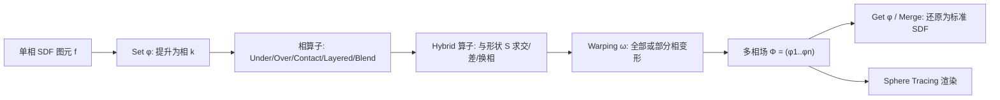

## 一句话总结

本文提出 PhaseTree，把传统"单相"符号距离场（SDF）推广为"多相"符号距离场，用一棵构造树同时编码空间中每个点到最近相界面的符号距离以及所属材料/相，从而在保持 SDF 紧凑性、分辨率无关性与算法兼容性的前提下，统一地建模具有多种材料、分层结构和复杂内部界面的体积物体。

## 研究背景

- 领域现状：隐式曲面把表面定义为标量函数的零等值面 $$\partial\Omega=\{\boldsymbol{p}\in\mathbb{R}^3\mid f(\boldsymbol{p})=0\}$$，其中符号距离场因紧凑、支持光滑混合与变形、并能配合 Sphere Tracing 等加速算法而被广泛采用。层次化的构造树（如 BlobTree）进一步支持组合、混合、变形的递归建模。
- 核心痛点：常规隐式曲面本质上只能描述"单块"物体——任意一点上 $$f(\boldsymbol{p})$$ 只编码到最近表面的符号距离，无法区分材料或相。要表达复合材料、分层材料、带内部相结构的体积物体，只能外挂额外数据结构、多通道纹理或标注方案，既不统一也难以融入既有隐式建模流水线。已有的基于网格的多相方法（多尺度向量体、对象空间多相隐式函数等）大多为数值仿真设计，依赖采样网格、内存开销大（单个物体常需数 MB），且一般不满足 1-Lipschitz 性质，无法直接套用 Sphere Tracing 这类算法。
- 本文 idea：定义多相符号距离函数 $$\Phi:\mathbb{R}^3\to\mathbb{R}^n$$，$$\Phi(\boldsymbol{p})=(\phi_1(\boldsymbol{p}),\dots,\phi_n(\boldsymbol{p}))$$，每个分量都是 1-Lipschitz 的 SDF；再围绕它设计一套构造树算子（相转换、合并、组合、接触、分层、混合、变形等），在建模过程中自动维护"每点至多属于一个相"的一致性约束，让多相信息成为一等公民。

## 方法

整体框架：一个多相物体由一棵构造树表示。树的叶子是标准单相 SDF 图元，内部节点是把 SDF"提升"为相、组合多相、以及变形空间的算子。核心不变量有两条：其一，各相区域 $$\Omega_i$$ 构成空间的划分，任一内部点存在唯一索引 $$k$$ 使 $$\phi_k(\boldsymbol{p})<0$$，因此相类型可直接取 $$\mu(\boldsymbol{p})=\arg\min_{i}\phi_i(\boldsymbol{p})$$；其二，除个别保守场情形外，所有算子都保持 1-Lipschitz 性质，这是既能安全应用光滑布尔算子、又能保证 Sphere Tracing 稳健行进的前提。

关键设计：

1. **双向的相转换（Set/Get 与 Merge）**：把一个标准 SDF $$f$$ 转成多相模型，只需把它设为某个相 $$\phi_k=f$$，其余相置 $$\phi_i=\infty$$（表示该相不存在）。反过来，合并算子 $$M$$ 把一组相取逐点最小值融合回单个 SDF；由于各 $$\phi_i$$ 都是 1-Lipschitz，其逐点最小值仍是 1-Lipschitz。这条双向通道保证单相算法可无损"升格"进 PhaseTree，也能随时"降格"回去复用既有算法。一个巧妙变体是薄壳算子：由控制形状 $$f$$ 一次生成两相，壳相为 $$\lvert f(\boldsymbol{p})\rvert-t$$、内部相为 $$f+t$$（$$t$$ 为厚度）。

2. **多相组合与接触算子**：布尔并/交不能直接搬到向量值场上，作者定义了非交换的 under 算子 $$\mathcal{A}\cup^{-}\mathcal{B}$$（用 $$\mathcal{B}$$ 的相替换 $$\mathcal{A}$$ 中重叠部分）与对称的 over 算子，其相函数写作 $$\phi_i=\max(\min(\phi_{\mathcal{A}i},\phi_{\mathcal{B}i}),-\min_{j\neq i}\phi_{\mathcal{B}i})$$，后一项强制"相互斥"、防止重叠。更进一步的接触算子用加权和 $$f(\boldsymbol{p})=\alpha\phi_{\mathcal{A}i}(\boldsymbol{p})-(1-\alpha)\phi_{\mathcal{B}j}(\boldsymbol{p})$$ 定义一条接触界面，当 $$\alpha$$ 在 $$[0,1]$$ 变化时，接触算子在 over 与 under 之间连续插值，可模拟两种材料"恰好贴合"的碰撞界面。

3. **分层与相特定的光滑布尔**：分层算子 $$L$$ 把已有全部相包进一层厚度为 $$t$$ 的新相，是单相偏移算子在多相下的自然推广，可增量式地"一层层"搭建复杂物体；配合光滑并还能得到相间光滑过渡的包覆效果。相特定的光滑布尔则只对指定相做光滑混合，其余相相应作差以维持互斥，这正是隐式曲面"光滑融合"能力在多相框架下的保留。

4. **Hybrid 算子与 Warping**：Hybrid 算子引入一个外部 SDF 形状 $$S$$ 作为作用域，支持"只对某些相在某个区域求交/差"（如剖切查看内部而保留其余相），以及局部换相 $$C_{i\to k}$$（在 $$S$$ 内把相 $$i$$ 变为相 $$k$$）。变形算子按经典 SDF 空间变形写作 $$\Phi(\boldsymbol{p})=\tfrac{1}{\lambda}\Phi_{\mathcal{A}}\circ\omega^{-1}(\boldsymbol{p})$$，其中 $$\lambda\ge\sup\lVert J_{\omega^{-1}}\rVert$$ 用于维持 Lipschitz 界；变形还可只作用于部分相（如扭转被柔性护套包裹的电缆内芯）。

多相 Sphere Tracing 只需极小改动：先确定射线起点所在相 $$\mu(\delta(0))$$，沿射线以最小绝对相值 $$\min_i\lvert\Phi_i\rvert$$ 作保守步长前进，直到相标签发生变化（即射线离开初始相 $$\phi_i>0$$）即判定命中界面。由于所有相都是 1-Lipschitz，该步长是到任何界面距离的严格下界，保证不会越过界面；界面处法向满足 $$\boldsymbol{n}_i=-\boldsymbol{n}_j$$，为物理渲染中在不同界面施加反射/折射律提供了一致的相信息。

## 实验结果

作者用 C++ 与 GLSL 实现，构造树可导出为 GLSL 函数在 GPU 上实时 Sphere Tracing。主实验对比了几何完全相同的物体在"单相 SDF 构造树"与"多相 PhaseTree"两种表示下的渲染耗时与节点数，结论是多相带来的额外开销通常在 5%~25% 之间，个别情形因多相能用更紧凑的树反而更快。

| 模型 | 单相节点数 | 单相耗时 (ms) | 多相节点数 | 多相耗时 (ms) | 相对开销 |
|------|-----------|--------------|-----------|--------------|---------|
| Bunny | 6 | 5458 | 6 | 5414 | 0% |
| Cables | 34 | 7361 | 27 | 9121 | +24% |
| Hourglass | 40 | 488 | 43 | 604 | +24% |
| Geology | 51 | 555 | 58 | 585 | +5% |
| Cake | 73 | 1158 | 81 | 1054 | −9% |
| Ice cup | 52 | 1041 | 47 | 816 | −22% |

补充实验显示渲染时间随相数近似线性增长，且当相数为 4 的倍数时编译器优化更充分；内存上 PhaseTree 与标准 SDF 构造树相当、部分情形（ice cup、cables）更紧凑，一个复杂多相物体仅需几 KB 存储，而基于网格的多相方法通常需数 MB。方法还展示了与 SIREN 神经 SDF、BlobTree、Sphere Carving 包围体、代理加速节点等既有模型/算法的兼容与集成。

## 亮点与局限

- 亮点：
  - 用单一构造树把"几何 + 相"统一编码，且保持每个相为一致的 1-Lipschitz SDF，因此天然兼容 Sphere Tracing、布尔运算、偏移、包围体加速等全套 SDF 算法，单相与多相可无损互转。
  - 算子体系完整（组合、接触、分层、光滑混合、Hybrid 求交/换相、部分相变形），把隐式建模里熟悉的操作干净地推广到多相，尤其能优雅处理"材料恰好贴合的界面""事后剖切查看内部"这类单相下很棘手的任务。
  - 紧凑、分辨率无关、可编译进 GLSL，相比网格式多相方法在内存与实时性上优势明显。

- 局限：
  - 相数直接推高 $$\Phi(\boldsymbol{p})$$ 的求值成本与 Sphere Tracing 迭代数；靠代理节点缓解又会加深层次、增加遍历开销。
  - 相界面附近符号距离会局部变小，Sphere Tracing 步长被迫变短、收敛更慢，因此不建议把含大量内部界面的物体激进地合并回单相。
  - 当前建模仍依赖脚本化地拼装构造树（如用 Fibonacci 螺旋程序化放置电缆内芯），缺少更友好的交互式创作工具。

## 延伸思考

- PhaseTree 与近期非流形界面重建（如从 UDF 提取材料界面）路线互补：本文是"程序化正向定义"带一致界面的多相体，而重建方法是"从数据反向恢复"界面，两者在几何处理与仿真中可能结合——例如把重建得到的多材料结构导入 PhaseTree 做可编辑的程序化表示。
- 作者已把 1-Lipschitz 神经 SDF 作为单个相接入框架，"多相神经场"（带显式符号距离保证与算子闭合性）是自然的未来方向，可为学习式多材料建模提供可组合的表示基座。
- 相距离函数 $$\phi_i$$ 本身还能作为额外几何句柄驱动纹理混合、参数调制与着色决策，暗示了"相感知材质"这一与外观建模/PBR 交叉的应用空间。
