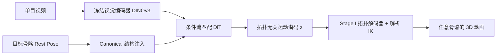

## 一句话总结

TopoCap 是首个"拓扑无关"的单目视频驱动动画框架，能把视频里的运动零样本地重定向到任意骨骼拓扑的 3D 角色（从两足、四足到六足乃至无生命的关节物体），无需模板先验，也无需测试时优化。

## 研究背景

- 领域现状：生成式 AI 让静态 3D 资产的创建变得廉价，但给这些资产做动画依然是瓶颈。单目动作捕捉在人体（依赖 SMPL）和四足动物（依赖 SMAL）等标准化对象上已经做得很好，运动重定向也能在结构相近的骨骼间迁移动作。
- 核心痛点：这些方法都被"模板"死死绑住。参数化模板只覆盖特定物种，面对幻想生物、机器人、会动的家具这类"长尾"角色就彻底失效。根本障碍在于运动与结构的刚性耦合——传统上运动被表示成相对特定骨骼层级的局部关节旋转序列，导致不同骨骼之间的数据在数学上不兼容。理论上每种拓扑都要一套独立的运动先验，不可行。
- 本文 idea：作者的核心假设是，骨骼结构虽然是离散、组合式的，但运动背后的物理规律却处在一个连续、低维的流形上。只要能把千差万别的骨骼映射进这个共享流形，动作捕捉就从"特定姿态估计"变成了"通用运动合成"。

## 方法

TopoCap 用一条两阶段的解耦式生成流水线来落地上述思路：先学一个把运动与骨骼结构分离开的通用运动流形，再把视频到动画建模成在该流形上的条件生成问题。

关键设计分为四点：

- **拓扑无关的运动表示**。每帧运动状态被参数化为局部旋转 $$\boldsymbol{R}_t$$ 与弹性偏移 $$\boldsymbol{O}_t$$。前者是各关节相对父节点的旋转，后者是加在骨长上的时变平移增量，用来刻画呼吸、卡通拉伸等纯旋转表达不了的非刚性形变。全局姿态通过一个可微的、纳入了弹性偏移的前向运动学算子求出。

- **第一阶段：学习通用运动流形（Graph CVAE）**。难点在于神经网络要求固定维度输入，而骨骼图的节点数 $$J$$ 和连接方式各不相同。作者用"先压缩再组合"的架构解决：先用图注意力机制把信息流限制在父子邻居之间以保持运动学因果性，再用 Perceiver-IO 瓶颈以 $$L$$ 个固定的可学习查询把变长关节特征压成定长潜码。压缩只在空间维进行、保留时间分辨率 $$T$$，从而保住高频运动细节。解码时把目标骨骼嵌成结构查询去检索潜码里的动态，通过在 rest pose 条件上重建，强迫潜码只编码"结构无关的动态"（角色在做什么），把"怎么执行"交给解码器。

- **Global-First 重建 + 解析 IK**。直接预测局部旋转会沿深层运动链累积误差，只预测全局位置又会忽视骨骼约束。作者让解码器先预测全局关节位置与朝向，再通过可微的解析逆运动学反解出局部旋转与弹性偏移，兼顾全局一致性与合法的局部参数化。训练用全局位置/朝向的 MSE，旋转用余弦距离化解四元数的双重覆盖歧义，另加速度损失保时序平滑，潜空间用 KL 正则。

- **第二阶段：生成式运动提取（流匹配）**。把单目动捕看成在流形上找一条对齐视觉证据与目标拓扑的轨迹，用流匹配 Transformer 建模 $$p(z_{1:T} \mid V, S)$$。视觉端用冻结的 DINOv3 抽 patch token；结构端提出 Canonical 结构注入——把目标 rest pose 构造成"零运动"序列，过一遍预训练的 CVAE 编码器投影到同一潜流形，使流模型能用交叉注意力在抽象视觉线索与目标骨骼的运动能力之间建立语义对应。骨干采用 DiT，前置一个交替做时间注意力与全局注意力的上下文精修模块来稳定视觉信号。

此外作者构建了 **Mobjaverse** 数据集：从 Objaverse-XL 出发，经过运动学树校验、运动标准化、VLM 语义过滤（用 GPT 类模型判定"动态且有意义"）、人工核验、纹理绑定五道清洗，得到 5006 种不同骨骼拓扑、超 200 万帧动画，结构多样性比现有动物数据集高两个数量级。

## 实验结果

在视频到动作提取这个主任务上，作者在 Truebones Zoo 与 Mobjaverse 上把测试集切成 Seen（训练见过的拓扑）与 Unseen（零样本新拓扑），对比优化式方法 Puppeteer 与学习式方法 GenZoo：

| 数据集 | 方法 | MPJPE↓ | MPJVE↓ | CD↓ | GD↓ |
|--------|------|--------|--------|-----|-----|
| Truebones Zoo | Puppeteer | 227.21 | 87.85 | 0.095 | 0.622 |
| Truebones Zoo | Ours (Seen) | 52.05 | 12.05 | 0.049 | 0.289 |
| Truebones Zoo | Ours (Unseen) | 62.54 | 8.67 | 0.057 | 0.529 |
| Mobjaverse | Puppeteer | 342.52 | 108.63 | 0.117 | 0.694 |
| Mobjaverse | Ours (Seen) | 179.61 | 47.99 | 0.092 | 0.487 |
| Mobjaverse | Ours (Unseen) | 192.04 | 51.76 | 0.102 | 0.463 |

TopoCap 大幅领先基线，且 Seen 与 Unseen 之间的差距很小，说明模型学到的是真正通用的运动先验而非记忆特定骨骼。GenZoo 只在四足上勉强可用，无法泛化到长尾生物。

在运动重建（CVAE 表征能力）上，TopoCap 即便在有固定模板的 HumanML3D、AniMo4D 上也超过了专用模型（如在 HumanML3D 上 MPJPE 5.44 对比 MoMADiff 的 9.32），同时还能处理模板方法根本无法应对的 Truebones Zoo 与 Mobjaverse。消融实验表明：Global-First 解码对降低 MPJPE 至关重要（换成纯局部回归误差最大）、时间注意力对平滑度（MPJVE）关键、速度损失能抑制高频抖动；把视觉条件下采样 8 倍时性能仅轻微下降，证明生成先验能可靠地补全缺失的时序动态；带 rest-pose 条件的潜表示相比直接预测运动 token 在未见拓扑上优势尤为明显。

## 亮点与局限

- 亮点：
  - 首次实现拓扑无关的单目视频到动画，单次前向即可零样本重定向到任意骨骼，摆脱参数化模板依赖。
  - "运动与结构解耦"的思路优雅，还带来了零样本运动重定向、文生视频再转 3D 动画等 emergent 应用。
  - 配套发布了结构多样性高出两个数量级的 Mobjaverse 数据集，填补了长尾拓扑运动数据的空白。

- 局限：
  - 在极其罕见的拓扑上性能会明显退化（论文自己给出了失败案例）。
  - 对输入视频质量和真实footage的域差敏感。
  - 需要预先定义好目标骨骼，且工作在相机空间，不建模全局轨迹与足部接触等物理约束。

## 延伸思考

这篇工作把"骨骼拓扑"从硬约束降格为可条件化的输入，思路上与 AnyTop 等"任意拓扑运动生成"一脉相承，但把入口换成了单目视频，落到了动捕这个更实用的场景。它与文生视频模型串联后，本质上把视频生成器变成了可无限扩产的 3D 运动数据源，这对训练更大的运动基础模型很有想象空间。值得追问的点：当前不建模全局轨迹和物理接触，生成的动作在落地、承重等物理合理性上还有多大缺口？以及在极长尾拓扑上，是靠继续堆数据多样性，还是需要引入显式的物理/接触先验来兜底？
