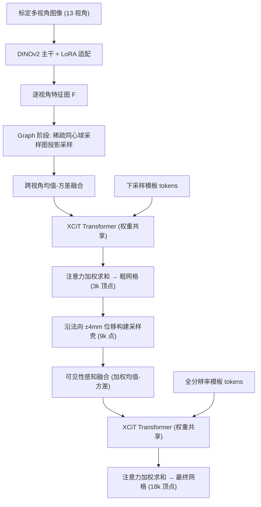

## 一句话总结

SHELLS 提出一种前馈式多视角 3D 头部重建框架，用"粗网格引导 + 分层贴面采样壳"的层级策略把特征采样与网格分辨率解耦，仅用合成数据训练即可泛化到真实采集，在 0.08 秒内重建出 1.8 万顶点、稠密语义对应的头部网格，显存占用比体素方法减少 88%。

## 研究背景

构建高保真数字人需要把多视角图像重建成"稠密语义对应"的头部网格，即所有重建结果共享同一固定拓扑、顶点一一对应。传统流程先做多视角立体（MVS）扫描，再把模板网格非刚性配准到扫描上。这条路存在两大痛点：MVS 在高光区域产生噪声与孔洞、把耳朵鼻孔等凹陷过度平滑、在头发区域生成不真实几何，需要大量人工清理；后续配准每帧要几分钟到几小时优化，还需手工调参在保真度与鲁棒性之间权衡。

近年前馈式方法（如 ToFu、TEMPEH、GRAPE、MOCHI）直接从标定多视角图像回归网格，绕过 MVS 与配准，把速度推到近交互级。但它们普遍依赖显存密集的全局与逐点特征体，把输出分辨率限制在约 3k–5k 顶点，难以扩展到稠密拓扑；而且这些方法独立地精修每个顶点位置，缺乏全局几何理解，在被头发或衣物遮挡的区域容易出现网格瑕疵。此外，训练它们通常需要昂贵的配对采集数据（每帧带配准网格或原始扫描）。SHELLS 正是针对显存瓶颈、全局一致性与数据成本这三点提出改进。

## 方法

SHELLS（Semantic Head Estimation via Layered Local Sampling）是一个端到端训练的两阶段 Transformer 框架：第一阶段用稀疏全局采样图预测一个粗网格，第二阶段围绕粗网格构建分层采样壳，从贴面采样的多视角特征回归出高分辨率最终网格。

**特征提取。** 每张图像经冻结的 DINOv2-B 主干提取 2D 特征图，并在每个线性层注入可训练的 LoRA 残差（秩 $$r=5$$）以适配重建任务。空间维度下采样 14 倍，拼接四个均匀间隔的主干层并投影到 $$d_f=98$$ 维。

**Graph 阶段（粗预测）。** 为在未知 3D 位置时定位人脸，作者不用稠密 3D 网格，而是定义由多层同心球（二次细分的正二十面体）顶点构成的稀疏点云 $$\boldsymbol{S}_g$$。每个采样点用相机投影 $$\Pi_k$$ 投到各视角图像平面双线性采样，再跨视角融合。融合方式沿用 ToFu 的逐元素均值 $$\boldsymbol{\mu}$$ 与方差 $$\boldsymbol{\sigma}^2$$ 拼接：$$\boldsymbol{f}=[\boldsymbol{\mu};\boldsymbol{\sigma}^2]$$。得到的全局特征点云与下采样模板 token 一起送入 XCiT Transformer。XCiT 在特征维度而非 token 数量上计算注意力，规避标准自注意力对大点集的二次显存复杂度。最终粗顶点由采样图坐标的注意力加权和得到：

$$\hat{\boldsymbol{V}}_c = \mathrm{Softmax}\!\left(\boldsymbol{Q}_c \boldsymbol{K}_c^{\top} / \sqrt{d_m}\right)\boldsymbol{S}_g$$

**Shell 阶段（精预测）。** 用粗网格 $$\hat{M}_c$$ 的顶点法向 $$\hat{\boldsymbol{N}}_c$$ 构建分层采样壳，把顶点沿法向正负位移堆叠：

$$\boldsymbol{S}_l = [\hat{\boldsymbol{V}}_c;\ \hat{\boldsymbol{V}}_c + d_l\hat{\boldsymbol{N}}_c;\ \hat{\boldsymbol{V}}_c - d_l\hat{\boldsymbol{N}}_c]$$

这样采样被限制在目标几何附近，减少无关特征、把显存与最终网格分辨率解耦。壳采样点的融合采用 TEMPEH 的可见性感知策略：按局部表面几何给每个视角加权 $$\phi_k = \mathrm{Softplus}(\delta_k \cdot \cos\theta_k)$$，其中 $$\delta_k$$ 是该顶点在第 $$k$$ 个相机下的可见性（深度缓冲判定），$$\cos\theta_k$$ 是顶点法向与视线方向的点积。最终顶点同样是动态采样壳坐标的注意力加权和 $$\boldsymbol{V}_f = \mathrm{Softmax}(\boldsymbol{Q}_f \boldsymbol{K}_f^{\top}/\sqrt{d_m})\boldsymbol{S}_l$$。值得注意的是两阶段共享同一 Transformer 与投影层。相比 ToFu/TEMPEH 每顶点用 512 个体素样本（共约 $$9\times10^6$$ 个采样），SHELLS 两阶段总采样点仅 11592 个，大幅降低采样开销。

**损失函数。** 端到端训练结合顶点到顶点（V2V）与顶点到平面（V2P）距离。V2V 用对角权重矩阵 $$\boldsymbol{\Omega}$$ 对不同区域赋予不同重要性：

$$\mathcal{L}_{v2v} = \lambda_c \lVert \boldsymbol{\Omega}\,\boldsymbol{\Delta}\boldsymbol{V}_c \rVert_F^2 + \lambda_f \lVert \boldsymbol{\Omega}\,\boldsymbol{\Delta}\boldsymbol{V}_f \rVert_F^2$$

V2P 只惩罚与目标表面正交的位移分量，允许顶点沿切平面"滑动"分布。作者强调基于稠密语义对应的 V2V 损失本身提供了强隐式正则，无需额外正则项就能维持表面完整性。

**合成数据训练。** 采用 Wood 等的程序化方法，从 2500+ 身份的注册网格（各 17821 顶点）出发，随机赋予皮肤纹理、表情混合、服饰毛发配饰，用 Blender Cycles 从 13 个视角渲染，覆盖多种族裔与年龄段，共 30 万对数据。整个模型在单张 H100 上训练约两周，且完全不使用真实采集数据。

## 实验结果

在真实采集测试集上与 TEMPEH、3DMM 回归、3DMM 拟合对比（V2V 为对配准结果的顶点距离，P2S 为对 MVS 扫描的点到面距离，越低越好；3DMM 拟合的 V2V 加括号因参考配准以其初始化存在偏置）。

| 方法 | V2V 均值 | V2V 中位 | V2V 标准差 | P2S 均值 | P2S 中位 | P2S 标准差 |
|---|---|---|---|---|---|---|
| 3DMM regression | 30.33 | 30.20 | 1.52 | 17.23 | 18.31 | 9.37 |
| 3DMM fitting | (1.53) | (1.33) | (0.94) | 2.05 | 1.03 | 3.31 |
| TEMPEH (Coarse) | 2.28 | 2.06 | 1.19 | 1.66 | 1.09 | 2.27 |
| TEMPEH (Final) | 2.13 | 1.90 | 1.16 | 1.19 | 0.62 | 2.10 |
| SHELLS (Coarse) | 1.74 | 1.53 | 1.00 | 1.14 | 0.78 | 1.17 |
| **SHELLS (Final)** | **1.71** | **1.50** | **0.97** | **1.13** | **0.76** | **1.17** |

关键结论：SHELLS 在真实数据上比 TEMPEH 的 V2V 中位（均值）误差降低 21%（20%），在合成数据上降低 29%（28%）。P2S 上 TEMPEH 的中位数更低（0.62），因为它逐顶点精修能把个别点拉近扫描表面，但代价是全局表面一致性差、语义对应不准；SHELLS 的整体式预测在全头保持更优对应。网格质量上，SHELLS 的三角形形变分数比 TEMPEH 低 31%（0.38 vs 0.55），翻转率近乎减半（0.08% vs 0.15%）。效率上，推理显存约 2.4GB（体素基线约 20GB，省 88%），训练显存约 20GB（vs 65GB，省 70%），18k 顶点推理 0.08 秒（vs 0.29 秒，3.5 倍加速）。

消融表明：用 DINOv2 特征替换 TEMPEH 的 ResNet 特征网使合成集 V2V 降 49%，LoRA 适配贡献约 20% 提升，粗采样图密度对结果至关重要，而中间网格分辨率（500 vs 3000 顶点）对最终精度影响很小，说明壳阶段对粗网格分辨率鲁棒。

## 亮点与局限

亮点：

- 层级化"粗引导 + 贴面采样壳"策略把特征采样与网格分辨率解耦，使模型能扩展到 18k+ 顶点稠密拓扑，同时显存仅为体素方法的 12%。
- 用共享 Transformer 整体式回归所有顶点（注意力加权求和采样坐标），替代逐顶点独立精修，带来更好的全局表面一致性与遮挡鲁棒性。
- 完全用合成数据训练即可泛化到真实多视角采集，摆脱对昂贵预配准数据集的依赖；对输入视角数量鲁棒，2 个视角也能给出合理结果。

局限：

- 对极端舌头动作重建失败，源于合成训练集舌部表情多样性不足。
- 18k 顶点网格只捕获全局与中频结构，缺乏皱纹、毛孔等照片级细节，需另训一个位移图/纹理合成网络补充。
- 只预测毛发/衣物下的皮肤表面，若数字化身需要贴合头发或胡须外层体积的网格代理，还需扩展合成数据的毛发/衣物表面标注。

## 延伸思考

SHELLS 最值得玩味的一点是"合成数据即可泛化到真实采集"，它把数字人重建从"必须先有昂贵的预配准多视角数据"这一门槛中解放出来。这背后是基础模型特征（DINOv2）+ 标定相机几何约束的组合：前者提供强语义先验，后者提供度量精度，二者叠加使得合成到真实的域间隙被显著压缩。这暗示在其他需要稠密对应的重建任务（手、身体、器官）中，"程序化合成 + 基础模型特征 + 已知标定"可能是绕开真实标注瓶颈的通用配方。

另一个方法论上的启发是"采样空间的构造重于采样密度"。SHELLS 用 1.1 万个贴面壳点就超过了体素方法 900 万个采样，核心在于让粗网格先把搜索空间收缩到目标表面邻域。这与"由粗到精"的经典思想一致，但它把粗预测的作用从"初值"升级为"定义离散搜索空间"，值得在其他几何回归任务中借鉴。局限方面，模型只重建皮肤层、缺乏高频细节，恰好为后续接一个 displacement/纹理合成模块留出了清晰的分工边界——SHELLS 负责拓扑一致的中频几何，细节交给专门网络，这种解耦式流水线在工业级数字人生产中可能比端到端一步到位更实用。
