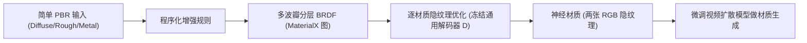

## 一句话总结

用一套物理先验驱动的程序化规则，把只有"漫反射 + 单波瓣 GGX"的简单 PBR 材质"提升"成能表达灰尘、清漆、绒毛、层间散射等复杂外观的多波瓣 BRDF，再把它压成紧凑的神经材质表示，从而为训练更富表现力的生成式材质模型造出数据。

## 研究背景

- 领域现状：生成式材质创作正在兴起，但模型质量被训练数据的质量和覆盖面死死卡住。现有大规模数据集大多基于"漫反射 + 单个 GGX 高光"的简化外观模型。
- 核心痛点：真实材质有清漆、灰尘、绒毛、薄层散射、双高光（haze）等效果，简单 PBR 模型根本表达不出来。而 OpenPBR、Disney Principled 这类高保真模型虽然能表达，却没有对应的大规模数据集——手工制作复杂材质代价过高，导致"训练下一代表现力材质合成器所需的数据"严重缺失。
- 本文 idea：不去改纹理分辨率、也不在保持简化着色模型的前提下加细节，而是直接扩展 BSDF 本身的外观空间。做法是一条程序化数据增强流水线：拿广泛可得的低维简单 PBR 数据当输入，在物理原则和领域先验指导下把它提升成更有表现力的分层 BSDF，再编码成带正则化隐空间的紧凑 6D 通用神经表示，供下游生成任务使用。

## 方法

整体框架分三段：先设计一个可组合的多波瓣非漫反射 BRDF 模型；再用程序化规则把每个简单 PBR 材质实例提升成该模型的一个实例；最后用一个权重冻结的通用解码器把这个 22 参数的非漫反射分量压成两张 RGB 隐纹理（6D 隐空间）。作为下游演示，用这批神经材质数据微调一个视频扩散模型来生成材质。

关键设计：

1. 广义非漫反射反射模型。保留原始的 Lambertian 漫反射项不动，只把单个 GGX 高光波瓣替换成一个由八个波瓣组成的非漫反射分量，分为导体分支和介质分支。核心是 core/haze 两组波瓣：每个分支都用一个低粗糙度的 core 波瓣（产生锐利高光）和一个高粗糙度的 haze 波瓣（捕捉更模糊的反射），二者叠加就得到让材质更真实的"双高光"外观。此外还有四个可选的"装饰波瓣"（decorator lobes）：灰尘/绒毛（sheen 波瓣）、清漆（低粗糙度 GGX 涂层）、内层散射（介质波瓣下方的 sheen，管掠射角的软性回射散射）、次表面散射（更粗糙、带色的 GGX，产生柔和着色高光）。保持漫反射与非漫反射分离，便于分别编辑，也让需要 albedo 的去噪等渲染任务保持简单。

2. 程序化提升规则。所有材质都先做一个基线增强（Type 0，即 haze-only）：用 metalness 混合导体/介质分支、从 base color 推导导体的复折射率、把单张粗糙度纹理映射成两个相关的粗糙度尺度。给定输入粗糙度 $$r$$，构造 $$\alpha_{core} = r^{p}$$ 和 $$\alpha_{haze} = s \cdot r^{q}$$，其中 $$p > 2$$、$$q < 2$$、$$s > 1$$ 是逐材质采样的标量。在此基础上通过开启不同装饰波瓣组合出 Type 1–5（灰尘、清漆、灰尘+清漆、绒毛+散射、全开），装饰波瓣的参数（如灰尘厚度、清漆 IOR）从物理上有意义的区间采样，灰尘的权重还会被世界空间法向调制（偏好朝上表面）并叠加三平面映射的空间掩码（模拟指纹、划痕）。

3. 紧凑神经材质表示。非漫反射分量有 22 个参数，直接用于生成不现实。作者训练一对编码器-解码器 MLP（四层、每层 64 神经元、指数激活），训练后冻结权重，得到一个跨材质共享的 6D 隐空间；每个材质实例只用两张 RGB 隐纹理表示。解码器输入 6D 隐向量和一对方向 $$(\omega_i, \omega_o)$$，输出 BRDF 值 $$f_{neu}$$、透射反照率 $$T_{neu}$$ 和亮度反射率 $$R_{neu}$$。完整 BRDF 通过在漫反射之上分层得到：$$f(\omega_i, \omega_o) = f_{neu}(\omega_i, \omega_o) + T_{neu}(\omega_i) \frac{c}{\pi}$$，其中 $$T_{neu}$$ 用于保证能量守恒，$$R_{neu}$$ 用于重要性采样。

4. 隐空间正则化（生成友好的关键）。把 22 个参数压进 6 通道会产生纠缠映射，早期微调扩散模型时约一半输出会解码出无效材质（Inf 或伪影），说明有效材质在隐空间里紧贴着无效区。作者用两招平滑映射：一是加入一个"填充类"（infill class）——参数在各自范围内独立均匀采样的随机材质，占训练数据 20%，用来更均匀地填充隐空间；二是在计算重建损失时向隐值注入 $$\pm 0.005$$ 的小幅均匀噪声，强迫解码器对轻微扰动的隐码也能准确重建，从而对生成更鲁棒。两招结合基本消除了生成中的伪影。

逐材质优化用 $$\ell_1$$ 损失组合三项（权重 $$\lambda_f = 0.95$$、$$\lambda_t = 0.04$$、$$\lambda_r = 0.01$$），BRDF 项必须主导。组合后的材质还要过一个（弱化的）白炉测试过滤能量增益，约 90% 通过，构成最终数据集。

## 实验结果

下游演示：作者在 Objaverse 和 BlenderVault 的 10,640 个 3D 模型上构建了神经材质数据集（隐优化在含 80 张 L40/L40S 的集群上共耗时 22 小时），再微调 Cosmos 视频扩散模型（Cosmos-1.0-Diffusion-7B-Video2World）生成 3D 物体上的神经材质。评估在 16 个手工材质测试资产上进行，对比近期的图像引导 PBR 材质生成方法 TRELLIS.2。主实验按"方法 × 指标"组织，指标在每个物体的 16 视角上计算：

| 方法 | CLIP-FID↓ | CMMD↓ | LPIPS↓ | PSNR↑ |
|------|-----------|-------|--------|-------|
| TRELLIS.2 | 8.642 | 0.132 | 0.0510 | 24.54 |
| 本文 (Ourtrellis, 用 TRELLIS.2 生成的 base color) | 6.527 | 0.058 | 0.0444 | 28.28 |
| 本文 (Ourref, 用参考 base color) | 3.907 | 0.020 | 0.0215 | 32.53 |

本文两个变体在全部四个指标上都优于 TRELLIS.2；用参考 base color 的 Ourref 优势最明显。神经拟合质量方面，随机抽取每种增强类型 50 个样本渲染预览球并计算 FLIP 误差，各类型的最好/中位/最差 FLIP 误差大致落在 0.03–0.19 区间。此外作者展示了"哈兹 + 微尺度 glint"的可组合增强：把神经 BRDF 用基于 Simplex 噪声、受波动光学启发的噪声实例调制 $$f^{(i)}_{neu}(\lambda, \omega_i, \omega_o) = f_{neu}(\omega_i, \omega_o) \cdot N^{(i)}(\lambda, \omega_i, \omega_o)$$，可重新引入生成模型难以产出的细尺度结构。

## 亮点与局限

- 亮点：
  - 抓住了生成式材质"数据贫瘠"的根因，用程序化增强 + 物理先验从廉价的简单 PBR 数据造出富表现力的多波瓣材质，思路务实且可规模化。
  - 多波瓣 BRDF 模块化、轻量、易扩展，新效果只需加波瓣；漫反射与非漫反射分离便于编辑与去噪。
  - 6D 神经表示紧凑（两张 RGB 隐纹理），且专门为生成做了隐空间正则化（infill 类 + 隐码抖动），直接解决了扩散生成解出无效材质的实际问题。
- 局限：
  - 生成质量受视频扩散模型分辨率限制，细尺度空间变化（尤其灰尘）会被平滑掉。
  - 空间变化靠预定义掩码调制，效果依赖掩码频率与物体真实尺度的关系，而网格尺寸未必对应真实世界大小，需要物体尺寸估计才更鲁棒。
  - 多波瓣模型只覆盖选定的一小类现象；加入虹彩、层间吸收等需要更多装饰波瓣，而外观模式增多又会放大神经表示的局限，需要更高维隐空间和更好的正则化。
  - 目前对任意输入材质允许任意增强类型，可能产生不常见外观；生成结果仅作为可行性证明（proof of feasibility），偶有投影伪影和近失败案例。

## 延伸思考

这项工作本质上把"缺数据"问题转化成"程序化造数据 + 压缩成生成友好的表示"，与近年用合成数据训练生成模型的思路一脉相承。它把 Raghavan 等人的生成式神经材质从 2D patch 扩展到带纹理参数化的 3D 物体，并借鉴 Munkberg 等人的视频扩散材质合成管线。几个值得追问的点：一是增强类型目前是随机分配的，用物体/材质识别来指导类型选择会更合理；二是隐空间正则化的两个技巧（填充类 + 抖动）是否有更原理化的替代（如学习式抖动范围，作者初步实验未见提升）；三是随着高分辨率视频模型出现，细尺度灰尘/划痕等空间变化的保真度有望自然改善。对做神经材质、可微渲染或生成式外观建模的人，这套"物理先验驱动的数据增强 + 紧凑神经编码"范式很值得借鉴。
