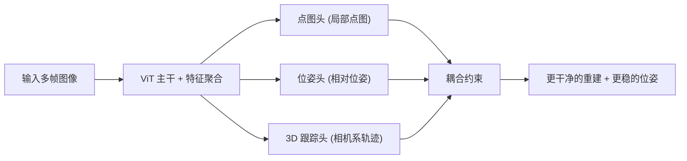

## 一句话总结

TrajVG 在前馈式多帧三维重建里新增一个"相机坐标系 3D 轨迹跟踪分支"，把跨帧对应关系从隐式副产品变成显式预测，用轨迹、局部点图、相对位姿之间的一致性约束互相纠偏，从而在动态视频上得到更干净、无重叠、位姿更稳的重建。

## 研究背景

- 领域现状：前馈式 3D 重建（DUSt3R、MASt3R、VGGT、$$\pi^3$$ 等）用神经网络直接从像素回归稠密几何和相机关系，按多帧融合坐标系分两类——以固定世界参考帧锚定的全局参考法（如 VGGT），和逐视图预测尺度无关局部点图的局部参考法（如 $$\pi^3$$）。
- 核心痛点：全局参考法在多物体运动、非刚性形变下单一参考帧不足以表达场景；局部参考法虽对复杂运动更鲁棒，但独立局部点图之间的融合完全依赖估计出的相机位姿。当位姿估计模糊（弱重叠、旋转漂移）时，缺少显式的"连接点"，即便每帧点图各自局部一致，融合后仍会出现表面重叠、重复结构和漂移。现有方法只是隐式捕捉跨视图依赖，缺乏显式几何约束。
- 本文 idea：借鉴经典 SfM，把跨帧 3D 对应从稠密回归的隐式副产品提升为显式预测。引入一个在**相机坐标系**下估计稀疏 3D 轨迹的跟踪分支，让这些轨迹充当几何"连接点"，通过两组一致性目标反向约束点图和位姿；再把同一套约束改写成只依赖 2D 轨迹的自监督形式，从而在缺乏 3D 标注的野外视频上扩展训练。

## 方法

整体框架：模型基于共享 ViT 主干，并行输出相机位姿头、点图头，以及新增的 3D 跟踪头。跟踪头预测每帧相机坐标系下的稀疏 3D 轨迹，再用一组耦合约束把稀疏轨迹、稠密局部点图、相对位姿三者绑在一起，使跟踪监督的梯度同时流向点图分支和位姿分支。当有 3D 真值时用有监督约束，只有 2D 轨迹时用同构的自监督变体。

关键设计：

1. **在相机坐标系而非世界系里预测轨迹**。若在固定世界/规范坐标系里定义轨迹，静态点存在平凡解——对静态世界点 $$X_i$$，正确轨迹随时间不变即 $$X_{t,i} = X_i$$，跟踪分支只要输出近零更新就能压低损失，从而对对应误差不敏感、失去纠正点图重叠和约束相机运动的信号。改在每帧相机系下预测 $$p^{(c_t)}_{t,i} = \hat{C}_{w\to c_t}\,\mathrm{Hom}(X_i)$$，分支就必须解释视点引起的几何变化、在每帧点图上重新关联到正确的局部邻域。查询点由首帧点图双线性采样初始化，逐帧输出 3D 位置 $$\hat{p}_{t,i}$$ 和可见性 $$\hat{v}_{t,i}$$。

2. **轨迹—点图双向一致性（带梯度路由）**。在跟踪像素处采样点图得到 $$\tilde{p}_{t,i}$$，用可见性权重 $$w_{t,i}$$ 和 Huber 惩罚 $$\rho(\cdot)$$ 强制两者一致：

$$L_{\text{cons}} = \sum_{t,i} w_{t,i}\left[\rho(\mathrm{sg}[\hat{p}_{t,i}] - \tilde{p}_{t,i}) + \rho(\hat{p}_{t,i} - \mathrm{sg}[\tilde{p}_{t,i}])\right]$$

其中 $$\mathrm{sg}[\cdot]$$ 是停梯度算子：第一项只更新点图分支（轨迹被 detach），第二项只更新跟踪分支（点图采样被 detach）。这避免了两分支互相追逐的不稳定梯度，也避免二者一起漂向平均值的退化解。

3. **静态锚点驱动的相机一致性**。为准确恢复自运动，需把刚性背景与动态物体分开。用真值轨迹定义二值静态掩码 $$m_{t,i}$$：仅当物理位移 $$\lVert X^{*}_{t,i} - X^{*}_{x,i}\rVert_2 < \tau_{\text{static}}$$ 时判为静态。把每帧 3D 点用预测相对位姿变换到锚帧坐标系 $$\tilde{p}^{(c_x)}_{t,i} = \hat{C}_{t\to x}\,\mathrm{Hom}(\mathrm{sg}[\tilde{p}_{t,i}])$$，再对静态点强制其重投影与锚帧一致并向真值锚点对齐。同样用停梯度控制方向：一项只更新位姿（用静态轨迹），另一项只更新轨迹点。静态门控抑制了动态区域的梯度，保证位姿更新主要由符合刚性运动的点驱动。

4. **野外视频的自监督扩展**。3D 标注稀缺，于是不新增损失函数，而是复用上面的一致性目标：对无标注视频用现成 2D 跟踪器（如 CoTracker3）生成伪 2D 轨迹和可见性，在这些像素处采样点图得到相机系 3D 观测，再套用 $$L_{\text{cons}}$$ 和 $$L_{\text{cam}}$$（因无位姿真值，锚点项里对真值的监督分量去掉）。这把 2D 对应信号迁移到 3D 点图和相机分支，无需深度或位姿标签。由于纯 2D 约束会导致尺度歧义或走捷径，最终采用半监督策略：混合有标注数据（锚定度量尺度、稳定训练）与野外视频（提升对多样外观和复杂运动的鲁棒性）。训练分三阶段，从 $$\pi^3$$ 预训练权重初始化。

## 实验结果

在 TAPVid-3D 真实世界 3D 点跟踪基准上（均使用 MegaSAM 深度提升，指标 AJ3D 越高越好），TrajVG 在三个子集上整体领先，超过 SpatialTracker2、TAPIP3D 等原生 3D 跟踪器：

| 方法 | ADT AJ3D↑ | DriveTrack AJ3D↑ | PStudio AJ3D↑ |
|------|-----------|------------------|---------------|
| SpatialTracker2 + M | 22.3 | 15.8 | 18.2 |
| TAPIP3D + M | 21.6 | 14.6 | 18.1 |
| DELTA + M | 21.0 | 14.6 | 17.7 |
| 本文 + M | 23.1 | 17.8 | 18.2 |

其余任务结论（文字概述）：相机位姿上，RealEstate10K 的 AUC@30 与 RRA@30 刷新最优，Co3Dv2 旋转精度最高；轨迹精度在 TUM-dynamics 全指标第一、ScanNet 的 ATE 最低、Sintel 的 RPE 平移与旋转均最低。点图重建在场景级的 ETH3D 上 Accuracy/Completion/Normal Consistency 全面领先，长序列 7-Scenes 稀疏与稠密视图均排第一。视频深度在 Sintel、Bonn 上 Abs Rel 刷新最优。单目深度在 Bonn、NYU-v2 上最好。消融显示：单开 3D 跟踪分支已能提升点图；再加 $$L_{\text{cons}}$$ 与 $$L_{\text{cam}}$$ 提升明显大于单用其一；$$L_{\text{self-sup}}$$ 在野外 Sekai 数据上持续改善全局轨迹与相对位姿（在域内 ETH3D 上增益有限，归因于数据分布差异）。

## 亮点与局限

- 亮点：
  - 把跨帧对应从隐式副产品变成显式的相机系 3D 轨迹预测，直击局部参考法"融合只靠位姿"的瓶颈；在相机坐标系里定义轨迹巧妙规避了世界系下静态点的平凡解。
  - 停梯度式的双向一致性和静态门控设计考究，避免了双分支互相追逐、动态区域污染位姿等常见不稳定问题。
  - 同一套耦合约束无缝改写为只需 2D 轨迹的自监督形式，让野外视频也能加入训练，且在多任务（跟踪/位姿/点图/深度）上一致受益。

- 局限：
  - 依赖现成 2D 跟踪器产生伪标签，自监督质量受其上限约束；纯 2D 约束仍存在尺度歧义与走捷径风险，需有标注数据兜底。
  - 自监督增益有明显的域相关性（野外数据受益大、域内基准增益小）。
  - 3D 跟踪评测用的是冻结主干、只微调跟踪分支的专用变体，端到端全模型在标准跟踪协议下的表现未直接给出；静态掩码依赖真值轨迹阈值，对阈值选择和野外场景的可迁移性存疑。

## 延伸思考

- 这条"把显式对应重新引回前馈重建"的路线与经典 SfM/bundle adjustment 形成呼应：在深度学习管线里用可微的轨迹—点图—位姿耦合部分替代迭代几何优化，值得和可微 BA、后处理式全局对齐方法对比开销与精度。
- 静态/动态门控目前靠位移阈值二值判定，若换成软置信或学习式动静分解，可能对复杂非刚性场景更友好。
- 方法建立在 $$\pi^3$$ 的局部点图表示之上，若把这套轨迹耦合迁移到全局参考帧模型（如 VGGT）或与 3D Gaussian Splatting 等表示结合，能否进一步减少动态场景的重复表面，是值得追问的方向。
