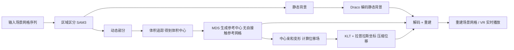

## 一句话总结

TSMC 是第一个专门面向"大规模、无界 4D 场景网格序列"的压缩框架：它把场景拆成静态背景与动态前景，用体素追踪为动态部分构造一张"无自接触"的参考网格，再把每帧表示成参考网格 + 位移场，并用 KLT + 拉普拉斯坐标把位移场压得极小。

## 研究背景

- 领域现状：由深度传感器重建的时变 4D 场景网格（time-varying scene mesh）正在成为体积视频（volumetric video）的基础媒体格式，能提供 6 自由度的沉浸式 AR/VR 交互。相比高斯泼溅和神经辐射场，网格是显式、结构化的表示，几何精确、拓扑清晰、物体边界明确。
- 核心痛点：这类网格数据量巨大，存储、传输、实时串流都很吃力。而它天生"难压"——逐帧的顶点数、面连接、拓扑都在变，还是包含大片静态背景加多个独立运动物体的无界场景。现有方法几乎都靠"选一个关键帧变形去逼近后续帧并保持拓扑"，在复杂场景里会被自接触（self-contact，如手臂搭在桌上、嘴碰到瓶子）搞出严重伪影；单个物体的运动还会把畸变传播到整张网格的所有顶点。此前最接近的工作 TVMC 用体积追踪做到了物体级压缩，但它依赖绕数（winding number）的内外测试，对大场景中常见的开放/复杂几何不可靠，且直接用 Draco 压位移、忽略了时间冗余。
- 本文 idea：把"体积追踪建立稳定时序对应"这条思路从单物体扩展到整个无界场景。先做静/动分离，只对动态部分做时序建模；再用体积追踪的稳定中心构造无自接触参考网格解决伪影；最后针对位移场做二阶轨迹压缩（KLT + 拉普拉斯坐标）榨干时间与空间冗余。

## 方法

整体框架：TSMC 是一条"分离 → 追踪 → 参考网格 → 位移场 → 变换域压缩"的流水线。输入场景网格序列先经区域区分拆成静态与动态两块；静态背景对一组帧只编码一次；动态部分被当成新的时变网格序列处理——用体积追踪得到跨帧稳定的体积中心，据此提取一张参考网格，再把每帧变形到该参考网格上算出位移场，位移场用 KLT 加拉普拉斯坐标压缩后串流。解码端只需解出静态背景与参考网格，再用位移场把参考网格变形回各帧并与静态部分拼合。

关键设计：

1. **静/动场景分解（是什么/为什么/怎么做）**：直接对整个场景网格做体积追踪既慢又不准（绕数问题让参考中心无法正确表示网格包围的区域）。因此 TSMC 先把每帧分成静态背景（墙、地板等）和动态前景。做法是从固定的 $$X$$ 个视点渲染每帧，用 SAM3 做两阶段密集追踪得到多视角动态掩码，再通过光线投射把 2D 掩码"抬升"到网格面上：对每个面统计其在各视点下被标记为动态的票数与可见次数，得到归一化动态分数 $$R_t(f) = V_t(f) / \max(U_t(f), 1)$$，当 $$R_t(f) \ge \tau$$ 就判为动态面。这样静态部分只编码一次并跨帧复用，大幅降低冗余。

2. **无自接触参考网格（解决伪影的核心）**：动态部分被当作新的时变序列。为避免自接触区域"变形后粘连"的伪影，TSMC 不用关键帧，而是用体积追踪得到的体积中心作隐式引导。先用序列中两两中心的"最大欧氏距离"构造距离矩阵 $$D$$，再用多维缩放（MDS）把中心重新摆到一个规范的 3D 位形，最小化应力函数把长期空间关系还原出来。中心间还定义亲和度 $$a_{ij} = \exp(-(\sigma d_{ij})^2)$$ 表征连接强度。基于这组参考中心，把各帧动态部分变形对齐后做泊松表面重建，得到一张完整、无自接触的参考网格。

3. **中心亲和变形（怎么变形才不串味）**：普通的 ARAP、嵌入式变形都按欧氏距离更新顶点，会把"空间上近但属于不同部位"的顶点错误耦合。TSMC 改用中心亲和变形：对每个顶点先找最近中心 $$c_{k_1}^t$$，再选与之亲和度最高的前 $$K_{\text{nbr}}$$ 个邻居中心（按亲和度而非欧氏距离），用对偶四元数混合刚性变换来驱动顶点。这样变形结果紧贴中心的运动，同时保持拓扑。为控制大运动带来的畸变，序列按 GoF 大小分组处理，并配合 QEM 简化与中点细分做表面拟合。

4. **KLT + 拉普拉斯坐标压位移（榨干时间/空间冗余）**：由于时变网格的位移是一段连续运动，TSMC 把每个顶点在一组帧内的位移拼成向量 $$d_i \in \mathbb{R}^{3 \cdot GoF}$$，用 KLT（本质是 PCA）学一个变换矩阵和均值，只保留前 $$m$$ 个主成分做有损编码——实验显示 $$m = 3$$ 个基向量就能捕获 95% 以上的位移信息。随后再对这组基构造几何拉普拉斯算子 $$L$$，用 $$Y = L^{*} G$$ 进一步把熵压低，量化后串流；解码端在同一张已解码参考网格上算出相同的 $$L$$，通过稀疏最小二乘还原。参考网格本身则用 Draco（高质量设置）编码，因为它在解码速度上比 KLT 更优。

## 实验结果

数据集来自四个真实/合成场景：Answering、Drinking、Arena、Sitting（Azure Kinect 采集或点云转网格），外加一个 100% 动态比例的 Synthetic 数据集。评价用 D2-PSNR 与四视点渲染的 SSIM（把顶点法向转成 RGB 颜色、关闭光照后渲染），并报告解码时间。主实验（对应下表）在相近码率下比较 TSMC 与四个基线在四个真实场景上的平均表现：

| 方法 | D2-PSNR↑ | SSIM↑ | 解码时间↓ | 说明 |
|------|----------|-------|-----------|------|
| TSMC（本文） | 53.48 | 0.8949 | 34.50 ms | SSIM 最优，实时约 30 FPS |
| TVMC* | 53.84 | 0.8585 | 10.78 ms | D2-PSNR 略高但 SSIM 明显低 |
| Draco | 26.43 | 0.7915 | 13.25 ms | 逐帧内编码，无时间预测 |
| KLT | 37.27 | 0.8174 | 95.43 ms | TSDF 隐式表示，解码慢 |
| NeCGS | 38.85 | 0.8191 | 69.95 ms | 神经 TSDF 压缩 |

核心结论：在 15 Mbps 以下的低码率区间，TSMC 在 SSIM 上全面领先。例如 Answering 序列 TSMC 约 8 Mbps 即可达到 SSIM 0.9，而 TVMC* 需要近 13 Mbps 才能追平。TSMC 与 TVMC* 的 D2-PSNR 相当，但解码时间比依赖 Marching Cubes 的 KLT / NeCGS 快达 85.42%（虽比 TVMC* 和 Draco 慢，因为后两者更简单）。整体压缩比约 200× 到 240×，相比 Draco、TVMC*、KLT、NeCGS 分别减少约 67.63%、34.43%、75.03%、60.39% 的数据量。

其余实验用文字补充：在 100% 动态比例的 Synthetic 数据集上（静/动分离几乎无收益的极端场景），TSMC 的动态压缩组件依然给出有竞争力的率失真表现；作者还把 TSMC 实现在 Meta Quest 3 上做到 24 FPS 的全设备端 4D 网格实时解码播放（宣称是首个完全跑在独立 VR 头显上的 4D 网格解码器）；此外把 TSMC 接入混合高斯-网格框架 LMG 压缩其网格分量，网格码率从 357.6 Mbps 降到 6.13 Mbps（约 60× 缩减），渲染质量仅有微小下降。

## 亮点与局限

- 亮点：
  - 首个面向"完整无界场景网格"做帧间预测压缩的方法，把体积追踪从单物体扩展到大场景，突破了此前只能压静态或物体级动态网格的限制。
  - 用无自接触参考网格 + 中心亲和变形，从根上缓解了自接触区域的粘连伪影，低码率下视觉质量明显更好。
  - KLT + 拉普拉斯坐标的位移二阶压缩很有效，$$m = 3$$ 基向量即可覆盖 95%+ 位移信息；且拉普拉斯算子在收发两端用同一张已解码参考网格计算，无需额外串流。
  - 解码快、可 GPU 加速，静态背景复用进一步省时间，真机 VR 端实时可跑。

- 局限：
  - 编码复杂度高（每帧数秒级），只适合"离线编码、实时播放"的场景。
  - 方法本质有损：体积追踪与参考网格提取给质量设了上限，SSIM 随码率上升还会波动，不像 Draco 那样能趋于无损；用满全部基向量才到峰值。
  - 静/动分离的收益依赖场景有足够静态区域，在 100% 动态的极端场景中这部分优势基本消失。
  - VR 端 24 FPS 尚未针对更高帧率做优化。

## 延伸思考

TSMC 把"体积追踪建立稳定对应 + 变换域压缩位移"这套思路推到了场景级，和高斯泼溅/NeRF 这类隐式 4D 表示形成互补：它证明了显式网格在需要精确几何、清晰边界、以及作为高斯基元结构先验时依然有独立价值——LMG 实验里 60× 的网格码率缩减尤其说明混合 3DGS 管线中网格分量的压缩空间很大。值得追问的方向包括：SAM3 分割质量对静/动分解的敏感度如何、错分会不会污染下游压缩；体积中心数量与 GoF 大小对率失真的权衡是否有更自适应的选法；以及编码端数秒/帧的开销能否降下来，让这套方案从"离线编码 + 端侧播放"走向真正的实时采集-传输闭环。
