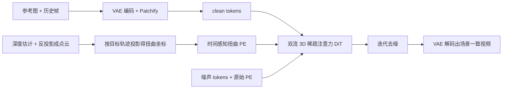

## 一句话总结

UCM 用一套"时间感知的位置编码扭曲"机制，把精确相机控制和长期场景记忆统一到同一个视频扩散框架里，让世界模型在按用户指定相机轨迹生成视频时，还能在回到旧视角时保持场景一致。

## 研究背景

- 领域现状：基于视频生成的世界模型能模拟可交互环境，近年借助大规模真实视频训练已能生成高保真的未来画面，成为仿真、自动驾驶、机器人、游戏引擎等交互应用的基础。
- 核心痛点：这类模型有两个长期难题。一是长期一致性差——受限于时序条件的有限上下文窗口，相机重新回到看过的场景时画面会"漂移"、前后对不上；二是相机可控性弱——开放世界视频视角高度多样，把精确的用户相机控制注入生成模型很困难。现有两条路线各有短板：显式 3D 重建（如用 TSDF 融合点云再渲染做条件）在大尺度无界场景中不灵活、易丢失细粒度结构；直接拿历史帧做条件（编码原始相机参数或 Plücker 嵌入）只能建立帧级对应，依赖训练中隐式学到的 3D 先验，导致控制不精确、对应关系弱。
- 本文 idea：作者观察到"相机可控生成需要建模初始帧与后续帧之间的空间变换"和"长期记忆需要历史帧与未来帧的空间对齐"，两者本质都依赖 spatio-temporal 的 token 级对应关系，可以用同一个扭曲操作统一解决。于是提出对条件 token 的 3D 位置编码做几何驱动、时间感知的重新赋值（warping），为相机控制和记忆注入提供显式、鲁棒的 token 对应，再配一个高效双流 DiT 降低算力开销，并用点云渲染模拟"场景重访"来低成本造训练数据。

## 方法

整体框架：UCM 建立在预训练的图生视频 DiT 之上，采用"逐片段"生成范式做长时间模拟，每个片段以参考图或上一片段末帧为条件。它把参考图、检索到的历史记忆帧编码成 clean token，与噪声 token 拼接后一起去噪；核心是对 clean token 的位置编码做时间感知扭曲，从而在 token 层面建立显式的时空对应，统一支撑相机控制与记忆注入。

关键设计：

1. 时间感知位置编码扭曲（核心贡献）。对每个历史帧/参考图，用流式深度估计得到深度图，再经反透视投影按已知视角矩阵抬升成点云；把点云投影到第 $$i$$ 个目标帧的相机坐标系，得到该历史像素在目标视角下的扭曲坐标图 $$[U, V]$$。这些坐标图下采样到 latent 分辨率，并附上时间索引 $$i$$，构成时间感知的扭曲位置编码 $$W = [i, U, V]$$，替换掉条件 token 原本的 3D 位置编码。为控制算力，帧级相机控制时把参考图 token 复制 $$N$$ 份分别扭曲到各目标视角；记忆引导时每个历史帧只投影到与之最相关的那一个视角。沿用 PE-Field 的多级 PE 提升 sub-patch 对齐精度，但不像 PE-Field 显式写入深度值——视频的时序连贯性让模型能隐式学到相对深度。

2. 高效双流视频扩散。输入 token 分两类：作为条件的 clean token 和需要复杂建模的 noisy token。据此设计 UCM DiT-block 里的双流 3D 稀疏注意力：每个 clean token 只在自己所属帧内部互相注意（用原始 PE），其 key/value 再带着扭曲后的时间感知 PE 拼接给 noisy token 做引导；noisy token 之间保持 3D 全注意力，同时借助扭曲 PE 建立的强对应，用一个二值注意力掩码强制每个 noisy token 只注意被扭曲到相同相机视角的 clean token。这种块稀疏结构在几乎不增加算力的前提下实现条件生成。

3. 可扩展数据构造。理想训练数据需要"多次从不同视角重访同一场景"的长视频，但现有数据集要么是纯静态多视角、要么规模/多样性不足，用引擎合成的又不够真实。作者对单目视频用 3D 重建模型得到点云和相机轨迹，随机选帧、加随机相机偏移 $$\Delta c$$ 渲染点云来模拟重访，得到带二值遮挡掩码的渲染图（掩码告诉模型哪些历史 token 可靠）。再把渲染图 warp 到带随机时间偏移 $$\Delta i$$ 的另一帧，制造跨视角的时序几何错位，迫使模型对齐静态场景、忽略违反跨视角几何约束的动态物体。该策略让模型能在 50 万+ 单目视频上训练。

## 实验结果

UCM 基于 Wan2.1 1.3B 微调的内部 I2V 模型，在 561k 单目视频上用 8 张 A100 训练约 4 天。长期记忆持久性实验最能体现方法价值，在"记忆初始化"和"循环轨迹"两种协议下对比各代表方法（数值取自论文，↑越高越好、↓越低越好）：

| 设置 | 方法 | RotErr↓ | FVD↓ | PSNR↑ | LPIPS↓ |
|------|------|---------|------|-------|--------|
| 记忆初始化 | C-a-M | 10.87 | 303.34 | 12.44 | 0.56 |
| 记忆初始化 | VMem | 5.35 | 292.08 | 12.78 | 0.50 |
| 记忆初始化 | VWM | 2.60 | 301.77 | 15.06 | 0.42 |
| 记忆初始化 | UCM | 2.32 | 198.84 | 15.57 | 0.34 |
| 循环轨迹 | C-a-M | 11.50 | 138.29 | 15.68 | 0.34 |
| 循环轨迹 | VMem | 4.78 | 133.95 | 16.35 | 0.28 |
| 循环轨迹 | VWM | 3.54 | 179.72 | 19.54 | 0.23 |
| 循环轨迹 | UCM | 3.29 | 61.47 | 23.01 | 0.09 |

UCM 在两种协议、几乎所有指标上都取得最优，循环轨迹下的视觉质量和视角召回一致性优势尤其明显。相机可控性方面，UCM 的旋转误差（RotErr 1.01°）优于所有隐式方法，仅平移误差略逊于基于点云的 VWM；但 VWM 在无界场景和细粒度结构上受 3D 表示质量限制。推理速度上，双流设计让 UCM（2.76 s/frame）快于大多数竞品。消融显示：检索历史帧越多长期记忆越好（默认取 20 帧做性能/开销权衡）；块注意力掩码既加速又带来性能提升；用点云渲染做数据构造相比直接采历史帧显著改善质量与召回一致性。

## 亮点与局限

- 亮点：
  - 用"位置编码扭曲"这一统一视角，把相机控制与长期记忆两个看似不同的问题归约为同一种 token 级时空对应，思路简洁且显式，避开了纯隐式先验的不精确。
  - 双流 + 块稀疏注意力在扩展序列长度带来的二次复杂度上做了实用折中，能处理较多记忆帧而开销可控。
  - 用点云渲染模拟"场景重访"来构造训练数据，绕开了长期多视角重访视频稀缺的瓶颈，可利用 web 规模单目视频。

- 局限：
  - 逐片段生成会累积微小预测误差，长序列下损害外观完整性。
  - 依赖学到的先验区分动态物体与静态场景，遇到运动物体时会产生伪影。
  - 帧数增多时流式深度估计的存储与算力开销不可忽略，实际部署需要更高效地组织历史信息。

## 延伸思考

方法把 3D 几何显式地"编码进位置编码"，是介于纯显式 3D 重建（如 VWM 的 TSDF 融合）与纯隐式相机编码（如 Plücker 嵌入）之间的折中路线，思路上与 PE-Field 把新视角合成当作条件图像生成一脉相承。它对流式深度估计（STream3R）质量有较强依赖，深度或轨迹估计误差会直接污染扭曲坐标；作者也指出更先进的流式重建框架能进一步降低开销。值得追问的方向：一是如何在超长序列下抑制误差累积（例如引入显式的一致性校正或关键帧锚定）；二是动态场景的记忆——当前策略主动"忽略"动态物体，如何反过来对动态内容也建立可控记忆，是通往真正可交互世界模型的关键一步。
