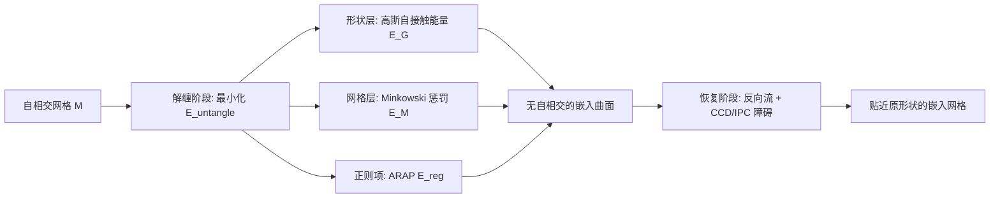

## 一句话总结

提出一个能量框架，通过**形状层的高斯自接触能量**与**网格层的 Minkowski 惩罚**两者协同，在不改变网格连接关系的前提下，可靠地消除表面网格中的自相交（self-intersection），把"缠绕"的曲面还原成嵌入（embedded）曲面。

## 研究背景

- 领域现状：表面网格是仿真、制造、机器人、几何处理与学习管线的基础表示，这些下游算法都默认曲面能把"内部"和"外部"分开（即曲面是嵌入的、无自相交）。但扫描、重建、抽取简化、生成模型等来源的大规模三维数据集普遍带有自相交。
- 核心痛点：现有方法大多把自相交当成**局部碰撞事件**，靠离散检测/投影/约束来处理，在复杂缠绕、多个远距离区域相互穿插、或退化几何上常失败。而经典排斥能量（如切点能量 tangent-point energy）虽擅长"预防"相交，却不适合"修复"——从已相交的构型初始化时，这些能量往往变得无穷大、无定义或数值不稳定。即使最新的 SOTA（Instant Repair）也常常只能修复一部分，残留相交集中在紧折痕、高曲率等精细区域。作者的关键洞察是：**嵌入性是一个全局几何属性，无法只靠局部推理来强制**。
- 本文 idea：同时在两个层面强制嵌入性。用一个在相交构型上仍**有限**、但强烈惩罚"空间接近却测地远"的区域对的高斯能量来驱动全局解缠；再用一个作用于三角形对的 Minkowski 惩罚来处理离散网格特有的局部退化。两者互补，缺一不可。

## 方法

整体框架分两个阶段。**解缠阶段（untangling）** 最小化一个组合目标，把全局的高斯自接触能量、局部的 Minkowski 惩罚、以及形状保持正则项加在一起，直到检测不到任何非相邻三角形对的相交为止；**恢复阶段（recovery / reverse flow）** 在保证不再产生穿插的前提下，把解缠得到的曲面拉回接近输入的形状、恢复几何细节。全程不改变网格连接关系。

关键设计：

1. **高斯自接触能量（形状层，全局）**。定义在曲面对 $$\Sigma \times \Sigma$$ 上的双重积分能量：
   $$E_G(\Sigma;\varepsilon) = \iint_{\Sigma\times\Sigma} \frac{w(x,y)}{\varepsilon^{p}} \exp\!\left(-\frac{\lVert x-y\rVert^2}{\varepsilon^2}\right) dH^2(x)\, dH^2(y)$$
   其中权重 $$w(x,y)$$ 在对角线（$$x=y$$）上取零，用来抑制相邻点的贡献，只惩罚"欧氏空间上接近、但沿曲面测地距离远"的点对。与经典结能量（Möbius 能量、切点能量）精神一致，但关键区别是：这个高斯核在相交构型上**保持有限**，因此可以从已相交的输入出发去做修复，而不是只能预防。核宽 $$\varepsilon$$ 越小能量越集中在相交处，越大则把梯度信息在更大邻域上铺开，从而提供"全局感知"的解缠动力。

2. **自适应带宽（bandwidth）**。核宽 $$\varepsilon$$ 决定解缠的速度和质性结果（$$\varepsilon$$ 太大会像 cMCF 一样靠整体翻面来解相交）。作者把 $$\varepsilon$$ 当作变分参数：对固定曲面，能量在 $$\varepsilon\to 0$$ 和 $$\varepsilon\to\infty$$ 时都趋零，故必在中间尺度取得极大值，这个极大值给出曲面的"特征交互尺度"。通过不动点迭代 $$\varepsilon = g(\varepsilon)$$ 求解。进一步引入**逐顶点的局部自适应带宽** $$\varepsilon(x)$$，用对称组合 $$\varepsilon_{ij}^2 = \tfrac{1}{2}(\varepsilon_i^2+\varepsilon_j^2)$$ 配对，让薄褶皱、细手柄与大平滑区各用合适的尺度。实验显示局部自适应带宽收敛最快（中位 225 次迭代 vs 冻结带宽的上千次）。

3. **Minkowski 惩罚（网格层，局部）**。离散网格上的自相交还来自薄尖刺、近共面折叠、坏形状三角形等局部退化，需要一个直接作用于三角形对的项。核心用 Minkowski 差集的性质：两三角形 $$A,B$$ 相交 $$\iff 0 \in A-B$$。于是把"相交检测"转化为"原点是否落在凸多面体 $$A-B$$ 内"，并用原点到 $$A-B$$ 的符号距离作为穿透深度的光滑度量。作者不显式构造多面体，而是把 $$A-B$$ 表示为支撑半空间的交，候选法向 $$N$$ 只需两个面法向加上两组边的叉积，取半空间符号距离的最大值即得。惩罚只对相交三角形对求和：
   $$E_M[M] = \sum_{(A,B)\in P} \max\{0,\, -\phi(0, A-B)\}$$
   梯度由激活的支撑半空间给出，分段光滑。作者特意讨论了"为什么不用相交线长度"：相交长度只度量接触集大小、不度量到无相交构型的距离（一根细三角形垂直穿过大三角形，相交段可以任意短却需要很大位移才能解开），且梯度不稳定。

4. **解缠目标与恢复目标**。解缠目标 $$E_{\text{untangle}}[M] = \lambda_G E_G + \lambda_M E_M + \lambda_{\text{reg}} E_{\text{reg}}$$，正则项用 ARAP（as-rigid-as-possible）保持局部形状。解缠阶段用 L-BFGS + Armijo 回溯线搜索，直到无非相邻三角形相交时终止。恢复阶段借鉴 IDP（保证全局单射的三维形变处理）思路，用固定 500 步 Newton、每步带连续碰撞检测（CCD）和 IPC 障碍能量，把形状拉回接近原始输入且维持嵌入性。为性能，作者推导了高斯能量的**闭式解析梯度**（避免自动微分），并对超出带宽若干倍的远距离点对做**邻域截断**。

## 实验结果

主实验是在多个数据集上与当前 SOTA 方法 Instant Repair（ISIR）比较"完全消除自相交"的能力。作者方法在每个数据集上都做到**全部网格完全解缠、残余相交三角形为 0**，而 ISIR（即使把迭代上限放宽到 15000、逐数据集调到最优）仍留下大量未修复网格。

| 数据集 | 方法 | 网格总数 | 完全解缠数 | 残余相交三角形 | 耗时 (s) |
|--------|------|--------|----------|------------|--------|
| ISIR Benchmark | 本文 | 60 | 60 | 0 | 2217 |
| ISIR Benchmark | Instant Repair | 60 | 11 | 8331 | 2815 |
| SMAL | 本文 | 49 | 49 | 0 | 1409 |
| SMAL | Instant Repair | 49 | 0 | 27892 | 2407 |
| SCAPE | 本文 | 68 | 68 | 0 | 1706 |
| SCAPE | Instant Repair | 68 | 0 | 5193 | 4605 |
| Microsoft Rocketbox | 本文 | 140 | 140 | 0 | 4678 |
| Microsoft Rocketbox | Instant Repair | 140 | 22 | 11335 | 4984 |
| Analytic Surfaces | 本文 | 26 | 26 | 0 | 1063 |
| Analytic Surfaces | Instant Repair | 26 | 6 | 22975 | 628 |

其余实验与关键结论（文字概述）：

- **两个能量缺一不可**：仅用 $$E_M$$ 能解开局部碰撞，但对深度穿插（如熊爪插进头部）无能为力，因为纯局部力无法诱导所需的全局运动（该数据集 60 个里只有 33 个能靠 $$E_M$$ 单独解开）；仅用 $$E_G$$ 能消除大尺度穿插，但会漏掉局部退化的相交。二者结合才鲁棒。
- **鲁棒性**：能处理带边界、非流形（如书页沿书脊焊接的多页模型）、非可定向、浸入失败（Whitney 伞 / cross-cap 奇点）、多物体场景等挑战性几何——因为能量只依赖嵌入距离与局部邻接，不需要一致法向、曲率或流形结构。首页展示的复杂例子含 21.5 万顶点、43.1 万面。
- **对比 cMCF**：共形化平均曲率流（cMCF）不是为消相交设计的，会引入严重畸变、整体翻面，且不支持带边界/非流形/多物体约束。
- **为什么需要解缠阶段**：反向流受同伦类（isotopy）限制，只能从同一同伦类的嵌入初始化才能恢复目标；而自相交输入的同伦类事先未定义。解缠阶段的作用正是在贴近输入的同时消除相交，为反向流提供一个合法的嵌入初始化。
- **应用**：数据集清洗、带固定锚点的受约束场景排布、三维多智能体路径规划、构造嵌入 Seifert 曲面、以及构造平面曲线间的显式同痕（把同痕视作高一维的嵌入曲面）。

## 亮点与局限

- 亮点：
  - **抓住问题本质**——嵌入性是全局属性，用"全局形状能量 + 局部网格惩罚"双层协同，直击以往局部方法的软肋，在多个基准上做到 100% 完全解缠，明显超越 SOTA。
  - 高斯自接触能量在相交构型上**保持有限**，解决了经典排斥能量"修复时发散"的根本障碍。
  - 形式化上只依赖嵌入距离和局部邻接，因此对非流形、非可定向、浸入失败等"硬骨头"几何天然鲁棒；不改变网格连接关系。
  - Minkowski 差集的半空间表示给出高效、光滑、可导的三角形对穿透深度，且能自然推广到一般凸多边形面。

- 局限：
  - **无理论保证**——作者明确说明方法不保证一定产出嵌入曲面，只是实践中在大量困难输入上稳定成功。
  - **拓扑障碍**——对根本无法嵌入 $$\mathbb{R}^3$$ 的曲面（如 Klein 瓶、实射影平面 $$\mathbb{R}P^2$$），任何连续形变都无法消除相交。
  - 从离已知嵌入很远的随机初始化出发（如高亏格多面体的随机顶点）可能不收敛到嵌入实现，只能大幅减少相交数。
  - 多智能体路径规划中包围体在优化中会变形，不保证智能体运动真正无碰撞。
  - 依赖若干权重 $$\lambda_M, \lambda_{\text{reg}}$$ 和邻域大小 $$N$$，虽多数情况共享设置，但极端例子仍需单独调参。

## 延伸思考

- 这条工作线是 Keenan Crane 组"排斥能量"系列（Repulsive Curves / Surfaces / Shells）的延续，但把重心从"预防相交"转向"修复已有相交"，通过有限化的高斯核绕开了经典排斥能量在相交处发散的老问题——这个"把奇异核换成有限核"的思路，或许也能反哺其它需要从坏构型初始化的几何优化任务。
- "把同痕/形变看成高一维的嵌入曲面，再做解缠"是很漂亮的视角，可能在结理论可视化、时空曲面建模、乃至四维 cobordism 的显式构造上有后续。
- 对生成式三维（如神经形状合成）产出的大规模含相交网格做自动清洗，是很实际的落地点：作为可微、无需体素化的后处理，能直接服务于要求嵌入曲面的仿真/学习管线。值得追问的是在超大规模数据集上的吞吐与自动调参能否进一步免人工干预。
- 缺乏收敛/嵌入性理论保证是最大的开放问题；能否给出某类几何下的可证明保证，或与带对称性利用的专门优化（高亏格正则映射构造）结合，都是有意思的方向。
