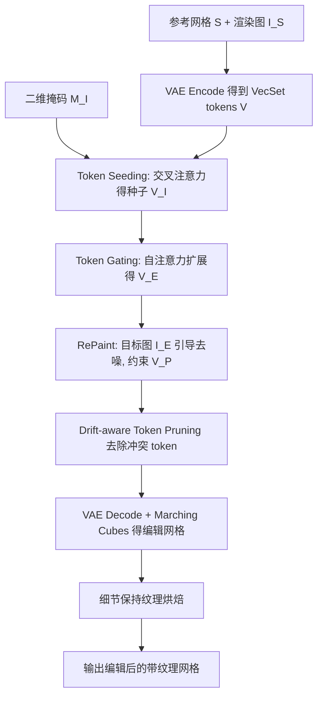

## 一句话总结

VecSet-Edit 是首个免训练的三维网格局部编辑框架，直接在高保真 VecSet 大重建模型（LRM）的潜空间里操作，仅凭一张二维图像和一个二维掩码就能实现精准的局部几何与纹理编辑，同时严格保持未编辑区域的原始结构。

## 研究背景

自动化三维资产生成技术快速发展，但生成的资产往往无法直接满足下游需求，创作者需要对特定部件做局部、可控的修改，而重新生成通常不可靠，容易破坏原有的几何和纹理，因此三维编辑成为把生成结果转化为可用资产的关键环节。

现有编辑方法大多在中间表示上操作，比如三维高斯泼溅（3DGS）或多视图图像，而非直接编辑动画与物理仿真所需的、具有显式拓扑的网格。VoxHammer 借助体素化 LRM 向原生网格编辑迈进了一步，但存在两个实际局限：

- 需要额外的三维掩码标注，人工成本高、难以规模化。
- 体素粒度从根本上限制了分辨率和保真度，不及现代 VecSet 类 LRM。

这些空白呼唤一种网格原生的编辑框架，只需轻量监督，能保持资产身份，并充分利用高保真 VecSet 重建骨干。核心挑战在于定位：VecSet 把几何编码为无序的 token 集合，天真地在 token 空间编辑常常会波及非目标区域。作者的关键观察是，VecSet 的 token 并非空间上任意分布，尽管形式无序，却表现出稳定的局部性，能一致地对应到连贯的表面区域。

## 方法

VecSet-Edit 建立在 TripoSG 这一 VecSet 类 LRM 之上，它由一个负责网格与 token 互映的变分自编码器（VAE）和一个负责条件生成的扩散 Transformer（DiT）组成。DiT 通过整流流（rectified flow）在潜 token 上做条件生成，从噪声出发用欧拉求解器逐步演化：

$$
\boldsymbol{V}_{t-\Delta t} = \boldsymbol{V}_t - u_\theta(\boldsymbol{V}_t, h_I, t)\cdot \Delta t
$$

其中 $u_\theta$ 是预测的速度场，$t$ 为扩散时间。每个 DiT 块在 token 间的自注意力和对图像特征的交叉注意力之间交替，这两类注意力正是本文 token 级分析与操控的基础。

### VecSet 几何属性

作者先形式化了"区域忠实"的 token 子集。给定三维水密包围体 $\boldsymbol{B}$ 和网格 $\boldsymbol{S}$，目标区域定义为二者交集 $\boldsymbol{S}_B$。若从 token 子集 $\boldsymbol{V}_B$ 解码出的几何与 $\boldsymbol{S}_B$ 的 Chamfer 距离（CD）低于容差 $\epsilon$，则称该子集满足几何属性：

$$
\mathrm{CD}(\boldsymbol{S}_B, \mathrm{Decode}(\boldsymbol{V}_B)) < \epsilon
$$

实证检验表明，即便用最朴素的"落在包围盒内的 token"选择，82.3% 的样本重建 CD 就能低于 0.30，说明无序 token 确实携带强空间先验。据此，编辑被重新表述为一个 token 选择问题：把潜 token 划分为可编辑子集 $\boldsymbol{V}_E$ 与保留子集 $\boldsymbol{V}_P$，即 $\boldsymbol{V} = \boldsymbol{V}_E \oplus \boldsymbol{V}_P$。

### Token 选择

- **掩码引导的 Token Seeding**：借鉴文生图编辑中交叉注意力可做零样本语义定位的思路，若一个 token 持续关注掩码内的像素，它很可能负责生成该区域的几何。用交叉注意力对掩码像素累积注意力质量，并通过 KL 散度筛选信息量高的层进行聚合，超过阈值 $\tau_I$ 的 token 构成种子集 $\boldsymbol{V}_I$。
- **注意力对齐的 Token Gating**：利用自注意力捕捉 token 间反映几何邻接的相互作用，从种子集出发按对参考集的注意力得分扩展，得到空间上更连贯的可编辑子集 $\boldsymbol{V}_A$。

### VecSet-Edit 框架

固定保留 token $\boldsymbol{V}_P$ 后，把 RePaint 策略适配到 VecSet token：可编辑 token 在目标图像 $\boldsymbol{I}_E$ 引导下迭代去噪，而保留 token 被约束沿原始扩散轨迹演化。

由于 VecSet token 具有空间可移动性，去噪早期可能出现可编辑 token 漂移进本应不变的区域，造成不可逆的几何重叠。为此引入 **Drift-aware Token Pruning**，在剪枝时刻识别两类互补子集：受目标图像条件支持、应保留的 $\boldsymbol{V}_{cond}$，以及与保留区域结构关联、可能引入几何冗余的 $\boldsymbol{V}_{conflict}$，随后剔除冲突且不受条件支持的 token：

$$
\boldsymbol{V}_E^{(T_{pruning})} \leftarrow \boldsymbol{V}_E^{(T_{pruning})} \setminus (\boldsymbol{V}_{conflict} \setminus \boldsymbol{V}_{cond})
$$

### 细节保持的纹理烘焙

以 MV-Adapter 作为纹理骨干，从源网格渲染六视图法线并结合条件图像合成多视图 RGB，再投影到网格表面优化 UV 纹理。为避免全局烘焙破坏未编辑区的高频细节，作者计算源网格与编辑网格在渲染视图下的法线差异掩码，只在几何发生变化的区域重生成纹理，其余区域保留原始外观。

## 实验结果

作者在 Edit3D-Bench（300 个样本）上评估，每个样本提供源网格、三维包围盒和编辑图像。值得注意的是，与依赖三维包围盒做定位的基线不同，本方法仅在评估时使用包围盒。评估指标涵盖未编辑区域保持质量（CD、PSNR、SSIM、LPIPS、FID）与条件对齐（DINO-I、CLIP-T）。

| Method | Time | CD ↓ | PSNR (M) ↑ | SSIM (M) ↑ | LPIPS (M) ↓ | FID ↓ | DINO-I ↑ | CLIP-T ↑ |
| --- | --- | --- | --- | --- | --- | --- | --- | --- |
| MVEdit | ~160s | 0.188 | 21.90 | 0.91 | 0.13 | 47.05 | 0.81 | 27.03 |
| Instant3DiT | ~20s | 0.124 | 16.76 | 0.81 | 0.28 | 72.13 | 0.71 | 25.71 |
| Trellis | ~600s | 0.014 | 29.22 | 0.97 | 0.04 | 33.09 | 0.91 | 27.87 |
| VoxHammer | ~600s | 0.018 | 27.05 | 0.95 | 0.05 | 31.13 | 0.90 | 28.08 |
| Ours | ~200s | **0.011** | **29.63** | 0.97 | 0.04 | 32.63 | **0.92** | 27.75 |
| TripoSG (VAE 编解码上界) | ~100s | 0.006 | 31.88 | 0.98 | 0.02 | 16.21 | - | - |

本方法取得最低的 Chamfer 距离，比此前最优低约 21%，并在 PSNR、SSIM、LPIPS 等图像指标上领先，说明它有效维持了未编辑区域的结构完整与视觉保真。相比 Trellis 和 VoxHammer 还有约 2 倍的墙钟加速。DINO-I 明显领先，反映几何忠实捕捉了输入图像的结构细节；CLIP-T 略低，源于设计上优先严格的图像对齐而非宽泛的文本对应。

消融实验显示，Token Seeding 与 Token Gating 的引入显著提升定位与保持指标，Token Pruning 进一步降低几何误差，Detail-Preserving Texture Baking 作为最后一步在未编辑区保持上带来关键增益。此外 12 位三维从业者的用户研究中，本方法在区域保持（59.17%）和条件对齐（58.33%）两项上都获得压倒性偏好。

## 亮点与局限

亮点：

- 首个直接在 VecSet 潜空间做局部网格编辑的免训练框架，绕开体素类 LRM 的分辨率瓶颈。
- 揭示并形式化了 VecSet 无序 token 的空间局部性（几何属性），把编辑巧妙转化为 token 选择问题。
- 仅需二维掩码即可完成定位，无需人工三维掩码标注，且保留区域的几何与纹理保持出色。
- Drift-aware Token Pruning 针对 VecSet token 可移动这一独有难题，抑制了不可逆的几何干扰。

局限：

- 在更严格的容差下（如 $\epsilon = 0.01$），朴素 token 选择的区域忠实度仍然有限，token 选择仍有提升空间。
- CLIP-T 文本语义对齐略逊于部分基线，反映方法偏向图像对齐而非文本引导。
- 依赖预训练 VecSet 骨干（TripoSG）的重建质量，其上界约束了整体保持性能。

## 延伸思考

本文最有启发的一点是把"无序潜表示"重新诠释为"隐含空间局部性"的可编辑结构。这提示：许多号称无序或置换不变的 token 表示，可能仍在训练中习得了稳定的空间语义，值得系统性地探测其可解释与可操控性。将交叉注意力用于二维到三维 token 的语义定位、用自注意力作几何连通性代理的做法，也可能迁移到其他基于集合的生成骨干上。另一个方向是把"漂移剪枝"这一思想推广到更一般的流式或粒子式扩散过程中，作为约束局部编辑不外溢的通用机制。
