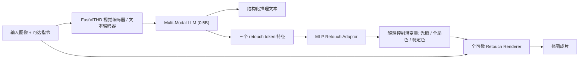

## 一句话总结

VeraRetouch 用一个仅 0.5B 的视觉语言模型作"大脑"分析图像与指令、生成修图推理与解耦控制潜变量，再驱动一个全可微的 Retouch Renderer 直接渲染出成片，摆脱了对 LightRoom 等不可微外部软件的依赖，实现了可端到端像素级训练、支持三种任务、且能上手机部署的轻量推理修图框架。

## 研究背景

- 领域现状：自动修图从早期的强化学习/监督学习（在 FiveK、PPR10K 等小数据集上学专家风格）发展到扩散模型图像编辑，再到近期用多模态大模型（MonetGPT、PhotoArtAgent、JarvisArt）结合专业修图软件做"带推理的修图"——先分析缺陷、给出理由、再执行调整。
- 核心痛点：现有推理修图方法普遍依赖不可微的外部工具（LightRoom、Photoshop），这在训练时形成一道"优化墙"，无法做像素级端到端反向传播，损害精度与泛化；同时它们参数冗余大、模型笨重、推理慢，还难以在一个框架里同时兼顾自动修图与指令修图，且训练数据规模小限制了泛化。
- 本文 idea：把不可微工具换成一个自研的全可微渲染器，让梯度能从像素一路回传到 VLM；用轻量 0.5B VLM 做推理中枢；再造一个百万级多任务数据集补齐数据短板。

## 方法

整体框架分两条主线。先离线训练一对"Retouch Encoder + Retouch Renderer"作为可微的修图基元，它既充当训练时替代外部软件的可微渲染桥梁，又是构造大规模数据集的工具；然后在此之上搭建 VeraRetouch 主框架：一个紧凑 VLM 读入图像与可选指令，自回归生成结构化推理文本和三个解耦的修图潜变量，潜变量经渲染器落成最终成片。训练分三阶段：域对齐预训练、推理监督微调（RSFT）、以及强化学习后训练 DAPO-AE。

关键设计：

- 解耦的 Retouch Encoder 与 Retouch Renderer。Encoder 基于 ResNet，从"参考输入图-参考目标图"这对图像里抽出三个解耦控制潜变量，分别对应光照（曝光、阴影）、全局色（色温、色调）、特定色（如红色亮度）三个维度；训练时用二值掩码选择性激活各潜变量以强制解耦。Renderer 是一个轻量纯 MLP 的逐像素颜色映射，把拼接后的潜变量加性注入隐层，从输入图合成输出图。与扩散式生成器不同，它只改颜色和影调、严格保留结构和高频细节，且天然可微。

- AetherRetouch-1M+ 数据集。首个百万级专业修图数据集，覆盖三类真实需求。Auto-Retouch 用"逆向退化"策略：从高质量图出发，用直方图检索到最相似的专家修图对做参考，通过 Encoder-Renderer 反推专家修图逻辑，生成保留内容结构但带真实瑕疵的"未修图"版本。Style-Retouch 收集 5030 个在线预设（11 大类 193 子类），用 Qwen2.5-VL 给图像分类匹配预设、经 LightRoom API 施加，再用 Qwen3-VL 做语义扰动扩充指令多样性。Param-Retouch 把参数分为光照/全局色/特定色三组，高斯随机采样组合后经 LightRoom 渲染。推理链由 Qwen3-VL 按"内容要素 → 三视角逐点问题分析 → 逐点修图计划"的层级结构生成。

- 三阶段训练。域对齐预训练：LLM 生成的 retouch token 与预训练控制潜变量存在明显分布错配，直接喂进渲染器会严重掉质量，于是加一个三层瓶颈 MLP 的 Retouch Adaptor 做特征空间转换，冻结视觉编码器、用 Param 数据训练对齐，损失是 token 的交叉熵加图像重建的 L1，写作

$$L_{total} = \alpha \cdot L_{CE}^{text} + L_{1}^{img}$$

  RSFT 阶段冻结其他模块只训 LLM，在三任务上等比例随机采样，让模型输出结构化格式、学会推理与控制潜变量之间的因果关系、并获得像素级精修能力。DAPO-AE 后训练借解耦裁剪与动态采样的策略优化，用三个简单奖励——格式奖励、图像相似度奖励、以及只在 Auto-Retouch 激活的美学奖励——按任务定制奖励配置，进一步提升自主美学感知。

## 实验结果

在 FiveK-Bench 的 Auto-Retouch 任务上，VeraRetouch（DAPO-AE 版）在保真度与直方图一致性、感知质量多项指标上取得最优或次优，PSNR 达 26.85 dB，比扩散基线 Flux.1 Kontext 高约 1.08 dB，同时模型体量远小于对手。

| 方法 | 参数量↓ | PSNR↑ | SSIM↑ | LPIPS↓ | 单图耗时↓ |
|------|--------|-------|-------|--------|----------|
| Flux.1 Kontext | 16.87B | 25.77 | 0.896 | 0.079 | 16.78s |
| Qwen-Image-2509 | 28.85B | 17.81 | 0.572 | 0.193 | 48.77s |
| MonetGPT | 8.29B | 22.91 | 0.914 | 0.064 | 44.33s |
| JarvisArt | 8.29B | 21.52 | 0.865 | 0.149 | 14.31s |
| VeraRetouch (SFT) | 0.63B | 26.04 | 0.936 | 0.053 | — |
| VeraRetouch (DAPO-AE) | 0.63B | 26.85 | 0.939 | 0.049 | 6.90s |

效率上，0.63B 的模型单图仅需约 6.9s（H20 GPU、512p），相比 Flux.1 Kontext 约 16.8s、JarvisArt 约 14.3s 有约 2.5 倍加速；在 MacBook Air（M4）和 iPhone 16 Pro 上分别约 7.4s 与 13.5s，验证了消费级硬件与移动端部署能力。在 Aether-Bench 的 Style 与 Param 子任务上也全面领先，Param 任务 PSNR 高达约 30 dB。消融显示：潜变量预测显著优于直接预测离散 LightRoom 参数（PSNR 24.11 对 18.07），得益于可微渲染带来的直接梯度回传；数据规模从 5% 增到 100% 指标稳步上升；38 人用户研究中 VeraRetouch 在美学、指令契合、纹理一致性三项均得分最高，DAPO-AE 版偏好率约 61.6%。

## 亮点与局限

- 亮点：
  - 首个完全不依赖外部修图软件、全可微的多任务推理修图框架，打通了从像素到 VLM 的端到端梯度。
  - 极致轻量，0.5B VLM 却在质量与效率上超越数十亿参数的扩散/agent 方法，真正能上手机。
  - 三维解耦控制潜变量 + 纯 MLP 渲染器，既可控又严格保结构、护高频细节，避免了扩散生成常见的内容改动。
  - 用 Encoder-Renderer 逆向退化合成数据，低成本造出首个百万级专业修图多任务数据集。

- 局限：
  - 渲染器只做颜色与影调的逐像素映射，本质上无法处理需要局部结构编辑或内容生成的修图需求（如去物、换背景）。
  - 数据合成大量依赖 LightRoom 预设与参数、以及 Qwen 系列模型生成的推理链与指令，可能把这些工具/模型自身的风格偏好与偏差带入训练分布。
  - DAPO-AE 的定量增益较小，主要靠用户研究与困难样本的定性改善来佐证，美学奖励的收益难以被标准指标充分捕捉。

## 延伸思考

VeraRetouch 走的是"VLM 做规划 + 可微参数化渲染器做执行"的路线，和把修图当成图像生成的扩散式编辑（Flux.1 Kontext、Qwen-Image）形成鲜明对比——后者强在语义级大改，前者强在保真、可控、可解释与轻量。这种"解耦控制潜变量 + 可微渲染基元"的思路值得推广到其他需要精细可控又要保结构的任务，比如可微的调色/白平衡、甚至局部区域的可微调整。一个自然的追问是：三维（光照/全局色/特定色）的解耦是否够用，能否扩展出空间局部潜变量以支持带蒙版的局部修图；以及逆向退化合成的数据分布与真实"未修图"照片之间是否存在系统性差距，会不会限制在极端场景下的泛化。
