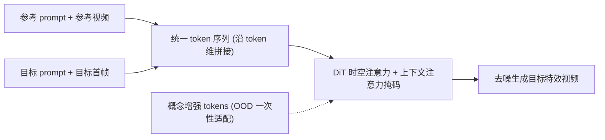

## 一句话总结

VFXMaster 把视觉特效（VFX）生成重塑为"看着参考视频照做"的上下文学习任务，用单一统一模型就能把一段参考特效的动态与变换迁移到用户给定的目标图像上，并对训练集之外的全新特效展现出很强的泛化能力。

## 研究背景

- 领域现状：视频生成模型（DiT、CogVideoX、Hunyuan-DiT 等）日趋成熟，可控视频生成也在编辑与内容创作上得到关注。但真正针对"电影级动态特效"的可控生成仍很少被研究，主要卡在 VFX 数据稀缺、变换过程复杂。
- 核心痛点：VFX 常含反物理、超现实、反直觉的元素（能量束的粒子动态、魔法元素的绚丽纹理），属于预训练模型知识范围之外的分布外内容，光靠详细文本 prompt 很难精准生成；而现有可控方法依赖关键点、深度图、边缘草图等空间对齐条件，无法刻画特效那种非结构化的动态与纹理。更关键的是主流做法走"一个特效训一个 LoRA"的范式，既费资源，又是封闭集训练，天然无法泛化到没见过的特效类别。
- 本文 idea：作者观察到同一种 VFX 的不同视频只是主体和背景不同，动态与变换过程是相似的。于是把"同种特效的两段视频"看作一组参考-目标数据对，做上下文学习——让模型去学"如何模仿特效"这件通用能力，而不是死记某个具体特效，从而用单一框架统一众多特效并向未知特效泛化。

## 方法

整体框架：以 CogVideoX-5B-I2V 为底座（3D VAE + DiT + T5 文本编码器）。训练时随机取同一特效类别的两组"prompt-视频"对，一组作参考、一组作目标；两者共享同一个 3D VAE 与文本编码器落到同一潜空间后，沿 token 维度拼成一条统一序列送入 DiT，只微调时空注意力层就让模型学会参考到目标的特效模仿，不额外引入可训练模块。扩散损失只在目标视频上计算。

关键设计：

1. **上下文条件化（In-Context Conditioning）**：定义新的输入-输出格式——"示例：参考 prompt → 参考视频；查询：目标 prompt 和目标图像 → ？"，促使网络去模仿参考对之间的复杂关系并在目标图像上复现。对目标与参考视频施加相同的 3D 旋转位置编码（RoPE），显式引导模型感知二者的相对时空关系。因为参考与目标同处一个潜空间，直接拼接成统一 token 序列，只需微调时空注意力即可完成特效迁移，无需为每个特效单独训练 LoRA。

2. **上下文注意力掩码（In-Context Attention Mask）**：无约束地拼接 token 会导致信息泄漏——目标视频可能生成参考 prompt 里提到但与特效无关的主体或背景。为此设计注意力掩码来管理信息流：目标 prompt 作为 query 时可关注所有上下文，与特效相关、语义相似的部分被放大、无关信息被抑制；参考的 prompt-视频对只彼此互相关注以提供充分的特效表征；目标视频 token 只能关注自身对应的 prompt 与参考视频 token。这样视觉信息从"干净"的参考流向"带噪"的目标，随网络加深逐步精修目标表征，在单次前向中实现高保真特效生成而不泄漏内容。

3. **高效一次性特效适配（Efficient One-shot Effect Adaptation）**：针对更难的分布外（OOD）特效，冻结底座模型，引入一小组可学习的"概念增强 tokens"（$$z_{ce}$$），拼进统一 token 序列。为防止在单个样本上过拟合，训练时用随机裁剪、翻转、错切、锐化等标准数据增强。注意力掩码进一步约束信息流：概念增强 token 可关注所有上下文以细粒度学习特效，而只有目标文本与视频 token 能反向关注这些 token。训练后，$$z_{ce}$$ 就成了这个新特效的精确语义代理。推理时，域内特效只需加载微调过的时空注意力层；OOD 特效则额外加载对应的概念增强 token 获得更好的泛化质量。

数据与训练：训练数据来自开源 Open-VFX、Higgsfield/PixVerse 等商业平台及其他网络资源，共约 1 万条样本、200 个特效类别（含角色变换、环境转场、艺术风格变化）。采用多分辨率训练，每段视频均匀采样到 49 帧、8 fps；用 Adam、学习率 1e-4，仅更新 DiT 里的 3D 全注意力层，在 NVIDIA A800 上训练 4 万步。概念增强 token $$z_{ce} \in \mathbb{R}^{1 \times 226 \times c}$$、零初始化，默认 $$c = 3072$$。

## 实验结果

在 OpenVFX 测试集的 15 个域内特效类别上，与两个 SOTA 特效生成方法及在同数据上微调的基线 CogVideoX* 对比（下表为全部特效上的平均分）。VFXMaster 在 FVD、Dynamic Degree 和自提出的综合指标 VFX-Cons. 上均领先。VFX-Cons. 借助视觉语言模型从三个角度打分：特效发生分（EOS）、特效保真分（EFS）、内容泄漏分（CLS）。

| 方法 | FVD↓ | Dynamic Degree↑ | VFX-Cons.↑ |
|------|------|------|------|
| CogVideoX* | 2010 | 0.65 | 0.75 |
| VFX Creator | 1856 | 0.67 | 0.83 |
| Omini-Effects | 1679 | 0.71 | 0.85 |
| Ours | 1369 | 0.80 | 0.91 |

其余实验以文字概述：在专门构建的 OOD 测试集上，仅用上下文条件化就已具备一定泛化能力；再叠加一次性适配后各项指标显著提升——EFS 从 0.47 升到 0.70、CLS 从 0.79 升到 0.87。消融显示上下文注意力掩码至关重要：去掉后 EFS 骤降到 0.11、CLS 从 0.79 跌到 0.24，内容严重泄漏；去掉参考 prompt 则各指标一致下滑，说明文本作为"高层概念锚点"提供了关键辅助。数据规模实验（2k/4k/6k/10k）显示性能随数据量单调提升，尤其是 OOD 泛化，印证框架的可扩展性。50 人的 2AFC 用户研究中，VFXMaster 在特效一致性（42%）与美学质量（32%）上的偏好率均高于对比方法。

## 亮点与局限

- 亮点：
  - 首个统一的、基于参考的 VFX 视频生成框架，用一个模型取代"一特效一 LoRA"，从根本上解决可扩展性瓶颈，并能泛化到未见过的特效类别。
  - 上下文注意力掩码巧妙地把"特效属性"与"无关内容"解耦，在单次前向内完成高保真迁移、有效抑制内容泄漏（消融数据佐证其必要性）。
  - 一次性适配用少量概念增强 token、低成本微调就能快速吃下一个全新的 OOD 特效，兼顾泛化与效率。
  - 承诺开源代码、模型、数据集与专门的 OOD 评测指标（VFX-Cons.），对后续研究友好。

- 局限：
  - 依赖同种特效的成对参考视频构造训练数据，特效数据本身稀缺，数据规模实验也表明性能对数据量敏感。
  - VFX-Cons. 依赖 VLM 打分，评测本身带有模型主观性；用户研究规模（50 人）有限。
  - 论文正文未系统讨论失败案例与推理成本，OOD 上仍需一次性适配才能达到较好保真度，纯零样本泛化能力有上限。

## 延伸思考

- 把特效生成当作"上下文学习/模仿"而非"记忆具体类别"，与图像扩散里的视觉上下文学习（如 in-context 编辑、参考驱动生成）一脉相承，思路可迁移到运动迁移、风格迁移等其他"参考驱动"的视频任务。
- 概念增强 token 类似文本反演（textual inversion）/软提示的思路，用极少参数抓住一个新概念；值得追问的是：这些 token 能否组合、叠加多个特效，或在不同底座间迁移复用。
- 与 StyleMaster、FlexiAct、VACE 等统一可控视频生成工作相比，VFXMaster 专注"动态特效"这一难点子域；未来若能与轨迹/相机/深度等空间条件结合，或可实现"特效 + 精确空间可控"的更完整创作工具。
