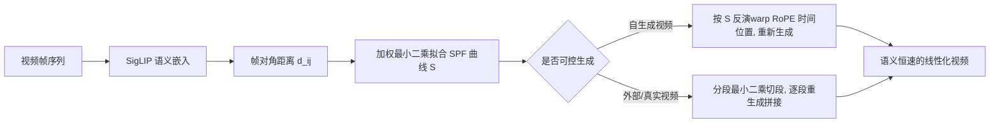

## 一句话总结

论文提出"语义进度函数"（Semantic Progress Function, SPF）——一条刻画视频序列中"含义随时间累积变化"的一维曲线，并据此对生成或真实视频做"语义线性化"重定时，使转变以恒定语义速度平滑展开，消除突兀跳变。

## 研究背景

- 领域现状：图像/视频生成模型（尤其是首末帧条件的视频扩散模型）已能在两个端点之间"脑补"出中间过渡，被广泛用于影视特效、镜头转场、循环视频与产品揭示。此前工作大多关注时间上的平滑性或隐空间插值。
- 核心痛点：这些生成序列的语义演化往往高度非线性——很长一段几乎不变，然后突然发生剧烈的语义跳变（比如一只珠子突然变成蜜蜂）。既有方法没有一个原则化的度量来刻画"语义变化的速率"、定位突变发生的位置，也无法跨模型比较序列的语义节奏。
- 本文 idea：先用一个可解释、与模型无关的一维函数 SPF 把复杂的视觉变换"压缩"成语义累积轨迹，让语义节奏变得可测量；再利用它反过来重参数化时间轴，把不均匀的语义变化"拉直"为恒定速率。

## 方法

整体分两步：先构造 SPF 作为诊断工具（度量语义如何随帧演化），再基于 SPF 做重定时干预（ReTime），既能作用于自己生成的视频，也能作用于外部/真实视频。

关键设计：

- **语义距离与 SPF 拟合**：每帧用 SigLIP 编码成嵌入向量，两帧之间用角度度量（归一化后 $$d_{ij}=\arccos(z_i^\top z_j)$$）衡量语义差异；只对时间间隔 $$\lvert i-j \rvert \le 30$$ 的帧对计算以强调局部结构。SPF 是一个向量 $$S \in \mathbb{R}^T$$，要求其差分近似语义距离 $$S_i - S_j \approx d_{ij}$$。把所有帧对约束写成线性系统 $$AS \approx b$$，再用带高斯时间权重、带正则的加权最小二乘求解，得到闭式解 $$\hat{S}=(A^\top W A + \lambda I)^{-1}A^\top W b$$。SPF 的斜率即"瞬时语义变化速率"，其偏离直线的程度直接暴露节奏不均。
- **自生成视频的重定时（RoPE 时间位置扭曲）**：把 SPF 归一化到 $$[0,1]$$，理想情况下第 $$k$$ 帧应达到进度 $$k/(T-1)$$，于是通过反函数 $$\tau_k = S^{-1}(k/(T-1))$$ 求出扭曲后的时间位置——在语义变化剧烈处拉伸时间、在稳定处压缩时间。把这些扭曲位置替换进视频扩散 Transformer（如 Wan）的旋转位置编码（RoPE）里，让模型"感知"到非均匀的时间间隔。整个过程在推理时完成，无需重训练或后处理插值。
- **频率感知 + 时间步调制**：RoPE 用多个频段表示位置，低频管长程结构、高频管短程动态。若所有频段统一扭曲会导致高频抖动、低频扭曲不足又纠不动全局节奏。作者让扭曲强度 $$\alpha_b$$ 随频段从低到高指数衰减（低频强扭、高频近似线性）；同时按扩散去噪时间步用指数调度 $$\gamma$$ 让早期（高噪声、塑结构阶段）扭曲更强。再配合三次迭代精化，逐步逼近线性语义进度。
- **外部/真实视频的重定时（分段重生成）**：对无法控制生成过程的视频，用分段最小二乘把 SPF 切成若干近似线性的连续段，每段首末帧作为语义关键帧，用 Wan2.2（首末帧条件）或 LTX-2（关键帧序列条件）重新生成中间片段，段长按该段语义变化量 $$T_k = \mathrm{round}(T \cdot \Delta S_k)$$ 分配，最后拼接。这套范式适配几乎所有支持关键帧/首末帧条件的开源或闭源模型。

## 实验结果

论文以 VBench 质量指标验证"重定时不损害视觉保真度"作为主实验：在每个模型各 128 条重定时视频上评测，重定时前后各项指标基本一致（均在一个标准差内）。

| 模型 | 类型 | 美学质量↑ | 运动平滑度↑ | 时间闪烁↑ |
|------|------|-----------|-------------|-----------|
| Wan2.2 | 原始 | 0.630 | 0.987 | 0.978 |
| Wan2.2 | 重定时 | 0.626 | 0.987 | 0.978 |
| LTX-2 | 原始 | 0.660 | 0.994 | 0.990 |
| LTX-2 | 重定时 | 0.656 | 0.993 | 0.990 |

其余实验以文字补充：合成验证用旋转 Spot 在恒定/上升/下降三种角速度下生成视频，SPF 曲线紧贴真实角位置，证明它确实捕捉语义节奏而非像素运动；消融显示像素级 L2 度量无法捕捉语义跳变，SigLIP 的细粒度敏感度最佳（能检测到人物"发怒"的起点）；重定时策略对比中，像素线性插值会产生重影、依赖外部模型做关键帧插值会受限于该模型质量，而本文直接作用于底层模型特征、质量更连贯；主观用户研究中 88% 偏好本文改善后的语义节奏；作者还提出基于 SPF 的线性度评分来量化节奏。

## 亮点与局限

- 亮点：
  - 用一维、可解释、与模型无关的 SPF 把"语义节奏"这一模糊概念变成可测量、可比较、可干预的量。
  - 重定时在推理时完成，无需重训练或人工标注；频率感知扭曲与时间步调制的设计细致，兼顾全局节奏与局部平滑。
  - 框架通用：既能改自生成视频，也能改真实/闭源模型产出的视频；对 LTX-2 的音视频模型还能保持音画同步。
- 局限：
  - SPF 依赖帧级嵌入，剧烈相机运动、强光照变化或大幅非语义外观变化会污染嵌入空间，使曲线部分反映感知变化而非纯语义演化。
  - 迭代精化会逐步把时间嵌入推离训练分布，迭代过多会损害输出质量。

## 延伸思考

方法把 RoPE 时间位置当作可编辑的"节奏旋钮"，这与近期一批基于 RoPE 调制做运动迁移/长视频外推的工作（RoPECraft、RIFLEx、LoViC 等）思路相通，但本文独特之处在于扭曲量由实测语义内容驱动、且带分频段控制。作者提出的下游想象也颇具价值：语义节奏分析可用于生成模型的时间行为基准、关键帧式视频摘要、语义缩略图；而"线性化的均匀语义轨迹"天然是训练"编辑强度可控模型"的数据来源。值得追问的是，纯依赖 2D 图像嵌入的距离在强动态场景下如何与运动解耦——引入运动感知或时序 grounding 的嵌入，可能是让 SPF 更鲁棒的关键一步。
