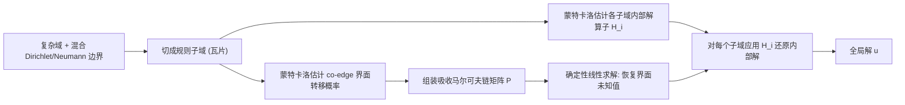

## 一句话总结

把复杂几何域切成规则小块，用蒙特卡洛（Walk on Stars）在每个小块上估计"边界值→内部解"的局部解算子，再用一个确定性稀疏线性系统把这些小块沿界面耦合起来求解，从而在复杂/可变几何上又快又稳地求解椭圆型 PDE——比纯蒙特卡洛低方差、比网格法免网格划分。

## 研究背景

- 领域现状：椭圆型边值问题（热传导、静电、势流、路径规划等）在图形与工程中无处不在。求解上有两条主流路线：一是网格法（FEM/FDM），全局耦合、解稳定，但要精细刻画复杂边界需要昂贵的体网格划分或极端加密；二是无网格蒙特卡洛法（Walk on Spheres / Walk on Stars），天然适配任意几何、高度并行、无偏，近年在图形社区流行。
- 核心痛点：蒙特卡洛法用"无偏"换来了"高方差"。它是逐点、迭代、彼此不相关的估计器，收敛慢（误差按 $$O(S_{pp}^{-1/2})$$ 下降）；在 Neumann（反射）边界占主导的场景里，随机游走会变得极长、方差爆炸，导致解充满噪声、无法可靠地做流线提取等下游任务。而网格法在粗离散下又有很大偏差，想降误差就得堆自由度、反复重划网格。
- 本文 idea：作者观察到蒙特卡洛的慢收敛源于"逐点不相关估计"而非缺乏全局耦合。于是提出把域分解成简单规则的子域（如正方形瓦片）：在每个小子域上蒙特卡洛游走很短、方差天然受控，用它估计局部解算子；子域界面上的未知值则被重新解释为"在界面之间游走"的随机过程，离散化后化为一个吸收马尔可夫链，用一次确定性线性求解精确替代模拟这些离散游走。随机的部分只做局部算子估计，全局耦合完全确定、不引入额外方差。

## 方法

整体框架：方法分两个阶段。先是"随机估计"——把域切成非重叠子域，在每个子域上用蒙特卡洛估计内部解算子 $$\boldsymbol{H}_i$$（边界值到内部值的映射，即离散化的 Poisson 核）；同时在覆盖界面的重叠"co-edge"子域上估计界面之间的转移概率。再是"确定性求解"——这些转移概率组装成一个吸收马尔可夫链的稀疏矩阵，通过解一次线性系统直接得到所有界面未知值，最后对每个子域套用其内部算子还原全部内部解。

关键设计：

1. 用蒙特卡洛"制表"局部解算子（Poisson 核）。对一个固定内部点 $$x$$，Poisson 核 $$P_\Omega(x, \cdot)$$ 恰好是 WoS/WoSt 轨迹首次抵达 Dirichlet 边界的首达分布，于是 $$u(x) = \mathbb{E}[g(Z)]$$，其中 $$Z$$ 是首达点。把边界离散成若干带配点的面板 $$\Gamma_j$$，从内部配点发射 $$S$$ 条游走、统计落到各面板的频率，就得到局部解算子矩阵 $$\boldsymbol{H}$$ 的一行。这个矩阵有双重解释：按列看是"单位边界数据的谐波延拓"（解算子），按行看是行随机的首次退出概率分布——每行非负、约和为 1。行视角正是接入马尔可夫链的关键。制表一次之后，任意新边界数据都只需一次矩阵-向量乘即可求内部解，无需重跑游走。

2. 用吸收马尔可夫链做确定性全局耦合。界面值本身是全局未知量。作者把"在界面之间游走"离散成吸收马尔可夫链：转移矩阵写成分块形式，转移矩阵中瞬态-瞬态块为 $$\boldsymbol{Q}$$、瞬态-吸收块为 $$\boldsymbol{R}$$。关键恒等式是界面值满足 $$(\boldsymbol{I} - \boldsymbol{Q})\,\boldsymbol{u}_T = \boldsymbol{R}\,\boldsymbol{g}$$，即用一次线性求解精确替代"模拟无穷多条离散随机游走"。这一步完全确定、零额外方差，把几何复杂度都吸收进了预估的转移统计里。随机游走 Laplacian $$\boldsymbol{L} = \boldsymbol{I} - \boldsymbol{P}$$ 在一维退化情形下正好等于经典的有限差分 Laplacian，说明这套离散与网格法一脉相承。

3. co-edge 覆盖：如何给界面定义"内部"。由于非重叠分解里界面本身是边界、无法当内部点做首达统计，作者额外引入一个重叠覆盖——每条界面边 $$e$$ 由相邻两个子域的并 $$\tilde{\Omega}_e = \Omega_{i(e)} \cup \Omega_{j(e)}$$ 构成一个 co-edge 子域，使 $$e$$ 落在其内部，边界则由邻近界面段组成。在每个 co-edge 上复用同一套蒙特卡洛制表流程，就得到界面到邻近界面的转移概率，散布进全局矩阵 $$\boldsymbol{P}$$。这一设计保证了转移的局部性与矩阵稀疏性（连接结构酷似有限差分矩阵）。

4. 规则瓦片分解与 $$T\times B$$ 权衡旋钮。实践中用 $$T\times T$$ 的正方形瓦片，每片每轴用 $$B$$ 个配点，有效分辨率 $$N = T\times B$$。这暴露出一个可调权衡：$$B$$ 小、$$T$$ 大时行为像网格法——全局系统大（$$O(N^2)$$ 自由度）、蒙特卡洛开销低；$$T$$ 小、$$B$$ 大时退化为纯蒙特卡洛——系统小甚至没有、但蒙特卡洛开销高。增大 $$B$$ 把自由度从内部移到界面，全局系统规模降到 $$O(N^2/B)$$，代价是每个局部算子需要更多样本。由于局部子域问题彼此独立、天然并行，且只有靠近几何的 $$O(T)$$ 个算子需要估计（空瓦片可预计算复用），方法能用"并行的算子估计"去摊薄"串行的全局求解"。

## 实验结果

主实验取 Neumann 主导的迷宫场景（等样本数下与 Walk on Stars 对比），最能体现"分解缩短游走、降方差"的核心卖点：

| 方法 | 平均游走步数 $$W$$ | RMSE | 说明 |
|------|------|------|------|
| Walk on Stars (N=256) | 734 | 0.012 | 长反射游走、方差高 |
| 本文 (T=64, B=4) | 17 | 0.0038 | 等样本数，游走缩短约 43× |

在等样本预算下，域分解让平均游走步数下降约 43 倍，误差降到约 1/3；确定性全局求解不引入额外方差、只带来受控偏差。收敛性方面：固定小 $$B$$ 时方法以 $$O(1/T)$$ 收敛，与一阶有限差分一致；按有效分辨率 $$N=T\times B$$ 重绘时，不论 $$B$$ 取值，均以 $$O(1/N)$$ 收敛，且因算子"几何感知"整体误差比有限差分有一个有利的下移。在大规模周期微结构（如热交换器、哑铃单元）上，FEM 因需高质量网格在 16 瓦片以上就内存耗尽，WoSt 因超长游走 16 瓦片已需 4 小时以上，均质化虽快但抹掉了子瓦片几何细节；本文对单个瓦片预计算一次算子（约 3 秒）后在大晶格上复用，在线成本主要是线性求解，兼顾效率与子瓦片精度。首图仓库热流案例中，本文 9.7 秒完成、RMSE 0.008，而 WoSt 需上万秒、误差 0.036。

## 亮点与局限

- 亮点：
  - 提出"缓存解算子而非缓存解"的新范式——一旦制表，任意新边界数据只需一次矩阵乘，且几何局部修改时只需重算受影响的少数瓦片，天然支持迭代设计与时变几何的高效再求解。
  - 优雅统一了三套视角：连续蒙特卡洛首达分布、离散吸收马尔可夫链、网格法的随机游走 Laplacian，把"随机估计"与"确定性求解"清晰解耦。
  - 明确暴露 $$T$$/$$B$$ 权衡旋钮，可在"网格法端"与"纯蒙特卡洛端"之间连续调节，把并行预计算与串行全局求解的成本分配显式化、可调。
  - 在 Neumann 主导、复杂/周期几何上相对 WoSt、FEM、均质化均展现出实用优势，实现基于 Dr.Jit + fcpw 的 GPU 并行。

- 局限：
  - 目前仅处理二维、且限于零 Neumann 条件与无源项（$$f=0, h=0$$）；扩展到三维、一般边界条件与源项留待未来工作。
  - 局部算子采用逐点配点制表，内部算子存储按 $$O(B^3)$$ 增长，且高 $$B$$ 的高维算子更难用蒙特卡洛精确估计，样本需求上升；用光滑函数基表示算子可能更省，但复杂几何+混合边界会让 Poisson 核出现尖锐变化，难以套用标准光滑基。
  - 有障碍物的一般情形下，co-edge 转移在不同重叠覆盖上估计导致正/反向转移不互易，全局系统非对称、非自伴，缺乏对称正定结构；仅在无障碍时可利用可逆性。
  - 论文只给出经验收敛，未提供形式化收敛保证。

## 延伸思考

- 这项工作把渲染里"预计算并压缩传输算子"（如聚合散射算子、通量传递矩阵的"蒙特卡洛矩阵求逆"）的思想迁移到了椭圆 PDE，值得关注它与神经算子（learning operator between function spaces）路线的对照：本文强调跨大量子域的可组合性与几何灵活性，而非在固定域上学一个映射。
- "缓存解算子"的可复用性对反问题/逆向设计特别有吸引力——微结构与超材料设计中，几何参数微调即可诱导宏观行为大变，若能把 $$T$$/$$B$$ 权衡与可微渲染式的梯度结合，或可支撑高效的可微 PDE 逆向设计。
- 自适应分解（远离几何处用大子域）、更一般的子域单元、以及三维推广，都是自然的下一步；三维的算法挑战与网格法同源，但仍可保留蒙特卡洛的几何灵活性。
- 非对称随机游走 Laplacian 与离散微分几何里"好 Laplacian"判据（局部性、正权、对称正定、收敛性）的张力，是一个有趣的理论追问点：能否设计出既几何感知又对称正定的界面耦合。
