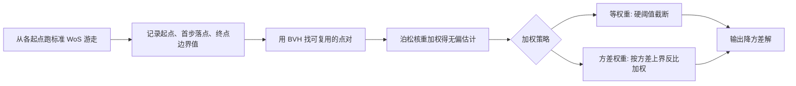

## 一句话总结

本文为求解拉普拉斯方程的 Walk on Spheres（球面游走，WoS）蒙特卡洛算法提出了一种带解析误差保证的"信息复用"方差缩减方法：利用布朗运动路径的连续性，把从邻近点出发的游走结果通过一个固定大小的缓存共享给当前点，从而在几乎不增加运行时间的前提下把估计方差降低若干数量级。

## 研究背景

- 领域现状：拉普拉斯方程等椭圆型 PDE 广泛出现在热传导、流体、静电等稳态问题里。求解方法分为有网格（有限差分/有限元/有限体积）与无网格两类。WoS 是一种无网格蒙特卡洛方法，从关注点出发做布朗运动随机游走直到触及边界，靠边界值的期望来估计解，既不需要离散化整个区域，也能只在关心的局部子域上求解。
- 核心痛点：传统 WoS 的估计是"逐点独立"的，每个点自己跑一批游走、彼此不共享信息，导致解呈现明显的椒盐噪声。降方差最直接的办法是加大游走数 $$n$$，但代价高昂。此前也有工作尝试复用其它点的游走，但要么要求起点必须随机采样、无法自由选择缓存点，要么没有对复用后估计方差给出理论上界（存在复用后方差反而变大的风险）。
- 本文 idea：既然布朗运动的路径几乎必然连续，那么被同一个"完全含于区域内的球"包住的两个点，它们的路径都必须先离开这个球才能到达边界，其出口分布彼此绝对连续。于是可以把从某点出发的游走当作"重要性采样"过的样本，用泊松核重新加权后，得到另一点解的无偏估计——即在邻近点之间"传递信息"，让每个点用上更多样本。

## 方法

整体框架：方法完全作为原始 WoS 的后处理运行。先照常从若干起点各跑 $$n$$ 条游走并记录关键数据；再对每一对满足"距离条件"的点，用泊松核把一个点的游走重新加权成对另一个点的无偏估计，把这些估计按某种权重线性组合，得到降方差后的最终解。关键在于给出一个"多近才能安全复用"的距离阈值，保证复用后的方差不会劣化。

关键设计：

1. 泊松核重加权（信息复用估计量）。对于含于区域内、半径为 $$r$$、圆心为 $$c$$ 的球 $$\partial B(c,r)$$，球内任意点 $$x$$ 的解都可由从 $$c$$ 出发的游走经测度变换算出。核心公式是把从起点 $$x_i$$ 出发、首步落在 $$W_{\tau_B}$$、终止于边界值 $$f(W_\tau)$$ 的一条游走，重加权为对 $$x$$ 的无偏估计 $$\hat{u}_{x_i}(x) = k_{x_i}(x, W_{\tau_B}) f(W_\tau)$$。这里之所以只需重加权首步、后续步骤不变，是因为拉普拉斯方程的贡献只来自终止位置的边界值 $$f$$。

2. 方差上界与安全距离阈值。用泊松核的确定性上界配合 Popoviciu 不等式，可以把复用估计的方差界成随 $$\lVert x - x' \rVert$$ 增大而急剧上升的形式。当两点距离趋近球半径 $$r$$ 时方差会爆炸，因此不能无脑复用所有邻近点。作者据此为每个维度 $$d$$ 解出一个常数 $$C(d) \in [0,1]$$，只要 $$r^{-1}\lVert x - x' \rVert \le C(d)$$ 就保证复用估计方差不超过 $$\tfrac{3}{4}M^2$$（$$M$$ 为边界函数上界）。二维给出 $$C(2) \approx 0.268$$，补充材料进一步收紧到 $$0.447$$。

3. 两种加权策略。等权重（Algorithm 2）用硬阈值 $$\lVert x_i - x_l \rVert < C(d) r_l$$ 筛掉过远的点，再对入选估计取平均；当每个点复用了 $$p-1$$ 个邻居时，最终方差被界为 $$O(n^{-1} p^{-1})$$，比原始 WoS 的 $$O(n^{-1})$$ 快，且能恢复原始最坏情况界。方差权重（Algorithm 3）不设硬截断，而是对所有可复用估计按方差上界的倒数加权，离得越近权重越大；它渐近界不如等权重紧，但能纳入更多点的信息。两种方案都能用球的 BVH 高效并行地找点对，且只需存每条游走的起点、终点、首步。

4. 缓存构造与渐近加速。信息复用不仅能后处理，还能改变"在哪里起步"。若只关心离边界至少 $$\delta$$ 的区域，可构造一个大小为 $$O(\delta^{-d})$$ 的缓存网格（边长 $$\delta/2$$），从这些缓存点起步的游走即可估计整个内部子域上任意点的解。关键在于缓存大小只取决于关注点离边界的距离 $$\delta$$，与关注点个数 $$m$$ 无关——这带来相对现有 $$O(m)$$ 缓存的显著渐近优势，把传信息的运行时降到 $$O(mn)$$ 级别。

## 实验结果

主实验在一个含威斯康星大学吉祥物 Bucky 网格的三维盒子上求解拉普拉斯方程（盒子周期边界、网格上色边界条件），对比原始 WoS（Alg 0）、等权重复用（Alg 1）、方差权重复用（Alg 2），每点 10 条游走。方差权重方案把平均方差降低约两个数量级，而额外的后处理时间不到总运行时间的 1%。

| 方法 | 总时间(s) | 后处理(s) | 平均方差↓ | 最大方差↓ |
|------|-----------|-----------|-----------|-----------|
| 原始 WoS | 18027 | 0 | 0.03 | 0.111 |
| 等权重复用 | 17978 | 2.29 | 0.00517 | 0.111 |
| 方差权重复用 | 18613 | 57.7 | 0.000147 | 0.0933 |

其余实验一致支持该结论：在二维 48×48 网格问题上，两种复用方案的 $$L_2$$ 误差都被大幅压低，且最坏情况方差始终不超过原始 WoS，验证了理论上界。在固定 25 元素缓存、只估计离边界较远子域的设定下，随着关注网格加密，原始 WoS 的 $$L_2$$ 误差上升，而复用方案误差基本不变——因为点越密、每个点能复用的无偏估计越多。作者还在 Julia 分形边界、斯坦福兔、犹他茶壶等复杂/非光滑几何上展示了效果，平均方差普遍取得至少一个数量级的改善。

## 亮点与局限

- 亮点：
  - 首个对 WoS 信息复用给出解析方差保证的方案，明确了"多近才能安全复用"的距离阈值，避免了复用反而增大方差的风险。
  - 纯后处理即可接入现有 WoS 管线，额外开销极小（通常 < 1% 运行时间），却能把方差降低若干数量级。
  - 缓存点可任意选择，缓存大小只依赖离边界距离而与关注点数量无关，带来实打实的渐近运行时改善，尤其适合只求局部解的场景。

- 局限：
  - 目前只对带 Dirichlet 边界条件的拉普拉斯方程给出完整分析；推广到泊松方程、变系数、Neumann 边界等虽被指出可行，但方差界需重新推导。
  - 方差界基于 Popoviciu 不等式，较为宽松，实际问题中往往远不紧；靠边界附近的点因可用球半径小、能复用的邻居少，改善有限。
  - CPU 实现，尚未利用 GPU 并行（作者列为进行中工作）。

## 延伸思考

这项工作与图形学里 Sawhney 和 Crane 重新推广的 WoS 几何处理路线一脉相承，也与同期的缓存类方差缩减（如缓存傅里叶系数、off-centered 泊松核加权）形成呼应，但其差异化优势在于"任意缓存 + 解析保证"。沿着方差界的思路，可以进一步引入对边界函数正则性的假设来收紧上界，或把重加权思想扩展到梯度、Hessian 乃至更一般椭圆 PDE 的信息复用。对渲染领域而言，这种"路径连续性 → 邻域样本共享"的降方差范式，与辐照度缓存、路径复用等技术在直觉上高度相通，值得互相借鉴。
