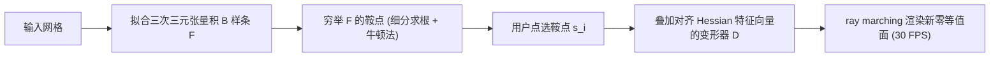

## 一句话总结

作者发现有向距离场（SDF）的鞍点天然对应曲面上"拓扑不稳定"的位置，据此把 SDF 拟合成三次三元张量积 B 样条、快速穷举鞍点，并在选定鞍点处叠加一个与 Hessian 特征向量对齐的紧支撑"变形器"，从而实现 30 FPS 的实时、拓扑感知的形状编辑。

## 研究背景

- 领域现状：形状编辑分为几何编辑（改变曲面起伏）和拓扑编辑（断开连接、连接断头、填/开洞）。三角网格、参数曲面等显式表示擅长几何编辑，但因只关注曲面本身、忽略其在三维空间中的嵌入，难以处理拓扑变化；连续隐式表示（如 SDF）虽能灵活容纳任意拓扑，却不直观、不好操作。
- 核心痛点：现有隐式编辑方法要么每次编辑都要求解偏微分方程（水平集类方法），无法满足实时交互；要么用草图/梯度算子驱动，难以精确表达"想在哪里改拓扑"的意图，且交互系统笨重。关键难题是：如何快速定位到"想编辑拓扑的区域"，并以易操作、能即时可视化的方式更新隐式表示。
- 本文 idea：借助 Morse 理论的洞察——当隐式函数在临界点处的函数值符号发生翻转时，曲面拓扑随之改变。其中 1-鞍点（Hessian 恰有一个负特征值）对应可断开/连接的细颈区域，2-鞍点（两个负特征值）对应可填/开的洞。于是把 SDF 的鞍点预计算出来作为交互提示，用户点选鞍点即可编辑其局部拓扑。

## 方法

整体框架分三步：先把输入网格拟合成一个三次三元张量积 B 样条函数 $$F$$（隐式化），再穷举 $$F$$ 的所有鞍点作为可编辑的候选提示，最后在用户选定的鞍点处叠加一个与 Hessian 特征向量对齐的紧支撑变形器来改写 SDF，并用 ray marching 实时渲染零等值面。

关键设计：

1. **把 SDF 参数化为三次三元张量积 B 样条**。将模型归一化到 $$[0,1]^3$$，划分为分辨率 $$N$$ 的规则网格，用根植于各网格点的三次 B 样条基 $$B_{ijk}$$ 线性组合表示 SDF：$$F(\boldsymbol{q}) = \sum_{i,j,k}\alpha_{ijk} B_{ijk}(\boldsymbol{q})$$。系数通过在网格点上采样真实 SDF 值构建稀疏对称线性系统 $$A\boldsymbol{\alpha}=\boldsymbol{c}$$，用共轭梯度法直接求解。选 B 样条是看中它的局部支撑、非振荡以及二阶光滑性——二阶光滑保证可以稳定分析 Hessian，局部支撑保证编辑只影响局部。

2. **用 Hessian 分类临界点并穷举鞍点**。临界点满足梯度 $$\nabla F=0$$，再按 Hessian 的负特征值个数分为极小点、1-鞍点、2-鞍点、极大点四类。1-鞍点标记"可断开/连接"的不稳定拓扑，2-鞍点标记"可填/开洞"的不稳定拓扑；极大/极小点对应稳定拓扑，系统禁止选取（否则可能产生与主体断开的孤立曲面）。穷举时对每个网格单元用基于细分的求根法把单元剖成八个子单元（最大细分层级设为 1，避免鞍点无限增多），再以各子单元中心为初值跑牛顿法精化鞍点位置（迭代上限 20 次）。

3. **与 Hessian 特征向量对齐的变形器**。编辑写成 $$F_{\text{new}}(\boldsymbol{q}) = F(\boldsymbol{q}) + \sum_{\boldsymbol{s}_i\in S} D_{\boldsymbol{s}_i}(\boldsymbol{q})$$，其中变形器 $$D_{\boldsymbol{s}_i}(\boldsymbol{q}) = \beta_{\boldsymbol{s}_i} B\!\left(W_{\boldsymbol{s}_i}^{-1} Q^{T}(\boldsymbol{q}-\boldsymbol{s}_i)\right)$$。这里 Hessian 分解为 $$H=Q\Lambda Q^{T}$$，$$Q$$ 的三个特征向量给出变形器的局部坐标系，$$W_{\boldsymbol{s}_i}$$ 是各方向的缩放对角阵，$$\beta_{\boldsymbol{s}_i}$$ 调节影响强度。之所以对齐特征向量：在曲面点处两个特征向量对齐主曲率方向、一个对齐法向，这样变形能最大程度保持原有各向异性形状；若换成法向加两个随机正交方向（论文称"法向变形器"），各向异性特征会被削弱。用户通过增大 $$\beta_{\boldsymbol{s}_i}$$ 使 $$F_{\text{new}}(\boldsymbol{s}_i)$$ 从负变正，就会在鞍点处触发拓扑突变（粘连与分离之间翻转），翻转阈值可由 $$\beta_{\boldsymbol{s}_i}\ge -\sum_{i,j,k}\alpha_{ijk}B_{ijk}(\boldsymbol{s}_i)/B(0)$$ 给出（其中 $$B(0)=8/27$$）。

4. **几何编辑与实时性**。把任意曲面点当作基点即可做几何编辑（造凸起或凹陷）：曲面点处 Hessian 必有一个零特征值，其特征向量即法向，另两个对齐主曲率方向。渲染上放弃 marching cubes，改用 ray marching（球面追踪）直接绘制隐式面；又因为小幅拓扑编辑不会移除或搬动鞍点，鞍点只需预计算一次、后续只保留变形器，从而在入门级 GPU 上也能维持 30 FPS。

## 实验结果

用户研究以草图式拓扑编辑方法 STEM（Ju 等，2007）为基线，招募 15 名志愿者完成四类"目标复现"任务（开/填洞、断开连接、连接断头），每任务限时 5 分钟，分辨率 $$N=150$$。用 Chamfer 距离、F-Score、法向一致性以及亏格/连通分量等拓扑指标评估复现质量。本文方法在全部指标上均优于 STEM。

| 任务 | Chamfer↓ (Ours / STEM) | F-Score↑ (Ours / STEM) | Normal C.↑ (Ours / STEM) | 亏格 (Ours / STEM / GT) |
|------|------|------|------|------|
| Task 1 | 2.80 / 3.84 | 94.00 / 91.46 | 98.68 / 94.50 | 3.14 / 3.20 / 3 |
| Task 2 | 2.86 / 3.72 | 93.62 / 84.21 | 98.02 / 94.14 | 8.15 / 7.67 / 8 |
| Task 3 | 2.96 / 4.33 | 92.78 / 84.41 | 96.69 / 92.26 | 1.00 / 5.54 / 1 |
| Task 4 | 2.65 / 4.14 | 94.36 / 79.40 | 99.22 / 94.58 | 1.00 / 3.92 / 1 |

主观问卷（流畅度、可操作性、满意度，1~5 分）显示本文系统各项均获高分，而 STEM 可操作性差、多数人对结果不满意。性能上，隐式化解方程 $$<10$$ 秒、鞍点穷举 $$<25$$ 秒（均为一次性预计算）；在 GTX 1060 与 RTX 3060 上，拓扑编辑、几何编辑均稳定 $$>30$$ FPS。应用层面展示了修复泊松重建（SPR）拓扑噪声、艺术创作、3D 医学影像（如血管瘤定位与切除模拟）以及文物修复等场景。

## 亮点与局限

- 亮点：
  - 把 Morse 理论中"临界点符号翻转即拓扑改变"的经典结论落地成一个可交互工具，用**预计算的鞍点**直接充当"该在哪里改拓扑"的交互提示，比草图输入更精确、更直观。
  - B 样条的二阶光滑与局部支撑，使得既能稳定分析 Hessian 又能局部编辑；变形器对齐 Hessian 特征向量，天然保持主曲率方向上的各向异性，几何编辑更符合直觉。
  - ray marching + 鞍点一次性预计算，使系统在入门级 GPU 上也能 30 FPS 实时响应；用户研究定量、定性都显著优于基线。
- 局限：
  - 直接在隐式表示上操作，隐式化过程会带来与原曲面的轻微偏差，对 CAD 模型尤为明显。
  - 依赖均匀空间划分，高分辨率场景下时间与内存开销大（作者提出未来可用八叉树替代规则网格）。

## 延伸思考

- 方法把"拓扑编辑"约束在了预计算鞍点集合上，这既是它直观的来源，也是表达能力的边界：无法在"当前没有鞍点提示"的地方主动制造拓扑变化。若能动态更新鞍点或引入更多变形器模板，编辑效果会更丰富。
- 用鞍点作为拓扑操作的锚点，与近年基于神经隐式场（如 SDF/占据场）的编辑思路有天然衔接空间——能否在神经场上同样穷举临界点、以 Hessian 引导做拓扑感知编辑，是值得探索的方向。
- 隐式化偏差对 CAD 的影响提示：对需要精确保持尖锐特征的模型，或许需要把 B 样条替换为特征保持的自适应表示（八叉树 / 特征对齐网格），在实时性与保真度之间取得更好平衡。
