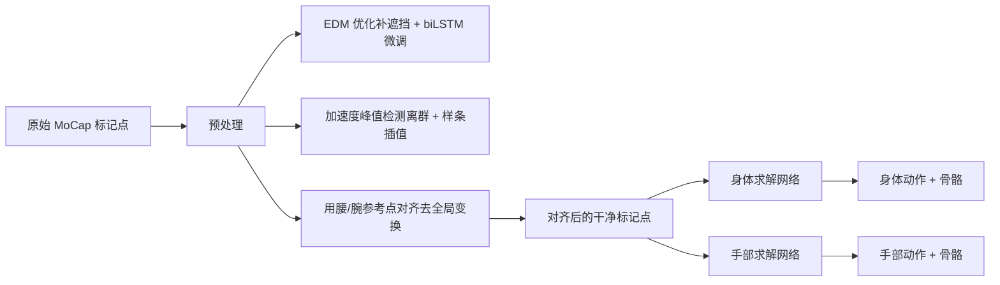

## 一句话总结

针对光学动捕原始数据中的遮挡与离群噪声，本文提出一种基于"标记点局部性"的异质图神经网络方法：先用邻居标记点的欧氏距离矩阵优化补全遮挡点，再用区分标记点与关节的图卷积网络求解身体与手部动作，遮挡标记点位置误差比现有方法降低约 20%，关节旋转与位置误差进一步降低约 30%。

## 研究背景

- 领域现状：光学动捕仍是影视和游戏工业捕捉身体与手部精细动作的标准方案，但原始数据不可避免地被遮挡、位置误差和错标污染，清洗与求解往往还需大量人工修正，手部动作尤其耗时。数据驱动方法（如 MoCap-Solver）已达到当时的最优水平。
- 核心痛点：现有最优数据驱动方法有三个短板。其一，用蒙皮函数从解出的骨骼重建"干净标记点"，忽略了标记点在体表滑动等复杂运动，且会引入求解误差；其二，用单一全连接结构对所有标记点一视同仁地编码，忽略标记点之间的细粒度相关性，导致大幅身体动作和多指手部动作求解不准；其三，训练时普遍用"逐帧随机采样"来模拟噪声，无法生成真实数据中常见的 40~100 帧的长遮挡间隙，造成合成数据与真实数据分布不匹配。
- 本文 idea：利用"局部性"这一先验——一个标记点的运动与其紧邻标记点强相关、与其它标记点弱相关。据此可以用邻居间稳定的距离关系高效补全遮挡点，用异质图显式建模标记点与关节的邻接关系来精确求解动作，并按真实遮挡的时空统计规律做数据增强。

## 方法

整体 pipeline 分三个模块：先对原始数据做预处理（补遮挡、去离群、对齐去全局变换）得到干净的局部坐标标记点；再用异质图神经网络逐帧分别求解身体与手部动作；训练所需的噪声数据则由一套贴合真实分布的数据增强算法生成。

关键设计分四点：

1. **邻居标记点与局部性先验**：对每个标记点，计算它与其它标记点两两距离在整段运动中的方差，取方差最小的 $$K$$ 个作为邻居。方差小意味着距离稳定，这些邻居既能高效约束遮挡点位置，也能更好地表征对应身体部位的运动。实验中补遮挡用 6 个邻居、求解网络用 3 个邻居；且用"最小距离方差"选邻居优于用"最小平均距离"。

2. **EDM 优化补遮挡 + 网络微调**：这是补遮挡的核心。对在 $$s$$ 到 $$e$$ 帧间遮挡的标记点 $$M_i$$，先取其可见邻居，在遮挡起止帧构建距离矩阵 $$D_i^s, D_i^e$$，对中间帧线性插值得到 $$D_i^t$$（因邻居间距离变化极小，线性插值即为很好的近似，还能反映体表滑动等细微形变）。再用欧氏距离矩阵优化（EDM）求解遮挡点位置：先用多维标度法（MDS）由距离矩阵求一组初始点坐标，再用 SVD 求解正交 Procrustes 问题把这组点刚性对齐到邻居上。由于距离并不能完全刻画复杂运动，最后用一个含图内卷积层和 biLSTM 的循环网络学习从 EDM 结果到真值的偏移量 $$M_{off,i}^t$$ 做微调。损失只在遮挡帧上监督：
$$\mathcal{L}_{occ} = \sum \lVert (1-O_i^t) \odot (\hat{M}_{clean,local,i}^t - (M_{EDM,local,i}^t + M_{off,i}^t)) \rVert$$

3. **异质图求解网络**：构建异质图 $$G=(G_M, G_J, A_{MJ})$$，其中标记点图 $$G_M$$ 的边连接邻居标记点，关节图 $$G_J$$ 的边即骨骼连接，跨图邻接矩阵 $$A_{MJ}$$ 依 T-pose 下标记点与关节的距离阈值建立；另加一个全局节点连到所有节点以表示全局变换。网络基于骨骼卷积构建"图内卷积"（聚合同类邻居）和"图间卷积"（聚合异类邻居）：先在 $$G_M$$ 上用图内卷积提取标记点局部特征，再分全局分支（残差块提全局运动特征）和局部分支（图间卷积提标记点—关节局部特征），拼接后在 $$G_J$$ 上图内卷积输出每个关节的旋转矩阵与偏移。身体与手部用结构相似但独立的网络分别求解。求解损失为动作、骨骼、前向运动学三项之和：
$$\mathcal{L}_{solving} = \lambda_M(Y-\hat{Y}) + \lambda_S(S-\hat{S}) + \lambda_{FK}(FK(Y,S)-FK(\hat{Y},\hat{S}))$$

4. **贴合真实分布的数据增强**：真实动捕数据整体遮挡率仅约 5%，噪声样本稀缺易过拟合。作者借鉴掩码自编码器思路，按真实统计规律生成噪声：不同标记点有不同遮挡概率 $$\hat{p}_{occ,i}$$（手部最密集、运动最复杂，遮挡概率最高），遮挡间隙长度服从重尾分布 $$\hat{g}_l$$。据此计算每个标记点长度为 $$l$$ 的间隙数量 $$N_{l,i}$$，从长到短不重叠地采样置为遮挡，并按均匀分布加位移模拟离群。相比逐帧随机采样（无法生成超过 6~8 帧的间隙），该方法生成的间隙分布最接近真实数据。

## 实验结果

在真实数据集（游戏工作室采集）和合成数据集（SMPL+H 由 CMU 身体动作与 GRAB 手部动作驱动）上评测，用三个指标：OMPE（遮挡标记点位置误差）、JOE（关节朝向角误差）、JPE（关节位置误差）。下表为真实数据集上与优化式方法 Vicon 及神经方法的主对比（身体 / 手部，越低越好）：

| 指标 | Vicon（身体/手） | [Holden 2018]（身体/手） | MoCap-Solver（身体/手） | 本文（身体/手） |
|------|------|------|------|------|
| JOE (°) | 4.21 / 1.37 | 2.54 / 0.80 | 1.89 / 0.58 | **1.22 / 0.45** |
| JPE (cm) | 1.75 / 0.49 | 1.02 / 0.27 | 0.89 / 0.20 | **0.61 / 0.15** |
| OMPE (cm) | 5.32 / 2.01 | 3.62 / 1.58 | 3.27 / 1.46 | **2.55 / 1.11** |

本文在所有指标上均优于基线：身体的 JOE、JPE 约低 30%、OMPE 约低 20%，手部各指标约低 20%（合成数据集上呈现相同趋势）。消融实验表明：EDM 初值使遮挡标记点位置精度提升约 40%，进而使身体动作误差降约 4%、手部降约 20%；身体与手部分网络求解使手部角误差降约 60%、身体降约 5%；在标记点图上先做图内卷积提局部特征使身体角误差降约 30%、手部降约 15%。数据增强在仅有少量训练数据时可将求解网络性能提升约 10%，而逐帧随机采样几乎无提升。

## 亮点与局限

- 亮点：
  - 把"手工几何先验（EDM 距离约束）"与"学习先验（网络微调）"结合补遮挡，能应对同时遮挡和不同时长的长间隙，比纯网络或纯蒙皮重建更准。
  - 用异质图区分标记点与关节两类节点、显式建模邻居相关性，兼顾大幅身体动作与多指手部精细动作；身体、手部分网络求解显著提升手部精度。
  - 数据增强按真实遮挡概率与重尾间隙分布生成噪声，弥补了逐帧随机采样无法产生长间隙的缺陷，缩小合成—真实分布差距。
- 局限：
  - 数据增强只考虑遮挡的时空分布，未纳入同时遮挡、不同部位标记点的差异化位移强度、邻近标记点互相错标等更复杂噪声模式。
  - 无法检测细微的标记点交换（如食指与中指之间的互换），检测并纠正此类交换留作未来工作。

## 延伸思考

- 方法把动捕求解拆成"几何优化补点 + 图网络求解"两阶段，几何先验降低了网络学习复杂标记点运动的难度；这种"可靠初值 + 网络学残差"的范式对其它稀疏观测重建问题（如稀疏 IMU 动捕、点云配准）也有借鉴意义。
- 用距离方差挑邻居、构建异质图的思路本质是把领域先验编码进图结构，相比纯 Transformer 全连接注意力更省参数也更可解释；后续可对比在同等数据下二者的泛化差异。
- 未解决的标记点交换问题，本质是标签歧义，可能需要引入类似 SOMA 的无标记点云自动标注、或结合时序一致性约束来联合求解"标注—补全—求解"。
