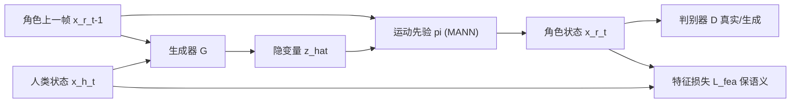

## 一句话总结

ACE 用生成对抗学习加一个语义特征损失，在预训练的角色运动隐空间里学习"人 → 非人角色"的跨形态运动重定向，把人类动作迁移到 Spot 四足机器人、螃蟹角色和 Stretch 轮式机器人上，并能 sim-to-real 到真实 Spot。

## 研究背景

- 领域现状：运动重定向是给非人角色生成动画的有效途径。人到人（相似骨架）的重定向已有大量工作，近年也出现了基于对抗学习（如 skeleton-aware 网络）的无配对方法。
- 核心痛点：把人类动作迁移到形态差异巨大的角色（腿/臂数量、身体尺寸、结构都不同）时存在两大难题——(1) 内在歧义，例如人的哪只手该映射到四足机器人唯一的机械臂上并没有唯一正确答案；(2) 可行性，很多人类动作在目标角色身上会引发奇怪动力学或自碰撞。传统优化法要精细调目标函数，监督学习又需要昂贵的配对数据。
- 本文 idea：把重定向表述为两个域之间的翻译问题，用无配对的对抗学习建立"对应关系"；同时预训练一个角色运动先验，把重定向学习压缩到低维隐空间里进行，并用一个人工设计的特征损失来保留源动作的高层语义。

## 方法

整体框架：先离线预训练一个角色运动先验 $$\pi$$，它由一个低维隐变量 $$\boldsymbol{z}$$ 控制角色状态；然后训练一个生成器 $$G$$ 把人类当前状态与角色上一帧状态映射到隐变量，再由运动先验解码出角色下一帧状态，并用判别器 $$D$$ 判断该状态转移是否真实，同时用特征损失牵引语义对应。

关键设计：

1. **预训练角色运动先验（隐空间）**：与其让重定向直接映射到高维角色动作（训练不稳定），先用 VAE 式方法学一个先验 $$\pi(\boldsymbol{z}_t, \boldsymbol{x}^r_{t-1}) \mapsto \boldsymbol{x}^r_t$$，编码器 $$c$$ 把状态转移编码成 32 维隐变量。网络主体用 Mode-adaptive Network（MANN，8 个专家）。角色数据由运动学控制器在随机指令下 rollout 生成，覆盖多种步态和速度。这样重定向就在这个紧凑隐空间里学习，跨形态映射更稳定。

2. **对抗对应学习**：生成器 $$G(\boldsymbol{x}^h_t, \boldsymbol{x}^r_{t-1}) \mapsto \hat{\boldsymbol{z}}_t$$，经先验解码得 $$\hat{\boldsymbol{x}}^r_t$$，判别器 $$D$$ 区分数据集里真实转移和生成转移。判别器损失为
$$L_D = -\mathbb{E}_{\Omega^r}[\log D(\boldsymbol{x}^r_{t-1}, \boldsymbol{x}^r_t)] - \mathbb{E}_{\Omega^h}[\log(1 - D(\boldsymbol{x}^r_{t-1}, \hat{\boldsymbol{x}}^r_t))]$$
并加梯度惩罚项（权重 0.1）稳定训练。对抗损失促使生成动作贴近角色的自然运动分布。

3. **语义特征损失（防模式坍缩的关键）**：仅靠对抗损失生成器容易 mode-collapse，只产出少数几种动作。于是加一个人工设计的特征函数 $$\Psi$$（含根高度、根朝向、根线/角速度、末端执行器位置，按身长归一化），最小化 $$L_{fea}(G) = \lVert \Psi(\boldsymbol{x}^h_t) - \Psi(\hat{\boldsymbol{x}}^r_t) \rVert$$ 来保留高层语义。生成器总目标为 $$\arg\min_G w_{adv} L_{adv} + w_{fea} L_{fea}$$。

4. **自动末端对应**：人和角色末端执行器数量可能不同，通过最小化两者末端位置分布的 KL 散度 $$\arg\min_i KL[\,p(x^{r,j}) \mid\mid p(x^{h,i})\,]$$ 自动建立第 $$j$$ 个角色末端到第 $$i$$ 个人类末端的映射，也支持用户手动指定映射。

## 实验结果

在 Spot 上做主对比实验，指标包括 Diversity（越接近数据集越好）、FID（越低越好）、特征损失 $$L_{fea}$$（越低越好）、Unrealistic Frame Ratio（越低越好，含自碰撞/穿地/滑步）。基线为 NKN、去掉特征损失的 ACEwoFea、去掉对抗损失的 ACEwoAdv。

| 方法 | DIV (→2.254) | FID ↓ | $$L_{fea}$$ ↓ | UFR ↓ |
|------|------|-------|------|-------|
| Dataset | 2.254 | 0.000 | N/A | 0.258% |
| ACE(本文) | 2.483 | 0.489 | 0.606 | 2.071% |
| NKN | 1.718 | 0.914 | 0.912 | 6.213% |
| ACEwoFea | 0.445 | 0.976 | 1.975 | 0.517% |
| ACEwoAdv | 3.077 | 0.736 | 0.553 | 9.741% |

ACE 的 DIV 最接近数据集、FID 最低，$$L_{fea}$$ 和 UFR 排第二。ACEwoFea 出现明显模式坍缩（DIV 仅 0.445，$$L_{fea}$$ 高达 1.975），验证特征损失对抑制坍缩、保语义至关重要；ACEwoAdv 虽 $$L_{fea}$$ 最低但 UFR 高达 9.741%（大量自碰撞/穿地/滑步），说明对抗损失对生成可行、真实动作不可或缺。另有 20 人参与的用户研究进一步支持 ACE 的感知质量，并展示了向真实 Spot 机器人的 sim-to-real 迁移。

## 亮点与局限

- 亮点：
  - 在隐空间而非高维状态空间学习重定向，显著稳定了跨形态训练。
  - 对抗损失（保自然可行）+ 特征损失（保语义、抑制模式坍缩）的组合设计清晰，消融实验说服力强。
  - 通用性好：一套框架覆盖四足+机械臂、六足螃蟹、轮式机械臂三种差异巨大的形态，并能 sim-to-real。
  - 末端执行器自动对应（KL 散度）减少了人工配对负担。
- 局限：
  - 特征函数 $$\Psi$$ 需人工设计选择哪些高层特征，仍带一定先验假设。
  - 角色各自按自身风格迈步、不与人同步，可能牺牲脚步动作本身的语义。
  - 因按归一化特征匹配，重定向动作的移动/扫掠幅度通常小于人类（如 Spot 推物 1.39 m vs 人 3.48 m），需要额外缩放因子调节。
  - 角色运动先验依赖运动学控制器 rollout 出的多样数据集，先验的表达能力上限受此约束。

## 延伸思考

- 特征损失本质是把领域先验以"要保留哪些语义"的形式手工注入，未来若能学习式地发现跨形态对应特征，会更自动化，也更能处理"该保留什么语义"本身就模糊的场景。
- 方法把重定向压进预训练隐空间，思路与用 VAE/对抗式运动先验做物理角色控制的工作一脉相承；若把运动先验换成物理仿真中训练的 imitation 先验，理论上能进一步提升动力学可行性与真机迁移鲁棒性。
- 无配对对抗翻译的框架对"歧义无唯一解"问题是天然契合的——但也意味着结果风格高度依赖角色数据集分布，如何让用户可控地在多种合理映射间选择（而非隐式由数据决定）值得追问。
