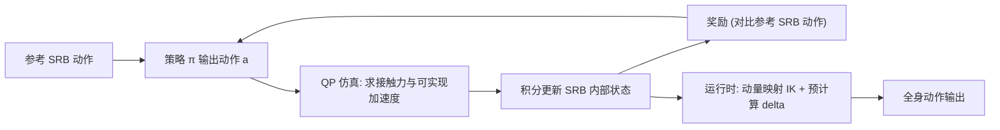

## 一句话总结

把全身角色简化成"单刚体"（SRB）来做物理仿真与强化学习，只用一段平地上的短参考动作训练出的追踪策略，就能不加任何额外训练地适应崎岖地形、推箱子、抵抗外力等各种未见过的环境。

## 研究背景

- 领域现状：自 DeepMimic 以来，物理仿真角色控制沿着"扩充动作库"的方向发展，做法包括用大规模动作数据集、生成模型，或训练不依赖具体参考动作的通用控制器。
- 核心痛点：这些方法都基于全身动力学仿真，为了让角色能应对环境和任务的多种变化，必须在训练时就"见过"这些变化，导致状态/动作空间维度高、训练时间长、样本效率低。
- 本文 idea：换一条正交的思路——不去堆动作数据，而是把角色用质心动力学（centroidal dynamics）简化为一个单刚体（SRB），只训练它去追踪一段参考动作。由于控制建立在"运动源于接触力"这一第一性原理上、且不含全身细节，策略天然对具体情境依赖更弱，从而无需额外学习就能泛化到未见环境。

## 研究方法

整体框架分两大块：先在低维的 SRB 角色上做物理仿真与强化学习，得到一个追踪参考动作的策略；再在运行时把仿真出的 SRB 运动通过逆运动学"还原"成全身动作。SRB 用一个近似全身惯量的盒状刚体加两只脚各两个接触点表示，仿真本身被写成一个二次规划（QP）问题。

关键设计：

- **SRB 建模与低维状态/动作空间**：状态 $$\boldsymbol{s}\in\mathbb{R}^{21}$$ 只含质心的高度/朝向/广义速度、两脚的水平位置与朝向、以及动作相位 $$\psi(t)$$；动作 $$\boldsymbol{a}\in\mathbb{R}^{10}$$ 只有"期望落脚位置"和"质心相对参考动作的期望速度"。维度大幅压缩，训练因此样本高效——在一台超便携笔记本（M1 CPU、16GB）上约 30 分钟、约 3M 步即可收敛。

- **QP 仿真作为环境**：每步先由动作与参考动作算出期望加速度 $$\ddot{\boldsymbol{q}}_d$$，再解 QP 找到在运动方程约束和摩擦锥约束下最接近期望加速度的实际加速度与接触力。目标函数为 $$Q=\lVert\ddot{\boldsymbol{q}}-\ddot{\boldsymbol{q}}_d\rVert^2+w_\lambda\lVert\lambda\rVert^2$$。外力项 $$\boldsymbol{F}_e$$ 在训练中设为 0，但运行时可注入非零外力（如推箱子的接触力、外部推力），这正是它无需重训就能应对外力的关键——环境变化以外力/接触形式直接进入 QP，而非要求策略事先见过。

- **落脚与相位的动态调整**：摆动脚用 LQR 滤波把离散的期望落脚位置平滑成连续轨迹；相位变化率随移动速度增大而加快（防止步幅过长），并在遭遇大外力、触地时刻偏离参考时主动延迟或提前触地以保持稳定。

- **全身动作还原**：SRB 太简化，缺全身细节。离线阶段先用训练好的策略跑出"基线 SRB 动作"，计算它与全身参考动作之间的差异 delta（$$\Delta$$，含质心帧、接触点、质心速度等差异，并对多个周期取平均）。运行时用改进的动量映射逆运动学（MMIK）把仿真 SRB 状态加上预计算的 $$\Delta$$，解出既满足落脚位置/质心配置及其时间导数、又贴近参考姿态的全身动作。

## 实验结果

主实验为"侧向/后向外力扰动下的平衡维持"对比：在 Sprint 控制器上、沿动作相位 20 个均匀点施加 0.2 秒、100–2000 N 的外力，比较本文方法、FFMLCD（Kwon et al. 2020）与 DeepMimic。核心结论是本文在"能保持不倒的最大外力"上约为 FFMLCD 的三倍，DeepMimic 因全身姿态追踪导致适应性差、较小力即摔倒。

| 方法 | 侧向推：保持平衡的力 | 后向推：保持平衡的力 | 适应性来源 |
|------|------|------|------|
| 本文 (SRB+RL) | 最高（约 FFMLCD 的 3 倍） | 最高（约 FFMLCD 的 3 倍） | 每帧输出落脚位置即时响应 |
| FFMLCD | 中 | 中 | 半周期非线性优化规划，响应有延迟 |
| DeepMimic | 低（较弱力即摔） | 低（较弱力即摔） | 全身姿态追踪，适应性受限 |

其余实验以定性为主：在最大 30 度崎岖地形上直接行走（DeepMimic 在缓坡上就因摆动脚绊地而失败）；推 10kg/30kg 不同重量箱子时通过前倾施加更大力、落脚略后移实现更强推力（DeepMimic 追踪同一参考动作却推不动箱子）；通过策略切换/混合实现不同速度动作间的过渡（如 Fast walk 1.8 m/s 与 Run 3.6 m/s 混合过渡），速度差在 30% 内切换可成功；并可加入期望朝向标量 $$\delta_y$$ 训练出交互式方向控制。

## 亮点与局限

- 亮点：
  - 用 SRB + 质心动力学把问题降维，训练极其高效（笔记本 30 分钟），却能零额外训练泛化到地形、推箱、外力、控制器过渡等未见场景。
  - 把环境变化统一表达为进入 QP 的外力/接触，抓住"运动源于接触力"的第一性原理，是泛化能力的根源。
  - 相比全身仿真方法适应性更强，相比纯运动学方法又能反映物理环境变化。
- 局限：
  - 无法表现接触丰富（contact-rich）的身体各部位交互，接触力只能施加在人工指定的接触点上；摔倒时也不显式表示身体与地面的碰撞（需切换到全身 PD 仿真来生成自然摔倒）。
  - SRB 采用恒定惯量，未建模全身随姿态变化的时变惯量，对依赖旋转速度的动作精度可能有影响。
  - 每个控制器仅基于单段短参考动作训练，动作丰富度受限于所选参考片段与切换/混合机制。

## 延伸思考

这项工作与近期人形机器人"从单段参考动作做自适应运动追踪"的思路（如各类 motion-tracking / adaptive control 方法）高度呼应——用简化模型换取样本效率与鲁棒泛化，是仿真到真实、控制迁移的重要方向。值得追问的是：恒定惯量假设的误差边界在哪些高动态动作上会显现？以及能否用更复杂的网络结构或分层学习，在保持 SRB 高效性的同时把"单参考动作"扩展成"多技能库"，让同一低维策略覆盖更广的动作谱。
