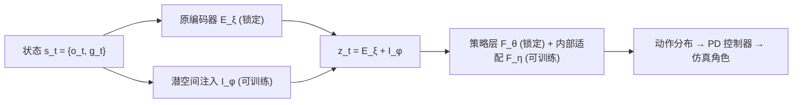

## 一句话总结

AdaptNet 通过向已训练好的强化学习控制策略中"注入"新的网络组件、编辑其潜空间，使物理仿真角色能在几十分钟内快速适应新风格、新形态、新地形等一系列新任务，而无需从头重训。

## 研究背景

- 领域现状：基于强化学习的物理角色动画已能合成走、跑、格斗、球类等大量技能，但训练一个策略往往要数小时到数天，甚至相当于"数年"的仿真交互时间。
- 核心痛点：现有方法多为"一个行为训一个策略"，换个新行为通常得从头再训。课程学习、warm-start、finetune 等迁移手段要么目标是练出单一高级技能，要么在目标改动较大时会发生灾难性遗忘（catastrophic forgetting）。
- 本文 idea：受图像扩散与大语言模型中 ControlNet、LoRA 等"条件化已有模型"思路启发，作者不动原策略权重，只训练少量注入到原网络中的新组件，通过**编辑控制策略的潜空间**来引导角色产生新行为，从而快速、稳定地完成适配。

## 方法

整体框架：给定一个用多目标强化学习（模仿目标 + 目标导向控制目标，配合 GAN 式判别器）预训练好的定位移动策略 $$\pi_\theta(a_t \mid E_\xi(s_t))$$，AdaptNet 复制这个策略并锁死其原参数 $$(\theta,\xi)$$，再挂上两级可训练模块：浅层的"潜空间注入"负责温和改动，深层的"内部适配"负责更实质的控制改动。适配时只优化新引入的参数 $$(\phi,\eta)$$。

关键设计：

1. **潜空间注入（Latent Space Injection, LSA）**：在角色状态 $$o_t$$ 与目标状态 $$g_t$$ 拼接编码后的第一个潜空间 $$Z_0$$ 上做加性修改：$$z_t = E_\xi(s_t) + I_\phi(s_t, c_t)$$。注入器 $$I_\phi$$ 内含一个与原编码器结构相同的 $$E_\phi$$（用原参数 $$\xi$$ 初始化）、一个可选的新控制输入编码模块 $$G_\phi$$（如地形高度图用 CNN 处理），以及一个末层零初始化的全连接 $$F_\phi$$。零初始化保证训练一开始输出与原策略完全一致，让探索从"原策略的状态-动作轨迹"出发而非随机起步。实验发现注入越靠近动作层越难训练，$$Z_0$$（编码器瓶颈处）效果最好。
2. **内部适配（Internal Adaptation, IA）**：给策略网络中每个内部全连接层并联一个零初始化的适配分支，$$z_t^i = F_\theta^i(z_t^{i-1}) + F_\eta^i(z_t^{i-1})$$，只训练增量参数 $$\eta := \{\Delta W^i, \Delta b^i\}$$。相比直接 finetune $$\pi_\theta$$，零初始化 + 可施加的 L2 正则让训练更稳、避免过拟合与漂移。它类似 LoRA，但用的是**全秩**而非低秩分解——因为策略网络潜空间只有 512/1024 维，缺乏大模型那样的低内在秩，LoRA 在此收益不明显。
3. **多目标训练与运行时插值**：预训练与适配都用同一套多评论家（multi-critic）框架，模仿与目标导向两个目标各自独立估计并标准化优势；模仿奖励由 32 个判别器的 hinge loss 集成给出。适配时丢弃旧判别器与旧评论家、从头训新的，以免旧任务偏置。运行时给注入项加一个缩放系数 $$\alpha \in [0,1]$$，即 $$z_t^0 = E_\xi(s_t) + \alpha I_\phi(s_t,c_t)$$，就能在原行为与新风格间平滑过渡，甚至在两个 AdaptNet 模型间插值切换。

适配目标函数（含对注入量与增量参数的正则）：

$$\max_{\phi,\eta}\ \mathbb{E}_t\Big[\textstyle\sum_k \omega_k \bar{A}_t^k \log \pi_\theta\big(a_t \mid E_\xi(s_t) + I_\phi(s_t,c_t);\eta\big) - \beta \lVert I_\phi(s_t,c_t)\rVert^2 - \kappa \lVert \eta \rVert^2\Big]$$

## 实验结果

实验在 IsaacGym 中以 512 环境并行进行，角色 15 个 body link、28 自由度，策略 30 Hz、仿真 120 Hz。预训练一个走/跑策略约需 26 小时，而 AdaptNet 适配简单任务仅需 10–30 分钟，复杂地形约 4 小时。应用覆盖少样本风格迁移、潜空间插值、身形/关节锁定等形态改动、低摩擦与崎岖/障碍地形、抗扰动等。

主实验为风格迁移下的**模仿误差**对比（各 body link 位置误差，单位米，越低越好），验证 LSA+IA 组合优于各消融与 LoRA：

| 风格 | AdaptNet (LSA+IA)↓ | 仅 LSA↓ | LSA+LoRA-64↓ | 仅 IA↓ |
|------|------|------|------|------|
| Swaggering | 0.05±0.02 | 0.05±0.02 | 0.06±0.02 | 0.11±0.03 |
| Goose Step | 0.11±0.08 | 0.18±0.08 | 0.21±0.12 | 0.35±0.11 |
| Jaunty Skip | 0.16±0.09 | 0.22±0.10 | 0.25±0.12 | 0.56±0.18 |
| Joyful | 0.17±0.07 | 0.22±0.09 | 0.28±0.12 | 0.54±0.22 |

在与 Scratch（从头训）、FT（直接微调）、FT+Reg、PNet（渐进网络）的对比中：Scratch 在 8M 样本预算内几乎学不到目标；FT 在形态/摩擦任务上可用，但在风格迁移上因过拟合新参考动作而遗忘目标导向能力；FT+Reg 全面训练不佳；PNet 与 AdaptNet 思路相近但无法零初始化、不能合并网络、样本效率低且内存翻倍。AdaptNet 在最终性能与样本效率上一致胜出，且因原网络冻结、可合并，推理时有效参数量与原策略持平。

## 亮点与局限

- 亮点：
  - 把"编辑潜空间"这一图像/语言大模型里的适配思路成功迁移到物理角色控制，且**保留并复用原策略**而非重训编码器。
  - 零初始化 + 残差注入让适配从原策略轨迹稳定起步，训练快（分钟级）、抗灾难性遗忘。
  - 结构可合并，推理零额外开销；缩放系数支持运行时风格插值与多模型混合，交互性强。
  - 适用面广：风格、形态、地形、抗扰动一套框架通吃，且形态适配无需重定向新参考动作。
- 局限：
  - 全秩内部适配相比 LoRA 参数更多；作者论证是因策略网络小、低秩收益有限，但这也意味着方法对更大网络的结论未必成立。
  - 适配仍需要针对新任务从头训练判别器与评论家，且注入点选择（$$Z_0$$ 最优）依赖经验，深层注入易致抖动或训练失败。
  - 形态适配中角色为匹配参考骨盆高度会出现"蹲着走"等非自然姿态；复杂障碍避让任务仍需约 22 小时训练。

## 延伸思考

- AdaptNet 与图像领域 ControlNet/LoRA 的类比很值得玩味：它印证了"靠近输入端的潜空间瓶颈更适合语义化编辑"这一跨模态规律，潜空间可视化也显示不同风格在 $$Z_0$$ 中呈连续的语义分布（含节奏、步频信息），这为可控运动生成提供了结构化的操纵接口。
- 一个自然的方向是把多个独立训练的 AdaptNet 模块组织成技能库，通过潜空间插值/加权做实时技能组合与过渡，向更通用的"可编辑运动基础模型"演进。
- 由于原策略权重全程冻结、适配模块可合并，这套机制对需要在边缘设备上快速下发"风格补丁"或"地形补丁"的游戏/虚拟角色部署场景颇具工程价值。
