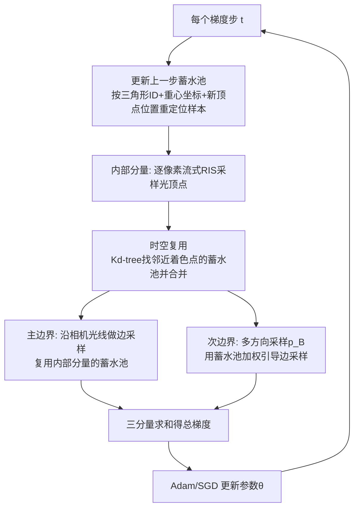

## 一句话总结

把实时渲染里跨帧复用光样本的 ReSTIR 框架，第一次搬进物理基逆向渲染的优化循环，让相邻梯度步之间"摊销"光样本，从而在复杂光照下用同等时间得到更干净的正向图像与梯度估计。

## 研究背景

物理基可微渲染近年进展很快：从对渲染方程、辐射传输、路径积分求导的理论，到各种蒙特卡洛估计器与高效反向传播方法，已经能对光传输做无偏求导。但这些技术几乎都假设场景是静态的。

问题在于，逆向渲染（analysis by synthesis）本身是一个迭代优化过程：用梯度方法（SGD 或 Adam）最小化渲染图与目标图之间的损失，每一个梯度步都会更新场景参数，于是场景实际上是"动态"的。相邻两步之间场景变化很小，存在强烈的时间一致性，而现有工作几乎没有利用这种一致性来提效。

与此同时，实时渲染领域的 ReSTIR（基于蓄水池的时空重要性重采样）正是为动态场景的直接光照设计的：它观察到相邻像素、相邻帧的积分形式相似，通过谨慎地重新加权，可以跨积分域复用采样。本文的核心思路就是：把逆向渲染优化中的"相邻梯度步"类比成 ReSTIR 中的"相邻帧"，从而复用光样本。

本文聚焦直接光照（单次反弹），针对可微直接光照积分的内部（interior）分量和边界（boundary）分量分别设计 ReSTIR 估计器，并把它整合进完整的逆向渲染管线。

## 方法

整体建立在 Zhang 等人的路径空间可微渲染（PSDR）公式之上。对参数 $$\boldsymbol{\theta}$$ 求导后，损失梯度分成两部分：内部积分（对被积函数求导）和边界积分（可见性跳变边界，可微渲染独有）。方法对这两部分都引入 ReSTIR 的时空复用。

关键设计上区别于正向渲染 ReSTIR：正向 ReSTIR 把蓄水池存在屏幕空间，本文把蓄水池存在参考曲面 $$\mathcal{B}$$ 上的着色点 $$\boldsymbol{p}_1$$ 处。这样蓄水池能随场景几何自然演化，也便于多视角小批量优化。

内部分量（§4）。先构造相机光线定出 $$\boldsymbol{p}_1, \boldsymbol{p}_2$$，再用流式 RIS 在光源上采样光顶点 $$\boldsymbol{p}_0$$，目标函数取路径的测量贡献：

$$\hat{p}(\boldsymbol{p}_0; \boldsymbol{p}_1) = L_e(\boldsymbol{p}_0 \to \boldsymbol{p}_1)\, f_s(\boldsymbol{p}_0 \to \boldsymbol{p}_1 \to \boldsymbol{p}_2)\, G(\boldsymbol{p}_0 \leftrightarrow \boldsymbol{p}_1)$$

时间复用是复用上一梯度步的蓄水池。因为前后步参数不同，复用前要"更新蓄水池"：记录样本所在三角形索引与重心坐标，用当前顶点位置重新算出 $$\boldsymbol{p}_0$$ 和 $$\boldsymbol{p}_1$$。梯度通过对 detach 后的因子乘以 $$\hat{f}$$ 做反向自动微分得到，逐路径局部计算，无需全局计算图。

边界分量（§5）。直接光照的边界路径分两类：边界段在相机光线上的主边界路径（$$K{=}1$$），和边界段在光源侧的次边界路径（$$K{=}0$$）。主边界用 Li 等人的蒙特卡洛边采样挑相机光线，并直接复用内部分量已生成的蓄水池。次边界更难，采用 Zhang 等人的多方向采样：先在三角形边上采点 $$\boldsymbol{p}_B$$、再采光顶点 $$\boldsymbol{p}_0$$、追踪得到 $$\boldsymbol{p}_1$$。本文用流式 RIS 采 $$\boldsymbol{p}_0$$，并引入一个副产品式的边重要性采样——用落在某条边上的蓄水池的平均权重来调制边长，从而更常采到对光源可见的边点：

$$p_k \propto \left( \frac{\sum_{r \in \boldsymbol{e}_k}(r.\mathrm{wsum}/r.M)}{n_k} + \epsilon \right) \lVert \boldsymbol{e}_k \rVert$$

ReSTIR 与对偶采样（§6）。对物体几何求导时，像素级对偶采样（antithetic sampling）对快速收敛很关键：从像素中心点对称地发射相关光线，让导数贡献相互抵消。但直接用 ReSTIR 会破坏这种相关性——两个对偶着色点的最近邻搜索可能返回不同的蓄水池集合。本文的解决办法很简单：强制所有对偶路径复用同一组随机选中的蓄水池集合 $$Q^*$$，从而恢复相关性。

管线与多视角（§7）。维护两组蓄水池（内部/主边界共用一组，次边界一组）贯穿所有梯度步。提供可选的"burn-in"预热阶段（实验约 32 次迭代），只做 ReSTIR 采样不反传梯度，先在场景里建立起时间信息，便于选学习率。多视角下，因为场景与光照固定，蓄水池里的光样本在各视角间仍然有效，可共用一套缓冲；小批量时，对当前批次所有视角都不可见的蓄水池予以保留转发。优化物体形状时为省下多份几何副本，引入少量偏差——只用当前迭代几何做可见性检查，并配合小学习率来控制偏差。

## 实验结果

在 AMD Ryzen 9 5900X + RTX 3090 上，用 GPU 波前可微渲染器实现，与两个基线对比：PT（每相机光线一个光样本，Mitsuba 3 / PSDR 常用）和 RIS（流式 RIS，与本文仅差在没有时空复用）。等时对比下（基线允许更高样本数以对齐总时间），本文梯度估计相对误差最多降低约 100×，重建误差最多降低约 20×。

下表为各逆向渲染场景的配置与每步可微渲染耗时（DR）：

| 场景 | 目标图数 | 批大小 | 参数量 | 迭代数 | 每步 DR |
|------|---------|--------|--------|--------|---------|
| Oxalis（纹理） | 1 | 1 | 183K | 2304 | 0.45s |
| Tree（形状/阴影） | 1 | 1 | 1 | 1024 | 0.9s |
| Painting（纹理） | 1 | 1 | 153K | 2048 | 0.37s |
| Kitty（纹理） | 32 | 16 | 65K | 128 | 14.1s |
| Octagon（形状） | 17 | 17 | 30K | 512 | 12.2s |
| World map（形状） | 6 | 2 | 52K | 1024 | 5.2s |

消融显示，逐分量地加入内部、主边界、次边界、边重要性采样，导数估计的 RelMSE 依次从 RIS 的 0.024 降到 0.009。对偶采样实验（Pig 场景）中，不做像素级对偶采样 RelMSE 高达 272.84，基础对偶采样降到 6.59，本文强制复用同组蓄水池后进一步降到 0.119。Forward-only 对照（Tree 阴影优化）表明：只对正向渲染用 ReSTIR 仍会因 $$\mathrm{d}_{\boldsymbol{\theta}}\boldsymbol{I}$$ 高方差而无法收敛，只有对正向和导数都用 ReSTIR（Ours + Ours）才能平滑收敛到真值。纹理优化（Oxalis / Painting / Kitty）和形状优化（Octagon / World map）中，基线在暗区、逆光、复杂遮挡下方差极大导致重建失败或明显伪影，本文均给出更干净、更接近真值的结果。

## 亮点与局限

亮点：
- 首次把 ReSTIR 的时空复用引入逆向渲染，把优化迭代当作"时间轴"复用光样本，思路清晰且切中痛点。
- 同时覆盖可微渲染的内部分量与边界分量，其中对边界积分用 ReSTIR 是首创；边重要性采样是复用的自然副产品，无需额外预计算。
- 揭示并解决了 ReSTIR 与对偶采样的相互干扰，方案简单（共享同组蓄水池）却有效。
- 把蓄水池存在参考曲面而非屏幕空间，使其随几何演化，并优雅支持多视角小批量。

局限：
- 只支持直接光照（单次反弹），源于 Bitterli 等人的早期 ReSTIR 公式；多次反弹光传输的复用留作未来工作。
- 多视角仅限于静态场景不同视角，不支持跨图变化的光照或物体姿态。
- 优化形状时为省内存引入了少量偏差，需要用小学习率来抑制。

## 延伸思考

把优化迭代维度重新解释为"时间维度"是这篇工作最漂亮的一步——它意味着任何为动态场景设计的时序复用/滤波技术，理论上都能被移植进逆向渲染的优化循环。顺着这个类比，广义 ReSTIR（GRIS）对复杂多反弹路径、体渲染路径的复用能力，都可能成为下一步把方差降到全局光照场景的钥匙。另一个值得注意的点是"burn-in"预热：它本质上是在优化真正开始前预先积累时序统计量，这与许多在线学习/自适应采样方法的冷启动问题相通，或许能与引导采样、神经重要性采样等自适应方法结合。最后，本文用小学习率来"换取"多视角形状优化中引入的偏差，这种偏差-步长的权衡在实际收敛速度与精度之间如何最优平衡，是一个值得进一步量化的工程问题。
