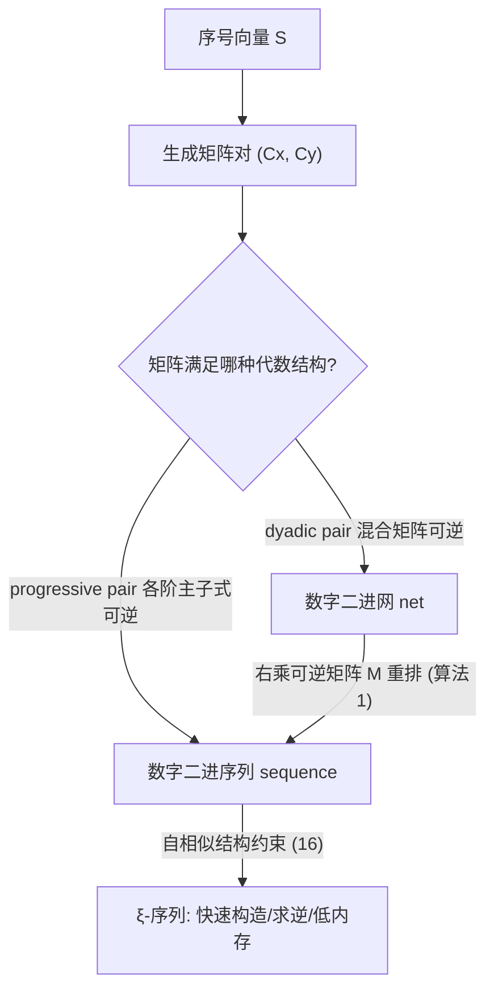

## 一句话总结
本文用 $$GF(2)$$ 上的线性代数把二维数字二进网（digital dyadic nets）与数字二进序列（sequences）的整个设计空间完整刻画出来，证明了任意二进网都能被重排成序列，并提出了一类自相似的 $$\xi$$-序列，其构造与求逆都极快、内存极省，可作为经典 Sobol 序列的替代。

## 研究背景
- 领域现状：采样是渲染中 Monte Carlo 积分的基础。低差异（low-discrepancy）图案，尤其是二进网与二进序列（如 Hammersley 网、Sobol 序列），凭借高生成速率和优秀的收敛性，被广泛认为是渲染采样的领先方案。这类构造多为"数字型"——坐标由序号经 $$GF(2)$$ 上的矩阵乘法得到。
- 核心痛点：以往社区更关注证明差异性（discrepancy）的界，而非构造本身，导致设计空间没有被完整刻画。人们普遍认为像 Hammersley 这样的"网"是不可扩展的（无法增量加点变成序列）；同时缺乏对"哪些矩阵能生成合法序列"的显式、可枚举的完整描述，搜索优质样本时只能大量试错再过滤。
- 本文 idea：引入"渐进矩阵对（progressive pair）"这一缺失概念，把数字二进序列的分析完全翻译成 $$GF(2)$$ 上的线性代数问题，从而精确算出设计空间的维数、给出显式参数化、给出网到序列的重排算法，并据此发现全新的自相似序列族。

## 方法
整体框架：所有构造都基于一对 $$m \times m$$ 的 $$GF(2)$$ 矩阵 $$(C_x, C_y)$$，点 $$i$$ 的坐标由 $$(X_i, Y_i) = (C_x S_i, C_y S_i)$$ 给出（$$S_i$$ 是序号的二进制列向量）。本文的核心是用"矩阵满足什么代数条件 ⇔ 生成合法的网 / 序列"这一对应，把采样构造问题变成线性代数问题。

关键设计：

1. 网与序列的代数刻画。作者定义"二进对（dyadic pair）"：由 $$C_x$$ 前 $$m-r$$ 行与 $$C_y$$ 前 $$r$$ 行拼成的混合矩阵对所有 $$r$$ 都可逆——这等价于生成合法二进网。序列则更强，需要"渐进对（progressive pair）"：所有 $$k \times k$$ 的主子块都构成二进对（定理 3.2）。这个"渐进对"正是把序列分析映射到线性代数的关键缺失环节。基于已有定理，网可显式参数化为 $$C_y = LUJC_x$$，序列可参数化为 $$(C_x, C_y) = (L_x U,\, L_y P U)$$，其中 $$L, L_x, L_y$$ 为下单位三角、$$U$$ 为上单位三角、$$P$$ 为二进 Pascal 矩阵、$$J$$ 为反对角矩阵。

2. 精确计数设计空间。利用上述显式参数化，作者数出：$$m$$-点数字二进网与序列各自能生成的**不同点集**数目都是 $$2^{m(m-1)}$$。这个"数目相等"是一个关键观察。

3. 任意网都能重排成序列（本文的一个惊人结论）。既然网和序列能生成的唯一点集数目相同，且枚举被证明既穷尽又无重复，那么每个数字二进网都能被重排为一个数字二进序列。作者给出显式构造：对二进对分解 $$C_y = LUJC_x$$，取 $$M = C_x^{-1} J U^{-1} P J$$，则 $$(C_x M, C_y M)$$ 就是渐进对。算法 1 把它变成一段只需矩阵求逆和 $$LU$$ 分解的流程，可将 Hammersley、Larcher–Pillichshammer（LP）、Gray 等经典网重排成可增量采样的序列。

4. 自相似 $$\xi$$-序列。作者要求序列满足自相似关系 $$p_{4i} = p_i / 2$$：即序号乘 4 的点等于原点缩放一半。这把 $$C_x$$ 逼成一种交错的"成对列"带状结构（式 16）。神奇之处在于，一个固定的二进常数
$$\xi = 0.0110100010\ldots = \tfrac{1}{2}\sum_{k=0}^{\infty} 2^{-2^{k}}$$
（其第 $$i$$ 位为 1 当且仅当 $$i$$ 是 2 的幂）就能确定第三个点相对第二个点的坐标（通过无进位乘法）。任给两个以 1 开头的向量 $$X, Y$$，$$(C_\xi(X), C_{\xi^+}(Y))$$ 就是渐进对（定理 5.3）。由于 $$\xi$$ 的稀疏结构，32 位精度下无进位乘法只需 5 次 shift-and-xor，构造一个序列比生成一个随机样本还便宜；取样则用一个仅由前 4 个点编码的简短循环（算法 4）即可。

## 实验结果
主实验为采样器的**生成速度**对比（单位：百万点/秒，越高越好），在不同规模 $$N = 2^m$$ 下比较随机采样、Sobol、Burley 版 Owen scrambling 与本文的 $$\xi$$-序列（$$\xi256$$ 为带 256 项查找表的两步检索版）。原表覆盖 $$m = 8,12,16,20,24,28$$，下表摘取代表性列：

| 采样器 | $$m{=}8$$ | $$m{=}16$$ | $$m{=}24$$ | $$m{=}28$$ |
|--------|-----------|------------|------------|------------|
| Random | 18 | 24 | 68 | 71 |
| Sobol | 32 | 28 | 57 | 51 |
| Burley | 11 | 13 | 39 | 39 |
| $$\xi$$ | 17 | 24 | 74 | 73 |
| $$\xi256$$ | 32 | 146 | 411 | 410 |

朴素实现的 $$\xi$$-序列已与 Sobol 相当或更快，而带查找表的 $$\xi256$$ 快出数倍。求逆速率约 3800 万点/秒，用 Morton 排序后可比正向生成再快约 70%；在 TITAN Xp GPU 上每秒可生成超 170 亿点。渲染方面，将 $$\xi$$-序列接入 PBRT 的 Global Sobol 采样器，采样生成加速约 3×、求逆约 5×，渲染总时间最多减少约 37%，且抗锯齿优于 Sobol、噪声低于逐像素打乱的 $$(0,2)$$-序列采样器。另外，把 256 点 LP 网从随机顺序改为本文算法给出的序列顺序后，前若干段前缀的星差异（star discrepancy）可缩小约 2–4 倍。

## 亮点与局限
- 亮点：
  - 用 $$GF(2)$$ 线性代数给出数字二进网与序列设计空间的**完整、可枚举、无冗余**刻画，并精确算出维数。
  - 打破"网不可扩展"的普遍认知——证明并给出算法，把任意数字二进网（含 Hammersley、LP）重排成可增量采样的序列。
  - $$\xi$$-序列构造/取样/求逆都极快、内存极省（可压到单个 2D 向量）、代码简单且几何直观，非常适合 GPU 上为每个线程/像素跑独立序列。
- 局限：
  - 全文聚焦二维 base-2 情形（$$(0,m,2)$$-网与 $$(0,2)$$-序列），高维推广未展开。
  - LP 序列所有子序列的星差异分析仍是开放问题；$$\xi$$-序列的差异性虽有实验评估，但缺少理论上界的保证。
  - 渲染层面的抗锯齿/降噪提升是"略好"级别，主要卖点仍是速度、内存与可分析性，而非画质的显著飞跃。

## 延伸思考
- 把"设计空间的完整代数刻画 + 廉价可枚举"这一思路推广到高维 $$(t,s)$$-序列或非二进 base，可能为高维渲染采样带来同样的搜索加速。
- $$\xi$$-序列极低的构造/求逆成本与"每像素独立序列"能力，天然契合实时/GPU 路径追踪与需要局部可逆采样的场景（如重要性采样、stippling），值得与 ReSTIR 等重采样框架结合考察。
- "自相似 + 无进位乘法常数"的构造范式很优雅，是否存在类似常数能刻画其他具备特定谱性质（如蓝噪声）的序列族，是一个有吸引力的追问方向。
