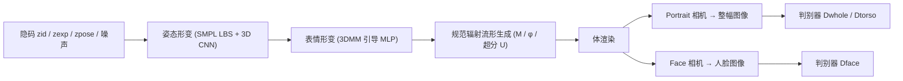

## 一句话总结

本文提出首个面向"头肩portrait"的可动画 3D-aware GAN，仅用无结构 2D 图像训练，就能生成可控相机视角、面部表情、头部与肩部姿态的高质量 3D 人像。

## 研究背景

- 领域现状：3D-aware GAN 能只用 2D 图像集学到可控 3D 相机视角的人物生成，避开难以规模化采集的 3D 扫描/多视图数据。已有可动画方法要么只做人头（表情可控、质量高），要么做全身（姿态可控）。
- 核心痛点：只有头的视频在现实中并不常见，实用性受限；而全身生成受身体运动复杂性拖累、质量偏低，且面部区域占比小、通常没有表情控制。介于两者之间、最贴近视频会议/虚拟主播场景的"头肩portrait"这一档，此前无人专门处理。
- 本文 idea：在 GRAM 的辐射流形（radiance manifold）3D-aware GAN 框架上，融合 3DMM 的表情控制与 SMPL 的头肩姿态控制先验，并针对头肩场景特有的两个难题——人脸质量、长发在姿态驱动下的形变——分别设计双相机训练与姿态形变处理模块。

## 方法

整体上遵循"规范空间神经辐射表示 + （逆）形变"的范式：先在中性姿态与中性表情的规范空间里学一个高质量辐射流形，再把目标空间中带有指定头肩姿态、面部表情的采样点通过两级形变映射回规范空间去查询辐射，最后体渲染成像。训练时用一套双相机方案，分别渲染整幅portrait与人脸并配多个判别器。

关键设计：

1. **对齐参数模型的隐码空间**：把身份码设计为 3DMM 人脸身份系数与 SMPL 体型系数的拼接；姿态码是精简的 SMPL 姿态参数（头、颈、左右锁骨、左右肩共 6 个关节的变换）；表情码即 3DMM 表情系数。这样每类隐码都有语义、可独立控制。

2. **两级形变（姿态 + 表情）**：对目标空间中每个采样点，先做姿态形变、再做表情形变，转到规范空间取辐射。姿态形变基于 SMPL 的线性混合蒙皮（LBS）：点 $$\boldsymbol{x}_p = \bar{\boldsymbol{T}} \cdot \boldsymbol{x}_t = \big(\textstyle\sum_{j} w_j \boldsymbol{T}_j\big)\cdot \boldsymbol{x}_t$$。表情形变则用一个受 3DMM 引导的 MLP $$D_e(\boldsymbol{x}_p, \boldsymbol{z}_{id}, \boldsymbol{z}_{exp}) \to \boldsymbol{x}_c$$，通过 3D 关键点损失与模仿损失让生成人脸的表情跟随 3DMM。

3. **姿态形变处理模块（针对长发）**：直接用"最近体表顶点的蒙皮权重"做全空间形变，是全身生成里的常规做法，但在高分辨率头肩portrait上，长发区域会在头部转动时出现尖锐的形变不连续、产生明显瑕疵。作者把所有射线采样点的（逆）LBS 变换矩阵堆成张量 $$\boldsymbol{T} \in \mathbb{R}^{H\times W\times D\times 16}$$，用一个 3D CNN $$D_p$$ 处理后再作用回采样点，从而学到更平滑、合理的形变，稳定了 GAN 训练。

4. **双相机渲染与对抗学习**：头在portrait中位置/朝向变化很大，仅用整幅图判别器无法给人脸足够监督；而在图像空间裁剪人脸再判别会因重采样引入模糊、损害训练。于是除主 portrait 相机外，额外放一个"人脸相机"——环绕头部、指向头心、坐标系与已有头部 3D-aware GAN 一致，其位置可由形变后的 SMPL 头部算出。三个判别器分工：$$D_{whole}$$ 判整幅portrait、$$D_{face}$$ 判人脸相机图像、$$D_{torso}$$ 判portrait下 1/4 躯干区域。训练采用带 R1 正则的非饱和 GAN 损失，并配合形变平滑、最小形变等正则项；分低分辨率、超分两阶段训练。

## 实验结果

在自建数据集 SHHQ-HS（由 SHHQ 的 40K 全身图裁剪、超分、去背景得到）上，与不具备表情/姿态控制的 EG3D、GRAM-HD 及只生成人头的 AniFaceGAN 作参考对比（FID/KID 用 20K 生成图与 20K 真实图计算）：

| 方法 | 人脸 256² FID↓ | 人脸 256² KID↓ | 整幅 512² FID↓ | 整幅 512² KID↓ | 备注 |
|------|------|------|------|------|------|
| EG3D | 5.63 | 0.20 | 6.81 | 0.26 | 分数最低但几何常近平面、视差错误 |
| GRAM-HD (64→512) | 8.01 | 0.41 | 7.75 | 0.29 | 无表情/姿态控制 |
| AniFaceGAN | 11.56 | 0.66 | N/A | N/A | 仅生成人头 |
| 本文 | 7.64 | 0.43 | 10.10 | 0.43 | 支持视角/表情/头肩姿态控制 |

本文在人脸指标上与 EG3D、GRAM-HD 相当，整幅图略低，但几何正确（EG3D 虽分数最低却常生成近平面几何）。消融实验表明：仅用 $$D_{whole}$$ 时人脸质量很差；加 $$D_{face}$$ 大幅改善人脸但整幅变差；三判别器组合在人脸与整幅上都好。真正的"双相机"训练显著优于"从渲染图裁剪人脸"的替代方案；去掉 $$D_p$$ 退化为简单蒙皮权重赋值后，长发在头动时出现尖锐不连续、整幅质量下降。此外还展示了用真人 talk 视频驱动生成虚拟人像的应用。

## 亮点与局限

- 亮点：
  - 首次专门定义并解决"可动画头肩portrait生成"这一介于纯头与全身之间、最贴近视频会议/虚拟主播的任务。
  - 双相机对抗训练用一个额外人脸相机绕开图像裁剪的模糊问题，给规范辐射流形更直接、更高分辨率的人脸监督。
  - 姿态形变处理 3D CNN 有效消除长发在头部转动下的形变不连续瑕疵。
  - 全程只用无结构 2D 图像训练，不需 3D 或视频数据。

- 局限：
  - 对训练分布外的极端表情、闭眼等姿态会产生瑕疵；SHHQ-HS 本身表情变化有限、缺极端表情与闭眼样本。
  - 口腔内部（如牙齿）视觉质量不理想。
  - 未优化实现下生成一张 512×512 图约需 0.87 秒（A6000），离实时尚有距离。

## 延伸思考

- 方法把"参数模型先验 + 规范辐射场 + 逆形变"这一套用到头肩这个中间尺度，思路可推广到更大范围（如加上手部/上半身），关键仍是如何为不同区域提供分辨率匹配的判别监督——双相机可否扩展成多相机分区判别。
- 依赖 SMPL/3DMM 拟合质量与训练集姿态-表情覆盖度，数据分布外泛化是主要瓶颈；引入更强表情先验或少量视频弱监督或能缓解闭眼/口内质量问题。
- 相比后续 3D Gaussian Splatting 类头像方法，本文的辐射流形在多视一致性上有优势但推理偏慢，把这套可控形变思想迁移到显式高斯表示上是自然的后续方向。
