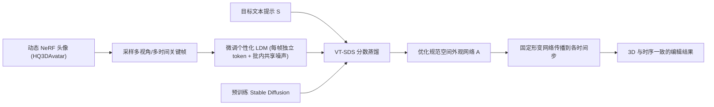

## 一句话总结

AvatarStudio 是首个针对**动态 3D 人头 avatar** 的文本驱动外观编辑方法：把一段多视角捕捉重建出的动态 NeRF 头像，按一句文字提示（如"把她变成僵尸""让他像梵高"）改外观，同时保持 3D 一致与时序一致。

## 研究背景

- 领域现状：过去几年数字人头 avatar 的真实感大幅提升，可用 RGB、音频、深度、IMU 等多种模态控制。文本驱动的 2D/3D 图像生成与编辑（DreamBooth、InstructPix2Pix、DreamFusion、Instruct-NeRF2NeRF 等）也快速发展。
- 核心痛点：现有对数字人头的控制几乎都集中在**运动**（表情、头部姿态、视角）或**重打光**上，外观编辑很少涉及；而文本这一最友好的输入模态尚未被充分用于人脸编辑。已有文本驱动的 3D 编辑方法要么依赖 CLIP 目标（编辑力度受限），要么根本不是为**动态序列**设计的，直接用在视频头像上会产生明显伪影、时序抖动。
- 本文 idea：以 HQ3DAvatar 的动态 NeRF 为输入，借助大规模文生图潜在扩散模型（Stable Diffusion）的先验来编辑外观。关键是让扩散模型既懂身份、又懂视角、又懂时间，并用一种改进的分数蒸馏把编辑传播到整个动态 NeRF 的规范空间。

## 方法

整体框架：输入是一段已重建好的动态 NeRF 头像（规范空间 NeRF + 形变网络）和一句目标文本。先用多个关键帧（覆盖不同视角与时间戳）微调一个个性化扩散模型，让它记住这个头的身份/视角/时间特征；再用这个个性化模型配合预训练模型，通过"视角与时间感知的分数蒸馏采样"（VT-SDS）只优化规范空间里的外观网络；最后靠固定的形变网络把规范空间的编辑结果传播到所有时间步。

关键设计：

1. **多关键帧个性化微调**：从多视角视频里选取覆盖不同视角与时间戳的图像（第一帧的全部 24 个相机视角，加上正面视角下 6 个与平均时间嵌入差异最大的帧），以 DreamBooth 式方式微调 Stable Diffusion。与 DreamBooth 只学单一 token 不同，这里给**每张图分配一个 10 字符的唯一标识符**（`photo of a [identifier] [man/woman]`），从而同时捕捉身份、视角与时间的变化。

2. **批内共享噪声防概念泄漏**：直接把 DreamBooth 用于"多概念"（多视角+多时间）会出现概念相互泄漏、编辑质量下降。作者发现只要在每个 batch（batch size 3）内**共享同一份噪声** $$\boldsymbol{\epsilon}$$，就能让各标识符各自抓住对应帧的变化、避免串味；同时加入类别先验保持损失抗语言漂移。

3. **VT-SDS（视角与时间感知的分数蒸馏）**：编辑时只优化规范空间的外观网络 $$A$$、冻结形变网络 $$D$$。每步随机采样一个视角/时间渲染图像并加噪，用改进的 SDS 梯度更新。噪声估计是个性化模型与预训练模型的线性组合（类似无分类器引导）：

$$\boldsymbol{\Psi}(\boldsymbol{x}_t, t, s, s_i) = w\left(v\,\boldsymbol{\zeta}_\theta(\boldsymbol{x}_t, s) + (1-v)\,\hat{\boldsymbol{\zeta}}_\theta(\boldsymbol{x}_t, s_i)\right) + (1-w)\,\boldsymbol{\zeta}_\theta(\boldsymbol{x}_t)$$

其中 $$w$$ 是总引导权重、$$v$$ 是模型引导权重。生成早期由个性化模型提供内容特征（锚住身份），后期交给大规模预训练模型做真正的编辑。

4. **退火与正则**：采用随时间降低最大采样时间步的退火 SDS，让编辑先定轮廓、后补高频细节；并对沿射线的密度累积权重加熵正则，鼓励点趋于完全透明或完全不透明，减少过拟合伪影。默认 $$v \approx 0.6$$、$$K=600$$，单个 prompt 在单张 A100 上约优化 60 分钟。

## 实验结果

由于文本编辑缺乏 ground truth，且 CLIP 分数会偏袒在 CLIP 空间优化的方法、又无法衡量时序一致性，作者采用**用户研究**做定量评估：48 名参与者，3 个身份 × 3 个提示，四选一比较"身份保持/提示贴合/时序一致/综合"。下表为各方法被评为最佳的百分比（每行合计 100%）：

| 评价维度 | Dream Fields++ | InstructNeRF2NeRF | AvatarStudio（本文） |
|----------|----------------|-------------------|----------------------|
| Q1 身份保持 | 4.6 | 7.2 | 88.2 |
| Q2 提示贴合 | 4.4 | 22.2 | 74.4 |
| Q3 时序一致 | 6.0 | 8.3 | 85.6 |
| Q4 综合 | 3.9 | 10.6 | 85.4 |

本文在全部四个维度都被显著评为最佳，综合质量上 85.4% 的场次胜出。定性上，方法能做写实（"老人""铜像"）与非写实（"熊猫""格林奇"）编辑，也能定向改局部（"蓝色头发"只改头发、不误染嘴唇），而基线常出现身份破坏、编辑跑到错误区域、时序抖动。消融显示：每帧独立 token 明显优于单 token；引入不同时间戳对时序一致至关重要；去掉预训练模型（$$v,K$$ 设 0）性能大幅下降，直接用原始 DreamFusion SDS 则无法收敛；SDS 退火能带来更好细节。

## 亮点与局限

- 亮点：
  - 首个面向**动态**（视频）3D 人头 avatar 的文本驱动外观编辑方法，兼顾 3D 一致与时序一致。
  - 多关键帧独立 token + 批内共享噪声，巧妙缓解了多视角/多时间微调时的概念泄漏。
  - VT-SDS 用"早期锚身份、后期做编辑"的模型引导思路，避开了 CLIP 目标编辑力度受限的问题，能同时做写实与风格化、乃至一定几何变化的编辑。
- 局限：
  - 依赖**多视角、均匀打光**的采集数据，无法直接处理单目/野外视频。
  - 计算开销大，单个 prompt 约需 60 分钟 A100 训练。
  - 几何层面的编辑幅度有限，难以大幅改变头部几何。

## 延伸思考

- 把输入需求从多视角均匀打光放宽到单目野外视频，甚至单张图像 + 目标运动驱动，是最直接的落地方向。
- VT-SDS 的"个性化模型锚内容 + 预训练模型做编辑"范式，与后续在 3D Gaussian 头像上做文本编辑的工作（如 GaussianAvatar-Editor）思路相通，值得对比表示形式（NeRF vs. 3DGS）对编辑一致性与速度的影响。
- 用户研究虽避开了 CLIP 偏置，但样本量与提示多样性有限；如何为"动态 3D 编辑"设计更客观、可复现的时序一致性指标仍是开放问题。
