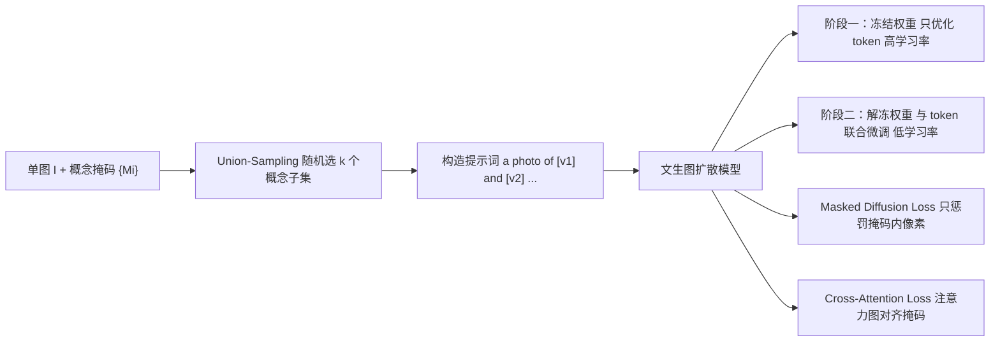

## 一句话总结

提出"文本场景分解（textual scene decomposition）"新任务：给定一张含多个概念的图像加上粗略掩码，为每个概念学出一个独立的文本 token（handle），从而能用自然语言自由地重组、重绘这些概念到全新场景中。

## 研究背景

- 领域现状：文本到图像模型的个性化（personalization）方兴未艾，Textual Inversion 通过优化新增文本 embedding、DreamBooth 通过微调模型权重，都能把某个用户提供的概念"教"给模型并在新语境中生成它。
- 核心痛点：现有方法几乎都假设"多张图学一个概念"，靠多视角/多姿态图像消除歧义；一旦切换到"单张图、多个概念"的场景就失灵。直接把 Textual Inversion 或 DreamBooth 套到单图上，会暴露重建—可编辑性的两难：前者能放进新语境但保不住身份，后者身份保真却因过拟合失去可控性。
- 本文 idea：用掩码指明要提取哪些概念（用户手绘或分割模型自动生成），再设计一套两阶段定制流程 + 两类损失，在"忠实还原概念身份"与"保留文本可编辑性"之间取得平衡，并支持多概念的任意组合生成。

## 方法

整体框架：给定单张图像 $$I$$ 和 $$N$$ 个掩码 $$\{M_i\}_{i=1}^{N}$$，目标是为每个掩码对应的概念学出一个文本 handle $$v_i$$。训练时把图像、掩码、含 handle 的提示词一起喂给冻结/微调的文生图扩散模型，用掩码重建损失 + 交叉注意力损失联合优化。

关键设计：

1. **两阶段平衡重建与可编辑性**：第一阶段冻结模型权重，只用高学习率优化各概念对应的文本 embedding，快速得到一个粗略但不破坏模型泛化能力的初始 handle；第二阶段解冻权重，与 token 一起用显著更低的学习率温和微调。这样既能忠实还原概念，又把过拟合导致的可编辑性损失降到最低。

2. **Union-Sampling（并集采样）**：若逐个概念独立训练，模型在生成"多个概念同框"时会失败。因此每步随机选一个大小 $$k \le N$$ 的概念子集 $$s = \{i_1,\dots,i_k\}$$，拼成提示词"a photo of [$$v_{i_1}$$] and … [$$v_{i_k}$$]"，损失在这些掩码的并集 $$M_s = \bigcup M_{i_k}$$ 上计算，从而增强组合生成能力。

3. **Masked Diffusion Loss（掩码扩散损失）**：只在概念掩码覆盖的像素上惩罚去噪误差：
$$L_{rec} = \mathbb{E}_{z,s,\epsilon\sim\mathcal{N}(0,1),t}\left[\lVert \epsilon \odot M_s - \epsilon_\theta(z_t,t,p_s)\odot M_s\rVert_2^2\right]$$
其中 $$z_t$$ 是第 $$t$$ 步的含噪隐变量，$$p_s$$ 是提示词。这鼓励忠实重建概念，但不阻止一个 handle 关联到多个概念。

4. **Cross-Attention Loss（交叉注意力损失）**：这是解耦的关键。作者观察到只用重建损失时，$$v_1$$ 和 $$v_2$$ 的注意力都会同时覆盖两个概念区域。于是额外约束每个 token 的交叉注意力图 $$CA_\theta(v_i, z_t)$$ 逼近其掩码：
$$L_{attn} = \mathbb{E}_{z,k,t}\left[\lVert CA_\theta(v_i,z_t) - M_{i_k}\rVert_2^2\right]$$
总损失为 $$L_{total} = L_{rec} + \lambda_{attn} L_{attn}$$，其中 $$\lambda_{attn}=0.01$$。这保证每个 handle 只关注对应概念区域，实现概念间的解耦。

## 实验结果

在 COCO 数据集上构建自动评测：筛选含至少两个占比 ≥15% 的独立实例的图像，配随机提示词与随机 token 数，每个基线生成 5400 对图文样本。用两个指标衡量——prompt similarity（生成图与提示词的 CLIP 余弦相似度）和 identity similarity（对掩码后的输入与生成结果提取 DINO embedding 比较）。核心结论是存在身份保真与提示遵从的固有权衡，本文方法处于 Pareto 前沿。下表按趋势总结主实验（散点图定性刻画，非精确数值）：

| 方法 | 提示遵从↑ | 身份保真↑ | 权衡表现 |
|------|-----------|-----------|----------|
| 本文（Ours） | 中高 | 中高 | 位于 Pareto 前沿，两者兼顾 |
| DB-m（Masked DreamBooth） | 低 | 高 | 保身份但过拟合、丢可编辑性 |
| TI-m（Masked Textual Inversion） | 高 | 低 | 跟提示但保不住身份 |
| CD-m（Custom Diffusion 改） | 高 | 低 | 与 TI-m 类似 |
| ELITE | 中 | 偏低 | 单图快速个性化，身份保真不足 |

消融实验（同一散点图）证实各组件必要性：去掉第一阶段 → 过拟合、提示遵从大幅下降；去掉掩码损失 → 学进背景、提示遵从大幅下降；去掉交叉注意力损失 → 概念纠缠、身份保真下降；去掉 union-sampling → 多概念生成变差、身份保真显著降低。此外基于 Amazon Mechanical Turk 的用户研究（1–5 分李克特量表打分）呈现相同趋势，进一步佐证本文方法处于身份保真与提示遵从的 Pareto 前沿。

## 亮点与局限

- 亮点：
  - 首次提出并解决"单张图、多概念"的文本场景分解任务，最多可同时提取约四个概念并任意组合。
  - 交叉注意力损失巧妙利用注意力图与场景布局的相关性来强制概念解耦，思路简洁有效。
  - 掩码可由用户手绘或分割模型（如 SAM）自动生成，实用性强；衍生出图像变体、纠缠概念分离、背景提取、局部图像编辑等多种应用。
- 局限：
  - 光照纠缠：单图输入使模型难以把场景光照与概念身份分离，换语境时光照仍沿用原图。
  - 姿态固化：有时把物体姿态与身份绑定，即便明确要求也难以生成不同姿态。
  - 概念数上限：超过约四个概念时身份学习会退化（欠拟合）。
  - 计算开销大：需要针对每张图做逐样本优化。

## 延伸思考

- 该工作把"个性化"从"多图单概念"推广到"单图多概念"，与后续一系列单图无监督概念提取（如 ConceptExpress、ICE 等）形成明确的谱系关系，交叉注意力作为解耦信号的思想被反复借鉴。
- 交叉注意力损失本质是把外部空间先验（掩码）注入 token 的注意力分布，这种"用注意力对齐监督语义归属"的范式或可迁移到视频、3D、组合生成等更复杂的解耦场景。
- 逐样本优化的高成本是落地瓶颈，与编码器式快速个性化方法结合（先编码器给初值再轻量微调）可能是兼顾质量与速度的方向。
- 光照与姿态纠缠源于单图缺乏变化，是否可用扩散模型自身先验合成多视角/多光照伪样本来缓解，值得追问。
