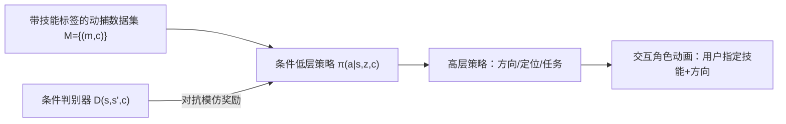

## 一句话总结

C·ASE 用"分而治之 + 技能标签条件化"的对抗式模仿学习，为物理仿真角色学习一个既能覆盖大量多样技能、又能被用户直接指定执行哪个技能的低层控制器。

## 研究背景

- 领域现状：物理仿真角色控制的主流做法是从大规模动捕数据里学一个可复用的低维技能隐空间（如 ASE、ControlVAE），高层策略再在这个空间里学习完成复杂任务。
- 核心痛点：这些方法把来自不同技能的状态转移当作同质样本"混在一起"学，而人类动作本质是异质的（发呆和挥剑的状态转移差异巨大）。这种假设导致严重的模式崩溃（mode collapse），很多技能被漏掉；同时整体嵌入的隐空间也不提供"直接指定要做哪个技能"的显式控制手柄，交互性差。
- 本文 idea：回归经典的分而治之思路，把异质的技能数据集切成一个个同质子集，用技能标签 $$c$$ 作为条件，训练一个条件化的低层策略去学习"给定技能"的行为分布。条件化本身天然带来了对技能的显式控制。

## 方法

整体框架分三个阶段：预训练阶段学习一个条件化低层策略 $$\pi(a \mid s, z, c)$$，通过条件对抗式模仿学习让它在给定技能标签 $$c$$ 时生成对应行为；交互控制器训练阶段在固定的低层模型之上训练高层策略（方向控制、目标定位等）；交互动画阶段用户可实时指定技能标签与运动方向来驱动角色。

关键设计围绕"如何把分而治之扩到大规模数据集"展开：

1. **条件对抗式技能嵌入**：每个技能 $$c$$ 下的转移由采样自超球先验分布的隐变量 $$z$$（$$z \sim \mathcal{N}(0, I)$$ 后归一化）表示。判别器 $$D(s, s', c)$$ 也接受技能标签，学着把参考动作和生成动作区分开；策略则要骗过它。同时用一个条件运动编码器 $$q(z \mid s, s', c)$$（建模为 von Mises-Fisher 分布）把状态转移映回隐变量，配合多样性项鼓励同一技能下产生多样的转移。这样"是什么"：一个技能条件下的行为分布；"为什么"：条件化避免了跨技能样本互相干扰导致的模式崩溃；"怎么做"：GAN 式对抗模仿 + 编码器互信息奖励。

2. **焦点技能采样（FSS）**：大数据集里不同技能学习难度差异大（挥剑比发呆难得多），平均对待会导致发展不均、漏学。FSS 在线更新每个技能进入参考缓冲区的采样概率 $$w_c = (1-\alpha)w_c + \alpha\,\sigma(b_c)$$，其中 $$b_c$$ 是判别器对该技能生成样本的平均"真实度"得分，得分低（学得差）的技能被更多采样。该策略在判别器先具备判别能力后（约 2500 步）才启用，使策略更快、更均衡地覆盖多样技能。

3. **骨骼残差力（SRF）**：虚拟角色与真人之间存在动力学失配，导致敏捷动作（如跳踢）难以模仿。在 PD 控制力矩之外，让策略额外预测施加在各关节的残差力来补偿失配。多体运动方程写作 $$B(\boldsymbol{q})\ddot{\boldsymbol{q}} + C(\boldsymbol{q}, \dot{\boldsymbol{q}}) + g(\boldsymbol{q}) = \boldsymbol{\tau} + \text{接触力} + \text{残差力}$$。残差力施加在除剑盾外的 $$J-2$$ 个关节上，并加正则约束使其仅在必要时启用。训练和推理阶段都施加。

4. **逐元素特征掩码（EFM）**：条件化后每个技能下的样本更稀疏，容易过拟合、降低多样性。EFM 就是在判别器内部加 dropout 层，避免过度依赖运动细节，从而从稀疏样本中捕获更一般的行为特征，让同一技能下的转移更多样。

## 实验结果

主实验在 Sword&Shield 数据集上评估低层策略的技能覆盖能力，采用"过滤后运动覆盖率"——只有当某技能被匹配次数超过阈值 $$\gamma \frac{N}{K}$$ 才算被覆盖，过滤率 $$\gamma$$ 越高越能剔除随机因素、暴露覆盖不均。

| 方法 | 覆盖率 γ=10%↑ | 覆盖率 γ=20%↑ | 覆盖率 γ=50%↑ |
|------|--------------|--------------|--------------|
| C·ASE（本文） | 91% | 稳定高位 | 稳定高位 |
| CALM | 71% | 71% | 43% |
| ASE | 66% | 57% | 40% |

ASE 和 CALM 的覆盖率随过滤率上升急剧下滑，说明覆盖严重不均衡；C·ASE 在各过滤率下都保持高覆盖，表明所有动作片段被随机轨迹较均匀地匹配到。

其余实验以文字补充：Fréchet Inception Distance（越低越好）上，C·ASE 在逐帧（16.5）、逐转移（47.4）、逐片段（1742.5）三个粒度均优于 ASE 与 CALM；技能转移覆盖率达 44.3%，显著高于 ASE（25.4%）与 CALM（28.4%）；运动多样性 APD 为 160.4，高于 ASE（145.4）与 CALM（152.7）。在更大的 Composite Skills 数据集（265 类技能）上，C·ASE 的过滤覆盖率 82% 也明显领先，且 SRF 对所有模型的敏捷、风格化动作都有正向帮助。

## 亮点与局限

- 亮点：
  - 用技能标签条件化，把"分而治之"扩到大规模数据集，直接缓解了整体嵌入方法的模式崩溃问题。
  - 条件化天然提供显式技能控制手柄，用户可像玩游戏一样直接指定角色执行哪个技能，且保持物理合理性。
  - FSS / SRF / EFM 三个训练技巧分别针对难度不均、动力学失配、样本稀疏，工程上成体系。
- 局限：
  - 依赖每段动作的技能标签（人工或神经标注器），标注质量与粒度会影响效果。
  - 训练成本高（单 A100、约 15 亿样本、约 1.5 天），且仿真环境依赖 IsaacGym。
  - 评估主要在带剑盾的单一角色形态上，对更多样体型/交互物体的泛化未充分展示。

## 延伸思考

- 与 ASE、CALM 是同一谱系的对比工作，核心区别在于"是否显式条件化技能"；这条思路可以进一步和语言条件（如把技能标签换成文本 embedding）结合，走向自然语言驱动的交互角色。
- 焦点采样本质是把"难例挖掘/focal loss"的思想搬到强化学习的技能采样上，这一在线难度自适应机制或许能迁移到其他多任务 RL 场景。
- 残差力虽提升了敏捷动作质量，但也在物理仿真里引入了非物理的外力，如何在保真度与可控性之间权衡、乃至逐步退火掉残差力，是值得追问的方向。
