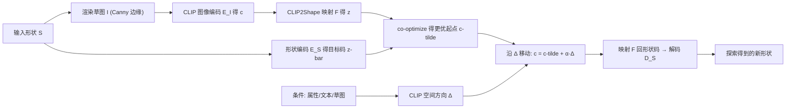

## 一句话总结

CLIPXPlore 借助预训练视觉-语言模型 CLIP，把 CLIP 空间与 3D 形状潜空间耦合起来，让用户可以用二值属性、文本或草图三种条件，在形状潜空间里找到有语义的探索轨迹，从而对给定 3D 形状做出可控、有意义的变体。

## 研究背景

- 领域现状：主流做法是把 3D 形状编码进一个高维潜空间，每个潜码可解码成一个形状，再通过在潜空间中采样/生成来做形状设计。近年的工作大多聚焦于提升潜空间里解码形状的质量与多样性。
- 核心痛点：潜空间的"探索"手段非常贫乏——要么是两个形状之间的线性插值，要么沿随机方向或"变化最大"的方向游走。这些方式既缺乏细粒度语义控制，也不像语言/草图接口那样自然地连接用户意图。此外直接把有监督方法搬到 3D 潜空间需要大量标注，且效果会退化。
- 本文 idea：引入 CLIP 这个把图像与文本编码到同一空间的预训练模型来引导探索。关键是把 CLIP 空间与形状潜空间耦合起来，使得"在 CLIP 空间沿某方向直线移动"等价于"在形状潜空间沿一条轨迹移动"，从而可以用文本/草图/属性在 CLIP 空间里指定探索方向，再映射回形状空间生成变体，且全程不需要昂贵的成对文本-形状数据。

## 方法

整体框架分三步：先训练一个把 CLIP 码映射到形状码的 CLIP2Shape 映射网络，把两个预训练空间连起来；推理时先为待探索形状在 CLIP 空间找到一个忠实的起点码；再根据用户条件在 CLIP 空间确定一个探索方向，沿该方向移动并映射回形状空间解码出新形状。

关键设计：

1. **耦合两个空间（CLIP2Shape 映射）**：对每个训练形状，先用 Open3D 渲染并做 Canny 边缘得到草图图像 $$I_i$$，用 CLIP 图像编码器得到 CLIP 码 $$c_i = E_I(I_i)$$；同时用形状编码器直接得到目标形状码 $$\bar{z}_i = E_S(S_i)$$。然后训练一个 8 层 MLP（带 skip-connection、leaky-ReLU）的映射器 $$F$$，用 $$L_2$$ 回归损失 $$L = \lVert z_i - \bar{z}_i \rVert^2$$（其中 $$z_i = F(E_I(I_i))$$）把 CLIP 码回归到形状码。训练时冻结两个编码器，只更新映射器，单 GPU 约一小时。选用草图而非照片，是因为草图既能捕捉几何/结构信息，又能同时支持"语言"和"用户手绘"两种条件输入。

2. **协同优化起点码（co-optimization）**：直接把渲染草图编码得到的 $$c$$ 作为起点，其映射码 $$z = F(c)$$ 因草图渲染的信息损失，往往与直接编码得到的 $$\bar{z}$$ 有偏差，重建不够忠实。于是迭代地协同优化 $$c$$ 与 $$z$$：固定可微的映射器 $$F$$，用 $$z_t$$ 与目标 $$\bar{z}$$ 的回归损失反向传播梯度去更新 CLIP 码，使 $$F(\tilde{c})$$ 更接近 $$\bar{z}$$，从而得到更忠实的探索起点 $$\tilde{c}$$。因为不重训、不微调，约 20 秒即可完成。

3. **三种方向探索模式**：在 CLIP 空间找到与条件匹配的方向 $$\Delta$$，再沿 $$c = \tilde{c} + \alpha \cdot \Delta$$ 移动。
   - 二值属性：用带/不带某语义部件（如扶手）的正负样本集（可用 PartNet 部件层级自动划分），在 CLIP 码上训练线性 SVM，取分类超平面法向作为 $$\Delta_{\text{binary}}$$（每类经验上需 1000+ 样本且正负平衡）。
   - 文本：准备输入描述 $$T$$ 与目标描述 $$T'$$，用文本编码器取二者 CLIP 码之差 $$\Delta_{\text{text}} = E_T(T') - E_T(T)$$。用与目标形成对比的输入描述能提升效果。
   - 草图：把输入形状渲染成草图 $$I$$，用户编辑得到 $$I'$$，取 $$\Delta_{\text{sketch}} = E_I(I') - E_I(I)$$。
   步长 $$\alpha$$ 的选择上，草图模式可利用编辑后草图的 CLIP 码 $$c_{\text{edited}}$$，在候选形状里挑最接近者；属性/文本模式则用预设值，也可生成多个候选让用户挑选。注意方向在 CLIP 空间是线性的，映射回形状空间后是一条非线性轨迹。

## 实验结果

在 ShapeNet（椅子、桌子）上，每种模式各准备 50 个探索案例（25 椅 + 25 桌），用 FID（视觉质量，越低越好）、CLIP-Similarity（与条件一致性，越高越好）以及用户评测的质量分 QS、匹配分 MS（1–5，越高越好）对比各模式的代表性基线。CLIPXPlore 在全部三种模式、全部指标上均取得最好成绩。

| 模式 | 方法 | FID ↓ | CLIP-S ↑ | QS ↑ | MS ↑ |
|------|------|-------|----------|------|------|
| 二值属性 | SVM in shape space | 156.0 | — | 2.442 | 2.448 |
| 二值属性 | 本文 | 136.0 | — | 4.176 | 3.998 |
| 文本 | TextDeformer | 174.2 | 0.815 | 2.322 | 2.008 |
| 文本 | 本文 | 124.0 | 0.878 | 4.402 | 4.012 |
| 草图 | Sketch2Mesh | 155.2 | 0.938 | 3.130 | 2.922 |
| 草图 | 本文 | 124.4 | 0.976 | 4.680 | 4.620 |

（表中每种模式仅列出最强基线与本文对比；文本模式另有 CLIP-Mesh、Text2Mesh，草图模式另有 Sketch2Model、SketchSampler，均弱于所列基线。）定性上，本文能改变拓扑（如生成竖条、拉杆、椅背上的孔洞、细腿等薄结构），而基于网格形变的文本方法和基于草图重建的方法难以做到。

## 亮点与局限

- 亮点：
  - 首个用预训练视觉-语言模型探索 3D 形状潜空间的框架，把 CLIP 空间与形状潜空间耦合，实现语义可控的探索。
  - 统一支持二值属性、文本、草图三种多模态条件，且无需成对文本-形状数据。
  - 轻量高效：映射器训练约一小时，co-optimization 约 20 秒，单次探索约一分钟（RTX 3090），无需重训或微调。
  - co-optimization 显著提升起点码对输入形状的忠实度，重建更多细节。

- 局限：
  - 沿探索轨迹可能引入超出给定条件的意外变化。
  - 步长 $$\alpha$$ 的合适取值仍不易确定。
  - 两个预训练空间本质是黑箱，难以判断某个输入条件是否落在模型能力范围内。
  - 探索受限于预训练形状空间，无法处理任意编辑的草图。

## 延伸思考

- 本文本质是"借一个已对齐的多模态空间（CLIP）当遥控器，去操纵另一个未对齐的生成空间（形状潜空间）"，核心桥梁 CLIP2Shape 是通过草图这个中介建立的；这一思路可推广到其它带潜空间的生成器（如把 CLIP 耦合到扩散模型或 3D Gaussian 表征的潜空间）。
- 用草图作为连接图像与几何的中介很巧妙，但也把方法的表达上限绑在草图能捕捉的结构信息上；若换用带外观/材质信息的中介，或许能把探索从纯几何扩展到外观。
- 步长 $$\alpha$$ 的自动选择、以及"如何判断条件是否在预训练能力范围内"，是这类基于固定预训练空间的可控生成方法共同的难点，值得进一步研究可解释的探索边界刻画。
